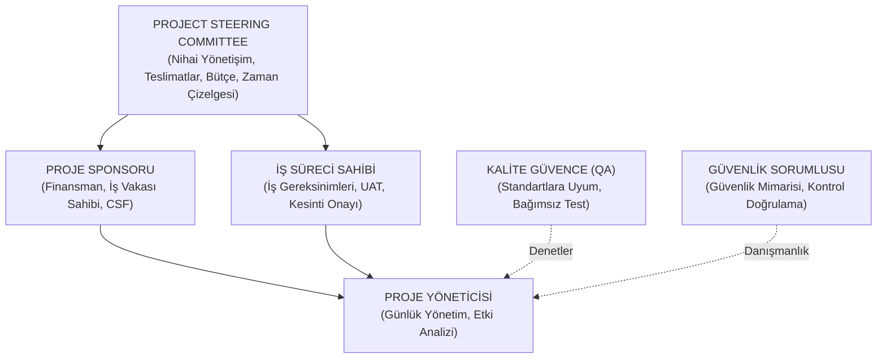
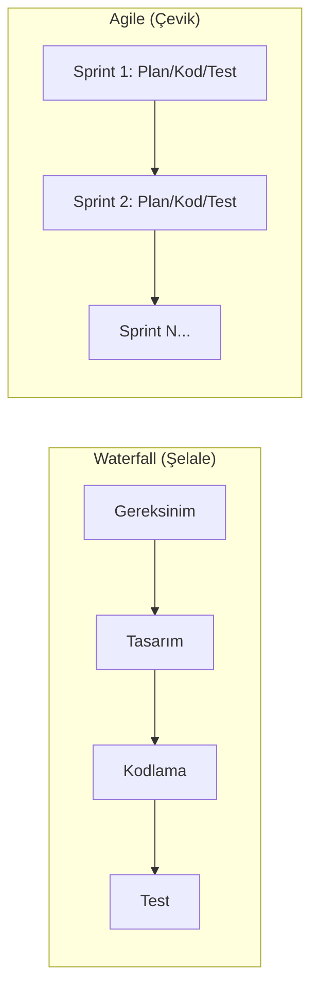
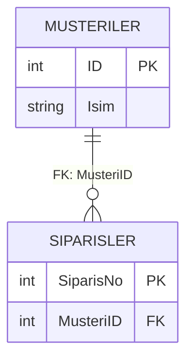
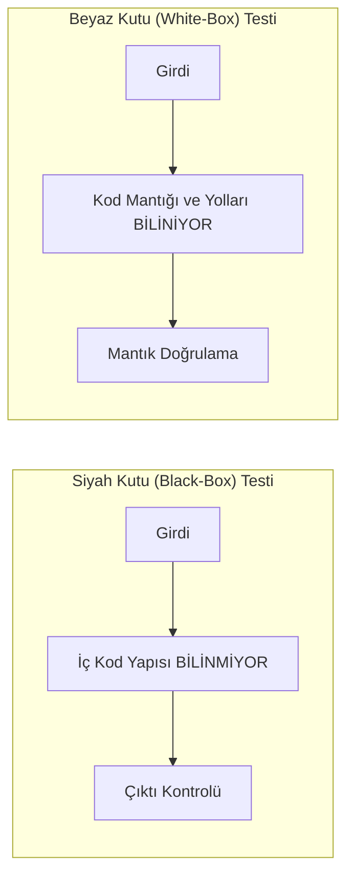
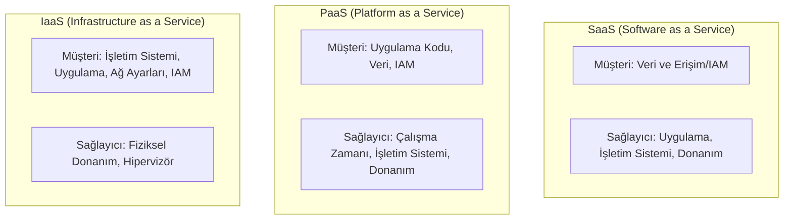

# CISA Domain 3 — Bilgi Sistemlerinin Edinimi, Geliştirilmesi ve Uygulanması: Kapsamlı ve Bütünleşik Çalışma Notu

---

## 1. IT Proje Yönetimi, Yönetişim ve Yaşam Döngüsü (SDLC)

### 1.1. Proje Yönetişimi, Rol ve Sorumluluklar

Bilgi sistemleri projelerinin başarısı, net tanımlanmış yönetişim yapılarına ve rol dağılımlarına dayanır. CISA sınavında sorular genellikle "bu durumda kim sorumludur" veya "ilk olarak kime başvurulmalıdır" mantığı üzerinden gelir:

*   **Proje Yönlendirme Komitesi (Project Steering Committee):** Üst düzey yöneticilerden ve kilit paydaşlardan oluşan temel yönetişim organıdır. Projenin günlük yürütülmesinden değil (bu proje yöneticisinin işidir), projenin çıktıları (**deliverables**), maliyeti, zaman çizelgesi ve nihai başarısından sorumludur. Stratejik yön verir, önemli kapsam değişikliklerini onaylar ve projenin genel yönetişimini gözetir.
*   **Proje Sponsoru (Project Sponsor):** Genellikle ilgili iş biriminin (business unit) üst düzey yöneticisidir. Projeye finansman (**funding**) sağlar, İş Vakası'nın (**business case**) sahibidir ve Proje Yöneticisi ile birlikte Kritik Başarı Faktörlerini (**Critical Success Factors - CSF**) tanımlar. Geçmiş projelerin geleceğe nasıl ışık tutacağını değerlendirmek isteyen bir denetçinin ilk görüşmesi gereken kişidir; çünkü iş gereksinimlerinin gerçekten karşılanıp karşılanmadığına dair nihai değerlendirmeyi sponsor yapar.
*   **Proje Yöneticisi (Project Manager):** Projenin günlük yönetiminden, kaynak koordinasyonundan ve ekibin liderliğinden sorumludur. Bir kapsam veya zaman çizelgesi değişiklik talebi geldiğinde Proje Yöneticisinin **YAPMASI GEREKEN İLK ŞEY**, bu değişikliğin bütçe, takvim, kaynak ve risk üzerindeki **Etki Analizini (Impact Analysis)** yapmaktır. Değişikliği doğrudan kabul etmek, reddetmek veya etki analizi yapmadan üst yönetime taşımak yanlıştır.
*   **İş Süreci Sahibi (Business Process Owner) / İş Kullanıcısı:** Sistemin fonksiyonel iş gereksinimlerini tanımlar, Kullanıcı Kabul Testlerini (UAT) yürütür ve sistemin canlıya alınması sırasındaki planlı kesintileri (**downtime**) onaylama yetkisine sahip birincil makamdır.
*   **Kalite Güvence (Quality Assurance - QA):** SDLC süreçlerine, kodlama standartlarına ve metodolojilere uyumu bağımsız olarak denetler. QA ekibi hataları tespit eder ve raporlar; ancak **asla hataları düzeltmek için kod yazmamalı veya canlıya kod taşımamalıdır** (Görevler Ayrılığı / SoD ihlali).
*   **Bilgi Güvenliği Sorumlusu (Security Officer):** Kurumsal güvenlik politikaları ve veri sınıflandırma standartlarına uygun olarak, sistem kontrollerinin etkili koruma sağladığını doğrular ve SDLC boyunca güvenlik mimarisine danışmanlık yapar.

### 1.2. Proje Örgütlenme Yapıları

Organizasyonel yetki paylaşımına göre üç temel proje yönetim yapısı sıkça sorulur:

1.  **Etki (Influence) Proje Organizasyonu:** Proje yöneticisinin hiçbir resmi yönetim yetkisi yoktur; sadece danışman, koordinatör ve etkileyici konumundadır.
2.  **Saf (Pure) Proje Organizasyonu:** Proje yöneticisi, projeye atanan tüm personel ve kaynaklar üzerinde tam yetkiye sahiptir.
3.  **Matris (Matrix) Proje Organizasyonu:** Yönetim yetkisi Proje Yöneticisi ile Fonksiyonel Departman Müdürleri (**department heads**) arasında paylaşılır. Kaynakların birden fazla proje veya departman arasında paylaşıldığı karma karmaşık yapılarda kullanılır.

### 1.3. Proje Başlangıcı: Fizibilite Çalışması ve İş Vakası (Business Case)

> [!NOTE]
> **Fizibilite Çalışması (Feasibility Study):**
> Bir IT projesinin ilk resmi adımıdır. Projenin teknik, ekonomik, operasyonel, yasal ve zamansal (TELOS) açılardan mümkün olup olmadığını değerlendirir. 
> - **Kapsam:** Veri işleme ihtiyacının nasıl karşılanacağına dair "yaklaşımı" tanımlar. Donanım seçim kriterleri veya uygulama güvenliği detayları bu aşamada değil, tasarım aşamasında ele alınır.
> - **Kritik Eksikliği:** Genellikle **organizasyonel etki (organizational impact)** değerlendirmesinin yapılmamış olmasıdır.
> - **Güvenlik Açısından:** Güvenlik ve kontrol gereksinimlerinin bu aşamada belirlenip belirlenmediği kontrol edilmelidir. Güvenlik sonradan eklenemez bir bileşendir.

> [!IMPORTANT]
> **İş Vakası (Business Case):**
> Projenin resmi olarak onaylanması ve fonlanması için hazırlanan temel belgedir. Beklenen maliyetleri, faydaları, riskleri ve kurumsal stratejiye uyumu belgeler.
> - Bir projenin fizibilitesini en iyi gösteren unsur, değerinin onaylı bir İş Vakası ile ortaya koyulmuş olmasıdır.
> - İş Vakası dinamiktir; proje ilerledikçe kapsam veya bütçe kısıtları nedeniyle güncellenebilir. Denetçi, Uygulama Sonrası Gözden Geçirme'de (PIR) İş Vakası'ndaki **değişikliklerin resmi değişim yönetimiyle onaylanıp onaylanmadığını** kontrol etmelidir.

### 1.4. Proje Planlama, Ölçüm ve Takip Teknikleri

*   **İş Kırılım Yapısı (Work Breakdown Structure - WBS):** Proje kapsamını yönetilebilir en küçük alt görev paketlerine böler.
*   **Öncelik Diyagramlama Yöntemi (Precedence Diagramming Method - PDM) / Kritik Yol Yöntemi (CPM):** Görevler arasındaki bağımlılıkları haritalandırarak projenin tamamlanabileceği en kısa süreyi, yani **Kritik Yolu (Critical Path)** belirlemeye yarar.
*   **Gantt Şeması (Gantt Chart):** Görev sürelerini, zaman akışını ve kaynak atamalarını zaman çizelgesi üzerinde gösterir. Proje bütçe tahminlerini zaman boyutunda görselleştirmek ve değerlendirmek için en kullanışlı araçtır.
*   **Fonksiyon Noktası Analizi (Function Point Analysis - FPA):** Yazılımın büyüklüğünü ve karmaşıklığını; girdi, çıktı, arayüz, dosya ve sorgu sayısına göre ölçen ISO standartlarında bir tekniktir. Geliştirme kaynaklarının, çabasının ve bütçesinin tahmin edilmesinde kullanılır.
*   **Zaman Kutusu Yönetimi (Timebox Management):** Sabit ve kısa bir süre içinde, önceden belirlenmiş kaynaklarla yazılım teslimatı yapmayı hedefler (RAD ve Agile yaklaşımlarında yaygındır).
*   **Kazanılmış Değer Analizi (Earned Value Analysis - EVA):** Proje performansını ve ilerlemesini ölçen en kapsamlı ve nesnel tekniktir. Kapsam, Zaman ve Maliyet metriklerini entegre ederek projenin gerçek sağlığını (Cost Variance, Schedule Variance) gösterir. Yalnızca kilometre taşlarına (milestones) bakmak bütçe tüketimini kör bıraktığı için EVA kadar güvenilir değildir.

### 1.5. Kapsam Yönetimi ve Kapsam Kayması (Scope Creep)

Proje ilerledikçe kontrolsüz biçimde yeni gereksinimlerin eklenmesi **Kapsam Kayması (Scope Creep)** olarak adlandırılır. Scope Creep'i önlemenin **EN İYİ YOLU**, tasarımın onaylandığı noktada bir **Yazılım Temel Çizgisi (Software Baseline)** oluşturmaktır. Baseline dondurulduktan sonraki her talep katı Değişiklik Yönetimi sürecinden geçmek zorundadır.

Bir projede maliyetlerin bütçeyi ciddi şekilde aşması durumunda üst yönetime iletilecek **EN BÜYÜK RİSK**, projenin tamamen terk edilmesi (**project abandonment**) olasılığıdır. Bu durum harcanan tüm kaynakların tamamen kaybedilmesine (sunk cost) yol açar.

---

## 2. Sistem Geliştirme Metodolojileri, Mimariler ve Olgunluk Modelleri

### 2.1. SDLC Metodolojileri

*   **Waterfall (Şelale):** Doğrusal ve sıralı bir modeldir. Gereksinimlerin projenin başında tam, net ve değişmez olduğu durumlar için uygundur.
*   **Agile (Çevik):** Yinelemeli (iterative) ve artımlı (incremental) bir modeldir. Eksik veya hızla değişen gereksinimlerle çalışmak için en uygun yaklaşımdır; sürekli geri bildirim döngüsüne izin verir.
*   **Hızlı Uygulama Geliştirme (Rapid Application Development - RAD):** Minimal planlama ve hızlı prototiplemeye odaklanır. En büyük potansiyel riski, hız uğruna derinlemesine dokümantasyonun feda edilmesi ve **kullanıcı gereksinimlerinin tam karşılanamaması** veya gözden kaçmasıdır.
*   **Prototipleme (Prototyping):** Gereksinimleri toplamada tek başına bir yöntem değil, gereksinimleri netleştirmek (conceptualize/clarify) için kullanılan bir tekniktir. En büyük faydası, son kullanıcı memnuniyetini artırması ve gereksinimlerin erken aşamada somutlaşmasıdır.
*   **Bileşen Tabanlı Geliştirme (Component-Based Development - CBD):** Gevşek bağlı (loosely coupled), yeniden kullanılabilir yazılım bileşenlerini birleştirerek sistem kurmayı esas alır.

### 2.2. Süreç ve Kalite Olgunluk Modelleri

#### CMMI (Capability Maturity Model Integration) Seviyeleri:
- **Level 1 (Initial):** Süreçler kaotik, ad-hoc ve kişilere bağımlıdır.
- **Level 2 (Managed):** Temel proje yönetim süreçleri kurulmuştur; benzer projeler tekrarlanabilir (Repeatable).
- **Level 3 (Defined):** Süreçler kurumsal düzeyde standartlaştırılmış, belgelenmiş ve organizasyon genelinde **yaygınlaştırılmıştır (process deployment)**.
- **Level 4 (Quantitatively Managed):** Süreçler nicel metriklerle ve istatistiksel tekniklerle ölçülür ve kontrol edilir.
- **Level 5 (Optimizing):** Odak noktası, istatistiksel süreç varyasyonlarını ele alarak **sürekli yenilik (innovation) ve teknolojik iyileştirme** ile performansı artırmaktır.

#### ISO/IEC 9126 Yazılım Kalite Standartları Öznitelikleri:
- **İşlevsellik (Functionality):** Yazılımın belirtilen ihtiyaçları karşılayan fonksiyonlara sahip olması.
- **Güvenilirlik (Reliability):** Belirli koşullar altında yazılımın performans seviyesini koruma yeteneği.
- **Kullanılabilirlik (Usability):** Kullanım için gereken çaba ve kullanıcı deneyimi.
- **Bakım Yapılabilirlik (Maintainability):** Yazılımda değişiklik yapabilmek ve hata düzeltebilmek için gereken çaba.
- **Taşınabilirik (Portability):** Yazılımın bir ortamdan diğerine aktarılabilme kolaylığı.
- **Verimlilik (Efficiency):** Harcanan kaynak miktarına kıyasla sunulan performans.

### 2.3. İş Süreçlerinin Yeniden Yapılandırılması (BPR) ve Kıyaslama (Benchmarking)

> [!NOTE]
> **Business Process Reengineering (BPR):**
> İş süreçlerinin radikal şekilde yeniden tasarlanmasıdır.
> - **BPR Uygulama Sırası:** `Envision` (İhtiyacı görselleştirme) $\rightarrow$ `Initiate` (Hedefleri belirleme) $\rightarrow$ `Diagnose` (Mevcut süreci belgeleme) $\rightarrow$ `Redesign` (Yeni süreci tasarlama) $\rightarrow$ `Reconstruct` (Uygulama) $\rightarrow$ `Evaluate` (İzleme).

> [!TIP]
> **Benchmarking (Kıyaslama) Süreç Adımları:**
> `Plan` (Kritik süreçleri seçme) $\rightarrow$ `Research` (Karşılaştırma verisi toplama) $\rightarrow$ `Observe` (Veri gözlemleme) $\rightarrow$ `Analyze` (Kök neden analizi) $\rightarrow$ `Adapt/Adopt` (Stratejiye dönüştürme) $\rightarrow$ `Improve` (Uygulama ve gözden geçirme).

### 2.4. Sistem Mimarileri ve Geliştirme Dilleri

*   **3-Tier (Üç Katmanlı) Mimari:** Sunum (Presentation - GUI), Uygulama (Business Logic) ve Veri (Data Storage) katmanlarının mantıksal ve fiziksel olarak ayrılmasıdır. Grafik arayüz sorunları yalnızca Sunum katmanını ilgilendirir.
*   **İnce İstemci (Thin Client) Mimarisi:** İstemci tarafında işlem gücü azdır, tüm iş mantığı ve hesaplama merkezi sunucuda döner. Merkezi sunucuda veya ağda oluşabilecek bir kesinti tüm istemcileri tamamen çalışamaz hale getirdiğinden **EN ÇOK etkilenen unsur ERİŞİLEBİLİRLİKTİR (Availability)**.
*   **Nesne Yönelimli Programlama (OOP):** Veri ve davranışları nesne (object) olarak kapsüller. Karmaşık ilişkilere sahip verileri modüllemede ve kodun yeniden kullanılabilirliğinde oldukça üstündür.
*   **Dördüncü Kuşak Diller (4GL):**
    *   *Embedded Database 4GLs:* Kendi özelleştirilmiş veritabanı yönetim sistemlerine bağımlıdır (örn. FOCUS, NOMAD).
    *   *Application Generators:* COBOL veya C gibi alt seviye (3GL) dillerde kaynak kod üreten yüksek seviyeli araçlardır.

---

## 3. Veritabanı Mimarisi, Yönetimi ve Veri Ambarı

### 3.1. İlişkisel Veritabanı Tasarımı: Normalizasyon ve Denormalizasyon

> [!NOTE]
> **Normalizasyon (Normalization):**
> Veri tekrarlarını (redundancy) ortadan kaldırmak ve veri bütünlüğünü (data integrity) sağlamak amacıyla verileri ilişkisel tablolara ayırma sürecidir.
> - *Faydası:* Güncelleme, ekleme ve silme anomalilerini engeller.
> - *En Büyük Riski:* Veri modelinin **karmaşıklığını (complexity)** artırmasıdır. Çok sayıda tablo birleştirmesi (JOIN) gerektirdiğinden bakım ve sorgulama zorlaşabilir.

> [!WARNING]
> **Renormalizasyon / Denormalizasyon (Denormalization):**
> Okuma ve sorgulama performansını / **işlem verimliliğini (processing efficiency)** artırmak (özellikle OLAP/raporlama için) amacıyla bilinçli olarak veri tekrarı eklemektir.
> - Depolama alanını artırır ve veri tutarsızlığı riski yaratır. Bu yüzden denormalizasyon **her zaman resmi bir gerekçeye (justification) dayanmalıdır**.

### 3.2. Anahtar Kavramlar ve Veritabanı ACID Prensipleri

*   **Birincil Anahtar (Primary Key):** Bir tablodaki her kaydı benzersiz kılar. **Asla NULL değer alamaz**.
*   **Referans Bütünlüğü (Referential Integrity):** Yabancı Anahtar (Foreign Key) kısıtlamaları ile tablolar arasındaki ilişkilerin tutarlılığını korur. Ebeveyn (parent) kaydın silinmesi durumunda alt kayıtların sahipsiz kalmasını (**Orphaned Data / Yetim Veri**) engeller.

> [!CRITICAL]
> **ACID Prensipleri (Veritabanı İşlem Güvenilirliği):**
> 1. **Atomicity (Bütünlük/Bölünmezlik):** "Ya hepsi ya hiçbiri" ilkesi. İşlemin bir adımı başarısız olursa tüm işlem geri alınır (rollback).
> 2. **Consistency (Tutarlılık):** İşlem veritabanını bir geçerli durumdan diğer geçerli duruma taşır; tüm kurallara ve kısıtlamalara uyulur.
> 3. **Isolation (Yalıtım):** Eş zamanlı çalışan işlemler birbirini etkilemez. Sonuç, işlemler sırayla (seri) çalıştırılmış gibidir. Eşzamanlılık kontrolünün (concurrency control) temel amacıdır.
> 4. **Durability (Kalıcılık):** İşlem onaylandıktan (commit) sonra, elektrik kesintisi veya sistem çökmesi olsa dahi veriler kalıcı depolamada saklanır.

### 3.3. Kurumsal Veri Akış Mimarisi ve Veri Ambarı Katmanları

Bir Veri Ambarı (Data Warehouse - DW) mimarisindeki katmanlar ve görevleri:

1.  **Data Source Layer (Veri Kaynağı Katmanı):** Operasyonel, harici ve non-operasyonel ham verileri toplar.
2.  **Data Staging and Quality Layer (Veri Hazırlama ve Kalite Katmanı):** Veriyi kopyalar, DW formatına dönüştürür (ETL) ve **kalite kontrolünü** yapar. Yalnızca güvenilir verinin çekirdek DW'ye girmesini sağlar.
3.  **Core Data Warehouse (Çekirdek Veri Ambarı):** Kurumun tüm verilerini raporlama ve analiz için merkezi olarak toplar.
4.  **Data Preparation Layer:** Verileri Data Mart'lara yüklenmek üzere birleştirir ve OLAP değerlerini önceden hesaplayarak (pre-calculate) erişim hızını artırır.
5.  **Data Mart Layer:** Çekirdek DW'den belirli bir iş biriminin (örn. Pazarlama, Finans) ihtiyacına göre seçilmiş **veri alt kümeleridir (subsets)**.
6.  **Warehouse Management Layer:** DW oluşturma/bakım görevlerinin zamanlanmasını (**scheduling**) ve güvenlik yönetimini yürütür.
7.  **Application Messaging Layer:** Katmanlar arasında bilgi ve kontrol mesajlarını taşır.
8.  **Internet/Intranet Layer:** Tarayıcı tabanlı arayüzler ve TCP/IP veri haberleşmesini sağlar.
9.  **Desktop/Presentation Layer:** Son kullanıcının doğrudan raporlama araçları ve dashboard'lar ile veriyle etkileşime girdiği katmandır.

### 3.4. OLTP vs. OLAP/Data Warehouse Ayrımı ve Sorgu Tipleri

> [!CRITICAL]
> **OLTP vs. Data Warehouse Ayrımı:**
> OLTP canlı, dinamik ve sık güncellenen işlem verilerini yönetir. Veri Ambarı (OLAP) ise statik ve tarihsel verileri saklar.
> **OLTP verileri ile Data Warehouse verilerinin aynı veritabanı ortamında birleştirilmesi, statik ve dinamik verilerin çatışması nedeniyle VERİ KALİTESİNİ ve sistem performansını ciddi şekilde düşürür.**

#### Veri Ambarı Sorgu Tipleri:
*   **Drill Up / Drill Down:** Bir boyut içinde toplulaştırma (yukarı) veya detaylara inme (aşağı).
*   **Drill Across:** Ortak öznitelikleri (**common attributes**) kullanarak ambar içerisindeki farklı boyutlardaki kesitleri birleştirip sorgulama (örn. Müşteriye göre tüm ürün gruplarındaki satışları toplama).

---

## 4. Veri Bütünlüğü, Uygulama Kontrolleri ve Arayüz Yönetimi

### 4.1. Girdi Doğrulama Kontrolleri (Input Validation Controls)

Uygulama girdi kontrolleri, veri girişindeki hataları henüz sisteme girerken yakalamak için tasarlanmış **önleyici (preventive)** kontrollerdir:

| Kontrol Tipi | Tanım ve Sınav İpucu |
| :--- | :--- |
| **Check Digit (Kontrol Basamağı)** | Bir anahtar koda matematiksel algoritmayla eklenen ek basamaktır. **Karakter yer değiştirme (transposition)** ve yazım hatalarını yakalar. |
| **Range Check (Aralık Kontrolü)** | Verinin belirlenmiş bir alt ve üst sınır **arasında** kalmasını doğrular (örn. ürün kodu 100–250 arası olmalı). |
| **Limit Check (Limit Kontrolü)** | Verinin belirli bir üst veya alt sınırı aşmadığını kontrol eder (örn. mesai saati $\le 10$). |
| **Validity Check (Geçerlilik Kontrolü)** | Girilen verinin önceden tanımlanmış sabit kod listesinde olmasını zorunlu kılar (örn. Medeni Hal alanına sadece 'M' veya 'S' girilebilmesi). |
| **Table Lookups (Tablo Arama)** | Girilen verinin veritabanındaki dinamik bir referans tablosuyla eşleşmesini zorunlu kılar (örn. Şehir kodunun şehir listesi tablosuyla doğrulanması). |
| **Reasonableness Check (Makullük Kontrolü)** | Girilen değerin mantıksal ve olağan sınırlar içinde olup olmadığını kontrol eder (örn. ortalama siparişi 10 adet olan birinin 50.000 adet girmesinde uyarı vermesi). |
| **Existence Check (Varlık Kontrolü)** | Alanın boş bırakılmadığını ve veri girildiğini doğrular. |
| **Duplicate Check (Yinelenen Kayıt Kontrolü)** | Yeni bir kaydın geçmiş kayıtlarla eşleşip eşleşmediğini denetleyerek **mükerrer fatura ödemesi veya işlem yapılmasını** engeller. |

### 4.2. Arayüz Kontrolleri, Veri Aktarımı ve Otomatik Mutabakat

Sistemler arası veri aktarımında tamlık ve doğruluğu (completeness/accuracy) sağlamanın standart yöntemi **Kontrol Toplamlarıdır (Control Totals / Hash Totals)**:

*   **Financial Totals:** Parasal alanların toplamı.
*   **Record Counts:** Aktarılan toplam kayıt sayısı.
*   **Hash Totals:** Finansal anlamı olmayan sayısal alanların (örn. müşteri numaraları, TC kimlik no toplamı) sırf veri bütünlüğünü doğrulamak amacıyla toplanması.

> [!TIP]
> Bir arayüzde (interface) kaybolan veya aktarılmayan kayıtları tespit edecek bir sürecin bulunmadığı belirlenirse, verilebilecek **EN İYİ ÖNERİ, OTOMATİK MUTABAKAT (Automated Reconciliation) yazılımı kurmaktır**. Manuel mutabakat verimsizdir ve SoD ihlallerine açıktır.

### 4.3. Satın Alma ve Borç Hesapları Kontrolü

*   **Üçlü Eşleştirme (3-Way Match):** Satın Alma Siparişi (**Purchase Order**), Mal Kabul Raporu (**Goods Receipt**) ve Tedarikçi Faturası (**Invoice**) verilerinin sistem tarafından otomatik olarak karşılaştırılmasıdır. Bu kontrol, **geçersiz, sahte veya hatalı ödemelerin yapılmasını EN İYİ engelleyen uygulama kontrolüdür**.

---

## 5. Yazılım Test Metodolojileri, Stratejileri ve Türleri

### 5.1. Test Seviyeleri (Testing Levels)

1.  **Birim Testi (Unit Testing):** Bireysel bir programı veya modülü test eder. Prosedürel tasarımın kontrol yapısına odaklanır. Geliştiriciler tarafından kodlama safhasında yürütülür.
2.  **Entegrasyon / Arayüz Testi (Integration/Interface Testing):** Birim testinden geçmiş modülleri bir araya getirerek sistemler/modüller arası veri aktarımının doğru çalıştığını doğrular.
3.  **Sistem Testi (System Testing):** Sistemi bir bütün olarak teknik spesifikasyonlara uygunluğu açısından test eder.
4.  **Final Kabul Testi (Final Acceptance Testing):**
    *   **Kalite Güvence Testi (QAT):** Uygulamanın **TEKNİK yönüne** (teknoloji kullanımı, performans, mimari uyum) odaklanır ve BT ekibi tarafından yapılır.
    *   **Kullanıcı Kabul Testi (UAT):** Uygulamanın **İŞLEVSEL/İŞ yönüne** odaklanır. İş kullanıcıları tarafından, sistemin dokümante edilmiş iş gereksinimlerini karşıladığını doğrulamak için yürütülür. Sistem canlıya geçmeden önceki son onay kapısıdır. UAT planı SDLC'nin en başında (Gereksinim aşamasında) hazırlanmaya başlanmalıdır.

### 5.2. Test Yaklaşımları

*   **Siyah Kutu (Black-Box) Testi:** Kodun iç yapısı bilinmeden yalnızca girdi-çıktı davranışına bakılarak yapılan fonksiyonel testtir.
*   **Beyaz Kutu (White-Box) Testi:** Test edenin kodun iç yapısını, veri akışını ve program mantığını bildiği test yaklaşımıdır.
*   **Aşağıdan Yukarıya (Bottom-Up) Test:** Önce en alt seviyedeki veri arayüzleri ve modüller test edilir. **Arayüz hatalarını SDLC'de EN ERKEN aşamada yakalayan test yaklaşımıdır**.
*   **Yukarıdan Aşağıya (Top-Down) Test:** Ana kontrol modülü önce test edilir, alt modüller "stub" (kukla kod) ile taklit edilir. Arayüz hatalarının ortaya çıkmasını geciktirir.

### 5.3. Özel ve Detaylı Test Türleri

*   **Regresyon Testi (Regression Testing):** Yapılan bir kod değişikliğinin veya hata düzeltmesinin, önceden sorunsuz çalışan işlevselliği bozmadığını doğrulamak için test senaryolarının **TEKRAR** çalıştırılmasıdır. Bir alt programdaki (subroutine) değişikliğin diğerini bozup bozmadığını tespitte EN UYGUN testtir.
*   **Stres Testi (Stress Testing):** Sistemin kırılma noktasını (**breaking point**) ve maksimum sınırlarını bulmak için beklenen yükün **ÖTESİNE** geçilerek yapılan testtir (örn. eşzamanlı kullanıcı sayısını kademeli artırmak).
*   **Yük Testi (Load Testing):** Sistemin BEKLENEN pik (peak) yük altındaki performansını ölçer.
*   **Hacim Testi (Volume Testing):** Sistemin işleyebileceği maksimum veritabanı kayıt hacmini ölçer.
*   **Kurtarma Testi (Recovery Testing):** Donanım/yazılım arızası sonrası sistemin toparlanma yeteneğini test eder.
*   **Sosyalleşebilirlik Testi (Sociability Testing):** Yeni/değiştirilmiş bir sistemin hedef ortamda **ÇALIŞTIĞI DİĞER sistemleri bozmadan ve çökertmeden bir arada yaşayabildiğini (coexistence)** doğrular.
*   **Benchmark Testi:** Yeni satın alınacak bir donanımın/sunucunun yüksek işlem hacmini ve yanıt sürelerini karşılayabildiğini standart iş yüklerine karşı ölçen testtir.
*   **Alpha Testi:** Yazılımın dahili geliştirici ortamında test edilmesidir.
*   **Beta Testi:** Yazılımın gerçek dış kullanıcılar tarafından canlıya yakın koşullarda denenmesidir; gerçek dünya performansı hakkında EN İYİ geri bildirimi sağlar.
*   **Pilot Test:** Yeni sistemin tek bir lokasyonda veya sınırlı bir kullanıcı grubunda tam olarak devreye alınmasıdır (tüm riskleri tek bir kontrollü alanda test etmeyi sağlar).

---

## 6. Uygulamaya Geçiş (Cutover/Deployment), İşletim, Değişim ve Sürüm Yönetimi

### 6.1. Canlıya Geçiş (Cutover/Migration) Stratejileri

| Strateji | Açıklama | Risk Seviyesi | Maliyet | Temel Gereksinim / Kontrol |
| :--- | :--- | :--- | :--- | :--- |
| **Ani / Doğrudan Geçiş (Abrupt / Direct Cutover)** | Eski sistem anında kapatılır, yeni sistem açılır. | **EN YÜKSEK** | Düşük | **Geri Alma Planı (Backout/Rollback Plan)** ve kapsamlı dokümantasyon ŞARTTIR. |
| **Paralel Geçiş (Parallel Changeover)** | Eski ve yeni sistem bir süre aynı veriyle yan yana çalıştırılır. | **EN DÜŞÜK** | **EN YÜKSEK** | Hesaplama doğruluklarını kanıtlar. Yeni sistem çökerse eski sistem devrededir. |
| **Aşamalı Geçiş (Phased Changeover)** | Sistem teslim edilebilir modüllere bölünüp sırayla devreye alınır. | Orta | Orta | Modüller arası geçici arayüz kontrolleri gerektirir. |
| **Pilot Geçiş** | Sistem önce tek bir şubede/lokasyonda tam devreye alınır. | Düşük-Orta | Düşük-Orta | Lokasyon bazlı kabul kriterleri. |

### 6.2. Uygulama Ortamlarının Ayrıştırılması ve SoD

Güvenli bir SDLC yapısında ortamlar (Development, Test/QA, Staging, Production) kesin olarak ayrılmalıdır.

> [!WARNING]
> **Geliştiricilerin (Developers) canlı/üretim ortamına (Production) YAZMA veya KOD TAŞIMA yetkisinin olması EN CİDDİ SoD İHLALİDİR.**
> Bu durum test edilmemiş, yetkisiz kodların doğrudan canlıya alınmasına zemin hazırlar.

### 6.3. Değişiklik Yönetimi (Change Management) ve Acil Değişiklikler

Bir sistemdeki her değişikliğin talep edilmesi, risk değerlendirmesinden geçmesi, test edilmesi, onaylanması ve izlenebilmesi sürecidir.

*   Bir İşletim Sistemi (OS) yükseltmesi incelenirken denetçinin **EN BÜYÜK ENDİŞESİ**, değişim kontrolünün (change control) eksikliğidir (yetkisiz ve test edilmemiş kod riski).
*   **Acil Değişiklikler (Emergency Changes):** Kritik bir arızayı gidermek için normal süreçlerin hızlandırılmasıdır.
    *   Güvenlik yöneticisinin EN BÜYÜK endişesi, değişikliğin uygun bir **risk değerlendirmesinden** geçmeden yapılmasıdır.
    *   Dokümantasyonun veya detaylı regresyon testinin değişiklikten **SONRA** yapılması acil durumlarda kabul edilebilir bir istisnadır.
    *   Acil değişikliklerde dahi **uygulamadan ÖNCE İş Yöneticisinden / Kullanıcı Yönetiminden (sözlü de olsa) ONAY alınması zorunludur**.

### 6.4. Sürüm Yönetimi (Release Management) ve Eskiyen Sistemler

*   **Büyük (Major) Sürüm:** Önemli yeni işlevsellikler ekler (örn. v5.0 $\rightarrow$ v6.0).
*   **Küçük (Minor) Sürüm:** Düzeltmeler ve küçük iyileştirmeler içerir (örn. v6.1 $\rightarrow$ v6.2).
*   **Acil (Emergency) Sürüm:** Kritik hizmet kesintilerini önlemek için yapılan geçici hızlı yamalardır.

> [!NOTE]
> Eskiyen (**aging**) BT sistemleriyle ilgili yazılım ve sürüm sorunlarını en iyi çözecek mekanizma **Sürüm Yönetimidir (Release Management)**; çünkü sistemleri planlı, düzenli ve kontrollü güncel tutar.

> [!TIP]
> Bir üretim sürümüne YALNIZCA ONAYLANMIŞ değişikliklerin geçtiğini doğrulamak isteyen bir denetçi, **EN GÜÇLÜ GÜVENCEYİ, Üretim Geçiş (Migration) Loglarından bir örneklem alıp bunları geriye doğru resmi ONAYLARLA eşleştirerek** (Validation) elde eder.

### 6.5. Uygulama Sonrası Gözden Geçirme (Post-Implementation Review - PIR)

> [!IMPORTANT]
> **PIR Ne Zaman Yapılır?**
> Sistem canlıya geçer geçmez yapılmaz! Sistemin kararlı hale geldiği (**system stabilization**) ve en az bir tam işlem döngüsünü (**full processing cycle**, örn. 3-6 ay veya ay sonu kapanışı) tamamladığı noktada yapılır.

*   **PIR'ın Birincil Amacı:** Uygulanan sistemin İş Vakası'nda (**Business Case**) tanımlanan hedeflere ve vaat edilen faydalara ulaşıp ulaşmadığını (**Benefits Realization / Fayda Gerçekleştirme**) doğrulamaktır.
*   **PIR Değerlendirme Göstergeleri:** Kullanıcı gereksinimlerinin karşılanıp karşılanmadığını PIR aşamasında göstermede en somut kanıt, **canlıya geçiş sonrası açılan Değişiklik Taleplerinin (Change Requests) sayısı ve Help Desk kayıtlarının analizidir**.
*   **PIR Bulguları:** PIR sırasında en endişe verici bulgu, **sistemin bir bakım planına (maintenance plan) sahip olmamasıdır**.

---

## 7. Görevler Ayrılığı (SoD) ve Son Kullanıcı Bilgi İşlem (EUC)

### 7.1. Geliştirici ve Üretim Ortamı Erişimi (SoD İhlalleri)

Kısıtlı kaynaklar nedeniyle bir Veritabanı Yöneticisi (DBA) hem geliştirme hem de canlıya kod dağıtımı yapıyorsa (SoD ihlali):
*   Denetçinin **YAPACAĞI İLK ŞEY**, resmi bir **Değişim Yönetimi sürecinin** izlenip izlenmediğini kontrol etmektir.
*   Geliştiricilerin canlıya kod taşıyabildiği durumlarda riski azaltan **EN İYİ TELAFİ EDİCİ KONTROL (Compensating Control), bağımsız bir ikinci kişi tarafından yapılan Kod İncelemesidir (Code Review)**.
*   Geliştiricilere canlı ortamda verilebilecek **TEK istisnai rol "Acil Destek / Firefighter"** rolüdür; bu da geçici ve sıkı loglanan bir erişim olmalıdır.

### 7.2. Son Kullanıcı Bilgi İşlem (End-User Computing - EUC)

İş birimlerinin IT departmanından bağımsız olarak kendi geliştirdiği karmaşık Excel tabloları, Access veritabanları veya makrolar **EUC** olarak adlandırılır.

*   **En Büyük Riski:** Resmi SDLC aşamalarından geçmediği için **VERİ BÜTÜNLÜĞÜNÜN KAYBI (Loss of Data Integrity)** ve hesaplama hatalarıdır.
*   **EUC Risklerini Yönetmek:** EUC'leri tamamen yasaklamak gerçekçi değildir. EN ETKİLİ yol, kritik EUC'lere IT'nin kullandığı kontrol pratiklerini (versiyon kontrolü, erişim kontrolü, test) risk düzeyine göre uygulamaktır.
*   **Matematiksel Doğruluğu Koruma:** Hesaplamaların doğruluğunu sürdürmenin EN İYİ YOLU, **formülleri kilitlenmiş, merkezi olarak doğrulanmış Standart Şablonlar (Standardized templates)** kullanmaktır.

---

## 8. Bilgi Güvenliği, Risk Yönetimi, Bulut, Mimariler ve Tedarikçi Yönetimi

### 8.1. Güvenlik Entegrasyonu ve Veri Gizliliği

Güvenlik ve Gizlilik (Privacy) gereksinimleri SDLC'nin en erken aşamasında (**Gereksinim Tanımlama / Fizibilite**) sürece dahil edilmelidir (*Shift-Left Security*). Güvenlik geç eklenirse, mimari değişikliği çok pahalı olacağından kurum harici telafi edici kontrollere (firewall vb.) bağımlı kalır.

*   **Veri Gizliliği Etki Değerlendirmesi (DPIA):** Kurumsal verilerin duyarlılığına dayalı profil oluşturma, reklam hedeflemesi veya PII işleyen platformlar kurulmadan önce **İLK YAPILMASI GEREKEN** çalışmadır.

### 8.2. Güvenlik Kontrol Türleri ve Biyometrik Güvenlik

*   **Önleyici (Preventive):** Olayı gerçekleşmeden engeller (örn. Biyometrik kapı geçiş sistemi — fiziki engelleme yaptığı için önleyicidir).
*   **Tespit Edici (Detective):** Olayın gerçekleştiğini gösterir (CCTV, loglar).
*   **Düzeltici (Corrective):** Olay sonrası durumu düzeltir (Yedekten dönme).

> [!WARNING]
> Biyometrik bir yüz/parmak izi tanıma sistemi seçilmeden önce **MUTLAKA YAPILMASI GEREKEN TEST, YANLIŞ KABUL (False Acceptance Rate - FAR) TESTİDİR**. Yetkisiz kişileri içeri alma oranı (FAR) yüksekse sistem güvenlik amacını sağlayamaz.

### 8.3. Mobil Cihaz Güvenliği (MDM)

*   Hassas veri içeren mobil cihazlar için **EN ÖNEMLİ ÖNLEYİCİ KONTROL, cihazlarda Kötü Amaçlı Yazılım Koruması (Anti-malware)** bulunmasıdır.
*   Hassas veri içeren bir cihaz kaybolduğunda/çalındığında **ALINACAK İLK ADIM cihazı UZAKTAN SİLMEKTİR (Remote Wipe)**.

### 8.4. Web Uygulamaları Güvenliği ve SQL Injection

*   **Sunucu Tarafı vs. İstemci Tarafı Doğrulama:** Veri doğrulama (validation) kontrollerinin istemci tarafına (browser) taşınması **SQL Injection** riskini katlayarak artırır; çünkü istemci kontrolleri proxy araçlarıyla (Burp Suite) kolayca atlatılır. **Doğrulama MUTLAKA sunucu tarafında (Server-side) yapılmalıdır**.
*   SQL Injection riskini kökten azaltmanın yolu **Parametreli Sorgular (Parameterized Queries / Prepared Statements) ve Güvenli Kodlama Standartlarıdır**.

### 8.5. Bulut Bilişim Modelleri ve Paylaşılan Sorumluluk

*   **IaaS:** Müşteri işletim sistemini, ağ yapılandırmasını ve **Kullanıcı Erişim Yönetimini (IAM)** yönetir. En büyük güvenlik riski erişim yönetiminin/portların yanlış yapılandırılmasıdır.
*   **PaaS:** Geliştiricilerin alt yapıyla uğraşmadan uygulama geliştirmesi için en uygun seçenektir.
*   **SaaS:** Müşterinin birincil sorumluluğu, kullanıcıların **DOĞRU YETKİLENDİRİLMİŞ (Properly Authorized / IAM)** olmasını sağlamaktır.

### 8.6. Dış Kaynak Kullanımı ve Tedarikçi Yönetimi

*   **Yazılım Emanet Anlaşması (Software Escrow Agreement):** Tedarikçinin kaynak kod mülkiyetini teslim etmediği durumlarda yapılır. Tedarikçi iflas ederse veya desteği keserse kodun müşteriye serbest bırakılmasını sağlar.
*   **Teklif Talebi (RFP):** Donanım/yazılım ediniminde RFP dokümanı **Destek ve Bakım gereksinimlerini (SLA, garanti, yama desteği) İÇERMELİDİR**. Maksimum bütçe sınırı rekabeti engellediğinden konmamalıdır. Tedarikçi teklifleri görüldükten sonra değerlendirme kriteri belirlemek ciddi bir taraflılık zayıflığıdır.
*   **Denetim Hakkı (Right-to-Audit):** Tedarikçi sözleşmelerinde denetçinin ilk arayacağı hukuki maddedir.
*   **SOC 2 Type II Raporları:** Bir hizmet sağlayıcının güvenlik standartlarına uyduğuna dair **EN GÜÇLÜ BAĞIMSIZ KANITTIR**.

### 8.7. Özel Konular ve Sistem Mimarileri

*   **Uzman Sistemler (Expert Systems):** Karar Ağaçları (**Decision Tree**), "Eğer-O Zaman" Kuralları (**Rules**) ve Anlamsal Ağlar (**Semantic Nets**) ile bilgiyi temsil eder. Bilgi Arayüzü (uzmanın kod yazmadan bilgi girmesi) ve Veri Arayüzü (cihazlardan veri toplama) olmak üzere iki arayüzü vardır.
*   **Elektronik Veri Değişimi (EDI):** İletişim İşleyicisi, EDI Arayüzü (Çevirici/Translator + Uygulama Arayüzü) ve Uygulama Sisteminden oluşur.
*   **E-Ticaret & Ödeme Modelleri:** B2G (Business-to-Government) şirketlerin kamuyla tüm işlemlerini kapsar. Elektronik Para modeli koşulsuz anonimlik sunar.
*   **Sanallaştırma & İnce İstemci:** Fiziksel sunucuda birden çok sanal sunucu çalıştırmada EN BÜYÜK ENDİŞE **Uygulama Performansıdır (paylaşılan kaynak rekabeti)**. Sanal platforma geçişte en büyük risk eğitimsiz personeldir.
*   **Adli Bilişim ve Delil Koruma:** Soruşturma altındaki bir çalışanın e-posta veritabanını delil olarak korumak için veri **ERİŞİMİ SIKI KISITLANMIŞ BİR SUNUCUYA YEDEKLEMELİDİR**. Standart OS araçlarıyla kopyalamak metadata'yı bozarak delil niteliğini düşürür.
*   **Optik Medya İmhası:** CD-R/DVD-R gibi Write-Once medyaları silmenin TEK yolu **fiziksel imhadır** (degauss edilemezler).

---

## 9. IS Denetçisinin Rolü, Bağımsızlık ve Denetim Yaklaşımları

### 9.1. Denetçi Bağımsızlığı ve Çıkar Çatışması (Self-Review Threat)

Bir IS denetçisi SDLC sırasında ekibe katılıp riskleri izleyebilir ve kontrol önerilerinde bulunabilir; ancak **kontrolleri bizzat tasarlamamalı, kodlamamalı veya uygulamamalıdır**.

> [!CRITICAL]
> **Çıkar Çatışması Durumunda Denetçi Ne Yapmalı?**
> Bir denetçi daha önce tasarımında yer aldığı veya kontrol önerdiği bir sistemi denetlemekle görevlendirilirse:
> - Görevi tek taraflı reddetmek veya "ben biliyorum, daha iyi denetlerim" demek yanlıştır.
> - **DOĞRU ADIM: Durumu DERHAL Denetim Yönetimine veya Denetim Komitesine (Audit Committee) bildirmektir.**

### 9.2. Kalite Güvence (QA) vs. Denetim Ayrımı

*   QA fonksiyonu kodun standartlara uyumunu denetler. QA ekibinin kod geliştirmeye yardım etmesi veya bulduğu hataları düzeltmek için koda müdahale etmesi SoD ihlalidir.
*   Yanlış kaynak kod versiyonunun canlıya taşınması bir **Kalite Güvence (QA) zayıflığına** işaret eder; doğru versiyonun doğrulamasını QA yapar.

### 9.3. Canlıya Geçiş Öncesi Denetim (Pre-Implementation Review)

Canlıya geçiş öncesi denetçi incelemesinde **BİRİNCİL ODAK**, sistemde çözülmemiş yüksek riskli bulguların (**unresolved high-risk items**) kalıp kalmadığını teyit etmek ve canlıya geçişi engellemeyen ikincil eksikler için tanımlanan **telafi edici iş süreçlerini (workarounds)** değerlendirmektir.

---

## 10. CISA Sınavı İçin Hızlı Hatırlatma Matrisi (Flash-Cards)

Sınav sorularında geçen tetikleyici ifadeler (triggers) ve doğrudan karşılık gelen doğru cevap eşleşmeleri:

| Soru Metnindeki İfade / Senaryo | Doğru Cevap / Sınav Mantığı |
| :--- | :--- |
| Karakter yer değiştirme (**transposition**) hatasını ne yakalar? | **Check Digit (Kontrol Basamağı)** |
| Mükerrer fatura ödemesini/girişini en iyi ne engeller? | **Üçlü Eşleştirme (3-Way Match) & Duplicate Check** |
| Arayüzde aktarılmayan kayıp kayıtlar en iyi nasıl bulunur? | **Automated Reconciliation (Otomatik Mutabakat)** |
| Sistemin canlıda iş gereksinimlerini karşılayacağı en iyi nasıl anlaşılır? | **User Acceptance Testing (UAT)** |
| Doğrudan geçişte (Direct Cutover) denetçinin EN BÜYÜK endişesi nedir? | **Geri Alma (Backout/Rollback) Planının olmaması** |
| Tedarikçi iflas ederse kaynak koda erişim nasıl güvenceye alınır? | **Software Escrow Agreement (Yazılım Emanet Anlaşması)** |
| Tedarikçi sözleşmesinde denetçinin arayacağı ilk madde nedir? | **Right-to-Audit (Denetim Hakkı) Maddesi** |
| Yeni sistemin mevcut sistemleri bozmadığı hangi testle anlaşılır? | **Sociability Testing (Sosyalleşebilirlik Testi)** |
| Sistemin kırılma noktasını ve sınır ötesi yükünü ne ölçer? | **Stress Testing (Stres Testi)** |
| SDLC'de arayüz hatalarını EN ERKEN aşamada ne tespit eder? | **Bottom-up Testing (Aşağıdan Yukarıya Test)** |
| Kod yapısı bilinmeden yapılan girdi-çıktı testi nedir? | **Black-box Testing (Siyah Kutu Testi)** |
| Kod değişikliğinin çalışan kısımları bozmadığı nasıl test edilir? | **Regression Testing (Regresyon Testi)** |
| Kapsam Kayması (Scope Creep) en iyi nasıl engellenir? | **Software Baseline (Yazılım Temel Çizgisi) oluşturarak** |
| Proje görev bağımlılıklarını ve Kritik Yolu çıkaran yöntem? | **Precedence Diagramming Method (PDM)** |
| Yazılım boyutunu ve karmaşıklığını ölçme tekniği? | **Function Point Analysis (FPA)** |
| Projenin Kapsam, Zaman ve Bütçe sağlığını birlikte ölçen araç? | **Earned Value Analysis (EVA)** |
| PIR (Post-Implementation Review) ne zaman yapılır? | **Sistem kararlı hale gelip tam işleme döngüsünü tamamlayınca** |
| PIR'ın birincil amacı nedir? | **Business Case'deki faydaların sağlandığını doğrulama (Benefits Realization)** |
| Normalizasyonun en büyük riski/yan etkisi nedir? | **Veri modelinin karmaşıklığını (complexity) artırması** |
| Denormalizasyon / Renormalizasyon neden yapılır? | **İşlem verimliliğini (sorgu/okuma hızını) artırmak için** |
| Veritabanı Birincil Anahtarda (Primary Key) neye izin verilmez? | **NULL değerlere** |
| Sahipsiz/Yetim kayıtları (Orphaned Data) ne engeller? | **Referans Bütünlüğü (Referential Integrity)** |
| Eş zamanlı veritabanı işlemlerini yalıtan ACID kuralı? | **Isolation (Yalıtım)** |
| SQL Injection'a karşı en etkili önleyici kontrol nedir? | **Parameterized Queries (Parametreli Sorgular)** |
| Veri doğrulaması (validation) nerede yapılmalıdır? | **Server-side (Sunucu tarafında)** |
| Biyometrik sistem dağıtımı öncesi en kritik test nedir? | **False Acceptance Rate (FAR - Yanlış Kabul Oranı) Testi** |
| Cihaz kaybolduğunda/çalındığında ilk yapılacak teknik işlem? | **Remote Wipe (Uzaktan Silme)** |
| SaaS bulut modelinde müşterinin temel sorumluluğu nedir? | **User Access Management (IAM - Kullanıcı Yetkilendirmesi)** |
| Denetçi daha önce tasarladığı bir sistemi denetlerse ne yapmalı? | **Durumu Denetim Komitesine / Yönetimine bildirmelidir** |
| Proje Yöneticisine değişiklik talebi geldiğinde İLK ne yapmalı? | **Etki Analizi (Impact Analysis) yapmalıdır** |
| Finansal Excel/EUC tablolarında doğruluğu korumanın EN İYİ yolu? | **Formülleri kilitlenmiş Standart Şablonlar kullanmak** |
| Geliştiricinin canlıya kod taşıma yetkisi varsa en iyi telafi edici kontrol? | **Bağımsız ikinci kişi tarafından Kod İncelemesi (Code Review)** |