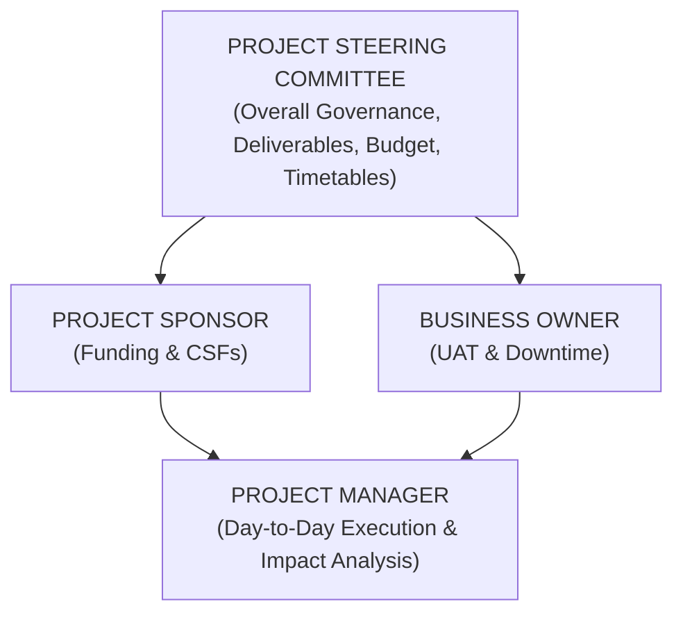
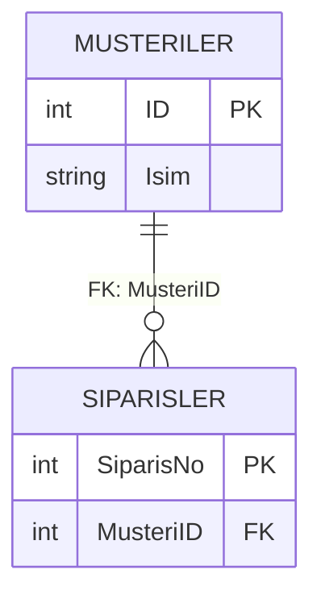
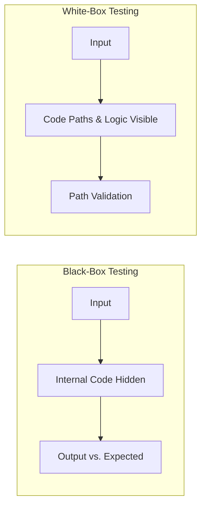

# CISA Domain 3: Bilgi Sistemlerinin Edinilmesi, Geliştirilmesi ve Uygulanması (Comprehensive Study Notes)

---

## 1. IT Proje Yönetimi, Yönetişim ve Yaşam Döngüsü (SDLC)

### Proje Yönetişimi ve Rol Dağılımları
Bilgi sistemleri projelerinin başarısı, net tanımlanmış rol ve sorumluluklara dayanır. Proje Yönetişim yapısı içerisinde her aktörün yetki alanı kesin çizgilerle ayrılmıştır:

- **Proje Yönlendirme Komitesi (Project Steering Committee):** Üst düzey yöneticilerden ve kilit paydaşlardan oluşur. Projenin genel yönetişiminden, stratejik yönünden, bütçe onaylarından, zaman çizelgelerinden ve nihai proje teslimatlarından (**project deliverables, costs, and timetables**) birincil ve nihai olarak sorumludur.
- **Proje Sponsoru (Project Sponsor):** Projenin finansmanını (**funding**) sağlayan, iş vakasının (**business case**) sahibi olan ve Proje Yöneticisi ile birlikte Kritik Başarı Faktörlerini (**Critical Success Factors - CSF**) belirleyen kişidir. Sistemin sağladığı iş değerinin gerçekleşmesinden nihai olarak sorumludur.
- **Proje Yöneticisi (Project Manager):** Projenin günlük yönetiminden, kaynak koordinasyonundan ve ekibin liderliğinden sorumludur. Bir kapsam değişikliği talebi geldiğinde, Proje Yöneticisinin yapması gereken **İLK** şey, değişikliği onaylamak veya reddetmek değil, proje ekibiyle birlikte değişikliğin zaman, bütçe, kaynak ve risk üzerindeki **Etki Analizini (Impact Analysis)** değerlendirmektir.
- **Güvenlik Sorumlusu (Security Officer):** Kurumsal güvenlik politikaları ve veri sınıflandırma standartlarına uygun olarak, sistem kontrollerinin etkili koruma sağladığını doğrulamakla ve SDLC boyunca güvenlik mimarisine danışmanlık yapmakla sorumludur.
- **Kalite Güvence (Quality Assurance - QA):** SDLC süreçlerine, kodlama standartlarına ve metodolojilere uyumu bağımsız olarak denetler. QA ekibi hataları tespit eder ve raporlar; ancak **asla hataları düzeltmek için kod yazmamalı veya canlıya kod taşımamalıdır**. Bu durum Görevler Ayrılığı (**Segregation of Duties - SoD**) ilkesini ihlal eder.
- **İş Süreci Sahibi (Business Process Owner):** Sistemin iş gereksinimlerini tanımlar, Kullanıcı Kabul Testlerini (UAT) yürütür ve uygulamanın canlıya alınması esnasında oluşacak planlı kesintileri (**downtime**) onaylama yetkisine sahip tek makamdır.
 

### Proje Örgütlenme Yapıları
Organizasyonel hizalanmaya göre üç temel proje yönetim yapısı bulunur:
1. **Influence Project Organization:** Proje yöneticisinin hiçbir resmi yönetim yetkisi yoktur; yalnızca danışmanlık ve rehberlik yapar.
2. **Pure Project Organization:** Proje yöneticisi, projeye atanan tüm personel üzerinde tam ve resmi yetkiye sahiptir.
3. **Matrix Project Organization:** Yönetim yetkisi Proje Yöneticisi ile Fonksiyonel Departman Yöneticileri (Department Heads) arasında **paylaşılır**. Kaynak kullanımı ve personel değerlendirmesi müzakere ile yürütülür.

### Proje Başlatma: Fizibilite Çalışması ve İş Vakası (Business Case)
Her IT projesi, **Fizibilite Çalışması (Feasibility Study)** ile başlar. Fizibilite çalışması; teknik, ekonomik, yasal ve operasyonel (TELOS) açılardan projenin uygulanabilirliğini değerlendirir. 
- Bir fizibilite çalışmasının en kritik çıktısı, projenin **organizasyonel etkisini (organizational impact)** ve veri işleme ihtiyaçlarını karşılama yaklaşımını ortaya koymaktır.
- Fizibilite aşamasında bir IS denetçisinin incelemesi gereken en önemli unsur, **güvenlik ve kontrol gereksinimlerinin bu ilk aşamada tanımlanıp tanımlanmadığıdır**.
- Fizibilite çalışmasının ardından **İş Vakası (Business Case)** oluşturulur. İş vakası, yatırımı finansal (ROI, TCO) ve stratejik açıdan gerekçelendirir. Projenin canlıya geçişinden (go-live) sonra yapılan **Post-Implementation Review (PIR)** analizinde elde edilen başarının ölçüldüğü temel referans dokümanı Business Case'dir.

### Proje Planlama, Ölçüm ve Takip Teknikleri
- **İş Kırılım Yapısı (Work Breakdown Structure - WBS):** Proje kapsamını yönetilebilir en küçük alt görevlere böler.
- **Precedence Diagramming Method (PDM):** Görevler arasındaki bağımlılıkları (Finish-to-Start, Start-to-Start vb.) ağ diyagramı üzerinde gösterir. PDM'in birincil amacı projenin **Kritik Yolunu (Critical Path)** belirlemektir.
- **Gantt Şeması (Gantt Chart):** Proje görevlerinin zaman akışını, sürelerini ve çakışmalarını görselleştirir. Projenin ne kadar süreceğini değerlendirmek ve görev bazlı bütçe tahminleri yapmak için en uygun araçtır.
- **Function Point Analysis (FPA):** Yazılımın boyutunu ve karmaşıklığını, kullanıcılara sunulan işlevlerin (girdiler, çıktılar, sorgular, dosyalar, harici arayüzler) sayısına göre matematiksel olarak hesaplayan ISO standartlarında bir tekniktedir. Geliştirme kaynaklarının ve maliyetlerin tahmin edilmesinde kullanılır.
- **Timebox Management:** Yazılım teslimatlarını belirli bir zaman dilimi (kısa ve sabit süre) ve önceden belirlenmiş kaynaklar içinde gerçekleştirmeyi hedefleyen proje yönetim tekniğidir (Agile/RAD süreçlerinde yaygındır).
- **Earned Value Analysis (EVA):** Proje performansını ve ilerlemesini nesnel olarak ölçen en kapsayıcı tekniktir. EVA; Proje Kapsamı, Zaman Çizelgesi ve Maliyet ölçümlerini entegre ederek harcanan bütçeye karşılık üretilen gerçek değeri (Cost Variance, Schedule Variance) hesaplar.

### Kapsam Yönetimi ve Kapsam Kayması (Scope Creep)
Proje ilerledikçe kontrolsüz şekilde yeni gereksinimlerin eklenmesine **Kapsam Kayması (Scope Creep)** denir. 
- Scope Creep'i engellemenin EN İYİ yöntemi, tasarımın dondurulduğu aşamada bir **Yazılım Temel Çizgisi (Software Baseline)** oluşturmaktır. Baseline dondurulduktan sonra gelen her türlü talep katı Değişiklik Yönetimi (Change Management) süreçlerine tabi tutulur.

---

## 2. Sistem Geliştirme Metodolojileri ve Olgunluk Modelleri

### SDLC Metodolojileri
- **Waterfall (Şelale):** Doğrusal ve ardışık bir modeldir. Gereksinimlerin projenin başında tamamen net ve değişmez olduğu durumlar için uygundur.
- **Agile (Çevik):** Yinelemeli (iterative) ve artımlı (incremental) bir yaklaşımdır. Eksik veya sürekli değişen gereksinimlerin bulunduğu dinamik ortamlarda projeyi küçük döngülere (sprint) bölerek yönetmek için en uygun metodolojidir.
- **Rapid Application Development (RAD):** Minimum ön planlama ile hızlı prototiplemeye dayanan bir yöntemdir. En büyük potansiyel riski, hızlı prototipleme ve sürekli değişim esnasında **kullanıcı gereksinimlerinin tam olarak karşılanamaması veya gözden kaçmasıdır**.
- **Prototyping (Prototipleme):** Kullanıcıların uygulamanın arayüzünü ve işleyişini henüz geliştirme aşamasındayken görmelerini sağlar. En büyük faydası, **gereksinimleri somutlaştırarak netleştirmesi ve son kullanıcı memnuniyetini maksimize etmesidir**.
- **Component-Based Development (CBD):** Sistemin gevşek bağlı (loosely coupled) ve bağımsız olarak yeniden kullanılabilir bileşenlerden (components) inşa edildiği yazılım mühendisliği yaklaşımıdır.

| Durum / Senaryo            | En Uygun Metodoloji               |
| -------------------------- | --------------------------------- |
| Net, Değişmez Gereksinim   | Waterfall (Şelale)                |
| Eksik / Dinamik Gereksinim | Agile (Çevik) / Iterative         |
| Hızlı Teslimat / Görsel    | RAD / Prototyping                 |
| Yeniden Kullanılabilirlik  | Component-Based Development (CBD) |
### Yazılım Kalite ve Süreç Olgunluk Modelleri

#### CMMI (Capability Maturity Model Integration) Seviyeleri:
- **Level 1 (Initial):** Süreçler düzensiz, kaotik ve ad-hoc'tur.
- **Level 2 (Managed/Repeatable):** Temel proje yönetim süreçleri kurulmuştur; benzer projeler tekrarlanabilir.
- **Level 3 (Defined):** Kurum genelinde standartlaştırılmış süreçler **tanımlanmış, belgelenmiş ve yaygınlaştırılmıştır (process deployment)**.
- **Level 4 (Quantitatively Managed):** Süreçler nicel metriklerle ve istatistiksel tekniklerle yönetilir ve kontrol edilir.
- **Level 5 (Optimizing):** Odak noktası, süreç performansını **sürekli yenilik ve teknolojik iyileştirmelerle optimize etmektir**.

#### ISO/IEC 9126 Yazılım Kalite Standart Kalite Öznitelikleri:
- **Functionality (İşlevsellik):** Belirtilen veya ima edilen ihtiyaçları karşılayan işlevlerin varlığı.
- **Reliability (Güvenilirlik):** Belirli koşullar altında yazılımın performans seviyesini koruma yeteneği.
- **Usability (Kullanılabilirlik):** Kullanım için gereken çaba ve kullanıcı değerlendirmesi.
- **Maintainability (Bakım Yapılabilirlik):** Değişiklikleri yapabilmek için gereken çaba.
- **Portability (Taşınabilirlik):** Yazılımın bir ortamdan diğerine aktarılabilme yeteneği.
- **Efficiency (Verimlilik):** Kaynak kullanımına oranla performans seviyesi.

#### Business Process Reengineering (BPR)
Süreçlerin radikal şekilde yeniden tasarlanmasıdır.
- **BPR Uygulama Adımları Sırası:** `Envision -> Initiate -> Diagnose -> Redesign -> Reconstruct -> Evaluate`
- **BPR Benchmarking Adımları Sırası:** `Plan -> Research -> Observe -> Analyze -> Adapt/Adopt -> Improve`

### Sistem Mimarileri ve Diller
- **3-Tier (Üç Katmanlı) Mimari:**
  1. *Presentation Layer (Sunum Katmanı):* Grafik kullanıcı arayüzü (GUI) ve kullanıcı etkileşiminden sorumludur. GUI sorunları bu katmanda çözülür.
  2. *Application/Business Layer (Uygulama Katmanı):* İş mantığı ve işlem kurallarını yürütür.
  3. *Data/Storage Layer (Veri Katmanı):* Veritabanı yönetimini ve veri kalıcılığını sağlar.
- **Thin Client Mimarisi:** İstemci tarafında işlem gücü azdır; iş mantığı sunucuda çalışır. Ağ veya sunucu kesintilerinde tüm sistem erişilemez hale geldiği için **Erişilebilirlik (Availability)** riski yüksektir.
- **Object-Oriented Programming (OOP):** Verileri ve davranışları nesneler (objects) olarak kapsüller. **Karmaşık ilişkilere sahip verileri modüllemede oldukça üstündür**.
- **4GL (Dördüncü Kuşak Diller):**
  - *Embedded Database 4GLs:* Kendi özelleştirilmiş veritabanı yönetim sistemlerine bağımlıdır (örn. FOCUS, NOMAD).
  - *Application Generators:* COBOL ve C gibi alt düzey (3GL) dillerde kaynak kod üreten araçlardır.

---

## 3. Veri Tabanı Mimarisi, Yönetimi ve Veri Ambarı

### İlişkisel Veri Tabanı Tasarımı: Normalizasyon ve Denormalizasyon
İlişkisel Veritabanı Yönetim Sistemlerinde (RDBMS) veri mimarisi performans ve veri bütünlüğü dengesi üzerine kurulur:

> [!NOTE]
> **Normalizasyon (Normalization):** Veri tekrarını (redundancy) ortadan kaldırmak ve veri bütünlüğünü (data integrity) sağlamak için büyük tabloları küçük, ilişkili tablolara bölme işlemidir.
> - *Faydası:* Güncelleme, ekleme ve silme anomalilerini engeller.
> - *En Büyük Riski:* Veri modelinin **karmaşıklığını (complexity)** artırmasıdır. Çok sayıda tablo birleşimi (JOIN) gerektirdiği için performans düşüşlerine yol açabilir.

> [!WARNING]
> **Renormalizasyon / Denormalizasyon (Denormalization):** Okuma ve sorgulama performansını / işleme verimliliğini (**processing efficiency**) artırmak amacıyla kasıtlı olarak veri tekrarının veritabanına yeniden dahil edilmesidir.
> - Denormalizasyon veri tutarsızlığı riski yarattığı için **mutlaka resmi bir gerekçeye (justification) dayanmalıdır**.

- **Birincil Anahtar (Primary Key):** Bir tablodaki her kaydı benzersiz kılan alandır. Birincil anahtarlarda **asla NULL değerine izin verilemez**.
- **Referans Bütünlüğü (Referential Integrity):** Yabancı anahtar (Foreign Key) kısıtlamaları ile tablolar arasındaki ilişkilerin tutarlılığını korur. Ebeveyn (parent) kaydın silinmesi durumunda çocuk (child) kayıtların sahipsiz kalmasını, yani **Verilerin Yetim Kalmasını (Orphaned Data)** engeller.

### Veritabanı ACID Prensipleri
Veritabanı işlemlerinin (transactions) güvenilirliğini sağlayan 4 temel kural:
1. **Atomicity (Bütünlük/Bölünmezlik):** Bir işlem "ya hep ya hiç" ilkesiyle çalışır. İşlemin tek bir adımı dahi başarısız olursa tüm işlem geri alınır (rollback).
2. **Consistency (Tutarlılık):** İşlem, veritabanını bir geçerli durumdan başka bir geçerli duruma taşır. Tanımlanmış tüm kısıtlamalar (constraints) korunur.
3. **Isolation (Yalıtım):** Aynı anda çalışan eşzamanlı işlemler birbirini etkilemez. Eşzamanlı yürütmenin sonucu, işlemler sırayla (seri) çalıştırılmış gibi aynıdır.
4. **Durability (Kalıcılık):** İşlem onaylandıktan (commit) sonra, elektrik kesintisi veya sistem çökmesi olsa dahi veriler kalıcı depolamada saklanır.

### Veri Ambarı (Data Warehouse) ve Mimarisi
Veri ambarı, organizasyonun karar destek süreçlerini besleyen merkezi tarihsel veri deposudur.

#### Kurumsal Veri Akış Mimarisi Katmanları:
1. **Data Source Layer:** Operasyonel, harici ve non-operasyonel ham verilerin alındığı kaynak katman.
2. **Data Staging and Quality Layer:** Verilerin kopyalandığı, veri ambarı formatına dönüştürüldüğü (ETL) ve **kalite kontrollerinin** yapıldığı yerdir.
3. **Core Data Warehouse:** Tüm kurumsal verilerin toplandığı ve organize edildiği merkezi ilişkisel depodur.
4. **Data Preparation Layer:** Data Mart'lara yüklenecek verilerin monte edildiği ve OLAP erişim hızını artırmak için pre-calculate edildiği katman.
5. **Data Mart Layer:** Belirli bir iş biriminin (örn. Finans, Pazarlama) ihtiyaçlarına özel olarakCore DW'dan türetilmiş **veri alt kümeleridir (subsets)**.
6. **Warehouse Management Layer:** Veri ambarını inşa etme, sürdürme, Data Mart'ları besleme görevlerinin **zamanlanmasını (scheduling)** ve güvenlik yönetimini sağlar.
7. **Application Messaging Layer:** Katmanlar arası bilgi ve kontrol mesajlarının taşınmasını sağlar.
8. **Internet/Intranet Layer:** Temel veri haberleşmesi ve TCP/IP ağ katmanı.
9. **Desktop/Presentation Layer:** Son kullanıcıların raporlama, dashboard ve OLAP araçlarıyla veriye ulaştığı arayüz katmanı.

> [!CRITICAL]
> **OLTP vs OLAP/Data Warehouse Ayrımı:**
> Online Transaction Processing (OLTP) canlı, dinamik ve sık güncellenen işlem verilerini yönetir. Data Warehouse (OLAP) ise statik ve tarihsel verileri analitik amaçla saklar. 
> **OLTP verileri ile Data Warehouse verilerinin aynı veritabanı ortamında birleştirilmesi, statik ve dinamik verilerin çatışması nedeniyle VERİ KALİTESİNİ ve sistem performansını ciddi şekilde düşürür.**

#### Veri Ambarı Sorgu Tipleri:
- **Drill Up / Drill Down:** Veriyi boyut hiyerarşisinde özetleme (yukarı) veya detaylandırma (aşağı).
- **Drill Across:** Veri ambarındaki cross-section bilgilere ulaşmak için **ortak öznitelikleri (common attributes)** kullanarak farklı boyutları birleştirme.

---

## 4. Veri Bütünlüğü, Uygulama Kontrolleri ve Arayüz Yönetimi

### Girdi Doğrulama Kontrolleri (Input Validation Controls)
Veri kalitesini sağlamanın EN İYİ yolu, hatalı verinin sisteme girişini anında engelleyen **otomatik önleyici uygulama kontrolleridir (preventive application controls)**.

- **Check Digit (Kontrol Basamağı):** Bir kimlik kodunun sonuna matematiksel bir algoritmayla eklenen basamaktır. Veri girişi sırasında yapılan **karakter yer değiştirme (transposition)** ve yazım (transcription) hatalarını tespit eder.
- **Limit Check:** Verinin önceden belirlenmiş bir üst veya alt sınırı aşmadığını kontrol eder (örn. mesai saati <= 10).
- **Range Check:** Verinin belirli bir sayısal **aralıkta** kaldığını doğrular (örn. ürün kodları 100 ile 250 arasında olmalıdır).
- **Validity Check:** Girilen veritabanı kodunun önceden tanımlanmış geçerli kod listesinde olup olmadığını kontrol eder (örn. Medeni hal alanına sadece 'M' veya 'S' girilebilmesi).
- **Reasonableness Check:** Verinin mantıksal sınırlar ve hayatın olağan akışına uygunluğunu denetler (örn. ortalama siparişi 20 adet olan bir müşterinin 10.000 adet sipariş girmesinde uyarı vermesi).
- **Existence Check:** Verinin girilip girilmediğini veya alanın boş bırakılıp bırakılmadığını doğrular.
- **Table Lookups:** Girilen verinin bilgisayarlı bir tablo/referans listesindeki değerlerle eşleşmesini zorunlu kılar (örn. şehir kodunun şehir adıyla eşleşmesi).
- **Duplicate Check:** Yeni girilen bir işlemin daha önce girilmiş geçmiş kayıtlarla eşleştirilerek mükerrer işlenmesini (örn. aynı faturanın iki kez ödenmesini) engeller.

| Kontrol Tipi        | Temel Amacı ve İşlevi                                              |
| ------------------- | ------------------------------------------------------------------ |
| **Check Digit**     | Transposition (yer değiştirme) ve yazım hatalarını yakalar.        |
| **Limit Check**     | Belirlenen tek bir üst veya alt sınırı denetler.                   |
| **Range Check**     | Belirli bir sayısal aralığı (örn. 100–250) denetler.               |
| **Validity Check**  | Önceden tanımlı harf veya kod kriterine uyumu doğrular (örn. M/S). |
| **Duplicate Check** | Mükerrer veri veya fatura girişini engeller.                       |

### Arayüz Kontrolleri (Interface Controls) ve Veri Aktarımı
Sistemler arası arayüzlerde (Interfaces / ETL) veri transferi gerçekleşirken kayıtların eksilmesini veya bozulmasını engellemek için şu kontroller uygulanır:
- **Otomatik Mutabakat (Automated Reconciliation):** Kaynak sistem ile hedef sistem arasındaki kayıt sayılarını ve finansal tutarları otomatik kıyaslar. Arayüzde düşen/aktarılmayan kayıtları tespit etmede EN İYİ yöntemdir.
- **Batch Controls (Toplu İşlem Kontrolleri):**
  - *Record Counts:* Transfer edilen toplam kayıt sayısı.
  - *Control Totals / Financial Totals:* Finansal alanların toplamı.
  - *Hash Totals:* Anlamsız sayısal alanların (örn. müşteri numaralarının toplamı) veri bütünlüğünü doğrulamak amacıyla toplanması.

### Satın Alma ve Borç Hesapları Kontrolü
- **Üçlü Eşleştirme (3-Way Match):** Otomatik bir uygulama kontrolüdür. **Satın Alma Siparişi (Purchase Order)**, **Mal Kabul Raporu (Goods Receipt)** ve **Tedarikçi Faturası (Invoice)** verilerini sistemde karşılaştırır. Bu kontrol, **geçersiz veya sahte ödemelerin işlenmesi riskini EN İYİ şekilde azaltır**.

---

## 5. Yazılım Test Metodolojileri ve Stratejileri

### Test Seviyeleri (Testing Levels)
1. **Unit Testing (Birim Testi):** Kod düzeyindedir. Tek bir programın veya modülün iç mantığını ve **prosedürel tasarımının kontrol yapısını** test eder. Geliştiriciler tarafından yürütülür.
2. **Integration / Interface Testing:** Birbirine veri aktaran iki veya daha fazla modülün/sistemin veri iletişimini ve arayüzlerini doğrulayan testtir.
3. **System Testing:** Modüllerin birleştirilerek sistemin bir bütün olarak çalışmasının ve teknik şartnamelere uyumunun test edilmesidir.
4. **Final Acceptance Testing (Final Kabul Testi):**
   - **Quality Assurance Testing (QAT):** Uygulamanın **teknik özelliklerine**, belgelenmiş spesifikasyonlarına ve teknolojisine odaklanır.
   - **User Acceptance Testing (UAT):** Uygulamanın **işlevsel (functional) iş gereksinimlerine** odaklanır. İş sahipleri tarafından yürütülür. Sistemin canlıya alındıktan sonra **kullanılacağının ve benimsenceğinin EN İYİ göstergesidir**.

### Test Yaklaşımları
- **Black-box Testing (Siyah Kutu Testi):** Kodun iç yapısı ve program mantığı **bilinmeden** yürütülür. Yalnızca girdiler sisteme verilir ve çıkan sonuçlar (çıktılar) beklentilerle karşılaştırılır.
- **White-box Testing (Beyaz Kutu Testi):** Kodun iç yapısı, mantık yolları ve mimarisi **bilinerek** yapılır. Program mantığının etkinliğini değerlendirir. Genellikle birim testlerinde kullanılır; ancak kritik iş kurallarının doğrulandığı özel UAT süreçlerinde de uygulanabilir.
- **Bottom-up Testing (Aşağıdan Yukarıya Test):** En alt düzeydeki veritabanı ve arayüz modülleri ilk önce test edilir. **Arayüz hatalarını SDLC'de EN ERKEN tespit eden yöntemdir**.
- **Top-down Testing (Yukarıdan Aşağıya Test):** Ana arayüz ve kontrol modülleri önce test edilir, alt modüller için kukla kodlar (stubs) kullanılır. Arayüz hatalarının tespitini geciktirir.

### Özel Test Türleri
- **Regression Testing (Regresyon Testi):** Kodda yapılan bir değişikliğin veya düzeltmenin, sistemin önceden sorunsuz çalışan diğer kısımlarını (alt rutinlerini) bozmadığından emin olmak için test senaryolarının tekrarlanmasıdır. Sürekli entegrasyon (CI/CD) süreçlerinde en sık **Unit Test** seviyesinde otomatize edilir.
- **Stress Testing:** Sistemi beklenen operasyonel sınırların ötesine geçecek şekilde kademeli olarak artan eşzamanlı kullanıcı/işlem yüküne tabi tutarak **sistemin kırılma noktasını (breaking point) ve maksimum kapasite sınırlarını** tespit eder.
- **Load Testing:** Sistemin pik saatlerde beklenen maksimum veri ve işlem yükü altındaki performansını ölçer.
- **Volume Testing:** Sistemin işleyebileceği maksimum veritabanı kayıt hacmini test eder.
- **Recovery Testing:** Sistem çöktükten sonra donaım/yazılım kurtarma mekanizmalarının başarısını ölçer.
- **Sociability Testing:** Yeni sistemin, canlı ortamdaki mevcut diğer sistemleri çökertmeden veya olumsuz etkilemeden **bir arada yaşayabildiğini (coexistence)** doğrular.
- **Benchmark Testing:** Yeni satın alınacak bir sunucunun/donanımın yüksek işlem hacimlerini ve yanıt sürelerini karşılayabildiğini standart test yükleriyle kıyaslayarak ölçer.
- **Alpha Testing:** Geliştirme aşamasında dahili ekip tarafından yapılan testtir.
- **Beta Testing:** Canlıya çıkmadan önce dış gerçek kullanıcılar tarafından gerçek dünya koşullarında yapılan testtir; canlı performans hakkında en gerçekçi geri bildirimi sağlar.
- **Pilot Testing:** Sistemin organizasyonun tamamına yayılmadan önce tek bir lokasyonda/departmanda denenmesidir (ERP projelerinde en verimli doğrulama yoludur).

---

## 6. Canlıya Geçiş (Deployment), İşletim ve Bakım

### Canlıya Geçiş (Cutover / Migration) Stratejileri
Yeni bir sistemi canlıya alırken kullanılan stratejiler risk ve maliyet dengesi içerir:

1. **Direct Cutover / Abrupt Changeover (Doğrudan/Anında Geçiş):** Eski sistem belirlenen kesinti tarihinde anında kapatılır ve yeni sistem açılır.
   - **RİSK:** **EN YÜKSEK RİSKLİ** yöntemdir. Yeni sistem başarısız olursa canlı ortam çöker.
   - **KONTROL:** Kesinlikle uygulanabilir bir **Geri Alma Planı (Backout/Rollback Plan)** ve **kapsamlı dokümantasyon** bulunmalıdır.
2. **Parallel Implementation (Paralel Geçiş):** Eski ve yeni sistem belirli bir süre aynı anda yan yana çalıştırılır.
   - **RİSK:** **EN DÜŞÜK RİSKLİ** yöntemdir. Yeni sistem çökerse eski sistem canlı kalmaya devam eder.
   - **Fayda:** Hesaplama doğruluklarını birebir kıyaslamayı sağlar. Ancak kaynak kullanımı ve maliyeti çok yüksektir.
3. **Phased Changeover (Aşamalı Geçiş):** Sistem modül modül canlıya alınır.
4. **Pilot / Staging Rollout:** Sistem lokasyon lokasyon canlıya alınır.

| Strateji             | Risk Seviyesi | Maliyet / Kaynak | En Kritik Kontrol            |
| -------------------- | ------------- | ---------------- | ---------------------------- |
| **Direct Cutover**   | **En Yüksek** | Düşük            | Backout Plan & Dokümantasyon |
| **Parallel Run**     | **En Düşük**  | **En Yüksek**    | Otomatik Veri Mutabakatı     |
| **Phased (Aşamalı)** | Orta          | Orta             | Modül Arayüz Kontrolleri     |
| **Pilot**            | Düşük-Orta    | Düşük-Orta       | Lokasyon Bazlı Test          |
### Uygulama Ortamlarının Ayrıştırılması (Environment Segregation)
Güvenli bir SDLC yapısında ortamlar kesin çizgilerle ayrılmalıdır:
- **Development (Geliştirme):** Kodun yazıldığı dinamik ortam.
- **Test / QA:** İşlevsel ve teknik testlerin yapıldığı ortam.
- **Staging (Pre-Production):** **Canlı ortamın (Production) BİREBİR aynısı/kopyası olan ortamdır.** Canlıya çıkış öncesi son doğrulamalar burada yapılır.
- **Production (Canlı):** Gerçek iş verilerinin işlendiği ortam.

> [!IMPORTANT]
> Test ve Production ortamlarının fiziksel/mantıksal olarak ayrılması, verimli bir **Değişim Yönetiminin (Change Management)** temel taşıdır.
> **Geliştiricilerin (Developers) canlı ortama yazma/kod taşıma (write/migrate) yetkisinin olması EN BÜYÜK SoD İHLALİDİR.**

### Post-Implementation Review (PIR)
Sistem canlıya alındıktan hemen sonra PIR yapılmaz. Sistemin kararlı hale gelmesi (**system stabilization**) ve **en az bir tam işleme döngüsünü (full processing cycle, örn. 3-6 ay)** tamamlaması beklenir.
- **PIR'ın Birincil Amacı:** Sistemin **İş Vakasında (Business Case)** tanımlanan hedeflere ulaşıp ulaşmadığını ve vaat edilen iş faydalarının gerçekleşip gerçekleşmediğini (**Benefits Realization**) doğrulamaktır.
- **PIR Detayları:** PIR sırasında sistemin başarısını değerlendirmede en iyi canlı kanıt, canlı işleme sonuçları (**results of live processing**) ve canlıya geçiş sonrası açılan **Help Desk destek biletlerinin (incident tickets) analizidir**.

---

## 7. Bilgi Güvenliği, Risk Yönetimi, Bulut ve Dış Kaynak Kullanımı

### Güvenlik Entegrasyonu (Security by Design & Shift-Left)
Güvenlik, yazılım geliştirme sürecine sonradan eklenemez. Güvenlik ve gizlilik (Privacy) gereksinimleri SDLC'nin en başından, yani **Gereksinim Tanımlama (Requirements) ve Fizibilite** aşamasından itibaren sürece dahil edilmelidir.
- SDLC aşama geçişlerinde (Phase gates) güvenlik kontrolleri birer **ön koşul (prerequisite)** olmalıdır. Güvenliğin geç tanımlanması, maliyetli telafi edici kontrollerin (compensating controls) uygulanmasına yol açar.

### Veri Gizliliği (Privacy)
Davranışsal reklamcılık, müşteri profilleme veya PII (Kişisel Veri) işleyen yeni platformlarda projeye başlamadan önce yapılması gereken EN ÖNEMLİ çalışma **Data Privacy Impact Assessment (DPIA - Veri Gizliliği Etki Değerlendirmesi)** çalışmasıdır.

### Biyometrik Güvenlik Sistemleri
Biometrik sistem seçiminde ve dağıtımında incelenmesi gereken en kritik güvenlik metriği **False Acceptance Rate (FAR - Yanlış Kabul Oranı)** değeridir. FAR'ın yüksek olması yetkisiz kişilere erişim vereceği için en büyük güvenlik açığıdır. Biometrik cihazlar **Önleyici (Preventive)** fiziki kontrollerdir.

### Mobil Cihaz Güvenliği (MDM)
Hassas veri içeren mobil cihaz kaybolduğunda/çalındığında ilk yapılması gereken teknik işlem cihazı **Uzaktan Silmek (Remote Wipe)** ve cihaz üzerindeki **Durağan Veriyi Şifrelemektir (Encryption at rest)**. Cihaz içindeki zararlı yazılımlara karşı ise **Anti-malware** hayati bir önleyici kontroldür.

### Web Uygulamaları ve SQL Injection Güvenliği
- **SQL Injection:** Saldırganın girdi alanlarına zararlı SQL komutları enjekte etmesidir. En etkili önleyici kontrol **Parametreli Sorgular (Parameterized Queries / Prepared Statements)** ve **Güvenli Kodlama Standartlarıdır**.
- **İstemci Taraflı (Client-Side) Doğrulama Riski:** Performans için doğrulama kontrollerinin tarayıcıya (browser) taşınması büyük bir güvenlik açığıdır. İstemci taraflı kontroller Burp Suite gibi araçlarla kolayca baypas edilebilir. **Veri doğrulaması MUTLAKA sunucu tarafında (Server-Side) yapılmalıdır.**

### Bulut Hizmet Modelleri ve Paylaşımlı Sorumluluk (Shared Responsibility)

| Katman / Sorumluluk            | IaaS           | PaaS           | SaaS           |
| ------------------------------ | -------------- | -------------- | -------------- |
| **Applications**               | Customer       | Customer       | Provider       |
| **Data & Access (IAM)**        | Customer (IAM) | Customer (IAM) | Customer (IAM) |
| **Runtime / Operating System** | Customer       | Provider       | Provider       |
| **Virtualization / Hardware**  | Provider       | Provider       | Provider       |

- **IaaS (Infrastructure as a Service):** Müşteri işletim sistemini, uygulamaları ve **Kullanıcı Erişim Yönetimini (IAM)** yönetir.
- **PaaS (Platform as a Service):** Müşteri alt yapı ile uğraşmadan yalnızca kendi yazılımlarını **geliştirmek ve entegre etmek** için kullanır.
- **SaaS (Software as a Service):** Sağlayıcı uygulamayı sunar. Müşterinin tek sorumluluğu **Kullanıcı Yetkilendirmesi ve Erişim Yönetimidir (IAM)**.

### Dış Kaynak Kullanımı ve Tedarikçi Riski
- **Yazılım Yedekleme Anlaşması (Software Escrow Agreement):** Tedarikçinin iflas etmesi veya desteği kesmesi durumunda, uygulamanın **Kaynak Kodunun (Source Code)** müşteriye teslim edilmesini sağlayan, bağımsız bir üçüncü tarafla yapılan sözleşmedir. Deliverable'lar arasında kaynak kodunun bulunmadığı durumlarda ZORUNLUDUR.
- **Denetim Hakkı (Right-to-Audit Clause):** Tedarikçi sözleşmelerine mutlaka eklenmesi gereken, gelecekte üçüncü tarafın kontrollerini denetleme yasal yetkisi veren maddedir.
- **Fikri Mülkiyet Hakkı (Intellectual Property - IP Ownership):** Özel yazılım geliştirmelerinde sözleşmede telif ve mülkiyet haklarının kuruma ait olduğu açıkça belirtilmelidir.
- **SOC 2 / Bağımsız Denetim Raporları:** Tedarikçinin güvenlik duruşunu doğrulamada en güvenilir araçtır.

---

## 8. End-User Computing (EUC) ve Gölge IT

### EUC Riski ve Yönetimi
Finansal tablolar üreten veya iş kritik süreçlerde kullanılan, kullanıcılar tarafından geliştirilmiş karmaşık makrolar veya tablolara **End-User Computing (EUC)** denir.
- **En Büyük Riski:** IT SDLC kontrollerinden geçmediği için **Veri Bütünlüğünün Kaybolması (Loss of Data Integrity)** ve hesaplama hatalarıdır.
- **Kontrolü:** EUC araçlarının doğruluğunu korumanın EN İYİ yolu, formülleri kilitlemek ve **Standartlaştırılmış Araç Hesaplamaları (Standardized tool calculations)** kullanmaktır. Ayrıca kurumsal IT kontrollerinin (yedekleme, erişim kontrolü, sürüm kontrolü) EUC uygulamalarına da adapte edilmesi gerekir.

---

## 9. IS Denetçisinin Rolü, Bağımsızlık ve Denetim Yöntemleri

### Denetçi Bağımsızlığı (Auditor Independence)
IS denetçisinin en temel ilkesi nesnelliktir:

> [!WARNING]
> Bir IS denetçisi, kontrol tasarımı yaptıysa, kod yazdıysa veya sistem geliştirme ekibinin aktif bir parçası olduysa, **bağımsızlığı halef denetimler için zedelenmiştir (Self-Review Threat)**.
> Böyle bir durumla karşılaşan denetçi, durumu **DERHAL Denetim Komitesine (Audit Committee)** veya denetim yönetimine bildirmelidir. 
> Denetçinin SDLC projelerindeki en uygun rolü, **Riskleri İzlemek ve Kontrol Tasarımlarına Danışmanlık Yapmaktır (Advisory Role)**.

### Canlıya Geçiş Öncesi Denetim (Pre-Implementation Review)
Canlıya geçiş öncesinde denetçinin **BİRİNCİL odağı**, sistemde **çözülmemiş yüksek riskli maddelerin (unresolved high-risk items)** bulunup bulunmadığını kontrol etmek ve canlıya geçişe engel olmayan ikincil hatalar için tanımlanmış **telafi edici iş süreçlerini (workarounds)** değerlendirmektir.

### Dijital Adli Bilişim ve Kanıt Toplama
İşten çıkarılan veya soruşturulan bir çalışanın bilgisayarındaki e-posta veritabanını kanıt olarak korumak için, veri **sıkı kısıtlanmış güvenli bir sunucuya yedeklenmelidir**. İşletim sisteminin standart kopyalama araçlarını (drag-and-drop) kullanmak, dosya metadatasını (erişim/değiştirme tarihlerini) değiştireceği için **kanıt bütünlüğünü (chain of custody) bozar**.

### Örnekleme Yöntemleri
- **Monetary Unit Sampling (MUS):** Popülasyondaki her bir para birimini (dolar/TL) örnekleme birimi olarak kullanır. Büyük parasal değere sahip maddelerin seçilme olasılığını artırır ve hataların parasal büyüklük bazında değerlendirilmesini sağlar.

---

## 10. Hızlı Hızlı Hatırlatma Matrisi (CISA Exam Flash-Cards)

| Senaryo / Soru İpucu                                                | Doğru Cevap / Altın Kural                                       |
| :------------------------------------------------------------------ | :-------------------------------------------------------------- |
| Yer değiştirme (Transposition) hatasını kim yakalar?                | **Check Digit**                                                 |
| Mükerrer fatura ödemesini ne engeller?                              | **3-Way Match & Duplicate Check**                               |
| Arayüzde aktarılmayan kayıp kayıtlar nasıl bulunur?                 | **Automated Reconciliation (Otomatik Mutabakat)**               |
| Sistem canlıda kullanılacak mı, nasıl anlarız?                      | **User Acceptance Testing (UAT)**                               |
| Doğrudan geçişte (Direct Cutover) en kritik eksiklik nedir?         | **Backout / Rollback Plan olmaması**                            |
| Tedarikçi iflas ederse kaynak koda nasıl ulaşılır?                  | **Software Escrow Agreement**                                   |
| Tedarikçi denetimi için sözleşmeye ne konur?                        | **Right-to-Audit Clause**                                       |
| Yeni sistemin mevcut sistemleri çökertmediği nasıl denenir?         | **Sociability Testing**                                         |
| Eşzamanlı kullanıcı sınırlarını ve kırılma noktasını ne bulur?      | **Stress Testing**                                              |
| SDLC'de arayüz hatalarını EN ERKEN ne tespit eder?                  | **Bottom-up Testing**                                           |
| Kodun iç mantığı bilinmeden yapılan girdi-çıktı testi?              | **Black-box Testing**                                           |
| Değişikliğin eski çalışan kodu bozmadığı nasıl anlaşılır?           | **Regression Testing (en çok Unit testte yapılır)**             |
| Scope Creep (kapsam kayması) en iyi nasıl engellenir?               | **Software Baseline oluşturarak**                               |
| Proje aşama bağımlılığı ve Kritik Yol (Critical Path) aracı?        | **Precedence Diagramming Method (PDM)**                         |
| Yazılım boyutunu ve karmaşıklığını hesaplama tekniği?               | **Function Point Analysis (FPA)**                               |
| Proje Kapsam, Zaman ve Maliyet performansını birlikte ölçen teknik? | **Earned Value Analysis (EVA)**                                 |
| PIR (Post-Implementation Review) ne zaman yapılır?                  | **Sistem kararlı hale gelip tam işleme döngüsünü tamamlayınca** |
| PIR'ın birincil amacı nedir?                                        | **Business Case'deki faydaların sağlandığını doğrulamak**       |
| Normalizasyonun en büyük riski nedir?                               | **Veri modelinin karmaşıklığını (complexity) artırması**        |
| Denormalizasyon/Renormalizasyon neden yapılır?                      | **İşleme verimliliğini (sorgu hızını) artırmak için**           |
| Birincil anahtarda (Primary Key) neye izin verilmez?                | **NULL değerlere**                                              |
| Sahipsiz/Yetim kayıtları (Orphaned Data) ne engeller?               | **Referans Bütünlüğü (Referential Integrity)**                  |
| Eşzamanlı veritabanı işlemlerini yalıtan ACID kuralı?               | **Isolation**                                                   |
| OLTP ve Data Warehouse aynı DB'de birleşirse ne bozulur?            | **Veri Kalitesi (Data Quality) ve Performans**                  |
| SQL Injection'a karşı en etkili önleyici kontrol?                   | **Parameterized Queries (Parametreli Sorgular)**                |
| Veri doğrulaması nerede yapılmalıdır?                               | **Server-side (Sunucu tarafında)**                              |
| Biometrik sistemlerde en kritik güvenlik metriği?                   | **False Acceptance Rate (FAR) - Düşük olmalı**                  |
| Cihaz kaybolduğunda sensitive veriyi korumak için?                  | **Remote Wipe (Uzaktan Silme) & Encryption at Rest**            |
| SaaS bulut modelinde müşterinin temel sorumluluğu?                  | **User Access Management (IAM - Kullanıcı Yetkilendirmesi)**    |
| Denetçi kontrol tasarlarsa ne olur?                                 | **Bağımsızlığı bozulur, Denetim Komitesine bildirmelidir**      |
