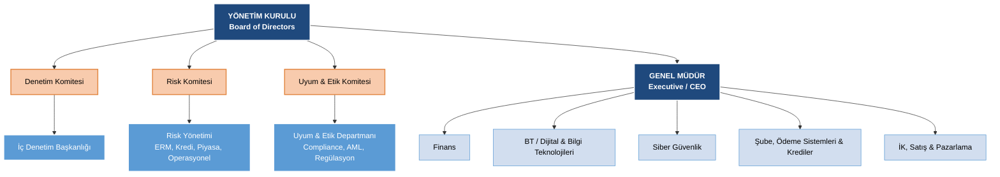

# Domain 1: Bilgi Sistemleri Denetim Süreci ve Organizasyonel Yapı

## 1. Bir Organizasyon Nasıl Çalışır?
IT Denetçisi (IT Auditor) olmak; büyük kurumların, bankaların veya hastanelerin bilgi sistemlerinin şirkete zarar vermeden, düzgün çalıştığından emin olmaktır. Peki bu şirketler nasıl yönetilir?

### 1.1. Yönetim Kurulu (Board of Directors)
Bir şirket kurduğumuzu hayal edelim. Üç arkadaş bir araya gelip sermaye koyduk. Parayı koyan ve en üstte söz sahibi olan yapıya **Yönetim Kurulu (Board of Directors)** denir. Yönetim Kurulunun temel amacı, yatırılan paranın büyümesi ve şirketin kanunlara uygun bir şekilde hedeflerine ulaşmasıdır.

### 1.2. İcrai Fonksiyon: Genel Müdür (Executive / CEO)
Yönetim Kurulu, işi bilfiil yapsın ve para kazandırsın diye bir **Genel Müdür (Executive)** atar. Genel müdür ve altındaki tüm departmanlar (BT, Finans, Satış, Siber Güvenlik vb.) şirketin **İcrai Fonksiyonunu** oluşturur. Amaç para kazandırmaktır.

### 1.3. Bağımsız Komiteler (Independent Committees)
Genel müdür işini iyi yapıyor gibi görünebilir ama ya usulsüzlük varsa? Ya kanunlara uyulmuyorsa? İşte bu yüzden Yönetim Kurulu, *genel müdürden tamamen bağımsız*, **doğrudan kendisine rapor veren yapılar kurar**:

- **Denetim Komitesi (Audit Committee)**: Şirketin tüm süreçlerini bağımsız bir gözle inceler.
- **Risk Komitesi (Risk Committee)**: Şirketin karşı karşıya olduğu riskleri (siber güvenlik, finansal vb.) belirler ve bunların yönetilip yönetilmediğini takip eder.
- **Uyum ve Etik Komitesi (Compliance and Ethics Committee)**: Şirketin KVKK, BDDK, GDPR gibi kanunî zorunluluklara (regulations) uyup uymadığını denetler.

>[!NOTE] Önemli Mantık
>Bir IT Denetçisi (CISA) olarak bizim yerimiz, Genel Müdürün altındaki IT departmanı <u>değildir</u>. Biz, doğrudan Yönetim Kuruluna bağlı olan **İç Denetim Başkanlığının** bir parçasıyız.  Gücümüzü ve bağımsızlığımızı buradan alırız.

---
## 2. Üçlü Savunma Hattı (Three Lines of Defense)
Dünyanın neresine gidersek gidelim, tüm büyük kurumlar riskleri yönetmek için bu modeli kullanır. 

![[uclu-savunöa.png]]

### Birinci Hat: İşi Yapanlar (First Line of Defense)
İşin mutfağıdır. Gİşe memuru, sistem yöneticisi, yazılımcı... İşi fiilen icra ve ilk risklerle karşılaşan kişilerdir. Görevleri, kendi işlerini kurallara uygun (Süreç Kontrol Faaliyetleri) yapmaktır.

### İkinci Hat: Kontrol Edenler (Second Line of Defense)
İnsanın olduğu yerde hata veya kötü niyet olabilir. Birinci hattın işini doğru yapıp yapmadığını izleyen, sürekli kontroller tasarlayan yapıdır. 

- **GRC (Governance, Risk, Compliance)** ve **Bilgi Güvenliği** ekiplerinden oluşur.
- Örneğin; sürekli kasa açığı veren bir şubeyi tespit etmek veya çalışanlara oltalama (phishing) testi yapmak ikinci hattın işidir.
### Üçüncü Hat: Denetleyenler (Third Line of Defense)
İşte CISA'nın sahneye çıktığı yer burasıdır. **İç Denetim (Internal Audit)** veya dışarıdan gelen düzenleyicilerdir (BDDK, ECB). Üçüncü hat, hem 1. hattı hem de 2. hattı denetler. Genel Müdürlüğe değil, **doğrudan Yönetim Kurulna bağlıdır**.

---

## 3. Bilgi Sistemleri Denetimine Giriş (IS Auditing)
Denetim, üç ana aşamadan oluşur: **Planlama**, **Saha Çalışması (Fieldwork/Execution)** ve **Raporlama (Reporting)**.

### 3.1. Standartlar ve Etik 
ISACA'nın yayımladığı "*IS Audit Standards, Guidelines and Codes of Ethics*" kitapçığı, denetçinin anayasasıdır.

**Etik (Ethics)**: Denetlenen kişiden hediye almamak, denetimin objektifliğini ve bağımsızlığını (independence) bozacak ilişkilere girmemek esastır. Kurallara uyulmazsa sertifika iptal edilebilir.

### 3.2. Denetim Tüzüğü (Audit Charter)
Bir denetime gittiğimizde, karşı taraf (denetlenen) bize bilgi/belge vermek istemeyebilir.

- **Audit Charter**, Yönetim Kurulu tarafından iç denetime verilen resmî **yetki belgesidir**.
- Bize tüm sistemlere, loglara ve süreçlere erişme hakkı verir. İletişimle çözülemeyen durumlarda masaya konulan en büyük hukukî ve kurumsal güçtür.

---

## 4. Risk Temelli Denetim Planlaması (Risk-Based Audit Planning)

CISA ezberle yapılmaz; risk nerede yüksekse oraya odaklanılır. Denetim planlanırken, dış tehditler (örn. Covid dönemi uzaktan çalışma), şirket politikaları, stratejiler ve teknolojik altyapılar göz önüne alınır.

### 4.1. Denetim Riski ve Bileşenleri
Denetim yaparken bizim de hata yapma ihtimalimiz vardır. Buna **Genel Denetim Riski (Overall Audit Risk)** denir. Üç parçadan oluşur:

1. **Doğal Risk (Inherent Risk)**: Bir sürecin doğası gereği taşıdığı risktir (örn. gişede nakit para alışverişi yapılması).
2. **Kontrol Riski (Control Risk)**: İkinci hattın (İç Kontrol) tasarladığı mekanizmaların, var olan bir hatayı tespit edememesi riskidir.
3. **Tespit Edememe Riski (Detection Risk)**: İç kontrolün kaçırdığı bir hatayı, **denetçinin (üçüncü hat)** de testlerinde bulamaması riskidir.

**Toplam Denetim Riski = Inherent Risk x Control Risk x Detection Risk**

### 4.2. Riske Müdahale Yöntemleri (Risk Response)
Bir risk tespit edildiğinde yönetim dört farklı aksiyon alabilir:

1. **Riski Azaltmak (Risk Mitigation)**: Riskin etkisini düşürmek. (Örn: Kapıya turnike koymak).
2. **Riski Kabul Etmek (Risk Acceptance)**: Riskin zararı, önlemin maliyetinden düşükse hiçbir şey yapmamak.
3. **Riskten Kaçınmak (Risk Avoidance)**: Riski yaratan faaliyeti tamamen durdurmak. (Örn: Sorunlu eski bir sunucuyu kapatmak).
4. **Riski Transfer Etmek (Risk Transfer)**: Riskin yükünü üçüncü bir tarafa devretmek. (Örn: Siber güvenlik sigortası yaptırmak).

---

## 5. İç Kontroller ve Kontrol Tipleri (Internal Controls)
Kontroller, bir risk olayının (risk event) gerçekleşmesini önleyen, tespit eden veya etkisini azaltan mekanizmalardır. İkinci hat tarafından tasarlanır. Biz denetçiler bu kontrollerin varlığını ve *etkin çalışıp çalışmadığını* test ederiz.

### 5.1. Kontrol Tipleri (Control Types)

1. **Önleyici Kontroller (Preventive Controls)**: Olay meydana gelmeden engeller.
	- *Örnek*: Diskleri şifrelemek -encryption-, hatalı parolayı reddetmek).
2. **Tespit Edici Kontroller (Detective Controls)**: İstenmeyen bir olayı (siber saldırı, hata, usulsüzlük vb.) engelleme gücü olmayan; ancak bu **olay gerçekleştiği anda** (eşzamanlı uyarı) veya **gerçekleştikten sonra** (geçmişe dönük inceleme) durumu fark etmemizi sağlayan mekanizmalardır. Önleyici kontrollere göre kurulumu daha ucuzdur.
	- *Gerçekleştiği Anda Tespit*: Yangın alarmı, yetkisiz giriş denemelerinde anında uyarı üreten SIEM sistemleri.
	- *Gerçekleştikten Sonra Tespit*: Güvenlik kamerası kayıtlarının incelenmesi, gün sonu kasa sayımları, sistem loglarının geriye dönük analizi.
3. **Düzeltici Kontroller (Corrective Controls)**: Olay yaşandıktan sonra sistemi eski sağlıklı hâline (recovery) geri döndürmeyi amaçlar. Hasarı yok etmez, ancak etkisini (impact) minimize eder.
	- *Örnek*: Biten bir siber saldırı veya sunucu çökmesi sonrası, verileri alınan yedeklerden (Backup) geri yüklemek. Bir felaket anında şirketin işleyişini başka bir coğrafi lokasyondaki sunuculardan devam ettirerek iş sürekliliğini sağlamak.

### 5.2. Kontrol Hedefleri (Control Objectives)

Şirketler milyonlarca dolar harcayıp kontroller tasarlarlar, ancak hiçbir kontrol boşlukta var olmaz. Tasarlanan her kontrolün hizmet ettiği büyük bir amaç olmalıdır. Buna **Kontrol Hedefi (Control Objective)** denir. Denetçi, kontrolü incelerken aslında şu soruya cevap arar: *Bu kontrol neyi başarmayı hedefliyor?*

- **Örnek 1**: İkinci hat gidip devasa bir SIEM (Güvenlik Bilgi ve Olay Yönetimi) sistemi satın alıyor. Amaç ne? Herhangi bir ihlali anında tespit edebilmek. Demek ki buradaki Kontrol Hedefi: **Olay Yönetimi (Incident Management)**.
- **Örnek 2**: Sistemlerin yedeği alınıyor (Corrective Control). Amaç ne? Sistem çökse bile şirketin para kazanmaya devam etmesi. Demek ki buradaki Kontrol Hedefi: **İş Sürekliliği (Business Continuity).**

>[!TIP] Denetçi Gözünden
>Kâğıt üzerinde kontrollerin harika görünmesi bir şey ifade etmez. Bir denetçi "Yedekleme politikamız var" sözüne inanmaz; "*Göster*" der. Yüzlerce sunucunun çalışıp çalışmadığını manuel kontrol etmek yerine, 10 satırlık bir Python betiği yazarak testleri otomatize edebiliriz. En değerli IT Denetçisi, riski en **maliyet etkin** ve hızlı şekilde tespit edebilen denetçidir.

---

## 6. Hangi Sistemleri Denetliyoruz?

Denetim planlaması yaparken, sadece kâğıt üzerindeki risklere değil, sektörün kullandığı spesifik teknolojik süreçlere de bakarız. Bir denetçi olarak her teknolojiyi bilemeyiz ama **bilginin nerede doğup nerede işlendiğini** takip ederek riskleri bulabiliriz. 

- **E-Ticaret**: Müşteri 750₺'lik sipariş verdiğinde, sistemde gerçekten 750₺ olarak mı işleniyor? Veri manipülasyonu var mı?
- **Elektronik Veri Değişimi (EDI - Electronic Data Interchange)**: Kurumlar arası otomatik veri transferidir. (*Örneğin:* Havayolundan bilet alınca kredi kartı şirketine veri gidip bize mil/puan gelmesi).
- **Satış Noktası Sistemleri (POS - Point of Sale)**: Kredi kartını okuttuğumuz cihazların ve bağlı oldukları ağın güvenliği.
- **Tedarik Zinciri (Supply Chain)**: Bir ürünün fabrikadan çıkıp müşteriye ulaşana kadar geçtiği tüm dijital adımlardır. Bir adımdaki güvenlik zafiyeti tüm zinciri kırabilir.
- **Endüstriyel Kontrol Sistemleri (ICS - Industrial Control Systems)**: Geleneksel IT sistemlerinden farklı olarak fabrikalardaki robotları ve üretim bantlarını yöneten sistemlerdir.

---

## 7. Denetim Türleri İnsan Fakötrü
Bilgi Sistemleri Denetimi yapsak da, organizasyonun 3. Savunma Hattı'nda farklı amaçlara hizmet eden birçok denetim türü bulunur. CISA olarak bu çerçeveleri bilmeliyiz:

- **Finansal Denetimler**: Mâlî tabloları ve parasal süreçleri inceler.
- **Operasyonel Denetimler**: İş birimlerinin verimliliğine odaklanır.
- **Uyum Denetimleri (Compliance Audits)**: KVKK, GDPR, BDDK gibi zorunlu kanun ve regülasyonlara uyumu test eder.
- **Üçüncü Parti Denetimleri**: Hizmet alınan taşeronların kontrolüdür.

