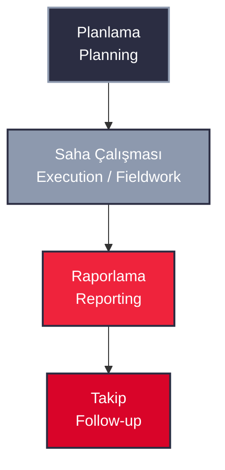

# CISA Domain 1: Bilgi Sistemleri Denetim Süreci (Part B - Execution & Reporting)

Bir denetim temelde bir **projedir**. Proje yönetiminde olduğu gibi denetimde de önce planlarız, sonra uygularız (saha çalışması) ve günün sonunda sonuçları raporlarız. Denetimin omurgasını bu üç temel aşama oluşturur.

## 1. Denetimin Tanımlanması ve Fazları (Audit Phases)

Birden fazla denetimi ve genel yapıyı kapsayan çatıya **Denetim Programı (Audit Program)** diyoruz. Program, adım adım denetim prosedürlerini barındırır ve doğru işletildiğinde her bir alt denetimin hedefine ulaşmasını sağlar.

Bir denetimi adım adım tanımlarken şu sıra izlenir:

1. **Konu (Subject)**: Denetimin başlığı nedir? (Örn: Kimlik ve Erişim Yönetimi - Identity and Access Management)
2. **Hedef (Audit Objective)**: Günün sonunda neye ulaşmak istiyoruz? Yönetime neyi teslim edeceğiz? (Örn: KVKK'ya uyumun kontrol edilmesi)
3. **Kapsam (Audit Scope)**: Hedefe ulaşmak için "nelere bakacağız" ve sınırları çizmek adına "nelere bakmayacağız". (Örn: Sadece internete açık sunucular incelenecek, iç ağ hariç tutulacak).
4. **Ön Planlama (Pre-Audit Planning)**: Sahaya inmeden önce yapılan kaba risk değerlendirmesidir (Risk Assesssment). Kapsamı netleştirir; teknik yetenekleri, bütçeyi, eforu, lokasyonu ve iletişime geçilecek kişileri belirleriz.
5. **Denetim Prosedürleri (Audit Procedures)**: Veriyi nasıl toplayacağız? Hangi betikleri yazacağız? Adımları nasıl gerçekleştireceğiz? Bunların metot seviyesinde belirlenmesidir.

## 2. Saha Çalışması ve Dokümantasyon (Fieldwork & Workpapers)

Denetime başladığımızda yaptığımız her adımı, kullandığımız her betiği (scripti) ve vardığımız her sonucu kayıt altına almamız gerekir. Buna **Çalışma Kâğıtları (Workpapers)** denir. Kurumsal hafıza ve hesap verilebilirlik (accountability) için hayati önem taşır.

- **Güvence Vermek (Assurance)**: Denetimin tek amacı eksik (bulgu) bulmak değildir. Eğer bir süreç sağlam işliyorsa, işlerin yolunda olduğuna dair güvence (assurance) vermek de denetimin asli görevlerindendir.
- **Usulsüzlük Tespiti (Fraud(Irregularity Escalation)**: Eğer incelemelerimiz sırasında bir illegallik veya usulsüzlük sezersek, bunu derhal **yazılı olarak üst yönetime raporlamalıyız.** Aksi takdirde, ileride patlayacak bir krizde "*Siz buraya güvence vermiştiniz*" denilerek fatura (liability) bize kesilebilir.

>[!warning] CISA Sınav İpucu
>Sınavda "Denetçi bir usulsüzlük (fraud) tespit ettiğinde **İLK** ne yapmalıdır?" tarzı sorular gelir. Cevap her zaman **üst yönetime/denetim komitesine durumu bildirmek ve gerekirse ek inceleme talep etmektir.** Denetçi polisiye bir soruşturma yapmaz, durumu raporlar.

## 3. Örneklem Alma (Sampling)

Milyonlarca satırlık verinin tamamını incelemek, kapasite veya zaman kısıtından dolayı her zaman mümkün olmayabilir. Bu durumda büyük veri setini temsil edecek küçük bir küme seçeriz; buna **örneklem (sampling)** denir.

(*Günümüzde yapay zekâ ve betikler sayesinde %100 popülasyon taraması yapmak mümkün ve ideal olsa da, CISA sınavı istatistiksel terminolojiyi bilmemizi bekler.*)

### A. Temel Test Türleri

1. **Uyum Testi (Compliance Testing)**: Kurumda bir kural, politika veya prosedür var mı? Varsa buna uyuluyor mu? Örneğin, "*Loglar 90 gün saklanmalıdır*" kuralı var mı ve genel işleyiş buna uyuyor mu?
2. **Maddî / Detaylı Test (Substantive Testing)**: Uyum testinin bir adım ötesidir. Gerçekten o sistemin içine girip, teknik detaylarda tek tek işlemlerin doğruluğunu kontrol etmektir. Kaynak gerektirir ama çok daha detaylıdır.

### B. Örneklem Yöntemleri

1. **İstatistiksel Örneklem (Statistical Sampling)**: Matematiksel denklemlere ve olasılığı dayanır. Seçim rastgeledir (random) ve objektiftir. Popülasyonun boyutuna göre kaç adet sample alınacağını formüller belirler.
2. **Yargısal / İstatistiksel Olmayan Örneklem (Judgmental / Non-Statistical Sampling)**: Denetçinin tecrübesine ve ön yargısına dayanır. Örneğin, pazarda arkaya dizilmiş çürük domatesleri bilip direkt oradan örneklem almak. **Riskli görünen alana odaklanılır**.
3. **Nitelik Örneklemi (Attribute Sampling)**: Belirli bir niteliğin veya hatanın popülasyonda ne sıklıkta tekrar ettiğini (occurrence rate) bulmak için kullanılır. Örneğin, 90 günlük loglarda "yetkisiz erişim denemesi" niteliğinin aranması.
4. **Dur veya Devam Et Örneklemi (Stop or Go Sampling)**: Sıralı bir testtir. Bir örnek çekilir, hatalıysa devam edilir. Hata oranı belirli bir noktayı aşarsa "burada kesin bir sıkıntı var" denilerek test durdurulur.
5. **Keşif Örneklemi (Discovery Sampling)**:
	- *Amaç:* Dolandırıcılık, usulsüzlük veya kontrol atlatma (fraud/irregularity) tespiti.
	- *Mantık:* Hiç hata yoksa usulsüzlük yok varsayılır. 1 hata bile varsa (tolerans sıfırdır) tüm popülasyon şüpheli kabul edilir.
	- *Örnek:* Yetkisiz admin hesabı aranması (1 tane bile varsa kritik bulgu) veya manuel ödeme yapılan işlemlerde sahte fatura tespiti.
6. **Değer / Tutar Örneklemi (Variable Sampling)**:
	- *Amaç:* Parasal tutar veya nicel değer tahmini yapmak. "Ne kadar?" sorusuna cevap verir.
	- *Kullanım:* Substantive testing (maddî/detaylı testler). Örn: Bilanço kalemlerinin maddî doğruluğu.
	- *Alt Türleri*:
		- **Stratified Mean per Unit (Katmanlı)**: Popülasyon gruplara ayrılır. Daha küçük örneklem ile daha iyi sonuç verir. Örneğin, 1M€ üzeri işlemler %100 test edilir, küçük tutarlar örneklenir.
		- **Unstratified Mean per Unit (Katmansız)**: Popülasyon tek grup kabul edilir. Ortalaması hesaplanır ve tüm popülasyona yansıtılır. Örneğin, tüm seyahay giderlerinin ortalaması alınarak toplam hata tahmini yapılması.
		- **Difference Estimation( Fark Tahmini)**: Kayıtlı değer ile denetlenen (gerçek) değer arasındaki farklar kullanılır. Toplam fark tahmin edilir. Örneğin, denetlenen faturalar kayıtlı değerleden ortalama 120€ fazla çıkıyorsa toplam fark hesaplanır.

### C. Temel İstatistiksel Kavramlar

- **Confidence Coefficient (Güven Düzeyi):** Örneklemin popülasyonu temsil etme olasılığıdır (%90 / %95 / %99). Genelde %95 tercih edilir. Güven düzeyi yükseldikçe, daha büyük örneklem almak gerekir.
- **Risk Level (Risk Seviyesi):** 1 eksi Güven Düzeyi'dir. (Örn: %95 güven düzeyi = %5 risk seviyesi).
- **Precision (Hassasiyet):** Kabul edilebilir hata aralığıdır. Yüksek precision (dar tolerans) daha küçük örneklem ama yüksek risk getirir; Düşük precision (geniş tolerans) büyük örneklem gerektirir.
- **Expected Error Rate (Beklenen Hata Oranı):** Attribute sampling için kullanılır. Beklenen hata yüksekse, daha büyük örneklem alınmalıdır.
- **Tolerable Error Rate (Tolere Edilebilir Hata):** Maddi yanlışlık sayılmadan kabul edilebilecek maksimum hatadır. Compliance testlerinde % olarak ifade edilir.
- **Sample Mean (Örneklem Ortalaması):** Alınan örnek değerlerin aritmetik ortalamasıdır.
- **Sample Standard Deviation (Örneklem Standart Sapması):** Verilerin örneklem ortalamasından ne kadar saptığını gösterir.
- **Population Standard Deviation:** Tüm popülasyonun dağılımını ölçer. Variable (değer) sampling hesaplamaları için kullanılır.

### D. Örneklem Riskleri (Sampling Risks)

Denetçinin örneklem seçerken hata yapma riskidir. İki temel seviyesi vardır:

- **Incorrect Acceptance (Yanlış Kabul)**: Aslında hatalı/sıkıntılı ola bir popülasyonu, çektiğimiz örneklemler temiz çıktığı için "Doğru/Güvenilir" olarak kabul etme riskimizdir. (*En tehlikelisidir.*)
- **Incorrect Rejection (Yanlış Reddetme)**: Aslında sağlam olan bir popülasyonu, şans eseri hatalı örneklemlere denk geldiğimiz için "*Sıkıntılı*" diyerek reddetme riskimizdir.

>[!warning] CISA Sınav İpucu
>ISACA bizden bir istatistik dehası olmamızı beklemiyor. Ancak hangi senaryoda istatistiksel, hangi senaryoda yargısal örneklem (judgmental sampling) yapmamız gerektiğini bilmeliyiz. **Eğer popülasyon homojen değilse ve belirli bir alanda risk yoğunluğu varsa, Judgmental Sampling seçilmelidir.**

## 4. Kanıt Toplama (Evidence Collection)

Denetimin en hassas noktasıdır. IT riskleri gözle görülmez, bu yüzden gerçeği ortaya çıkarmak denetçinin analitik zekâsına kalmıştır.

- **Kanıtın Kalitesi ve Bağımsızlığı (Independence of Evidence)**: Denetlenen kişinin bize sunduğu manuel bir Excel tablosu bağımsız bir kanıt değildir; nitekim manipüle edilebilir. Doğrudan sistemden çekilen loglar veya güvenlik birimi gibi üçüncü ve bağımsız bir kaynaktan alınan veriler çok daha güvenilirdir.
- **Zamanlama (Timing)**: Haberli denetimlerde sistemler son dakika güncellenebilir. Gerçek durumu görmek için geçmişe dönük logların (örn: *Parola politikası en son ne zaman değiştirildi?*) istenmesi veya habersiz denetim yapılması daha etkilidir.

### Kanıt Toplama Yöntemleri:

1. **Mülakat (Interview)**: "*Güncellemeleri yapıyor musunuz?*" diye sormaktır. Tek başına asla yeterli değildir, doğrulanması gerekir. 
2. **Yeniden Gerçekleştirme (Re-performance)**: Denetçinin, kullanıcının yaptığı işlemi başından sonuna kadar test verisiyle gözü önünde tekrarlatmasıdır. Çok güçlü bir kanıttır.
3. **Üzerinden Geçme (Walk-through)**: İşlemi baştan yaptırmadan, sürecin kâğıt üzerinde veya sistemde adım adım izlenmesidir.

## 5. Veri Analitiği ve Sürekli Denetim

Sadece mülakat yaparak denetim yapmak günümüzde pek geçerli değildir. Günümüzde, veriyi analiz edebilen denetçiler fark yaratır.

### **CAATs (Computer Assisted Audit Techniques)**
- Bilgisayar destekli denetim teknikleridir. Denetçinin büyük veriye erişmesini, analiz etmesini ve örneklem almasını sağlayan araçların genel adıdır.
### **GAS (Generalized Audit Software)** 
- CAATs şemsiyesi altında yer alan, denetçilerin veri çekmek ve analiz yapmak için kullandığı genel denetim yazılımlarıdır.
### **Sürekli Denetim (Continuous Auditing)**
- Kritik süreçlere yerleştirilen betikler/kurallar sayesinde 7/24 otomatik denetim yapılmasıdır. Örneğin, log akışında 1 dakikalık bir kesinti olduğunda anında alarm üretmesi veya taranmış yüz binlerce banka dekontunda imza eksikliğini görüntü işleme ile tespit eden kodlar. Büyük hacimli işlemleri anlık izlemeyi ve hata/suistimalleri gecikmeden tespit etmeyi amaçlar.
#### Sürekli Denetimde Kullanılan Spesifik Teknikler

- **SCARF / Embedded Audit Modules:** Uygulama (sistem) içine doğrudan denetim kodları gömülür. Seçili işlemler izlenir. (Örn: 10.000€ üzeri tüm ödemelerin otomatik olarak denetim loguna düşmesi).
- **Snapshots (Anlık Görüntü):** Bir işlemin girişten çıkışa kadar izlediği yolun fotoğrafı çekilir. (Örn: Bir kredi işleminin hangi validasyonlardan geçtiğinin sistem içinde adım adım kaydedilmesi).
- **Audit Hooks (Denetim Kancaları):** Şüpheli olaylarda anında alarm üreten tetikleyicilerdir. (Örn: Mesai dışı saatlerde admin login olursa sistemin alarm üretmesi).
- **Integrated Test Facility - ITF (Entegre Test Tesisi):** Canlı sistemde sahte (dummy) varlıklar/müşteriler oluşturulur. Test ve gerçek işlemler sistemde bir arada çalışır. (Örn: Dummy müşteri hesabına faiz hesaplatılıp, sonucun sistemin doğruluğunu teyit etmek için manuel hesapla karşılaştırılması).
- **Continuous & Intermittent Simulation - CIS (Sürekli ve Aralıklarla Simülasyon):** Sistem işlemleri paralel olarak simüle edilir. Önceden tanımlı kriterlere uyan işlemler denetlenir. (Örn: Kredi limiti aşan işlemlerin sistem tarafından doğru reddedilip reddedilmediğinin simülasyonu).

>[!warning] CISA Sınav İpucu
>Sınavda şıklarda hem CAATs hem GAS varsa ve soru genel bir araç kullanımı soruyorsa, ikisi aynı anda doğru cevap olmaz. Ancak soru "En spesifik/en doğru" olanı soruysa, senaryoya en uygun ve en detaylı aracı (örneğin port taraması için spesifik bir scanning software) seçmeliyiz.

## 6. Raporlama, Takip ve Değer Katma

Bulguları bulmak işin sadece yarısıdır. Denetimin nihai amacı kuruma **değer katmaktır**.

- **Kapanış Toplantısı (Closing Meeting)**: Rapor yayımlanmadan önce denetlenen tarafla masaya oturulur. Bulgular tartışılır, mutabık kalınır. Eğer denetlenen taraf geçerli bir karşı kanıt sunarsa, bulgu revize edilebilir veya silinebilir. Ortak mutabakat (kabul) ideal olandır.
- **Takip (Follow-up)**: Rapor yayımlandıktan sonra, denetlenen tarafın bulguları kapatmak için sunduğu "Aksiyon Planı"nın zamanında ve doğru uygulanıp uygulanmadığının denetçi tarafından tekrar kontrol edilmesidir. Eksiklik gerçekten giderildiğinde bulgu kapatılır.

## 7. Denetim Süreçlerinin İyileştirilmesi

Denetim departmanları da kendi süreçlerini sürekli geliştirmelidir.

- **Kontrol Öz Değerlendirmesi (CSA - Control Self Assessment)**: İşin sahiplerinin (birinci hat çalışanlarının) kendi süreçlerindeki kontrolleri ve riskleri bir anket yahut form aracılığıyla bizzat değerlendirmesidir.
	- *Faydaları:* Riski erken fark ettirir, çalışan motivasyonunu artırır, denetim maliyetlerini düşürür, kurum içi uyumu sağlar. Ancak tamamen beyana dayalı olduğu için, denetçinin gözü her zaman açık olmalıdır.
- **Entegre Denetim (Integrated Auditing)**: IT denetimi ile operasyonel/finansal denetimin birleştirilmesidir. Örneğin, havalimanı körüklerinin hem ağ güvenliğinin hem de fiziksel operasyonel işleyişinin aynı anda denetlenmesi.