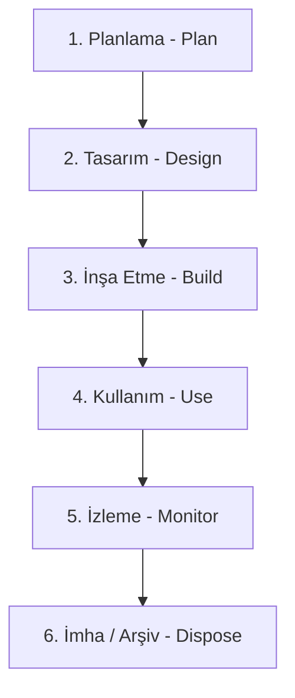

# Domain 4A: Bilgi Sistemleri Operasyonları (IS Operations)

Domain 3'te bir bilgi sisteminin fikir aşamasından projeye dönüşmesini, kodlanmasını, test edilmesini ve canlıya (production) alınmasını inceledik. Domain 4A'da ise resmi tamamlıyoruz: **Sistemler günlük operasyonu nasıl** <b><u>yürütülür?</u></b>

Bir sistem canlıya alındığı andan itibaren yaşayan bir organizmaya dönüşür. Donanımlar ısınır, veri tabanları büyür, kullanıcılar hatalar yapar, yamalar (patch) çıkar ve sistemler birbiriyle konuşur. Bir BT denetçisinin görevi, bu devasa operasyon çarkının iş hedeflerini kesintisiz, güvenli ve verimli bir şekilde desteklediğini doğrulamaktır.

---

## 1. Donanım ve Altyapı Bileşenleri (Hardware & Infrastructre)

Operasyonun temeli fiziksel donanımlara dayanır. Bilgisayar mimarisindeki temel parçalar güvenlik ve performans kontrollerinin ilk adımıdır:

- **CPU (Central Processing Unit - Merkezî İşlem Birimi)**: Bilgisayarın beynidir. Tüm komutlar CPU üzerinden geçer.
- **RAM (Random Access Memory - Rastgele Erişimli Bellek)**: Geçici hafızadır. Bilgisayar kapatıldığında veya yeniden başlatıldığında üzerindeki veri silinir (volatile).
- **SSD (Solid State Drive) / HDD (Hard Disk Drive)**: Kalıcı depolama alanlarıdır. Eski mekanik HDD'ler yavaşlık ve fiziksel hassasiyet nedenleriyle yerini SSD teknolojisine bırakmıştır.

### Sunucu ve İstemci (Server-Client) Mimarisi

İnternet ve kurum içi ağlar iki temel rolden oluşur: Hizmeti talep eden **istemciler (clients)** ve hizmeti sunan **sunucular (servers)**. Bir kurumda işlevlerine göre farklı sunucu tipleri bulunur:

- **Print & File Servers**: Dosya saklama ve yazıcı yönetim sunucuları.
- **Application & Web Servers**: Şirket içi uygulamaların ve dışa açık web sitelerinin çalıştığı sunucular.
- **Mainframe**: Özellikle bankacılık sektöründe milyarlarca para transferini anlık işleyen, çok yüksek güvenlik ve işlem kapasitesine sahip devasa ana bilgisayarlardır.
- **Thin Client (İnce İstemci)**: Üzerinde minimum işletim sistemi barındıran, tüm işlem gücünü merkezî bir sunucudan (örn. Microsoft Terminal Services veya Citrix Presentation Server) alan kısıtlı cihazlardır. Kullanıcı yetkilerini kısıtlamak ve veri sızıntısını önlemek için mükemmel bir kontroldür.
- **Proxy Server (Vekil Sunucu)**: Şirket ağından dış internete çıkan trafiği arada karşılayan "yol üstü" kontrol noktasıdır. Pahalı bir güvenlik duvarı (firewall) kurmadan önce, kullanıcıların sosyal medyaya veya zararlı sitelere girmesini engellemek için hızlı ve filtreleyici bir ara sunucu olarak görev yapar.

>[!danger] CISA Ciddi Risk Vurgusu: VoIP Telefon Sistemleri ve UPS Koruması
>Kurumda kullanılan dahili telefon sistemi **VoIP (Voice-over IP)** ise, masa telefonları elektrik gücünü ağ anahtarlarından (**PoE - Power over Ethernet**) alır.  
>- **EN BÜYÜK RİSK:** Ethernet anahtarlarının **kesintisiz güç kaynağı (UPS)** üniteleriyle korunmamasıdır. Kısa bir elektrik kesintisinde tüm ağ anahtarları kapanır ve çağrı merkezinin TÜM telefon iletişimi anında kesilir.
>- Ses iletişimi ile veri iletişiminin aynı altyapıyı/ekipmanı kullanması veya VoIP sistemini BT ağ ekibinin yönetmesi normaldir.

> [!important] CISA Vurgusu: Kritik Web Uygulamalarında Kesintisiz Erişilebilirlik
> Yoğun kullanılan kritik bir web uygulamasına kullanıcıların **kesintisiz erişimini** sağlamanın **EN İYİ yolu Yük Dengeleme (Load Balancing)** uygulamaktır.
> - Yük dengeleyici gelen trafiği birden fazla web sunucusuna dağıtır. Bir sunucu çöktüğünde trafik diğerine kesintisiz aktarılır.
> - *Çeldirici:* Disk Aynalama (Disk Mirroring) veya RAID sadece sunucu içindeki disk arızasını korur; CPU, RAM veya uygulama çökerse erişimi koruyamaz.

### Uç Nokta (Endpoint) Riskleri ve USB Güvenliği

Taşınabilir bellekler (USB), operasyonel kolaylık sağlarken kuruma üç büyük risk getirir: *Kötü amaçlı yazılım (malware/virüs) bulaşması$_1$, kurum dışına veri sızıntısı (data exfiltration)$_2$ ve cihazın fiziksel olarak kaybolması.$_3$*

>[!info] Denetçi Bakış Açısı
>**Doğrula**: "*Kurumda yetkisiz USB kullanımını engeleyen bir Uç Nokta Güvenlik Politikası (Endpoint Policy) var mı? USB üzerinden veri aktarımı engellenmiş mi? İşi gereği USB kullanması gereken personelin cihazları şifrelenmiş mi?*"

### Otomatik Varlık Takibi: RFID (Radio Frequency Identification)

RFID teknolojisi, bir mikroçip ve antenden oluşan, radyo frekanslarıyla nesnelerin kimliğini yayan sistemdir. Şirketler yüz binlerce donanım varlığını (laptop, sunucu, monitör) saymak ve doğrulamak (authenticity verification) için RFID etiketleri kullanır.
- **RFID Riski:** RFID sinyalleri dışarıdan herkes tarafından taranabilir. Kötü niyetli kişiler bu sinyalleri dinleyerek kurumun varlıkları hakkında bilgi sızdırabilir (information disclosure).
- **RFID Kontrolü**: RFID sinyal verilerinin şifrelenmesi (encryption) ve sadece yetkili okuyucuların bu sinyali anlamlandırabilmesi sağlanmalıdır.

### Donanım Bakım Programı (Hardware Maintenance)

Satın alınan donanım kendi hâline bırakılamaz. Sürekli bir bakım politikası (Maintenance Policy) yürütülmelidir. Bir denetçi, donanım sağlığını ölçmek için **Kullanılabilirlik Raporları (Availability Reports), Donanım Hata Raporları (Hardware Error Reports)** ve **Kullanım Oranı Raporlarını (Utilization Reports)** inceler.

> [!tip] CISA İpucu: Sunucu Kapasite & Yapılandırma Optimizasyonu
> Sunucuların işlem gereksinimlerini desteklemek üzere **en uygun (optimal) şekilde yapılandırıldığından** emin olmak için denetçinin incelemesi gereken EN İYİ kaynak: **Sunucu Kullanım Verileridir (Server Utilization Data - CPU, RAM, Disk I/O tüketim metrikleri)**.
> - *Çeldirici:* Benchmark testleri standart/teorik kıyaslamadır; sunucu logları güvenlik olaylarını gösterir; duruş süresi (downtime) raporları ise kapasite optimizasyonunu göstermez.

---

## 2. BT Varlık Yönetimi ve Otomasyon (ITAM & Job Scheduling)

Operasyonun en temel kuralı şudur: **Neyiniz olduğunu bilmeden, onu yönetemez ve koruyamazsınız.**

**ITAM (IT Asset Management - BT Varlık Yönetimi)**: Şirkette tüm donanım ve yazılım varlıklarının merkezî olarak envanterinin tutulmasıdır. Her varlığın bir etiket numarası, bir sahibi (owner), atandığı personel ve fiziksel konumu tanımlanmış olmalıdır. Varlık yönetimi, Risk Analizinin ve Kurumsal Mimarinin (Enterprise Architecture) ilk adımıdır.

### İş Takvimleme (Job Scheduling) ve Otomasyon

Gece yarısı çalışması gereken toplu veri tabanı yedeklemeleri veya gün sonu mutabakat hesaplamaları insan eliyle yapılamaz. **Job Scheduling Software (İş Takvimleme Yazılımları)** kullanılarak bu süreçler otomatize edilir.

>[!tip] CISA İpucu
>Job Scheduling denetiminde denetçinin ilk bakacağı yer **Hata ve İstisna Loglarıdır (Exception/Error Logs)**. Zamanlanmış bir iş başarısız olduğunda sistemin nöbetçi operatöre veya ilgili ekibe anında uyarı (alert) gönderip göndermediği doğrulanmalıdır.

---

## 3. Sistem Arayüzleri, Portlar ve Son Kullanıcı Bilişimi (EUC)

Sistemler birbirleriyle iletişim hâlindedir. İki farklı sistemin birbiriyle konuşmasını sağlayan yapılara **Sistem Arayüzleri (System Interfaces)** denir.

İletişim kapılarına ise **Port** adı verilir. Bir bilgisayarda teorik olarak $2^{16} - 1 = 65.535$ adet ağ portu bulunur.

- **Port 80 (HTTP)**: Şifresiz, açık web trafiğidir.
- **Port 443 (HTTPS)**: Şifrelenmiş güvenli web trafiğidir.

Nasıl ki bir insan mikroplardan korunma için ağzını/burnunu kapatıyorsa, bir **bilgisayarda** da **kullanılmayan tüm portlar kapatılmalıdır.** Arayüzlerde sadece gerekli portal açık tutulmalı ve bu portlar şifrelenmelidir.

> [!warning] CISA Analiz Vurgusu: Mesai Saatlerinde Ağ / Bant Genişliği Yavaşlaması
> İnternet bant genişliği yavaşlaması **sadece mesai saatleri içinde** yaşanıyorsa, EN MUHTEMEL neden **Yetkisiz Ağ Faaliyetleridir (Unauthorized network activities - çalışanların video izlemesi, P2P dosya indirmesi vb.)**.
> - *Nedeni:* Malware (kötü amaçlı yazılım), firewall konfigürasyon hatası veya e-posta spam'leri 24 saat boyunca sürekli yavaşlık yaratır; sadece mesai saatlerine denk gelen dalgalanmanın ana sebebi insan/kullanıcı davranışıdır.

### Son Kullanıcı Bilişimi (End-User Computing - EUC)

Yazılımcı olmayan son kullanıcıların (örneğin bir finans analistinin) kendi işlerini kolaylaştırmak için Excel makroları veya küçük veri tabanı araçları geliştirmesine **EUC ([[cisa-euc|End-User Computing]])** denir. EUC süreçleri BT departmanının kontrolü dışında geliştiği için **ciddi bir Gölge BT (Shadow IT) riski taşır**.

EUC ortamlarında şu 4 güvenlik katmanı mutlaka aranmalıdır:
1. **Authorization (Yetkilendirme)**: Kullanıcının kimliğine/rolüne uygun erişim sınırının belirlenmesi.
2. **Authentication (Kimlik Doğrulama)**: Sisteme giren kişinin iddia ettiği kişi olduğunun parola veya Çok Faktörlü Kimlik Doğrulama (MFA) ile kanıtlanması.
3. **Audit Logging (Denetim İzleri/Logları)**: Kullanıcının sistemde ne yaptığının, hangi veriyi değiştirdiğinin kayıt altına alınması.
4. **Encryption (Şifreleme)**: Verinin durduğu yerde (*at rest*) ve aktarılırken (*in transit*) şifrelenmesi.

---

## 4. Veri Yönetişimi, Performans ve Yazılım Lisans Yönetimi

Veri bir kurumun en değerli varlığıdır. Veri Yönetişimi (Data Governance) verinin kurallarını koyarken, Veri Yönetimi (Data Management) bu kuralları uygular.

### Veri Yaşam Döngüsü (Data Lifecycle)
Veri doğar, kullanılır ve ömrünü tamamlar...

### Yazılım Lisans Yönetimi (Software Asset Management - SAM)

Kurumlar bireysel kullanıcılar gibi korsan yazılım kullanamazlar. Lisanssız yazılım kullanımı, kuruma polisin gelmesine, ticarî faaliyetlerin durmasına ve devasa tazminat cezalarına yol açar. **Denetçi, kurumun sahip olduğu lisans sayısı ile aktif kurulu yazılım sayısını çapraz kontrol (cross-check) eder.**

> [!danger] CISA Vurgusu: Açık Kaynak Kodlu Yazılım (OSS) Kullanım Riski
> Bir uygulamada Açık Kaynak Kodlu (Open Source Software) bileşenlerin kullanılması durumunda denetçinin **EN BÜYÜK endişesi: Kurumun ve müşterinin açık kaynak yazılım lisans koşullarına (GPL/Copyleft) uyum sağlamak zorunda olmasıdır**.
> - *Nedeni:* Bazı kısıtlayıcı açık kaynak lisansları (GPL), o kod entegre edildiğinde kurumun kendi geliştirdiği özel (proprietary) ticari kaynak kodlarını da kamuya açıklamasını zorunlu kılar. Bu durum devasa bir telif ve fikri mülkiyet (IP) riskidir. Güvenlik açıkları taranıp kapatılabilir ancak lisans ihlalinin hukukî faturası kapatılamaz.

### Kaynak Kod Gözden Geçirme (Source Code Review)

Dışarıdan satın alınan veya içeride geliştirilen yazılımların kaynak kodları güvenlik açısından taranmalıdır. Yazılımdaki bir arka kapı (backdoor) veya veri sızıntısı, kurumun adının haberlere çıkmasına ve telafisi imkânsız bir **İtibar Riskine (Reputational Risk)** yol açar.

---

## 5. Problem, Olay (Incident) ve Değişim Yönetimi

Operasyon esnasında ortaya çıkan aksaklıkların yönetimi iki ayrı kavramdır ve birbirine karıştırılmamalıdır:

#### **Olay (Incident)**
- **Tanım:** Bir BT hizmetinin normal akışını bozan veya kalitesini düşüren planlanmamış her türlü kesinti veya aksaklık. 
- **Yaklaşımı:** Reaktiftir; ana hedef, hizmeti geçici bir çözüm (workaround) veya hızlı müdahale ile olabilecek en kısa sürede yeniden ayağa kaldırmaktır.
- ***Örnek:*** E-posta sunucusunun çökmesi veya bir uygulamanın hata vererek kapanması.

#### Problem
- **Tanım:** Bir veya birden fazla olayın arkasında yatan, genellikle başlangıçta bilinmeyen kök neden veya sistem hatasıdır.
- **Yaklaşımı:** Proaktiftir; olayların tekrar etmesini önlemek amacıyla kök neden analizi (root cause analysis) yapar ve kalıcı çözüm üretir.
- ***Örnek***: E-posta sunucusunun çökmesine yol açan gizli bir bellek sızıntısı (memory leak) yazılım hatası.

> [!check] CISA Vurgusu: Arızaların Tekrarlanmasını Önleme Yöntemi
> Kritik BT sistemi arızalarının **tekrarlanmamasını (not recur) sağlamak için EN İYİ yöntem: Kök Neden Analizi (Root Cause Analysis - RCA) gerçekleştirmektir**.
> - *Yedekli (redundant) sistem hatayı önlemez:* Sorun bir yazılım hatası veya konfigürasyon hatasıysa, aynı arıza yedekli sistemde de aynen tekrarlanır.

> [!important] CISA Vurgusu: Destek Kayıtlarında PII Koruması (Önleyici Kontrol)
> Yardım masası biletlerinin yorum alanlarına personelin PII (Kişisel Tanımlanabilir Bilgi) kaydettiği tespit edildiğinde, bunu engellemek için önerilecek **EN İYİ ÖNLEYİCİ (Preventive) eylem: Gizlilik Politikası Farkındalık Eğitimidir (Privacy policy awareness training)**.

Bir Olay (Incident) meydana geldiğinde, işe olan etkisine (tek kişi mi, tüm şirket mi?) ve aciliyetine göre bir Öncelik/Şiddet Seviyesi (Priority/Severity Level: P1, P2, P3) belirlenir. P1 (Kritik Olay / Major Incident) seviyesindeki kesintiler en yüksek hızda geçici müdahale gerektirir. Olay çözülüp hizmet geçici olarak sağlandıktan sonra, arızanın kök nedenini bulmak ve tekrarlanmasını engellemek amacıyla paralel olarak Problem Yönetimi (Problem Management) süreci başlatılır.

### Değişim, Konfigürasyon, Sürüm ve Yama Yönetimi
- **Değişim Yönetimi (Change Management)**: İşletim sistemi değiştirmek gibi büyük altyapısal dönüşümlerin bütçe ve onay süreçeriyle yönetilmesidir.
- **Konfigürasyon Yönetimi**: Tüm sunuculara basılan standart güvenlik ayarlarıdır. Örneğin, Windows sunucularında *Clean Desktop Policy* veya *MySQL* hardening standartları.
- **Sürüm Yönetimi (Release Management)**: Yazılımın geliştirme $\to$ Test $\to$ Canlı ortamlarına onay mekanizmalarıyla taşınmasıdır.
- **Yama Yönetimi (Patch Management)**: Yazılım üreticilerinin çıkardığı güvenlik yamalarının, önce test ortamında denenmesi ardından canlı sistemlere yüklenmesi sürecidir.

> [!danger] CISA Vurgusu: Canlı Sistem Yamalarında Onay Mercii
> Canlı ortama (Production) bir işletim sistemi yaması uygulanacağı zaman **EN ÖNEMLİ unsur: Bilgi Varlığı Sahibinden (Information Asset Owner) onay alınmasıdır**.
> - *Nedeni:* Sistemin operasyonel kesintisizliğinden ve iş riskinden nihai olarak sorumlusu Bilgi Varlığı Sahibidir. Geliştirici veya Güvenlik Yöneticisi sadece teknik tavsiye verir, canlıya geçiş onayını veremez.

> [!info] CISA Denetçi Mantığı: Gecikmiş Yamalarda İlk Aksiyon
> Kritik bir sistem için güvenlik yaması 2 ay önce çıkmış ama BT personeli henüz yüklememişse, IS denetçisinin yapması gereken İLK şey: **Yama yönetim politikasını incelemek ve bu durumla ilişkili riski belirlemektir (Review policy & determine risk)**.
> - Denetçi risk analizi ve politika incelemesi yapmadan aceleyle *"Hemen yükleyin"* veya *"Her ay yama yapın"* şeklinde müdahaleci tavsiyelerde BULUNMAZ

> [!important] CISA Vurgusu: Acil Durum Değişikliği (Emergency Change Control)
> 1. **Uygulanma Nedeni:** Bir uygulamada acil değişiklik süreci <u>yalnızca operasyonlar üzerinde önemli bir etki yaratma olasılığı yüksek olduğunda</u> tetiklenir. Rutin yama veya özellik taleplerinde kullanılamaz.
> 2. **Hesap Verilebilirlik (Accountability):** Sınırlı bütçeli bir kurumda acil müdahalede destek personelinin hesap verilebilirliğini sağlamak için **EN İYİ öneri**: *Canlı ortam erişiminin gerektiğinde personelin Bireysel Destek Kimliğine (Individual Support ID) geçici olarak verilmesidir*. (Ortak kullanılan 'firefighter' hesapları yapılan işlemin kime ait olduğunu belirsizleştirir).

### Hizmet Seviyesi Yönetimi (Service Level Management - SLA)

Destek ekiplerinin (Helpdesk) veya dış tedarikçilerin bir olaya ne kadar sürede müdahale edeceği sözleşmelerle veya iç standartlarla (**SLA - Service Level Agreement**) belirlenir.

> [!important] CISA Vurgusu: Tedarikçi SLA Uyumluluğunda En İyi Referans
> Kritik bir BT hizmeti sağlayan tedarikçinin SLA gereksinimlerini karşılayabilme yeteneğini belirlemek için denetçinin bakacağı **EN İYİ referans: Üzerinde uzlaşılan Kilit Performans Metrikleridir (Agreed-on key performance metrics - KPIs)**.
> - *Nedeni:* Ana sözleşme (Master Agreement) hukuki maddeleri içerir; bağımsız denetim raporları genel kontrolleri değerlendirir; ancak SLA'in karşılanıp karşılanmadığını sadece somut performans metrikleri (ölçülen uptime %, yanıt süresi) gösterir.

---

## 6. Veri Tabanı Yönetimi ve Güvenliği

Verilerin gece uyuduğu yer veri tabanıdır (Database). Modern dünyada en yaygın kullanılan yapı **İlişkisel Veri Tabanı Modeli (RDBMS)**'dir.

İlişkisel veri tabanlarında tablolar birbirine **Foreign Key (Yabancı Anahtar)** ile bağlanır.
- *Örnek*: Bir "Tarla" tablosu ile "Tohum" tablosunu birleştiririz. Eğer tarlayı silersek, o tarlaya ekili tohum kayıtları da sistemden silinmelidir (Referential Integrity).

> [!important] CISA Vurgusu: Veri Tabanı Bölümleme (Database Segmentation)
> Çok hassas bir veri tabanını bölümlere ayırmak (segmenting) **açıklığın/maruz kalmanın azalmasıyla (Reduced Exposure)** sonuçlanır.
> - Veri tabanını bölümlere ayırmak, bir güvenlik ihlali veya SQL Injection anında saldırganın tüm veri tabanını değil sadece ilgili bölümü ele geçirmesini sağlayarak "patlama yarıçapını" (blast radius) sınırlar. Tehdidi (threat) ortadan kaldırmaz, verinin hassasiyetini düşürmez.

### Veri Tabanındaki Ayrıcalıklı Erişim (PAM) ve Loglama

Veri tabanı yöneticileri (DBA) en üst düzey yetkiye (Privileged Access - root/sysadmin) sahiptir. DBA'lerin veriyi silme veya değiştirme yetkisini teknik olarak kısıtlamak imkânsızdır.

> [!danger] CISA Ciddi Risk Vurgusu: DBA Log Silme Yetkisi ve İzleme
> DBA'lerin veri tabanı sunucusundaki log konumuna erişimi ve logları silme yetkisi varsa, DBA faaliyetlerinin etkili izlenmesini sağlamak için **EN İYİ denetim tavsiyesi: Veri tabanı günlüklerini (logs) merkezî bir log sunucusuna (Centralized Log Server / SIEM) anlık aktarmaktır (Forwarding)**.
> - *Nedeni:* DBA veri tabanı sunucusunda tam yetkili olduğu için yerel izinleri aşabilir. Loglar DBA'in erişemediği bağımsız merkezî bir sunucuya aktarıldığında silinme riski ortadan kalkar ve izlenebilirlik sağlanır.

