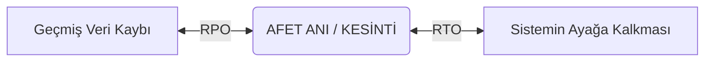

# Domain 4B: İş Sürekliliği (Business Continuity) ve Afet Kurtarma (Disaster Recovery)

Domain 4A'da sistemlerin günlük rutin operasyonlarını, altyapı bileşenlerini ve varlık yönetimini inceledik. Domain 4B'de ise işlerin ters gittiği kriz anlarına odaklanıyoruz: **Deprem, sel, yangın, siber saldırı veya ana veri merkezinin tamamen çökmesi durumunda kurum hayatına nasıl devam eder?**

Burada anlamamız gereken en kritik iki kavramsal ayrım şudur:

- **İş Sürekliliği Planı (BCP - Business Continuity Plan)**: İş odaklıdır (Business-driven). Bir kriz anında, teknolojiden bağımsız olarak **şirketin kritik iş süreçlerinin ve operasyonunun** nasıl devam ettirileceğini tanımlar.
- **Afet Kurtarma Planı (DRP - Disaster Recovery Plan)**: Teknoloji odaklıdır (IT-driven). Kesintiye uğrayan **BT altyapısının, sunucuların, veri tabanlarının ve ağların** teknik olarak nasıl tekrar ayağa kaldırılacağını belirler.

Teknoloji ne kadar hızlı ayağa kaldırılırsa kaldırılsın, iş süreçleri organize edilemediyse iş sürekliliği sağlanamaz. DRP, BCP'nin teknik bir alt bileşenidir.

---

## 1. İş Etki Analizi (BIA) ve Kurtarma Parametreleri

Afet planlamasında her şeyi aynı anda ve anında kurtarmak imkânsızdır, nitekim anlık kurtarma muazzam bir maliyet gerektirir. Hangi sistemlerin öncelikli kurtarılacağını belirlemek için ilk atılması gereken adım **İş Etki Analizi (BIA - Business Impact Analysis)** yapmaktır.

### BIA Süreci ve Mantığı

BIA, kesintilerin organizasyon üzerindeki finansal, operasyonel ve itibar etkilerini analiz eder. Süreçleri kritiklik derecelerine göre sınıflandırır:
1. **Kritik (Critical)**: Kesintisi kuruma anında devasa zarar veren, telafisi olmayan süreçler (*Örn: Bankacılıkta para transferi*).
2. **Hayati (Vital)**: Gün içinde ayağa kaldırılması gereken süreçler.
3. **Hassas (Sensitive)**: Manuel yöntemlerle bir süre idare edilebilen süreçler.
4. **Hassas Olmayan (Non-sensitive)**: Haftalarca kapalı kalsa dahi zararı az olan süreçler.

> [!important] CISA Vurgusu: BT Varlıklarını Kurtarma Önceliklendirmesi (BIA)
> Bir felaket planlaması yapılırken BT varlıklarının kurtarılmasını **önceliklendirmeye (prioritize recovery) EN İYİ yardımcı olan çalışma: İş Etki Analizidir (BIA)**.
> - *Nedeni:* BIA iş süreçlerinin kritiklik derecesini değerlendirerek destekleyici BT varlıklarının hangi sırayla ayağa kaldırılacağını (RTO/RPO) belirler. Olay Müdahale Planı (Incident Response) ilk müdahaleyi yönetir, BIA ise stratejik kurtarma sırasını verir.

### Kritik CISA Parametreleri: RPO ve RTO

BIA çalışmasının sonucunda her sistem için iki ana kurtarma hedefi belirlenir:

#### RPO (Recovery Point Objective - Kurtarma Noktası Hedefi)
- Kabul edilebilir **veri kaybı miktarı/süresidir (Extent of data loss that is acceptable)**. Kesinti anından geriye doğru ölçülür.
	- *Örnek*: RPO = 4 saat ise, en fazla son 4 saatin veri kaybı tolere edilebilir. Afet sonrası kalan veriler alternatif kaynaklardan tamamlanır.
	- *Orphan Data*: Afet anı ile son alınan yedek arasında kaybolan ve geri getirilemeyen veridir.

#### RTO (Recovery Time Objective - Kurtarma Zamanı Hedefi)
- Kabul edilebilir **maksimum kesinti süresidir (number of hours of acceptable downtime)**. Kesinti anından ileriye doğru ölçülür.
	- *Örnek*: RTO = 2 saat ise, sistem afette en en geç 2 saat sonra çalışır hâle gelmelidir.

> [!tip] CISA İpucu: RTO vs. RPO Mantığı
> - **RTO:** Kabul edilebilir kesinti süresidir $\rightarrow$ Donanım ve Saha stratejisini belirler.
> - **RPO:** Kabul edilebilir veri kaybıdır $\rightarrow$ Yedekleme sıklığını ve Replikasyon teknolojisini belirler.
> - **SDO (Service Delivery Objective):** Afet anında kabul edilebilir düşürülmüş hizmet seviyesidir.

---

## 2. Alternatif Kurtarma Saha Türleri (Recovery Sites)

Ana veri merkezi (primary site) çöktüğünde operasyonun kaydırılacağı alternatif sahaların donanım ve veri hazır olma durumları şöyledir:

| **Saha Tipi**     | Donanım Hazırlığı             | Veri Hazırlığı                 | RTO Süresi        | Maliyet      |
| ----------------- | ----------------------------- | ------------------------------ | ----------------- | ------------ |
| **Mirrored Site** | Birebir Özdeş Donanım         | Anlık eş zamanlı eşitleme      | Anında (0 RTO)    | Aşırı Yüksek |
| **Hot Site**      | Önceden Kurulu Hazır Donanım  | Anlık/yakın güncel veri        | Dakikalar/Saatler | Yüksek       |
| **Warm Site**     | Önceden Kurulu Hazır Donanım  | Yedeklerden yüklenmesi gerekir | 24-48 Saat        | Orta/Makul   |
| **Cold Site**     | Donanım Yok (Sadece Güç/HVAC) | Veri yok                       | Günler/Haftalar   | Düşük        |

> [!danger] CISA Vurgusu: Kısa RTO İçin Soğuk Saha (Cold Site) Riski
> Kısa bir RTO hedefi (örn. birkaç saat) olan bir uygulama için alternatif kurtarma sahası seçiminde denetçi için **EN BÜYÜK ENDİŞE: Uygulamanın Soğuk Sahaya (Cold Site) dayanmasıdır**.
> - *Nedeni:* Soğuk sahada hazır donanım yoktur. Donanımları temin edip kurmak günler/haftalar sürer. Kısa RTO hedefini tutturmak imkansızlaşır ve SLA ihlali doğar.

> [!important] CISA Vurgusu: Bütçe Kısıtı + RTO 48 Saat / RPO 24 Saat Senaryosu
> Sınırlı bir bütçeye sahip ve RTO'su 48 saat, RPO'su 24 saat olan bir şirket için gereksinimleri **EN İYİ karşılayan kurtarma sahası: Ilık Sahadır (Warm Site)**.
> - *Nedeni:* Warm site önceden kurulu donanım sunduğu için 48 saatlik RTO süresinde yedeklerin yüklenerek sistemin ayağa kaldırılmasına izin verir ve sınırlı bütçe için en ekonomik çözümdür. Hot site pahalıdır, Cold site ise 48 saati aşar.

----

## 3. Veri Yedekleme Stratejileri ve Doğrulama (Backup & Validation)

Afet anında verinin geri döndürülebilmesi günlük operasyonda alınan yedeklerin kalitesine bağlıdır.

### Yedekleme Yöntemleri ve Zaman Pencereleri

- **Full Backup (Tam Yedek)**: Tüm verilerin eksiksiz yedeğidir. Geri yüklemesi (restore) en hızlı, alması en uzun süren yöntemdir.
- **Incremental Backup (Artırımlı Yedek)**: En son alınan *herhangi bir yedekten* sonra değişen verileri yedekler. Hızlı alınır ancak geri yüklerken tüm yedek zincirine ihtiyaç duyulur.
- **Differential Backup (Fark Yedeği)**: En son *Full Backup*'tan sonra değişen tüm verileri yedekler.

>[!important] CISA Vurgusu: 7/24 Açık Sistemlerde En Verimli Yedekleme
>7/24 çalışan canlı sistemlerde büyük miktardaki verilerin yedeklenmesi için **EN VERİMLİ strateji: Hataya dayanıklı bir Diskten Diske (Disk-to-Disk - D2D) yedekleme çözümü uygulamaktır.**  
>- *Nedeni*: D2D yedekleme yüksek hızlı ikincil disk dizilerine snapshot (anlık görüntü) alarak canlı veri tabanını kilitlemeden ve performans kaybı yaratmadan hızlıca yedekler.

### Yedek Doğrulama ve Geri Yükleme Testleri (Backup Validation)

Yedek almak sürecin sadece yarısıdır. Alınan yedeklerin sağlam olduğunu teknik olarak kanıtlamaya **Yedek Doğrulama (Backup Validation)** denir.

>[!warning] CISA Ciddi Risk Vurgusu: Yedeğin Doğrulanması
>Veri tabanı yedekleme ve kurtarma planı incelenirken denetçi için **EN ÖNEMLİ husus: Yedek doğrulamanın (backup validation) gerçekleştiriliyor olmasıdır.**  
>- *Nedeni*: Periyodik olarak geri yükleme (restore) testleri yapılmayan yedeklerin afet anında sessizce bozulmuş (corrupt) olduğu ortaya çıkabilir. SLA hedefleri yazmak veya yedekleri kasete basmak verinin kurtarılabileceğini garanti etmez.

---

### 4. Ağ Dayanıklılığı ve Koruma Yöntemleri (Network Resilience)

Afet anında sunucular çalışsa bile ağ bağlantısı yoksa sistem ulaşılamaz olur. Ağ sürekliliği için şu teknikler kullanılır:

- **Redundancy (Yedeklilik)**: Çift hat kullanımı ve yedekli cihaz yapılandırmasıdır.
- **Alternative Routing**: Ana hat koptuğunda farklı bir iletişim ortamına geçilmesidir (Örn: Fiber kopunca Mikrodalga/4G'nin devreye girmesi).
- **Diverse Routing (Farklı Güzergâh Yönlendirmesi)**: Kabloların fiziksel olarak tamamen farklı coğrafî güzergâhlardan kazılarak binaya sokulmasıdır. Aynı binadan geçen iki hat kazıda birlikte kopabileceği için risk taşır.

---

### 5. Afet Kurtmara (DR) Test Türleri ve Operasyonel Uyum

Test edilmemiş bir DRP, sadece bir niyet belgesi mahiyetindedir. Test türleri karmaşıklık ve risk sırasına göre şunlardır:

| **Test Türü**                          | **Mantık/Amaç**                                                                | **Risk/Maliyet**      |
| -------------------------------------- | ------------------------------------------------------------------------------ | --------------------- |
| **Checklist Review**                   | Dokümanın gözden geçirilip güncellenmesi.                                      | Çok Düşük             |
| **Structured Walk-Through (Tabletop)** | Ekibin masa başında senaryoyu adım adım kâğıt üzerinde tartışması.             | Düşük/Ucuz            |
| **Simulation Test**                    | Gerçek dünya rol yapma simülasyonu (Canlı sistemler kapatılamaz).              | Orta                  |
| **Parallel Test**                      | İkincil sahanın (DR Site)                                                      | Orta-Yüksek           |
| **Full Interruption Test**             | Ana sistemin fişinin tamamen çekilerek tüm operasyonun DR siteye kaydırılması. | **Çok Yüksek/Pahalı** |

>[!danger] CISA Vurgusu: DRP İncelemesinde En Büyük Endişe
>Bir Felaket Kurtarma Planını (DRP) inceleyen bir IS denetçisi için **EN BÜYÜK endişe kaynağı: Planın son bir yıl içinde TEST EDİLMEMİŞ olmasıdır.**  
> - *Nedeni*: Test edilmeyen DRP'nin gerçek felaket anında işlerliği kanıtlanmamıştır. Planın *offsite* saklanmaması veya sorumlu isimlerin dokümanda yazmaması ikincil eksikliklerdir.

> [!important] CISA Vurgusu: Küresel Operasyonlarda BCP Kesintisizliği
> Birden fazla ülkede operasyon merkezleri bulunan bir kurumda kesintisiz operasyonu **EN İYİ sağlayan: Çalışanların İş Sürekliliği Planı (BCP) konusunda eğitilmesidir (Employee training on BCP)**.
> - *Nedeni:* Farklı ülkelerdeki krizlerde merkezle iletişim kopabilir. BCP eğitimi almış personel kriz anında kimseden talimat beklemeden kendi görevlerini yerine getirebilir.

> [!tip] CISA Vurgusu: Olay Müdahalesi (IR) ile BCP Uyumunun Sağlanması
> Olay müdahale faaliyetlerinin İş Sürekliliği (BCP) gereksinimleriyle uyumlu olmasını sağlamanın **EN İYİ yolu: Bir senaryo geliştirmek ve yapılandırılmış bir gözden geçirme / masabaşı testi (Structured Walk-Through) gerçekleştirmektir**.

---

## 6. Türkiye Bağlamı ve BDDK Regülasyonları

Türkiye bir deprem ülkesidir. BDDK (Bankacılık Düzenleme ve Denetleme Kurumu), bankalar ve finans kuruluşları için şu sert kuralları koymuştur:

- **Farklı Sismik Bölge Şartı:** Bankaların birincil veri merkezleri İstanbul'daysa, ikincil Afet Kurtarma Merkezleri (DR Site) kesinlikle aynı fay hattı ve sismik risk üzerinde **olamaz** (Genelde Ankara, Erzurum veya İzmir seçilir).
- **Anlık Aynalama (Mirrored Site):** Finansal verilerde RPO ve RTO toleransı sıfıra yakın olduğu için BDDK, ana sistemler ile afet merkezleri arasında anlık eşzamanlı (synchronous) veri aktarımını zorunlu kılar.

---
