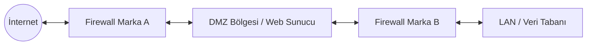
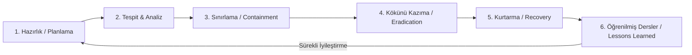

# Domain 5: Bilgi Varlıklarının Korunması ve Güvenlik Olay Yönetimi

İşbu domain, CISA sınavının **%26'lık en büyük ve en kritik bölümünü** oluşturuyor. Kurumların en değerli varlığı olan **enformasyonun** mantıksal, fiziksel, kriptografik ve operasyonel boyutlarda nasıl korunacağını kapsıyor.

Güvenlik; tıpkı araba veya uçak kullanmak gibi kâğıt üzerinde kuralları, standartları ve çerçeveleri (frameworks) uluslararası düzeyde yazılmış bir disiplindir. Bir BT denetçisinin temel görevi; **Gizlilik (Confidentiality), Bütünlük (Integrity) ve Erişilebilirlik (AVailability) - CIA Triad** doğrultusunda kurulan kontrollerin yeterliliğini, etkinliğini ve yasal regülasyonlarla (KVKK, GDPR, HIPAA) uyumunu değerlendirmektir.

---

## 1. Enformason Varlıklarının Güvenliği, Rolleri ve Yönetişimi

Bir sunucunun kendisi sadece bir donanım maliyetidir. O sunucuyu milyonlarca dolar değerinde kılan şey, **içinde barındırdığı veri/enformasyon varlığıdır** (kredi kartı verileri, hasta sağlık kayıtları, sigorta bilgileri, ticarî sırlar vb.). Güvenlik sistemleri donanımı değil, doğrudan o enformasyon varlığını korumak için tasarlanır.

### 1.1. Sorumluluk Matrisi ve Rol Ayrıım
- **Veri Sahibi (Data Owner)**: Genelde iş birimi yöneticisidir (örn: Pazarlama Direktörü). Verinin gizlilik ve kritiklik derecesini belirler, kimlerin erişeceğine karar verir.
- **Veri Emanetçisi (Data Custodian)**: Veri sahibinin belirlediği kuralları BT altyapısında uygulayan teknik ekiptir (örn: Sistem Yöneticisi / DBA). Sunucuları ayakta tutar, yedekleri alır, teknik erişim listelerini işletir.
- **Veri Kullanıcısı (Data User)**: Operasyonel işlerini yürütmek için veriyi okuyan ve işleyen çalışanlardır.
- **Bilgi Güvenliği Yöneticisi (CISO / ISO)**: Güvenlik politikalarını hazırlar, riskleri değerlendirir ve bağımsız güvenlik kontrollerini denetler.

>[!important] CISA İpucu: Conflict of Interest (Çıkar Çatışması)
>CISO / ISO kesinlikle CIO'ya (BT Müdürüne) veya operasyonel sistem yöneticilerine raporlamamalıdır. Doğrudan CEO'ya veya Yönetim Kuruluna raporlamalıdır. Ayrıca CISO, günlük değişiklik taleplerini (change requests) tek tek onaylayan bir icra makamı değil, politikaları belirleyen yönetsel bir roldür.

### 1.2. Varlık Sınıflandırması (Asset Classification)

Güvenlik bütçesini ve kontrollerini doğru yönetmenin **EN İYİ temeli Varlık Sınıflandırması**dır. Veriler kritiklik ve hassasiyet derecelerine göre kategorize edilir (Kamuya Açık, Hizmete Özel, Gizli, Çok Gizli). 

Sınıflandırma sonucunda **Temel Güvenlik Kontrolleri (Baseline Controls)** belirlenir. Örneğin, kamuya açık bir veri şifresiz saklanabilirken, "Gizli" veri sınıfındaki kayıtların yedekleme teyplerinde şifrelenmesi zorunlu kılınır.

>[!info] Denetçi Bakış Açısı
>**Değerlendir:** "Kurumda bilgi varlıklarına etiketleme (labeling) yapılmış mı?"  
>Etiketleme, çalışana verinin hassasiyetini gösterir. Veri etiketi olan bir doküman yetkisiz sızdırıldığında, çalışanın "*bilmiyordum*" deme şansı ortadan kalkar ve uygulanacak ceza yaptırımlarının yasal dayanağını oluşturur.

---

## 2. Yasal Düzenlemeler, Mahremiyet (Privacy) ve Veri Egemenliği

Dünyanın her yerinde veri koruma kanunları (Türkiye'de KVKK, AB'de GDPR, ABD'de sağlık verileri için HIPAA) temel olarak aynı ilkeleri amaçlar: Verinin gizli saklanması, izinsiz paylaşılmaması ve yurt dışına çıkarılmaması.

Mahremiyet incelemesinde denetçi şu 6 alana odaklanır:
1. Kişinin eylemlerinin (hareketlerinin ve davranışlarının) mahremiyeti.
2. İletişiminin mahremiyeti.
3. Görsellerinin ve verilerinin mahremiyeti.
4. Düşünce ve hislerinin mahremiyeti.
5. Mekânının (Konum ve coğrafî yerinin) mahremiyeti.
6. Şahsiyetinin 
$$
biyolojik, genetik ve beden bütünlüğünün
$$
 mahremiyeti (biyometrik gibi, parmak izi gibi).

### 2.1. Sınır Ötesi Veri Aktarımı (Data Sovereignty)

Bir kurum, İK veya finans sistemini başka bir ülkedeki üçüncü taraf bulut sağlayıcıda (third-party cloud) barındırmayı seçtiğinde, veri ilgili ülkenin veri egemenliği (data sovereignty) yasalarına tabi olur. BT Denetçisi böyle bir durumda **İLK olarak Gizlilik Etki Analizi (Privacy Impact Assessment - PIA)** yapılmasını önermelidir.

---

## 3. Fiziksel ve Çevresel Güvenlik Kontrolleri

Fiziksel güvenlik kontrolleri üç ana seviyede ele alınır:

- **Yönetsel Kontroller**: Ziyaretçi kayıt prosedürleri (user registration), güvenlik politikaları.
- **Teknik Kontroller**: Giriş ekranları, biyometrik okuyucular, kartlı geçiş sistemleri.
- **Fiziksel Kontroller**: Çitler, kilitli kapılar, hareket sensörleri, fizikî güvenlik görevlileri, CCTV kameraları.

Ayrıca kontroller işlevine göre ayrılır: **Proaktif** kontroller olayı başlamadan engellerken (barikatlar, kapı kilitleri) reaktif kontroller gerçekleşen olayı tespit eder (kameralar, yangın alarmları).

### 3.1. Çevresel Tehditler ve Elektrik Riskleri
* **Sag***: Voltaj seviyesindeki ani ve geçici düşüş.
* **Spike / Surge**: Voltaj seviyesindeki ani ve sert yükseliştir (Cihazları yakabilir).
* **Brownout**: Voltajın uzun süreli olarak düşük kalması (Sistemlerin çökmesine yol açar).
* **Blackout**: Elektriğin tamamen kesilmesidir (Total failure). UPS ve Jenerator gerektirir.
* **EMI (Electromagnetic Interference)**: Elektrik rüzgârları veya yüksek gerilim hatlarının yarattığı elektromanyetik parazitlerdir.

### 3.2. Veri Merkezi Yangın Söndürme Sistemleri
- **FM-200 (HFC-227ea)**: Gaz bazlı söndürme sistemidir. İnsan sağlığına zararsızdır, elektronik donanımlara veriye **HİÇBİR ZARAR VERMEZ**. Günümüz veri merkezlerinde en çok tercih edilen uluslararsası standarttır.
- **Halon Gazı**: Çevreye ve ozon tabakasına verdiği büyük zarar nedeniyle 1987 Montreal Protokolü ile **TÜM DÜNYADA YASAKLANMIŞTIR**.
- **Su bazlı Sistemler (Water-based)**: Yangını söndürür ancak elektronik donanımları kalıcı olarak bozar.
- **Argonite / CO2**: Yangını etkili söndürür ancak ortamdaki oksijeni tükettiği için **insan sağlığı için son derece tehlikelidir/öldürücüdür**.

---

## 4. Kimlik ve Erişim Yönetimi (IAM) ve Ayrılacılıklı Hesaplar

Erişmi yönetiminin (Identify & Access Management) özü; doğru kişileri, doğru zamanda, sadece ihtiyaç duydukları bilgi varlıklarına eriştirmektr.

### 4.1. İlerleme Aşamaları

**Identification** $\to$ **Authentication (Doğrulama)** $\to$ **Authorization (Yetkilendirme)** $\to$ **Audit Logging**

- **Identification**: Kullanıcının kim olduğunu söylemesidir (Örn: `logos123`)
- **Authentication**: Kullanıcının iddia ettiği kişi olduğunun doğrulanmasıdır (Parola, OTP «One-Time-Password», Biyometrik)
- **Authorization**: Kullanıcının sistemde yapabileceği eylemlerin (Read, Write, Delete, Execute) tanımlanmasıdır.
- **Audit Logging (SIEM)**: Yapılan eylemlerin inkâr edilemez şekilde kaydolmasıdır.

>[!important] CISA İpucu: Shared Account Tehlikesi
>Birden fazla kullanıcının aynı User ID ve parolayla sisteme giriş yapması, sistemdeki bir zararlı işlemin **hangi gerçek birey tarafından yapıldığının tespit edilmesini imkânsız kılar.** Bu durum **Hesap Verebilirlik (Accountability)** ilkesini tamamen yok eder.

### 4.2. Temel Erişim İlkeleri ve Modelleri

- **Bilmesi Gerektiği Kadar (Need-to-Know)**: Kullanıcının erişimini yalnızca görevi için gerekli bilgi parçasıyla sınırlar. Doğrudan **confidentiality'i (veri gizliliğini)** korur.
- **En Az Ayrıcalık İlkesi (Principle of Least Privilege)**: Kullanıcıya sadece günlük işleri için gerekli minimum yetkinin verilmesidir. "*İleride gerekebilir*" düşüncesiyle yerel yönetici (local admin) yetkisi verilmesi gbu ilkeye aykırıdır.
- **Role Dayalı Erişim Kontrolü (RBAC)**: Yetkiler bireylere değil, iş rollerine (örn: Muhasebe Uzmanı) atanır. Dahili kullanıcıların verileri yetkisiz değiştirmesini engellemede **EN ETKİLİ** teknik kontroldür.
- **Zorunlu Erişim Kontrolü (MAC - Mandatory Access Control)**: Erişim kararları sistem tarafından dayatılan güvenlik etiketlerine (clearance labels) göre verilir. Kullanıcı yetkiyi devredemez (Askerî sistemler). Standardı temsil eder.
- **İsteğe Bağlı Erişim Kontrolü (DAC - Discretionary Access Control)**: Kaynak sahibi (owner) erişim haklarını kendi takdirine göre başkalarına devredebilir. Esnektir, istisnaları temsil eder.

### 4.3. Çok Faktörlü Kimlik Doğrulama (2FA / MFA)

Kimlik doğrulama faktörleri 3 ana kategoriye ayrılır:
1. **Bildiğiniz bir şey (Something you know)**: Parola, PIN.
2. **Sahip olduğunuz bir şey (Something you have)**: Donanım token'i, Akıllı kart, One-Time-Password.
3. **Olduğunuz bir şey (Something you are)**: Parmak izi, İris, Yüz Tanıma.

*2FA olabilmesi için **FARKLI** iki kategoriden eleman birleşmelidir. (Örn: Parola + One-Time-Password)*.

### 4.4. Biyometrik Ölçütler

- **FRR (False Rejection Rate - Tip I Hata)**: Gerçek yetkili kullanıcının yanlışlıkla reddedilmesidir. Kullanıcıyı üzer, operasyonu yavaşlatır ancak **güvenlik ihlali yaratmaz (Fail-Safe)**.
- **FAR (False Acceptance Rate - Tip II Hata)**: Yetkisiz bir saldırganın yanlışlıkla yetkili kabul edilip içeri alınmasıdır. Güvenlik açısından **EN TEHLİKELİ durumdur (Fail-Unsafe)**.
- **CER/EER (Crossover Error Rate/Equal Error Rate - Çapraz/Eşit Hata Oranı)**: FAR ve FRR eğrilerinin kesiştiği eşit hata oranıdır. CER ne kadar düşükse biyometrik sistem o kadar kalitelidir.

>[!info] Denetçi Bakış Açısı
>**Doğrula**: "İşten ayrılan personelin sistem yetkileri zamanında kaldırılmış mı?"  
>Denetçi, İK'nın işten ayrılanlar listesi ile sistemdeki aktif hesapları karşılaştırır. Sistem yöneticisi "*Hesap Active Directory'de pasif, sistemde açık kalmış önemli değil*" dese dahi bu durum ciddi bir zafiyettir. İleride o hesap Active Directory'de tekrar aktif edilirse sistemde doğrudan yetki kazanabilir.

---

## 5. Veri Sızıntısı Önleme (DLP) ve Uç Nokta (BYOD/USB) Güvenliği

Veri sızıntısı önleme (Data Leak/Loss Prevention - DLP) sistemleri, hassas verilerin kurum dışına kaçmasını engeller. Verinin 3 durumu vardır:

1. **Duran Veri (Data at Rest)**: Veri tabanında veya sunucuda duran veridir. Şifreleme (Encryption) ile korunur.
2. **Hareket Hâlindeki Veri (Data in Motion / Transit)**: Ağ üzerinde e-posta veya web ile transfer edilen veridir. DLP kuralları ve SSL/TLS ile korunur.
3. **Kullanımdaki Veri (Data in Use)**: Kullanıcının ekranında, hafızada (RAM) işlenen veridir.

DLP kuralları eşik değerlerle çalışır: Örneğin 4 adet IBAN gönderilmesine izin verilirken,  5 adet IBAN gönderildiğinde güvenlik ekibine alarm üretilir, 10 adet IBAN gönderildiğinde ise e-posta tamamen engellenir.

### 5.1. USB ve Taşınabilir Medya Güvenliği

USB cihazları virüs bulaşması, veri sızıntısı ve fiziksel kayıp riski taşır. USB cihazlatındaki verilerin **ZORUNLU ŞİFRELENMESİ (Mandatory Encryption)**, kaybolsa bile verinin okunmasını engeller.

### 5.2. BYOD (Bring Your Own Device) Güvenliği

Çalışanların kişisel cihazlarını kurumsal ağa bağlaması durumunda:

- **İLK Adım**: Cihazın sisteme kaydının yapılması (Device Registration).
- **Zorunlu Şart**: Cihazların kurumsal güvenlik şartnamelerine (MDM - Mobile Device Management) tam uyum sağlamasıdır. 
- **Kablosuz Ağ Riski**: Cihazlarda "otomatik bağlan (autoconnect)" özelliğinin açık olması, cihazların sahte erişim noktalarına (**Evil Twin / Rogue AP**) otomatik bağlanarak kimlik bilgilerini kaptırmasına yl açar. Autoconnect kapatılmalıdır.

---

## 6. Ağ Mimarisi, OSI Katmanları ve Ağ Güvenliği

Ağ yapısı LAN (Local Area Network) ve WAN (Wide Area Network - İnternet) olarak ayrılır. Dış dünyaya açık sunucular ise **DMZ (Demilitarized Zone  - Ara Bölge)** ağında tutulur.

### 6.1. Çift Firewall Mimarisi (Dual Firewall)

Dış dünya ile DMZ arasına birinci firewall, DMZ ile LAN arasına ikinci firewall konulur. İki firewall'ın **farklı markalardan seçilmesi**, bir markadaki zafiyetin tüm kurumu çökertmesini engeller (Defense in Depth).

### 6.2. OSI (Open System Interconnection) Modeli (7 Katman) vs. TCP/IP Modeli (4 Katman)

Veri üst katmandan aşağı inerken başlıklar eklenir (**Encapsulation**); karşı tarafta yukarı çıkarken başlıklar sökülür (**Decapsulation**).

- **Katman 7 - Application (Uygulama):** Kullanıcının gördüğü yer (HTTP, HTTPS, FTP, SMTP, Telnet, SSH).
- **Katman 6 - Presentation (Sunum):** Verinin formatlandığı, sıkıştırıldığı yer (JPEG, TXT, MP4).
- **Katman 5 - Session (Oturum):** İletişimin başlatıldığı ve yönetildiği yer.
- **Katman 4 - Transport (Taşıma):** Verinin parçalandığı yer.
  - *TCP (Transmission Control Protocol):* Bağlantı odaklıdır. **3 Yönlü El Sıkışma (3-Way Handshake: SYN $\rightarrow$ SYN-ACK $\rightarrow$ ACK)** yapar. Paket kaybı olmaz, güvenilirdir ancak yavaştır.
  - *UDP (User Datagram Protocol):* Bağlantısızdır (Connectionless). El sıkışma yoktur, çok hızlıdır ancak paket kaybı olabilir. Video akışı, VoIP ve DNS sorgularında kullanılır.
- **Katman 3 - Network (Ağ):** Paketin üzerine IP adresinin basıldığı ve yönlendirildiği (Routing) yerdir (Router).
- **Katman 2 - Data Link (Veri Bağı):** Verinin ağ kartının fiziksel adresi olan **MAC Adresi** ile paketlendiği yerdir (Switch, Ethernet). MAC adresi iç ağda kalır, dış internete çıkmaz.
- **Katman 1 - Physical (Fiziksel):** Verinin sinyallere (bakır kabloda elektrik, fiberde ışık/foton, Wi-Fi'da radyo dalgası) ve bitlere (1 ve 0) dönüştüğü yerdir.

### 6.3. Önemli Ağ Portları

Denetçi bakış açısıyla temel kural: **Açık metin (cleartext) veri taşıyan her protokol bir zafiyettir ve doğrudan denetim bulgusudur.**

| Port | Protokol | Güvenli Alternatif | Temel Risk (Inherent Risk) | CISA Denetim & Kontrol Odağı |
| --- | --- | --- | --- | --- |
| **80** | HTTP | **443 (HTTPS)** | Eavesdropping, Sniffing, MitM, Oturum Çalma | Web sunucularında HSTS (`Strict-Transport-Security`) aktif olmalı; SSLv3, TLS 1.0/1.1 kapatılıp **TLS 1.2/1.3** zorunlu tutulmalıdır. |
| **23** | Telnet | **22 (SSH / SFTP)** | Kimlik bilgileri ve komutların açık metin iletilmesi | **Kritik Denetim Bulgusu.** Telnet tamamen yasaklanmalı; SSHv2, Root login kısıtı ve Key-based authentication aranmalıdır. |
| **25** | SMTP | **587 (Submission) / 465** | Open Relay zafiyeti, Spam/Phishing iletimi | Sunucunun dışa açık relay olmaması; **SPF**, **DKIM** ve **DMARC** TXT kayıtlarının eksiksiz yapılandırılması incelenir. |
| **67 / 68** | DHCP | — | Rogue DHCP (Trafik saptırma), DHCP Starvation (DoS) | Switch seviyesinde **DHCP Snooping** kontrolünün devrede olması (yalnızca yetkili portlardan `DHCP Offer` kabulü). |
| **161 / 162** | SNMP | **SNMPv3 (authPriv)** | v1/v2c sürümlerinde varsayılan "public/private" community string'ler açık metindir; topoloji ifşa olur | **SNMPv3** zorunluluğu; kimlik doğrulama (SHA) ve veri şifreleme (AES) ile `authPriv` modu doğrulanmalıdır. |

### 6.4. DNS Mimarisi ve Denetim Kontrolleri

DNS, ağın adres defteridir; bütünlüğü (Integrity) bozulduğunda tüm güvenlik katmanları bypass edilebilir.

#### 6.4.1. **DNSSEC (DNS Security Extensions):**
* **Sınav Tuzağı:** DNSSEC veriyi **şifrelemez** (Gizlilik / Confidentiality sağlamaz).
* **Sağladığı Kontrol:** Kayıtları dijital olarak imzalayarak **Bütünlük (Integrity)** ve **Kaynak Doğrulaması (Authenticity)** sunar.
* **Önlediği Tehdit:** *DNS Cache Poisoning* ve *Pharming* (kullanıcıyı sahte IP'ye yönlendirme).

#### 6.4.2. **Split-Horizon (Split-Brain) DNS:**
* **Amaç:** Bilgi İfşasını (Information Disclosure / Reconnaissance) engellemek.
* **Mekanizma:** Dahili (RFC 1918) ve harici IP çözümlemelerini mantıksal/fiziksel olarak ayırır; iç ağ topolojisinin internetten taranmasını önler.

#### 6.4.3. **Zone Transfer Kısıtlaması (TCP 53 - AXFR):**
* **Risk:** Yetkisiz bir istemcinin tüm DNS veri tabanını (sunucu adları, IP eşleşmeleri) tek sorguda çekmesi.
* **Kontrol:** Zone Transfer sorguları yalnızca yetkili ikincil (Secondary/Slave) DNS sunucularının IP adreslerine kısıtlanmalıdır.

#### 6.4.4. **DNS Tünelleme (Data Exfiltration):**
* **Risk:** Güvenlik duvarı ve DLP sistemlerini atlatmak için verilerin DNS sorgularına gömülerek dışarı sızdırılması.
* **Kontrol:** Yeni nesil güvenlik duvarlarında (NGFW) *DNS Inspection* ve *DNS Sinkholing* mekanizmalarının bulunması.

---

## 7. Kriptografi (Şifreleme) ve Açık Anahtar Altyapısı (PKI - Public Key Infrastructure)

### 7.1. Simetrik Şifreleme Algoritmaları
Tek bir gizli anahtar kullanılır.

- **DES (Data Encryption Standard)**: 1977 yapımıdır, 56-bit anahtar kullanırr, **günümüzde güvensizdir**. 64-bit bloklar halinde XOR operasyonu yapar. 5 modu vardır (ECB, CBC, CFB, OFB, CTR).
- **Triple DES (3DES)**: DES'i 3 kez peş peşe uygular. Daha güvenlidir ancak yavaştır.
- **IDEA**: 128-bit anahtar kullanan simetrik algoritma.
- **AES (Advanced Encryption Standard)**: Günümüz uluslarrarası standardıdır (NIST 2000). 128-bit bloklar kullanır.
- 128-bit anahtar $\rightarrow$ 10 tur (round) şifreleme.
- 192-bit anahtar $\rightarrow$ 12 tur şifreleme.
- 256-bit anahtar $\rightarrow$ 14 tur şifreleme.

### 7.2. Simetrik Anahtar Dağıtım Yöntemleri

Şifreyi koyan anahtar ile çözen anahtar birebir aynıdır. Evin kapısını aynı anahtarla kilitleyip aynı anahtarla açmak gibidir. İki taraftaki işlem birbirinin simetriğidir (aynısıdır).

1. **Offline Dağıtım:** Anahtarı elle/kağıtla veya USB ile vermek (Fiziksel ele geçirilme riski var).
2. **Açık Anahtar Şifreleme ile Dağıtım:** Önce asimetrik şifrelemeyle güvenli bir tünel kurulur, simetrik anahtar bu tünelin içinden gönderilir.
3. **Diffie-Hellman Anahtar Değişim Algoritması:** İki tarafın matematiksel bir denklemle ortak bir gizli anahtar oluşturmasıdır. Anahtar ağdan geçmez. Ancak en büyük kısıtı **karşı tarafın kimliğini doğrulayamamasıdır (Authentication eksikliği)**; bu yüzden Man-in-the-Middle saldırılarına açıktır.

### 7.3. Asimetrik Şifreleme ve Dijital İmza

Şifreyi koyan anahtar başkadır, çözen anahtar farklıdır. Kilitleyen anahtar kapıyı geri açamaz; açmak için onun eşi olan bambaşka bir anahtar gerekir. Girişteki ve çıkıştaki anahtarlar aynı olmadığı için adı asimetriktir.

- **Dijital İmza Oluşturma:** Mesajın hash özeti **Gönderenin ÖZEL ANAHTARI (Private Key)** ile şifrelenir.
- **Dijital İmza Doğrulama:** Alıcı, imzayı **Gönderenin AÇIK ANAHTARI (Public Key)** ile çözer.
- **Faydası:** **Bütünlük (Integrity), Kimlik Doğrulama (Authentication) ve İnkâr Edilemezlik (Nonrepudiation)** sağlar. Mesaj metni açıkta (cleartext) gönderilse bile dijital imza geçerliliğini korur ve doğrulanabilir.

### 7.4. Açık Anahtar Altyapısı (PKI) Bileşenleri
- **CA (Certificate Authority):** Dijital sertifikaları imzalayan ve yayımlayan ana otorite.
- **RA (Registration Authority - Kayıt Otoritesi):** Sertifika başvurusunda bulunan kullanıcıların/sistemlerin **kimliğini doğrulayan** idari birimdir (Sertifikayı kendisi basmaz, doğrulayıp CA'ya iletir).
- **CRL / OCSP:** İptal edilen sertifikaların listesi ve sorgulama protokolü.

---

## 8. Zafiyet Yönetimi, Güvenli Kodlama ve Web Uygulama Güvenliği

### 8.1. Yazılım Geliştirme Araçları: CASE (Computer-Aided Software Engineering) ve 4GL 

Yazılım geliştirme süreçlerini otomatize etmek ve insan kaynaklı hataları azaltmak için özel araçlar ve diller kullanılır:
- **CASE (Computer-Aided Software Engineering) Araçları:**
  - *Upper CASE:* Sürecin en başında iş ve gereksinim analizini yapar (Veri Akış Diyagramları - DFD, Varlık-İlişki Diyagramları - ERD).
  - *Middle CASE:* Ekran tasarımlarını, iş kurallarını ve süreç akışlarını modeller.
  - *Lower CASE (Code Generators):* Tasarlanan modellerden otomatik olarak kaynak kod ve SQL veri tabanı şemaları üretir.
  - *Denetim Riski:* Otomatik kod üreticilerin (Code Generators) ürettiği kodların içine güvenlik kontrollerinin (input validation, authentication) ve Görevler Ayrılığı (SoD) kurallarının doğru gömüldüğü mutlaka doğrulanmalıdır.

- **4GL (Dördüncü Nesil Diller):** Geliştirme süresini kısaltan *Nonprocedural* (ne yapılacağını söyleyen, nasılı sisteme bırakan) dillerdir (örn: SQL+, Natural). Raporlama ve sorgulama için harikadır, HOWEVER yüksek hacimli ve kritik transactional sistemlerde işlem kapasitesi yetersiz kalabilir.

### 8.2. Web Uygulama Güvenliği ve Temel Zafiyetler

Web uygulamaları, kurumların internete doğrudan açılan yüzü olduğu için saldırganların birincil hedefidir:

- **Geliştirici Eğitimi (Developer Training on Secure Coding):** Bir web uygulamasını korumanın **EN İYİ ÖNLEYİCİ KONTROLÜ (Primary Preventive Control)**, yazılımcılara güvenli kodlama (OWASP Top 10) eğitimi vermektir. Zafiyeti kod yazılırken engellemek, canlıya çıktıktan sonra tespit etmekten çok daha ucuz ve etkilidir.
- **SQL Injection (SQLi):** Web arayüzündeki parametrelerin filtrelenmemesi (input sanitization eksikliği) sonucu saldırganın doğrudan veri tabanı motoruna zararlı SQL komutları göndermesidir. Saldırganın **TÜM VERİ TABANINI sızdırmasına veya silmesine** imkan tanıdığı için web uygulamalarındaki **EN TEHLİKELİ** zafiyettir.
- **Test Edilmemiş Betikler (Untested CGI Scripts):** Kalite kontrol (QA) veya güvenlik testinden geçmeden sunucuya konulan CGI/web betikleri; komut enjeksiyonu ve yetki yükseltmeye izin vererek saldırganların iç ağa **Yetkisiz Erişim (Unauthorized Access)** sağlamasına yol açar.

### 8.3. Zafiyet Taraması vs. Sızma Testi (Vulnerability Scanning vs. Penetration Testing)

Her iki yöntem de kurumun savunma hattındaki zayıflıkları bulmayı amaçlar ve **Risk Bazlı Analize (Risk-Based Analysis)** dayanır:

| Kriter             | Zafiyet Taraması (Vulnerability Scanning)                                          | Sızma Testi (Penetration Testing)                                                  |
| :----------------- | :--------------------------------------------------------------------------------- | :--------------------------------------------------------------------------------- |
| **Yöntem**         | Otomatik araçlarla yapılan geniş kapsamlı tarama.                                  | Manuel, hedef odaklı ve uzman eliyle yapılan sızma girişimi.                       |
| **Amaç**           | Bilinen güvenlik açıklarını, eksik yamaları ve yanlış yapılandırmaları listelemek. | Bulunan açıkları sömürerek (exploit) sisteme ne kadar sızılabileceğini kanıtlamak. |
| **Maliyet / Efor** | Düşük iş gücü, periyodik ve otomatik çalıştırılabilir.                             | Yüksek iş gücü, derinlemesine uzmanlık gerektirir.                                 |
|                    |                                                                                    |                                                                                    |

#### **Sızma Testi Türleri:**
  - *Kör / Siyah Kutu Testi (Black Box / Blind Test):* Test ekibine kurum hakkında hiçbir ön bilgi verilmez; tıpkı dışarıdaki gerçek bir saldırgan gibi içeri sızmaları istenir.
  - *Beyaz Kutu Testi (White Box):* Test ekibine kaynak kodlar, ağ şemaları ve mimari detaylar verilerek derinlemesine analiz yaptırılır.
  - *Kimlik Bilgili Test (Credentialed / Gray Box):* Bir kullanıcı hesabı verilerek; "İçerideki bir çalışan veya hesabı ele geçirilen biri nerelere erişebilir?" senaryosu test edilir.

### 8.4. Eski ve Desteklenmeyen Sistemler (Legacy / ICS Riskleri)
Üretici desteği (End-of-Life / End-of-Support) bitmiş eski teknolojiler (özellikle Endüstriyel Kontrol Sistemleri - ICS / SCADA), üretici tarafından artık güvenlik yaması almaz. Bu sistemler için denetçinin en büyük endişesi, yamalanamayan açıklar nedeniyle **Yüksek Sistem İstismarı (System Exploitation Risk)** altında olmalarıdır.

---

## 9. Güvenlik Olay Yönetimi, Saldırı Türleri ve Olay Müdahele (5B)

Kurumların karşılaştığı tehditlerin tanımlanması, izlenmesi ve bir ihlal anında doğru adımlarla müdahale edilmesi sürecidir.

### 9.1. Olay Temelleri ve Hile (Fraud) Psikolojisi

#### 9.1.1. **Olay (Event) vs. Güvenlik İhlali (Incident):**

  - *Event:* Ağda veya sistemde gerçekleşen her türlü gözlemlenebilir durumdur (örn: bir kullanıcının login olması, bir port taraması).
  - *Incident:* Kurumun operasyonuna, gizliliğine veya varlıklarına **somut ve negatif bir zarar verdiği doğrulanmış** olaydır.
#### 9.1.2. **Hile Üçgeni (Fraud Triangle):** 

Kurum içi suistimaller üç faktörün birleşimiyle gerçekleşir:
  1. *Motivasyon (Motivation):* Maddi sıkıntı, hırs veya intikam duygusu.
  2. *Ussallaştırma (Rationalization):* "Zaten az maaş alıyorum, bunu hak ettim" düşüncesi.
  3. *Fırsat (Opportunity):* Yetersiz kontroller, denetimsizlik ve Görevler Ayrılığı (SoD) eksikliği. (Denetçinin odaklandığı tek bacak fırsatı yok etmektir).
#### 9.1.3. **Aktif vs. Pasif Saldırılar**

  - *Aktif Saldırılar:* Sisteme doğrudan müdahale eder, hizmeti kesintiye uğratır veya veriyi bozar (DDoS, fidye yazılımı). Hemen fark edilir.
  - *Pasif Saldırılar:* Trafiği gizlice dinler (eavesdropping), açık unutulmuş bir hesaba girip aylarca sessizce veri kopyalar. **Fark edilmesi çok zor olduğu için denetimsel açıdan çok daha tehlikelidir.**

### 9.2. Yaygın Siber Tehdit Vektörleri

- **DoS / DDoS (Hizmet Engelleme):** Bant genişliğini veya sunucu bağlantı tablolarını aşırı trafikle boğarak doğrudan **Erişilebilirliği (Availability)** hedefler.
	- *Savunma:* Yük dengeleme (Load Balancing) ve trafik filtreleme mekanizmaları.
- **Pharming:** DNS sunucularını veya yerel `hosts` dosyalarını zehirleyerek kullanıcıların doğru adres yazsalar dahi sahte web sitelerine yönlendirilip kimlik bilgilerinin çalınmasıdır.
#### 9.2.1. **Zararlı Yazılımlar (Malware):**
  - *Virüs / Solucan (Worm):* Kendi kendine çoğalan, sistem kaynaklarını tüketen yazılımlar.
  - *Mantık Bombası (Logic Bomb):* Belirli bir tarih veya koşul (örn: bir çalışanın işten çıkarılması) gerçekleştiğinde tetiklenen yıkıcı sabotaj kodları.
  - *Fidye Yazılımı (Ransomware):* Verileri şifreleyip açmak için para talep eden zararlılar.

### 9.3. Sosyal Mühendislik ve İnsan Faktörü Savunması

Sosyal mühendislik teknik açıkları değil, doğrudan **insan psikolojisini** ve güvenini istismar eder:
- **Phishing (Oltalama):** Toplu e-postalarla sahte linkler üzerinden kimlik bilgisi toplama girişimi.
- **Spear Phishing:** Belirli bir üst düzey yöneticiye veya kritik personele özel olarak kurgulanan, zararlı dosya/link içermediği için teknik filtreleri kolayca aşan kişiselleştirilmiş hedefli saldırı.

#### 9.3.1. **Savunma Katmanları:**

  - *Birincil Önleyici Kontrol:* **Güvenlik Farkındalığı Eğitimi (Security Awareness Training)** ile çalışanları birer "insan güvenlik duvarına (human firewall)" dönüştürmek.
  - *Eğitim Etkinliğinin Ölçümü:* Eğitimin gerçekten işe yarayıp yaramadığını kanıtlayan **EN İYİ kanıt, habersiz yapılan Oltalama Simülasyon Testlerinin (Social Engineering Simulations) sonuçlarıdır**.
  - *Teknik Güvenlik Ağı:* İnsan hatasını tolere etmek amacıyla zararlı linklere erişimi engelleyen **Web İçerik Filtreleme (Web Content Filtering)** çözümleri.

### 9.4. Güvenlik İzleme, Tespit ve Tuzak Sistemleri

- **Aktivite Logları (Activity Logs / Audit Trails):** Bir sistemde şüpheli/zararlı bir eylemin gerçekten gerçekleşip gerçekleşmediğini doğrulamak için incelenecek **EN KESİN kanıt kaynağıdır**.
- **SIEM (Security Information and Event Management):** Tüm ağ cihazları, sunucular ve güvenlik duvarlarından gelen logları merkezi olarak toplayıp kural motorlarıyla korelasyon kuran sistemdir.
- **IDS (Saldırı Tespit Sistemi - Detective Control):** Trafiği dinler ve şüpheli bir imza veya anomali yakaladığında **ALARM üretir**. Trafiği kesmez.
    - **IDS Tuning (Sistem İnce Ayarı):** IDS'in en kritik başarı faktörüdür. Kötü ayarlanmış bir IDS aşırı derecede **Yanlış Pozitif (False Positive)** üreterek analistlerde alarm yorgunluğuna (alert fatigue) yol açar.
    - **Yanlış Pozitif Yönetimi:** Eğer sistemde yanlış pozitif alarmlar aniden arttıysa, incelenmesi gereken **İLK yer kurumun Risk Yönetimi Süreçleri ve Tolerans Seviyeleridir**.
- **IPS (Saldırı Önleme Sistemi - Preventive Control):** Saldırı tespit edildiği anda oturumu keser, paketi düşürür ve trafiği **anında engeller**.
- **Honeypot / Honeynet:** İçinde gerçek veri barındırmayan, bilerek zayıf şifrelerle ağa yerleştirilen **tuzak sistemlerdir**. Amacı, saldırganı oyalamak, içeri sızma girişimlerini anında fark etmek ve saldırı yöntemlerini analiz etmektir.

### 9.5. Olay Müdahale Yaşam Döngüsü (Incident Response Lifecycle)

Bir güvenlik ihlali gerçekleştiğinde izlenecek adımlar dizisidir. Olay Müdahale Planı (IRP), zararı sınırlayıp sistemi eski hâline getirmeyi amaçladığı için bir **DÜZELTİCİ KONTROL (Corrective Control)** niteliğindedir.

- **Öğrenilmiş Dersler (Lessons Learned):** Tıpkı havacılık sektöründe her uçak kazasından sonra kuralların güncellenmesi gibi; her siber olay sonrasında olay sonrası değerlendirme (Post-Incident Review) yapılarak güvenlik politikaları ve kontrolleri güncellenir.
- **Uyum Denetimi Yaklaşımı:** Olay müdahale sürecinin şirket politikalarına uygunluğunu denetleyen bir BT denetçisi; rollerin kağıt üzerinde yazmasından ziyade **geçmiş olayların tanımlı prosedürlere uygun yönetilip yönetilmediğini (geçmiş bilet ve kayıtları)** inceler.

---

## 10. Adli Bilişim (Digital Forensics) ve Uçucu Veri

Saldırıya uğrayan veya suça karışan bir sistemden yasal olarak geçerli delil toplama sürecidir.

### 10.1. Uçuculuk Sırası (Order of Volatility)

Bir sunucu ele geçirildiğinde, delillerin kaybolma hızına göre en uçucu olandan en kalıcı olana doğru toplanması şarttır:
$$\text{1. CPU Kayıtları ve Önbellek (Cache)} \longrightarrow \text{2. RAM (Uçucu Veri)} \longrightarrow \text{3. Ağ Durumu / Canlı Bağlantılar} \longrightarrow \text{4. Sabit Disk (Kalıcı Depolama)}$$

> [!tip] CISA İpucu: RAM (Volatile Data) Önceliği
> Hacklenmiş bir sunucuda adli delil toplarken **İLK incelenmesi gereken kaynak: RAM'deki Uçucu Verilerdir (Volatile Data)**.  
> RAM; çalışan canlı süreçleri, açık portları, enjekte edilmiş bellek içi zararlıları ve şifreleme anahtarlarını barındırır. Sunucu kapatıldığı veya yeniden başlatıldığı an bu veriler **sonsuza dek silinir**. Sabit diskteki loglar ise saldırgan tarafından manipüle edilmiş olabilir.

### 10.2. Adli İncelemede En Büyük Denetim Endişesi

Adli inceleme yürütülürken teknik hatalar (imaj kopyası eksikliği, tutanak yetersizliği vb.) mahkemede delilin değerini düşürebilir. Ancak bir BT denetçisi açısından **EN BÜYÜK VE BİRİNCİL ENDİŞE: Yasal otoritelere ve düzenleyici kurumlara (KVKK, BDDK, Emniyet) ZAMANINDA BİLDİRİM YAPILMAMASI (Failure to notify proper authorities)** olmalıdır. Yasal bildirim zorunluluğunun ihlali, kuruma doğrudan devasa idari para cezaları ve yöneticilere cezai sorumluluk doğurur.