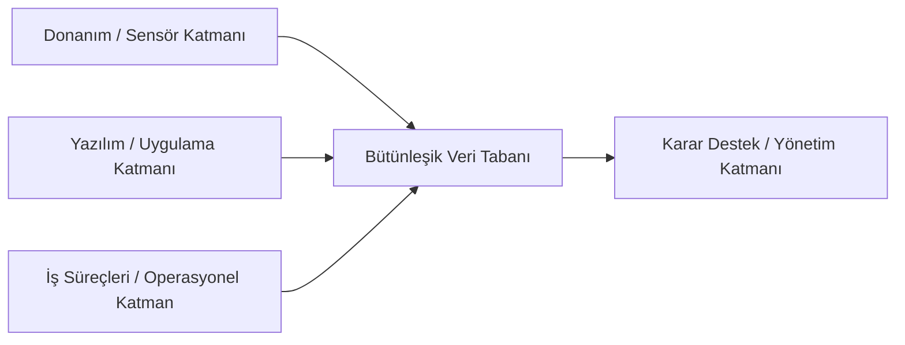
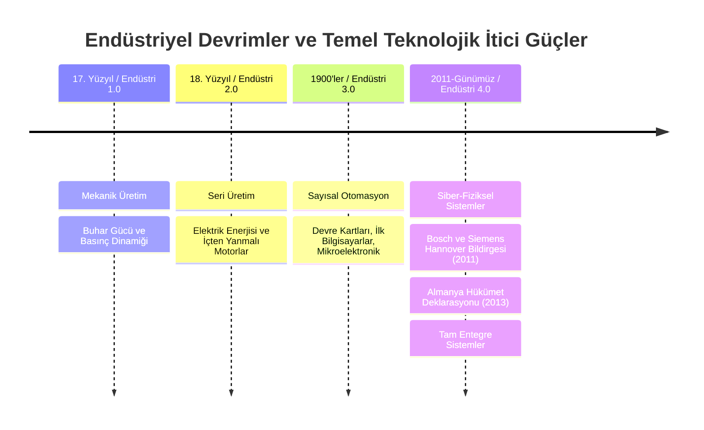

## Kavramsal Çerçeve

### Yönetim ([[Management]]) vs. İşletme ([[Business]])

Bilişim sistemleri analitiği; karar süreçlerinin, kaynak planlamasının ve yönetsel mekanizmaların teknoloji ile optimize edilmesiyle ilgilenir. YBS uzmanı pazarlama, muhasebe veya insan kaynaklarının operasyonel uygulayıcısı konumunda yer almaz. Bu fonksiyonların yöneticilerine analitik karar ortamı sunan mimariyi tasarlar.

### Sistem Entegrasyonu ([[System Integration]]) vs. İzole/Noktasal Çözümler

Yazılım, donanım ve beşeri süreçlerin ayrık yürütülmesi kurumsal körlüğe yol açar. Sistem entegrasyonu; veri üretim noktaları ile karar mercileri arasındaki mimari bağın eksiksiz kurulmasıdır.

### Otomasyon Devrimi: Yarı Otomatik Sistemler vs. Tam Otonom Kognitif Sistemler
* **Endüstri 3.0 Otomasyonu:** Mekanik ve elektronik kart yönlendirmeli kontrol. Robotik kol nesneyi hatasız veya hatalı olduğuna bakılmaksızın belirlenen koordinattan alır, diğer koordinata bırakır. Mantıksal denetim döngüsü bulunmaz.
* **Endüstri 4.0 Kognitif Otonomu:** Görüntü işleme, hata tespiti, otonom ayıklama ve dinamik montaj döngüsü. Sensörden gelen veriyi işleyerek hatalı ürünü hattan çeker, onarım protokolünü başlatır ve montaj sürecini insan müdahalesi olmaksızın tamamlar.

### Klasik Üretim Tesisleri vs. Karanlık Fabrikalar ([[Dark Factories]])

Geleneksel tesisler beşeri iş gücünün iklimlendirme, aydınlatma, vardiya araları, sağlık ve güvenlik ihtiyaçlarına göre kurgulanır. Karanlık fabrikalar insan unsurunu üretim hattından tamamen soyutlar. Işık, ısı, su, servis ve beşeri tazminat maliyetlerini sıfırlayan tam dijital ve otonom üretim alanlarıdır.

| Parametre                  | Endüstri 3.0 Üretim Hattı         | Endüstri 4.0 Karanlık Fabrika      |
| -------------------------- | --------------------------------- | ---------------------------------- |
| İnsan Müdahalesi           | Operasyonel / Doğrudan İş Gücü    | Yok / Yalnızca Üst Düzey Gözlemci  |
| Donanım Mimarisi           | PLC, Ayrık Elektronik Kartlar     | IoT, Akıllı Robotik Kollar, CPS    |
| Karar Mekanizması          | Deterministik / Önceden Kodlanmış | Yapay Zeka, Dinamik Görüntü İşleme |
| Kaynak Tüketimi (Işık/Isı) | Zorunlu (Beşeri Gereksinimler)    | Sıfır (Enerji Optimizasyonu)       |

### Ham Arama/Veri Üretimi vs. Çıkarımsal / Üretken Yapay Zeka ([[Generative AI]] & [[Inference]])
Geleneksel algoritmalar mevcut veri kümeleri üzerinde indeksleme ve eşleştirme icra eder. Üretken yapay zeka ise girdi bağlamını (context) ve geçmiş parametreleri analiz ederek geleceğe yönelik çıkarım, tahmin ve sentetik içerik üretimi gerçekleştirir.

---

## Sistem Tasarımı, Analiz ve Bilişim Mimarisi

### Endüstriyel Devrimlerin Evrimsel Aşamaları

### [[Endüstri 4.0]] Mimarisinin 11 Temel Teknolojik Unsuru
Bir bilişim sistemleri analisti, kurumsal optimizasyonu tasarlarken şu 11 bileşenin entegrasyonundan faydalanır:
1. [[Yapay Zekâ]] ve Makine Öğrenmesi
2. [[Nesnelerin İnterneti]] (IoT)
3. Siber Güvenlik Mimarisi
4. Büyük Veri Analitiği ([[Büyük Veri Analitiği]])
5. Bulut Bilişim Entegrasyonu
6. Eklemeli Üretim ([[Additive Manufacturing]] / 3D Baskı)
7. Otonom Robotik Sistemler
8. Sistem Simülasyonu ve Dijital İkiz
9. Yatay ve Dikey Sistem Entegrasyonu
10. Artırılmış Gerçeklik
11. Kenar Bilişim ([[Edge Computing]])

#### Bilişim Kaynak Tüketimi ve Fayda-Maliyet Analizi
Sistem tasarımında lüzumsuz donanım kaynak tüketimi mimari bir hatadır. İhtiyaç analizi yapılmadan tedarik edilen en üst konfigürasyonlu işlemci, bellek veya grafik donanımları, kapasitelerinin düşük bir yüzdesiyle çalıştığında kurumsal sermaye israfına yol açar.
(Hoca bu analizin sistem tasarımında temel parametre olduğunu belirtti).

#### **Doğrulanmış Operasyonel Fayda**
$$
\text{Sistem Etkinliği} =
\frac{\text{Doğrulanmış Operasyonel Fayda}}
{\text{Tedarik ve Altyapı Kaynak Maliyeti}}
$$

* **Yazılım Geliştirme Seviyeleri:** Sistem tasarımında doğrudan ağır kod kütüphaneleri kurgulamak yerine, ilk aşamalarda [[Low-Code / No-Code]] platformları ve [[Prompt Mühendisliği]] katmanları kullanılarak hızlı prototipleme yapılmalıdır.
