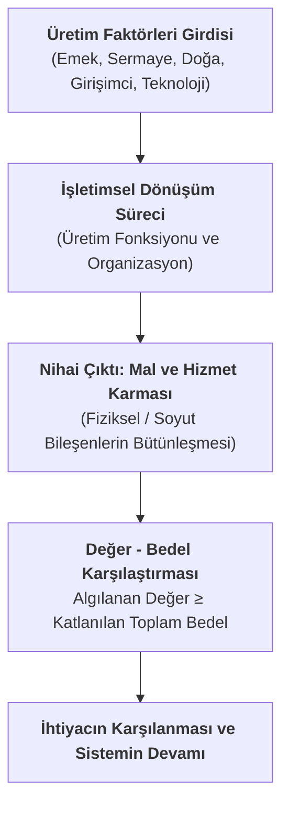
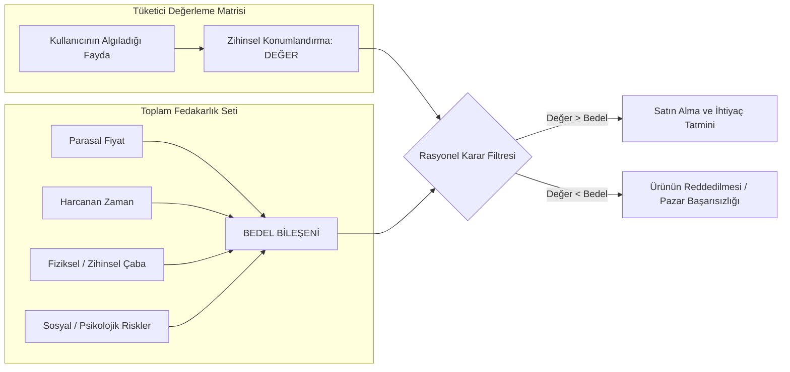
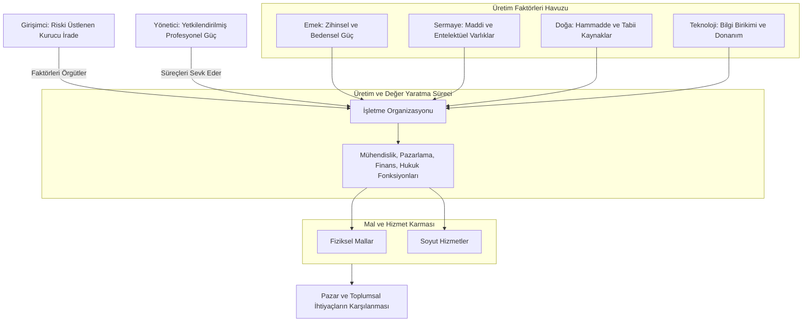

  * **Okuma Listesi:** Kütüphane, basılı yayın ya da üniversitenin elektronik veri tabanları üzerinden temin edebileceğimiz en az bir temel işletme kitabını okumamız gerkeiyor. Takip edilebilecek temel kaynak başlıkları:
     * *Çağdaş İşletmecilik*
     * *Genel İşletme*
     * *İşletme Bilimi*
     * *Temel İşletmecilik*

---

## Kavramsal Çerçeve

Üniversite lisans eğitimi, öğrenciye karmaşık bilgi yığınları içerisinden ihtiyaç duyulan veriye ulaşma, bu veriyi yapılandırma ve problem çözme süreçlerine uyarlama yetkinliği kazandıran kuramsal bir altyapıdır. YBS disiplini; örgütsel yapıların işletim fonksiyonlarını (üretim, pazarlama, finans, insan kaynakları vb.) veri tabanları ve yazılım mimarileri üzerinden birbirine bağlayan sistemleri tasarlar. Bilişim uzmanının kuracağı kurumsal yazılım mimarisi, doğrudan işletme fonksiyonlarının çalışma ilkelerine dayandığından, işletme biliminin kuramsal dinamiklerini kavramak bilişim sistemleri tasarımının ön şartıdır.

### Yönetim
Yönetim faaliyeti, yönetilmek istenen sistemin eksiksiz tanımlanması ve sistemik hareketlerin ölçülmesi şartına bağlıdır. Tanımlama, ilgili olgunun kuramsal sınırının anlaşılmasını ifade ederken; ölçümleme, uygulanan yönetsel müdahalelerin ve sistem gidişatının yönünü (artış, azalış, eğilim) sayısal ve niteliksel olarak belirleme çabasıdır. Ölçümleme eylemi, bir müdahalenin beklenen örgütsel değişimi yaratıp yaratmadığını somutlaştıran temel anlamlandırma aracıdır.

### İşletmenin varoluş nedeni?
İşletmenin varoluş nedeni **insan ihtiyaçlarının giderilmesidir**. Kâr, işletmenin yaşamını devam ettirmesini sağlayan amaçlar kümesi dâhilindedir. Toplumda karşılığı olmayan bir beşeri ihtiyacı karşılamayan hiçbir örgütsel yapı ekonomik akış yaratarak varlığını koruyamaz.

### İhtiyaç, İstek ve Uyarılmış İhtiyaç
- **İhtiyaç (Need)**: Karşılandığında bireye tatmin ve refah sağlayan, karşılanmadığında ise eksiklik, rahatsızlık ve ileri aşamalarda hayati risk yaratan biyolojik, sosyal veya psikolojik durumlardır.
- **İstek (Want)**: İhtiyacın tatmini sürecinde bireysel tercihler, kültürel kodlar ve çevresel faktörlerle biçimlenen somut tercihlerdir. Bireyin su ihtiyacını gidermek üzere su yerine soğuk çay veya gazlı içecek tercih etmesi, istek kavramının devreye girmesidir. Aynı biçimde, ulaşım ihtiyacı standart bir binek araçla giderilebilirken, bireyin Mazda talep etmesi ihtiyacın tercihlerle farklılaşmış bir isteğe dönüşmesidir.
- **Uyarılmış İhtiyaç (Stimulated Need)**: Bireyin zihninde kendiliğinden belirmeyen; pazarlama faaliyetleri, moda akımları ve dış uyarıcılar aracılığıyla hissedilir hâle getirilen yönlendirilmiş gereksinimlerdir. Cep telefonu kamerası üzerinden içerik üreticiliği yapan bir profesyonel için yüksek donanımlı bir akıllı telefon doğrudan temel bir çalışma ihtiyacıyken, standart bir kullanıcının salt marka prestiji sebebiyle en üst modele yönelmesi uyarılmış ihtiyaç ve istek kesişiminde gerçekleşir.

### Değer (Value) ve Bedel (Cost/Total Sacrifice) Dengesi
- **[[değer|Değer]]**: Bir ürün veya hizmetin [[para|parasal]] fiyatından bağımsız olarak, kullanıcının o varlıktan elde etmeyi beklediği topam faydaya istinaden zihninde biçtiği konum ve yüklediği anlamdır. Çölde susuz kalmış bir birey için bir şişe suyun değeri en üst seviyedeyken, az önce su tüketmiş bir birey için aynı nesnenin değeri düşüktür.
- **[[bedel|Bedel]]**: Müşterinin bir mal veya hizmeti elde etmek adına katlandığı parasal tutar, harcadığı zaman, sarf ettiği fiziksel enerji, bilişsel çaba ve satın alma sonrasında oluşabilecek sosyal/psikololojik risklerin (arkadaş çevresinin olumsuz eleştirilerini göğüsleme enerjisi, pişmanlık duygusu vb.) tamamını içeren fedakârlıklar bütünüdür.
- **Değer-Bedel Uyumu**: Kampüs içerisinde acil yemek ihtiyacı bulunan bir öğrencinin yanı başında 1.000₺'lik yemeği tercih etmesi ile açlığını yöneterek Karşıyaka'daki 250₺'lik alternatife yönelmek üzere zaman ve yol zahmetine katlanması, değer ve bedel bileşenlerinin göreli olarak tartılması sürecidir. **Bir ürünün ticarî başarısı, <u><b>sunulan toplam değerin müşterinin katlandığı toplam bedeli aşması</b></u> şartına bağlıdır.**

### Mal ve Hizmet Karması (Product Continuum)
- **[[mal|Mal]]**: İnsan gereksinimlerini karşılayan, fiziksel/somut varlığı bulunan, üretimi tüketminden önce gerçekleşen çıktılar.
- **[[hizmet|Hizmet]]**: Fiziksel varlığı bulunmayan, soyut nitelik taşıyan, üretimi ile tüketimi büyük oranda eşzamanla cereyan eden faaliyetler.
- **Karma Yapı**: İktisadi hayatta mutlak anlamda saf mal veya saf hizmet formları istisnai mahiyettedir; tüm çıktılar bir ***mal ve hizmet karması**** şeklinde tezahür eder. Üniversite amfisinde verilen eğitim dersi hizmet ağırlıklıdır: derslik, sıralar, aydınlatma ve bina gibi fiziksel mal unsurları bu hizmetin ayrılmaz taşıyıcılarıdır. Bir restoranda sunulan yemek fiziksel bir mal niteliği taşırken, yemeğin pişirilmesi, garsonluk sunumu, mekânın ambiyansı ve bulaşıkların temizlenmesi gibi unsurlar faturanın ana gövdesini hizmete dönüştürür. **Çıktının mal ya da hizmet olarak adlandırılması, işletmenin odaklandığı temel maliyet/gelir kaleminin ve müşterinin ödeme yaptığı <u><b>ağırlıklı bileşenin</b></u> fiziksel ya da soyut olması uyarınca belirlenir.**

### Hizmetlerin Yapısal ve Metodolojik Farklılıkları

1. **Müşterinin Sürece Dahiliyeti**: Hizmet sunumunda müşteri sürecin doğrudan bir parçasıdır. Doktor muayenehanesinde hastanın şikâyetlerini aktarması veya restoranda sipariş verilirkeny emeğe malzeme eklenip çıkarılması (tasarımın anlık değişmesi), müşterinin üretim anında sürece müdahil olduğunu kanıtlar.
2. **Standardizasyon ve Ölçümleme Güçlülüğü**: Fiziksel mallar belirli tolerans aralıklarında kusursuz bir standardizasyonla üretilebilirken, **hizmet çıktısı sunucunun ve alıcının o anki psikolojik, fiziksel ve bilişsel durumuna göre her seferinde yeniden şekillenir**. Aynı amfide aynı dersi dinleyen öğrencilerin zihinsel çıktıları ve aldıkları fayda birbirinden farklılaşır. Bu durum hizmet kalitesinin objektif referans noktaları üzerinden ölçülmesini zorlaştırır.
3. **Saklanamazlık (Eşzamanlı Tüketim)**: Hizmetler üretildiği an tüketilir. Stoklanarak raflarda bekletilemez. Kaydedilmiş çevrim içi video eğitimleri dijital depolama sağlasa da, her izleme seansında kullanıcının edindiği etkileşim ve algı düzeyi dinamik biçimde değişir.
4. **Zaman Ufku ve Etki Gecikmesi (Outcame Lag)**: Hizmetin nihai faydası tüketim anının ötesine geçerek uzun yıllara yayılabilir. Hizmet memnuniyeti kimi zaman dinamik ve gecikmeli bir yapı sergiler.

### Üretim Faktörleri Mimarisi
**[[kavram-uretim|Üretim]]**, insan ihtiyaçlarını karşılayacak mal ve hizmetlerin ortaya çıkartılması için yürütülen örgütlü çabalar bütünüdür. Üretim sürecini var eden girdiler şu şekildedir:

- **[[kavram-emek|Emek]]**: İnsanın mal ve hizmet üretimine vakfettiği bedensel ve zihinsel çabaların tamamıdır. Tarihsel endüstri devrimleri süreci, birim ürün başına sarf edilen insan emeğinin düzenli olarak azaldığını; dördüncü sanayi devrimi ve karanlık fabrikalar (lights-out-manufacturing) konseptiyle bu oranın minimal düzeye yaklaştığını göstermektedir.
- **[[kavram-sermaye|Sermaye]]**: Klasik iktisatta "*doğada serbest hâlde bulunmayan, insan emeğiyle üretilmiş fizikî üretim araçları*" (bina, makine, teçhizat, tesisat) olarak tanımlanır. **İşletme bilimi ise**, **işletmenin üretim faaliyetlerinde kullandığı maddî (nakit para, donanım, arazi) ve gayri maddî (patent, yazılım, marka) tüm varlıklar** kümesi olarak ele alır. 
	- Bu bağlamda **entelektüel sermaye** de, örgüt çalışanlarının edindiği bilgi birikimi, uzmanlık ve yeteneklerin kurumsal değer yaratma potansiyelidir. Anthropic bünyesinde kilit bir yapay zekâ başyazılımcısının şirketten ayrılması durumunda firmanın piyasa değerinde ve üretim kabiliyetinde yaşanacak dramatik düşüş entelektüel sermayenin operasyonel bir üretim faktörü olduğunu doğrular.
- **[[kavram-doğal-kaynaklar|Doğa]] (Doğal Kaynaklar/Toprak)**: Üretim için yeryüzünden sağlanan ham unsurlardır. Yeraltından çıkarılan ham petrol doğrudan bir doğal kaynak iken; rafineride damıtılarak elde edilen ve plastik şişe üretiminde kullanılan granül plastik, yarı işlenmiş bir sanayi malzemesidir. İşletme perspektifinde bu kaynaklar satın alındığı andan itibaren maddî sermaye unsurları altında takip edilir. Doğada bulunan ve insan tarafından işlenerek kullanılabilen her şeydir.
- **[[kavram-girisimci|Girişimci]]**: Kendi faydasını sağlamak (kâr elde etmek) amacıyla üretim faktörlerini bir araya getiren, yenilikçi süreçleri başlatan ve faaliyetlerin olumsuz sonuçlanması hâlinde ortaya çıkacak finansal/operasyonel zararın riskini üstlenen stratejik aktör.
- **[[kavram-yonetici|Yönetici]]**: Girişimcinin devrettiği yetki alanı içerisinde, üretim faktörlerini belirli hedefler doğrultusunda sevk ve idare eden, uzmanlığını kurumsal ücret karşılığında sunan profesyoneldir. **Yönetici sermayenin doğrudan riskini taşımaz. Riski üstlenen merci [[kavram-girisimci|girişimci]]dir.**
- **[[kavram-teknoloji|Teknoloji]]**: Üretim faaliyetlerinde ihtiyaçları karşılarken kullanılan her türlü bilgi birikimi ve bu birikimi somutlaştıran araç/donanım altyapısı. Teknoloji düzeyi ile teknolojiye yüklenen amaç arasında rasyonel bir dnege bulunmalıdır.

---

### Teknoloji Yönetiminde Fayda-Maliyet ve Alternatif Maliyet İlkesi
Teknoloji tercihlerinde belirleyici olan parametre, sırf teknoloji yatırımı yapmış olmak «*for take sake of technology*» saikiyle hareket etmek yerine kaynakların alternatif kullanım alanlarını ([[fırsat maliyeti]]) hesaba katan **Fayda-Maliyet Oranı** analizidir. Günlük talebi 300 ekmek olan bir mahalle fırınında 5 milyon ₺'ye, günde 10.000 ekmek üretebilen robotik bir hat kuran yaklaşım ile yalnızca 150.000₺'lik daha verimli bir yoğurma makinesi ekleyen yaklaşım arasındaki rasyonel tercih farkı bu ilkeyi örneklendirir. Robotik hat, talep artmadığı için kapasitenin yaklaşık %97'sini atıl bırakır ve maliyetini karşılayacak ek bir fayda üretmez. Üstelik aynı kaynakla ikinci bir şube açılabileceği için fırsat maliyeti de yüksektir. Buna karşılık yoğurma makinesi, düşük maliyetle işçilik süresini kısaltarak faydası maliyetini aşan bir çözüm sunar. Talep günde 10.000 ekmeğe çıksaydı, fayda maliyeti aşacağı için robotik hat da rasyonel bir yatırım olurdu.

### Verimlilik (Productivity)
**[[kavram-verimlilik|Verimlilik]]**, üretim sürecinde elde edilen çıktı düzeyi ile bu çıktıyı var etmek için sisteme dâhil edilen girdi miktarı arasındaki matematiksel orandır.
$$
\large
\text{Verimlilik} = \frac{\text{Çıktı Miktarı}}{\text{Girdiler Toplamı}}
$$

Verimlilik dinamik ve karşılaştırmalı bir kavramdır; **belirli bir zaman periyodu içerisindeki değişim yönü üzerinden okunur.** Kıt kamu kaynaklarının veya [[Çalışma Sermayesi (İşletme Sermayesi)|işletme sermayesinin]] (örn: kasadaki 1 milyon TL'nin ham madde alımına mı, Ar-Ge'ye mi, personel ücretlerine mi aktarılacağı kararı) en yüksek çıktı-girdi oranını sağlayacak alanlara kanalize edilmesi temel işletmecilik zorunluluğudur.

---

## 2. Araştırma Tasarımı ve Metodolojik Mimari

### İktisat ile İşletme Bilimi Arasındaki Metodolojik Sınır

İktisat bilimi, sınırlı (kıt) kaynakların toplum ölçeğindeki dağılım mantığını soyut varsayımlar, piyasa mekanizmaları ve genel denge modelleri üzerinden makro düzeyde inceler. Temel araştırma odağı **toplumun elindeki toplam üretim faktörlerinin hangi sektörlere tahsis edileceği, fiyat sisteminin piyasaları nasıl dengeye getireceği ve refahın bölüşüm kurallarıdır**.

**İşletme bilimi** ise, **tahsis edilen bu kaynakları tekil bir örgüt çatısı altında fiilen somut çıktılara dönüştüren, sevk ve idare eden uygulamalı bir sosyal bilim dalıdır**. İnsan ihtiyaçlarını karşılayacak mal ve hizmetleri üretmek üzere; iktisadi rasyonaliteyi, davranış bilimlerinin (psikoloji ve sosyoloji) insan odaklı ilkelerini, tekniği ve hukuk normlarını tek bir kurumsal hedef doğrultusunda birleştirir.

### Değer-Bedel Denge Modeli ve Tüketici Karar Mekanizması

### Üretim Faktörleri ve Dönüşüm Mimarisi

---

| Parametre                         | Mal Odaklı Sistemler                                                 | Hizmet Odaklı Sistemleri                                                   |
| --------------------------------- | -------------------------------------------------------------------- | -------------------------------------------------------------------------- |
| **Varlık Viçimi**                 | Fiziksel, dokunulabilir, somut nesneler                              | Soyut, performans ve deneyime dayalı süreçler                              |
| **Üretim ve Tüketim Zamanlaması** | Üretim tüketimden önce tamamlanır; ayrılabilir süreçlerdir.          | Üretim ve tüketim yüksek oranda eş zamanlıdır.                             |
| **Müşteri Etkileşimi**            | Müşteri üretim sürecinin dışındadır, nihai ürünle temas eder.        | Müşteri üretim sürecinin bizzat içindedir ve tasarımı anlık etkiler.       |
| **Standartlaştırma Derecesi**     | Yüksek düzeyde standardizasyon ve dar tolerans sınırları mümkündür.  | Düşük düzeyde standardizasyon; insan faktörüne bağlı değişkenlik hâkimdir. |
| **Ölçümleme Kabiliyeti**          | Nesnel referans noktaları üzerinden kesin kalite ölçümü yapılabilir. | Öznel algılar sebebiyle ölçümleme ve sapma tespiti zordur.                 |
| **Stoklanabilirlik**              | Depolanabilir, fiziksel envanter oluşturulabilir                     | Stoklanamaz, üretildiği anda tüketim gerçekleşir                           |
| **Memnuniyetin Zaman Ufku**       | Satın alma anında belirlenen memnuniyet seviyesi stabil seyreder.    | Memnuniyet dinamiktir; uzun vadeli etkilerle gecikmeli ortaya çıkabilir.   |

### Üretim Faktörlerinin Disiplinlerarası Analizi

| Üretim Faktörü | Klasik İktisat Perspektifi                                      | İşletme Bilimi Perspektifi                                                           |
| :------------- | :-------------------------------------------------------------- | :----------------------------------------------------------------------------------- |
| **Emek**       | Birim işgücü miktarı ve makro istihdam parametresi.             | Çalışanın bedensel ve zihinsel performansı, yönetsel motivasyon unsuru.              |
| **Sermaye**    | İnsan emeğiyle üretilmiş fiziksel tesis, alet, makine parkı.    | İşletmenin kullandığı tüm maddi kaynaklar, fonlar ve entelektüel sermaye.            |
| **Doğa**       | Üzerinde üretim yapılan toprak, madenler, rant getiren alanlar. | Satın alınan ham madde, yarı işlenmiş malzeme ve arazi varlığı (Sermayenin parçası). |
| **Girişimci**  | Faktörleri bir araya getiren bağımsız ekonomik özne.            | Şirketi kuran, stratejik vizyonu çizen ve sermaye riskini doğrudan taşıyan irade.    |
| **Teknoloji**  | Dışsal verimlilik artıran teknik ilerleme parametresi.          | Bilgi birikimi, donanım, süreç optimizasyonu ve rekabetçi Fayda-Maliyet Oranı aracı. |

---

