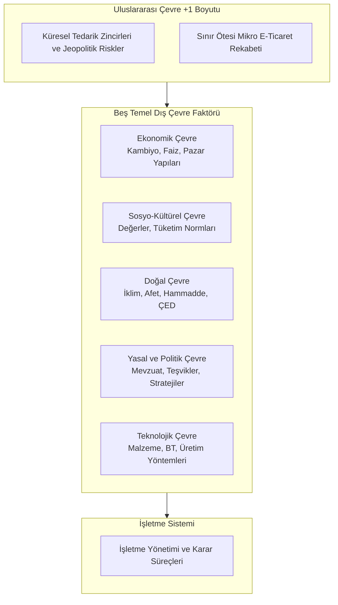

## Kavramsal Çerçeve

### Sistem Kuramı ve İşletme
**[[kavram-sistem|Sistem]]**; belirli bir ortak gayeye ulaşmak üzere eşgüdüm hâlinde hareket eden, birbirleriyle etkileşimli alt birimlerin oluşturduğu dinamik bir bütündür. Kuramsal açıdan [[Sistem Nedir|sistem]], kendi içinde müstakil bir iç dinamizmi bulunan bileşenlerin [[Sinerji|sinerjisiyle]] var olur. İşletme, parçası bulunduğu iktisadi, hukukî ve toplumsal üst sistemin kurallarına tâbi, çevresiyle sürekli kaynak, bilgi ve enerji alışverişi gerçekleştiren [[Açık Sistemler|açık bir alt sistemdir]]. İşletmenin içsel karar mekanizmalarını doğru kurgulamak, etkileşimde bulunduğu dış çevre faktörlerinin yapısal niteliklerini çözümlemeyi şart koşar.

### Kıtlık Prensibi ve İktisat Bilimi
İktisat bilimi, **sınırsız insan ihtiyaçlarının kıt kaynaklarla karşılanması sürecinde kaynak tahsisi, üretim ve bölüşüm mekanizmalarını araştıran sosyal bilimdir.** 

Kıtlık, bir kaynağın fizikî mevcudiyetinin sınırlı bulunmasını ifade edebileceği gibi o kaynağa serbestçe erişimin belirli bir maliyet, kota veya teknik engelleri tabi olmasını da içerir. Üretim süreci, kıt üretim faktörlerinin ([[Üretim Faktörleri|emek, sermaye, doğal kaynaklar, girişimci ve teknoloji]]) fayda üretecek mal ve hizmetlere dönüştürülmesini sağlar. [[6- Kripto Paralar#Paranın Fonksiyonları|Para]], mal ve hizmetlerin el değiştirmesini kolaylaştıran bir takas aracıdır. Paraya değerini veren ise onun karşılığında alınabilecek mal ve hizmetleri üreten reel faaliyetlerdir.

### Dış Çevre Analizi (5+1 Modeli)
İşletmeler, örgütsel stratejilerini inşa ederken iç dinamiklerini şekillendiren beş temel makro çevre faktörünü ve bu faktörlerin tamamını küresel ölçekte içeren ilave bir boyutu analiz eder:

#### 1. Ekonomik Çevre ve Pazar Yapıları
##### Ekonomik Sistemler 
- Üretim faktörlerinin mülkiyet yapısına ve kaynak dağıtım kararlarının kimin tarafından alındığına göre sınıflandırılır.
-  Üretim araçlarının mülkiyetinin ve dağıtım kararlarının merkezî yönetimde/devlette toplandığı yapılar **kontrollü sistemleri**; mülkiyetin özel teşebbüse ait olduğu, fiyat mekanizmasının arz ve talep dengesiyle kurulduğu modeller **serbestiyetçi sistemleri**; her iki kutbun muhtelif oranlarda kaynaştığı yapılar ise **karma ekonomik** sistemleri oluşturur.
##### Kambiyo Rejimi
- Ulusal para birimi ile yabancı para birimlerinin birbirine dönüştürülme kurallarını, döviz bulundurma serbestisini ve döviz kuru rejimlerini düzenlenir.
- Türkiye'de 1984 yılı öncesinde döviz bulundurma yasakları ve idari sabit kur rejimi ile 1991 sonrası piyasa dinamiklerine bağlanan serbest dalgalı kur rejiminin getirdiği esneklik, ithal girdi kullanan ve mamul ihraç eden işletmelerin maliyet planlamalarını doğrudan şekillendirden kambiyo politikası uygulamalarıdır.

##### Faiz ve [[5-rasyolar_2#a) Kaldıraç Oranı (Toplam Borç Oranı)|Finansal Kaldıraç Oranı]]
- [[Faiz]], **paranın zaman ve risk değeridir**. İşletmeler, ölçek ekonomisi elde etmek ve birim maliyetlerini düşürmek üzere öz kaynak havuzlarını yabancı kaynaklarla (borçlanma) takviye ederler. Borçlanma maliyeti doğrudan piyasa faiz oranıyla belirlenir. Geri ödememe riskinin düşük seyrettiği durumlarda (örn: güçlü teminat varlığı) borçlanma maliyeti ucuzlar. Vade süresi uzadıkça belirsizlik katsayısının artışı borç veren aktörün talep ettiği faiz marjını yükseltir.
 
##### Enflasyon, Deflasyon ve Stagflasyon
- [[Enflasyon]], fiyatlar genel düzeyinin sürekli artmasıdır ve paranın satın alma gücünü düşürür. [[Deflasyon]], fiyatlar genel düzeyinin sürekli düşmesidir. [[Stagflasyon]] ise, ekonomik durgunluk ve yüksek işsizlikle beraber enflasyonun da yüksek seyrettiği durumdur. Politika yapıcılar açısından çözümü zordur, çünkü enflasyonu düşürmeye yönelik önlemler durgunluğu derinleştirebilir, büyümeyi destekleyen önlemler ise enflasyonu körükleyebiliriz.

##### Gelir Dağılımı ve Pareto İlkesi
- Toplam gelirin toplum katmanları arasında bölüşüm profilidir. Nüfusun küçük bir azınlığının toplam gelirin büyük kısmını elinde tuttuğunu açıklayan Pareto dağılımı, işletmelerin hitap edeceği tüketici segmentlerini ve ürün fiyatlandırma eşiklerini belirler.

##### Pazar Kümeleri
- Üretim girdilerinin tedarik edildiği [[faktör pazarları]] ile üretilen nihai veya kurumsal alıcılara ulaştırıldığı tüketim/endüstriyel pazarlar olmak üzere iki temel pazar arayüzü bülünür.

##### Pazar Yoğunlaşmaları
- Tek satıcının fiyat belirleme gücünü elinde tuttuğu **[[monopol]]** ve tek alıcının piyasa şartlarını dikte ettiği **[[monopson]]** yapıları piyasa mutlakiyetini temsil eder.
- Cumhuriyet tarihinde Tekel İdaresi; tütün alımında tek alıcı (monopson), mamul tütün ve alkollü içki üretim ve dağıtımında tek yetkili (monopol) konumuyla bu yapıya örnek teşkil eder. 
- **Çok sayıda alıcı ve satıcının bulunduğu, hiçbir aktörün fiyatı etkileyemediği ideal durum tam rekabet piyasasıdır.**
- [[reel piyasa|Reel piyasa]] ortamlarında ise az sayıda büyük oyuncunun karşılıklı etkileşim içinde fiyatı belirlediği eksik rekabet türü olan **[[oligopol]] (satıcı yoğun)** veya **[[oligopson]] (alıcı yoğun)** pazarlar egemendir. Ürünün talep esnekliği derecesi, işletmenin [[monopol]] veya [[oligopol]] konumunda konumunda dahi fiyat artırma kapasitesini sınırlandıran mikroiktisadi bir etkendir.

#### 2. Sosyo-Kültürel Çevre
İşletmenin hedef kitlesini oluşturan tüketicilerin ve iş gücünü teşkil eden çalışanların inançlarını, normlarını, alışkanlıklarını ve davranış örüntülerini kapsar.

**Bölgesel Tüketim Alışkanlıkları**: Ege Bölgesi'nde yerleşik üretim kültürünün zeytinyağı talebini baskın kılması, Karadeniz Bölgesi'nde fındık yağı kullanımının yaygın olması, yerel tarım ve kültürün talep yaratma üzerindeki gücünü gösterir.

**Kültürel Algı ve Meşruiyet Yönetimi**: 1980'li yıllarda kültürel hassasiyetler sebebiyle Müslüman toplumlardan yoğun tepki alan küresel bir içecek üreticisinin, Ramazan aylarında aile, iftar ve birliktelik temalı reklam kampanyaları yürütmesi, pazar kabulünü kültürel değerlerle uyumlulaştırma çabasıdır.

**Sembolik Anlamlar**: Japon kültüründe beyaz rengin ölümü ve matemi simgelemesi nedeniyle ambalaj tasarımında beyaz renkten kaçınılması; Batı ve Türk kültüründe beyazın saflığı ve masumiyeti temsil etmesi, ambalaj tercihlerinde sosyo-kültürel çözümleme gerekliliğini ortaya koyar.

**Toplumsal Tepkiler ve Abluka Vakaları**: İngiltere'de çevreye duyarlı toplulukların petrol rafinerilerini insan zinciriyle ablukaya alması, toplumsal reaksiyonların tedarik zinciri süreçlerini durdurma gücünü kanıtlar. 

#### 3. Doğal Çevre
Coğrafî yapı, topoğrafya, iklim koşulları, su kaynakları, ham madde rezervleri ve doğal afet riskleridir.

**Sektörel Bağımlılık ve Coğrafî Risk**: Marmara Bölgesi'nin sanayi yoğunluğu ile yüksek sismik risk taşıması, işletmelerin inşaat standardından acil durum operasyonlarına kadar sabit yatırım maliyetlerini doğrudan yükseltir. Tarım ve turizm sektörlerinde iklim şartları doğrudan işletme gelirlerini kontrol eder.

**Çalışma Koşulları ve Donanım Koruma**: Alaska'daki balık işleme fabrikalarında aşırı soğuk sebebiyle iş gücünü çekmek adına yüksek ücret primleri ödenmesi; Afrika ve Orta Doğu'da 50 dereceyi aşan sıcaklıklarda makinelerin iklimlendirme sistemleriyle korunması, doğal çevrenin operasyonel giderler üzerindeki doğrudan etkisidir.

**Yasal Çevre Standartları**: Sanayi yatırımcılarının çevreye olan etkilerini sınırlandırmak amacıyla kamu otoritelerince aranan **ÇED Raporu (Çevresel Etki Değerlendirmesi)**, üretim planlarını ekolojik standartlara uyumlu kılmayı mecbur tutar.

#### 4. Yasal ve Politik Çevre
Devletin ve düzenleyici kurumların yürürlüğe koyduğu mevzuat bütünü (İş Kanunu, Türk Ticaret Kanunu, Borçlar Kanunu) ile benimsediği stratejik yönelimlerdir.

**Kamu Politikaları ve Teşvikler**: Türkiye'nin yerli otomobil [[kavram-konsorsiyum|konsorsiyumu]] TOGG, devletin otomotiv sektöründe yerli marka oluşturma ve yönlendirme politikası doğrultusunda kurulmuştur. Savunma sanayiinde dış kaynak temin kısıtları (F-35 programı yaptırımları) sonrasında güdülen teknolojik bağımsızlık politikası, yerli savunma firmalarına sağlanan kamu alım garantileri ve sübvansiyonlarla yürütülmektedir.

**Yasal Sınırlamalar**: Tütün ve alkollü içecekler piyasasında tek tip koyu ambalaj mecburiyeti, tanıtım asakları ve yaş kısıtlamaları, yasal-politik çevrenin [[Pazarlama Karması|pazarlama karmasını]] doğrudan kısıtlayan müdahaleleridir.

#### 5. Teknolojik Çevre
İşletmenin üretim, malzeme ve bilgi işleme süreçlerinde yararlandığı bilgi birikimi, donanım ve yöntemler bütünüdür.

**Malzeme Teknolojisi Atılımları**: Üç boyutlu yazıcıların 1970'lerden itibaren bilinmesine karşın günümüzde yaygınlaşması, eriyebilir polimer ve işlenebilir metal tozu teknolojilerindeki ilerlemelerin malzeme maliyetlerini düşürmesiyle gerçekleşmiştir.

**Teknoloji Yönetimi ve Örgütsel Uyum**: Bir üretim işletmesinde iş güvenliğini artırmak amacıyla kesici makinelere monte edilen hareket sensörlerinin, montajın tamamlandığı gece vardiyasında bizzat çalışanlar tarafından sökülmesi, teknoloji transferinin donanım teminiyle tamamlandığını, örgütsel kültür, çalışan yetkinliği ve davranışsal adaptasyon gerektirdiğini ortaya koyar.

**Bilgi Teknolojileri ve Küresel Rekabet**: Dijital pazar platformları işletmelerin küresel müşteri tabanına erişmesini sağlarken, tüketicinin alternatifleri anlık kıyaslayabilmesi sebebiyle rekabet şiddetini yerel seviyeden küresel seviyeye taşır.

#### 6. Uluslararası Çevre (+1 Boyutu)
İşletmenin sınır ötesi operasyonlarında karşılaştığı, diğer beş dış çevre faktörünün küresel ölçekte birleşmesiyle oluşan çok boyutlu yapıdır.

**Jeopolitik ve Lojistik Kırılganlık**: Süveyş Kanalı'nda karaya oturan konteyner gemisinin kanalı dört hafta boyunca tamamen tıkaması, Türkiye ve Avrupa'daki sanayi üretiminde ham madde teminini aksatarak kıtasal tedarik zinciri krizine yol açmıştır. Aden Körfezi'ndeki korsanlık faaliyetleri ise ticaret rotalarını uzatarak [[kavram-navlun|navlun]] maliyetlerini yükseltir.

**Mikro Ölçekte Küresel Rekabet**: Dijital kanallar üzerinden Çin menşeli 50 kuruşluk bir telefon kılıfının doğrudan yerel nihai tüketiciye ulaştırılabilmesi, mahalle ölçeğindeki yerel perakendecilerin dahi doğrudan uluslararası çevre faktörleri ve küresel tedarikçilerle rekabet hâlinde bulunduğunu gösterir.

### İşletmenin Amaçlar Hiyerarşisi
İşletme kararları, genel ve özel amaçların dengelenmesiyle inşa edilir.

#### Genel Amaçlar

##### 1. Kâr ve Kârlılık
- [[Kâr]], faaliyet dönemi sonundaki pozitif artık değeri; [[kârlılık]] ise bu artık değerin yatırılan sermayeye oranını ifade eder.
- 10 milyon liralık sermayeyle 1 milyon lira kâr (%10 kârlılık) elde etmek ile 100 milyon liralık yatırımla 8 milyon lira kâr (%8 kârlılık) elde etmek arasındaki seçim kâr marjıı ile satış hacmi arasındaki dengeye (*[[sürümden kazanmak|sürümden kazanma]]*) dayanır. 
- Kararlar daima [[fırsat maliyeti|Alternatif Maliyet]] (Fırsat Maliyeti) üzerinden analiz edilir. Risksiz mevduat faiz oranının %40 olduğu bir [[konjonktür|konjonktürde]], %10 getiri sağlayan yatırımlar [[reel getiri]] açısından sermaye kaybı anlamına gelir. Kamu işletmeleri ve vakıf iktisadi işletmeleri (örn: LÖSEV'in sağlık tesisleri ve hediyelik eşya satış birimleri), kurumsal devamlılığı sağlamak ve tesislerini yenilemek gayesiyle kâr marjı üretirler.

##### 2. Topluma Hizmet
- İnsan gereksinimlerinin karşılanması işletmenin varoluş zeminidir. Toplumsal ihtiyaçlara yanıt vermeyen organizasyonlar iktisadi sistem içinde mevcudiyetini koruyamaz.

##### 3. Varlığını Sürdürmek ve Büyümek
- Nüfus artışına ve ekonomik genişlemeye bağlı olarak pazar hacimleri büyüme eğilimindedir. Ölçeğini sabit tutan bir işletme, genişleyen pazar karşısında [[nıspî]] olarak küçülür ve pazar gücünü yitirir.

#### Özel Amaçlar
Girişimcinin şahsi değerlerinden, vizyonundan ve aidiyetlerinden kaynaklanan hedeflerdir. Türkiye'deki ilk Hilton Oteli'nin İstanbul veya Ankara yerine Adana'da kurulması kararı, rasyonel talep büyüklüğü parametrelerini aşarak Sabancı ailesinin kök saldığı Çukurova bölgesine itibar kazandırma, istihdam oluşturma ve kurumsal şan sağlama özel amacının bir sonucudur.

### İşletmenin Sosyo-Ekonomik İşlevleri

##### Üretici Birim İşlevi
[[ATLAS/0-ybs-notlari/YBS1003-isletme-bilimi/ders-1#Üretim Faktörleri Mimarisi|Üretim faktörlerini]] tüketim mallarına dönüştürerek gelir yaratır. İktisadi büyüme, girdilerin iç kaynaklardan temin edilip [[mâmul|mamullerin]] dış pazarlara ihraç edildiği modelle ivmelenir.

##### Yaratıcı Birim (Yenilik) İşlevi
Üniversiteler temel araştırma seviyesine odaklanırken işletmeler uygulamalı araştırma ve deneysel geliştirme süreçlerini finanse ederek bilgiyi ticarîleştirebilir metaya \[**teknolojiye**\] dönüştürür. Dokunmatik ekranların ve akıllı telefonların kitlesel tüketim standardı hâline gelmesi Apple ve benzeri teknoloji işletmelerinin bu yaratıcı fonksiyonuyla gerçekleşmiştir.

##### Bölgesel Kalkınma İşlevi
Büyük ölçekli yatırımlar çarpan etkisi yaratarak çevrelerinde geniş bir tedarikçi ve hizmet ekosistemi kurar. Manisa Organize Sanayi Bölgesi'nde yaklaşık 20 bin çalışan istihdam eden Vestel üretim yerleşkesi, bölgedeki sanayi işletmelerinin %70'inin kendisine çalışmasını sağlamakta; eğitim, sağlık ve konut yatırımlarını tetiklemektedir. Üniversite yerleşkelerinin 8-9 bin kişilik nüfus hareketiyle yerel esnafı beslemesi de bu etki alanına girer.

##### Tasarrufları Değerlendirme İşlevi
Bireysel birikimler; bankacılık sistemi (kredi mekanizması), doğrudan borçlanma senetleri ([[1-finansal_yonetime_giris_ve_temel_kavramlar#Tahviller (Bond)|tahvil]], [[Bonolar|bono]]) ve sermaye piyasası araçları ([[Hisse Senedi]] alımı, [[temettü]] getirisi) aracılığıyla işletmelerin [[Finansman|finansman]] havuzuna aktarılır. Katılım bankacılığı ise bu süreci faiz yerine kâr-zarar ortaklığı belgesi üzerinden reel işletme yatırımlarına ortak olarak yürütür. İkincil piyasa niteliğindeki borsada hisse alımı işletmeye doğrudan nakit girişi sağlamaz. İşletmeye sermaye akışı birincil piyasa niteliğindeki [[Halka Arz|Halka Arz (Initial Public Offering - IPO)]] ve [[Bedelli Sermaye Artırımı|bedelli sermaye artırımı]] süreçlerinde gerçekleşir.

##### Sosyal Denge ve İstihdam İşlevi
Çalışma hayatı; **devlet (düzenleyici)**, **işveren (üretici)** ve **çalışan (iş gücü)** sacayağı üzerinde yükselir. İstihdam olanaklarının daralması, toplumsal huzursuzluğu ve suç eğilimini artırır. İsviçre'de halk oyuna sunulan koşulsuz temel vatandaşlık geliri referandumu dahi, bireylerin üretken meşguliyet ve toplumsal statü arayışını ikame edememiştir. İşletmeler ayrıca kurumsal sosyal sorumluluk projeleri, okul/orman bağışları ve uluslararası pazarlardaki marka itibarlarıyla lobi ve ülke imajı işlevlerini ifa ederler.

### İşletmelerin Sınıflandırılması
Milyonlarca işletmenin idarî, hukukî ve iktisadî bakımdan yönetilebilmesi, benzer niteliklerin kümelenmesini şart koşar:

#### Üretilen Çıktının Türüne Göre 
- **Mal Üreten İşletmeler** (fiziksel, depolanabilir çıktılar)
- **Hizmet Üreten İşletmeler** (soyut, eş zamanlı tüketilen faaliyetler, pazarlama ve satış organizasyonları)

#### Müşteri Türüne Göre
- Nihai tüketiciye yönelik **Tüketim Malları Üretenler** (örn: binek otomobil, perakende ambalajlı).
- Diğer üreticilerin girdisini oluşturan **Endüstriyel Ürün Üretenler** (örn: ticarî kamyonlar, kafe/restoranlara toptan endüstriyel su temini, endüstriyel soğutma sistemleri) bkz. [[Endüstriyel Pazar]]

#### Faaliyet Alanına Göre
- **Tarım İşletmeleri**
- **Sanayi İşletmeleri** 
- **Hizmet İşletmeleri (Finans, Sağlık, Eğitim vb.)**

#### Mülkiyet Biçimine Göre
- **Kamu İşletmeleri**
- **Özel İşletmeler**
- **Karma İşletmeler**

#### Büyüklüklerine Göre
- **Küçük ve Orta Büyüklükteki İşletmeler ([[KOBİ]])**
- **Büyük İşletmeler**

#### Hukukî Yapılarına Göre
- **[[1-finansal_yonetime_giris_ve_temel_kavramlar#Şahıs Şirketleri (Kolektif, Komandit)|Şahıs Şirketleri]]**
- **[[1-finansal_yonetime_giris_ve_temel_kavramlar#Sermaye Şirketleri (Anonim -A.Ş., Limited -Ltd.)|Sermaye Şirketleri]] ([[1-finansal_yonetime_giris_ve_temel_kavramlar#Anonim Şirket (A.Ş.)|Anonim Şirket]], [[1-finansal_yonetime_giris_ve_temel_kavramlar#Limited Şirket (LTD. ŞTİ.)|Limited Şirket]])**

## Görselleştirmeler

#### Dış Çevre 5+1 Modeli
Aşağıdaki diyagram, işletmenin operasyonel çekirdeğini çevreleyen beş temel makro çevre faktörünü ve bunları kapsayan küresel uluslararası çevre boyutunu göstermektedir:

##### Makro

---

##### Karşılaştırmalı Piyasa Yapıları Analiz Tablosu

| Piyasa Türü       | Satıcı Sayısı          | Alıcı Sayısı           | Giriş-Çıkış Koşulları                                                                                                   | Fiyatlama Gücü ve Talep Dinamiği                                                                                                     | Reel Sektör ve Dijital Ekosistem Örneği                                                                                                 |
| :---------------- | :--------------------- | :--------------------- | :---------------------------------------------------------------------------------------------------------------------- | :----------------------------------------------------------------------------------------------------------------------------------- | :-------------------------------------------------------------------------------------------------------------------------------------- |
| **[[monopol]]**   | Tek Satıcı             | Çok Sayıda             | Yasal imtiyazlar, patent hakları, aşırı sermaye gereksinimi ve teknolojik ağ dışsallıkları kaynaklı kurumsal bariyerler | Fiyat belirleyici (Price Maker) konum; kâr maksimizasyonunu talep esnekliği sınırları dahilinde tek taraflı belirleme yetkisi        | Tarihsel Tekel İdaresi (İşlenmiş Tütün ve Alkollü İçki Satışı); Küresel Arama Motoru Pazarında Google Ekosistemi                        |
| **[[monopson]]**  | Çok Sayıda             | Tek Alıcı              | Kamusal yetki sınırları, devasa depolama kapasitesi ve kurumsal işleme altyapısı gerektiren yüksek ölçek şartları       | Alıcı egemenliği; girdi tedarik taban fiyatını belirleme ve üretici kâr marjını asgari düzeyde tutma imkânı                          | Cumhuriyet Dönemi Tekel İdaresi (Yerli Üreticiden Yaprak Tütün Alımı); Savunma Sanayiinde Tek Alıcı Konumundaki Millî Savunma Bakanlığı |
| **[[oligopol]]**  | Az Sayıda Büyük Satıcı | Çok Sayıda             | Yüksek sabit sermaye yatırımı, yoğun Ar-Ge harcamaları ve ileri teknoloji patenti gereksinimleri                        | Stratejik karşılıklı bağımlılık; fiyat lideri işletmenin adımlarını izleme, kurumsal uzlaşı eğilimi ve marka imajı odaklı rekabet    | Otomotiv ve Beyaz Eşya Ana Sanayii; Kamu Teşvikiyle Kurulan Yerli Otomobil Konsorsiyumu TOGG                                            |
| **[[oligopson]]** | Çok Sayıda             | Az Sayıda Büyük Alıcı  | Geniş lojistik filo, entegre soğuk hava depolama tesisleri ve kıtasal dağıtım ağı kısıtları                             | Alıcılar arası denge; yüksek alım hacmi gücüyle tedarikçiye uzun vadeli ödeme takvimleri ve iskonto uygulama kapasitesi              | Ulusal Ölçekli Süpermarket Zincirleri (BİM, Migros, A101) Karşısında Yerel Tarım Üreticileri                                            |
| **Tam Rekabet**   | Sayılamayacak Çoklukta | Sayılamayacak Çoklukta | Sermaye ve üretim faktörlerinin sektörler arası tam akışkanlığı; serbest piyasa giriş ve çıkış imkânı                   | Sıfır fiyat kontrolü; fiyat piyasa arz ve talep kesişimiyle kendiliğinden oluşur, işletme fiyat kabullenici (Price Taker) konumdadır | Standart Buğday, Pamuk ve Mısır Piyasaları; Regüle Borsa Emtia İşlemleri (Teorik Referans Modeli)                                       |
