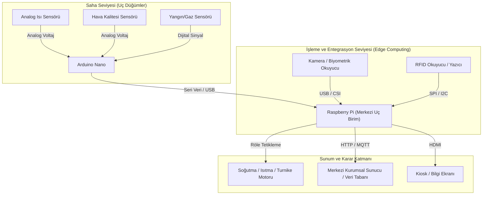
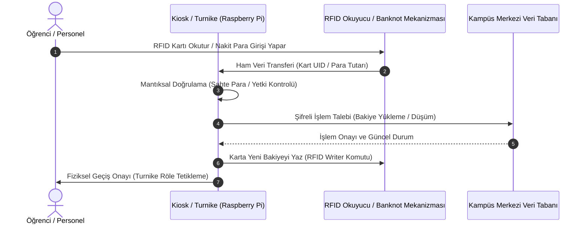

Ders, [[Endüstri 4.0]] vizyonunun temel bileşeni olan [[Nesnelerin İnterneti]] (IoT - Internet of Things) ve uç bilişim (edge computing) mimarisi üzerine kuruludur. Bilişim sistemleri analizinde yazılımın ihtiyaç duyduğu fiziksel veri akışını sağlayan donanım birimleri iki ana sınıfta incelenir.

* **Mikrodenetleyiciler ([[Arduino]]):** Dahili işlemci, kısıtlı bellek ve kalıcı bellek (flash) katmanlarını tek bir çip üzerinde birleştiren, işletim sistemi barındırmayan donanım birimleridir. Önceden yüklenen tek bir ürün yazılımını (firmware) sonsuz bir icra döngüsü (`loop`) içerisinde çalıştırırlar. Düşük güç tüketimiyle doğrudan sensör okuma ve aktüatör tetikleme görevlerini üstlenirler.
* **Tek Kart Bilgisayarlar ([[Raspberry Pi]]):** Çok çekirdekli merkezî işlem birimi (CPU), grafik işlemci (GPU), sistem belleği (RAM), kablosuz ağ yongaları ve harici depolama birimiyle (microSD) tam teşekküllü bir bilgisayar mimarisine sahiptir. Çok görevli (multitasking) bir [[Linux]] işletim sistemi (Raspberry Pi OS) çalıştırır. Veri tabanı yönetimi, ağ sunuculuğu, karmaşık karar algoritmaları ve kullanıcı arayüzü sunumunu aynı anda yürütme kapasitesine sahiptir.

| Mimari Parametre    | Mikrodenetleyici ([[Arduino]])                               | Tek Kart Bilgisayar ([[Raspberry Pi]])                             |
| :------------------ | :----------------------------------------------------------- | :----------------------------------------------------------------- |
| **İşlem Yeteneği**  | Tekil komut çevrimli denetleyici                             | Çok çekirdekli genel amaçlı mikroişlemci                           |
| **İşletim Sistemi** | İşletim sistemsiz (Bare-metal firmware)                      | Tam teşekküllü işletim sistemi ([[Linux]] / Debian tabanlı)        |
| **Depolama Modeli** | Entegre düşük kapasiteli flash hafıza                        | Harici microSD / SSD                                               |
| **Sinyal Arayüzü**  | Dahili [[Analog Sinyal]] (ADC) ve [[Dijital Sinyal]] pinleri | Varsayılan olarak yalnızca dijital [[GPIO]] pinleri                |
| **Ağ Entegrasyonu** | Harici modül gereksinimi (Model bağımlı)                     | Tümleşik Wi-Fi, Bluetooth ve Ethernet (Model 3 ve üzeride geçerli) |
| **Sistem Rolü**     | Uç sensör düğümü, veri toplayıcı                             | Uç sunucu (Edge Server), sistem yöneticisi, veri işleyici          |

#### 2. Sinyal Mimarisi ve Arayüz Protokolleri

Sistem tasarımında sahadaki fiziksel büyüklüklerin bilgi sistemine aktarılması iki temel sinyal dönüşüm yaklaşımıyla gerçekleşir:

* **[[Analog Sinyal]]:** Belirli bir aralıkta sonsuz sayıda gerilim değeri alabilen sürekli sinyallerdir (örneğin ortam sıcaklığı, ışık şiddeti). Arduino donanımı dahili Analog-Dijital Dönüştürücü (ADC) pinlerine sahip olduğundan bu verileri doğrudan işler.
* **[[Dijital Sinyal]]:** İkili mantık düzeyinde (0 V - Düşük / 3.3 V veya 5 V - Yüksek) çalışan kesikli sinyallerdir. Raspberry Pi üzerindeki [[GPIO]] (Genel Amaçlı Giriş/Çıkış) hatları varsayılan olarak dijital çalışır; sisteme analog bir sensör bağlanması gerektiğinde harici bir ADC entegresinin mimariye dahil edilmesi zorunludur.

#### 3. Kurumsal Ölçekte Sistem Analizi: Akıllı Kampüs ve Kartlı Geçiş Mimarisi Vakası

Ders kapsamında, yüksek maliyetli endüstriyel mimarilerin düşük maliyetli ve modüler IoT mimarilerine dönüştürülmesi gerçek bir kurumsal vaka üzerinden incelenmiştir:

##### Geleneksel/Konsorsiyum Mimarisi (2008 Öncesi)
* **Yapı:** Banka ([[İş Bankası]]), ana yazılım yüklenicisi ([[Softtech]]), donanım tedarikçisi (Target) ve alt lojistik sağlayıcılarından oluşan çok katmanlı konsorsiyum.
* **Donanım Birimi:** Her bir turnike içerisinde yer alan, Tayvan menşeili endüstriyel mini bilgisayar ([[Advantech]]) ve endüstriyel röle kartları.
* **Birim Maliyet:** Turnike başına yaklaşık 3.500 Amerikan Doları.
* **Sistemik Arızalar ve Yönetimsel Riskler:**
  1. *Tedarik Zinciri Kırılganlığı:* Arızalanan bir endüstriyel kartın onarım süreci önce İstanbul'a, ardından Tayvan'a uzanmakta; tamir süreleri aylar sürdüğü için geçiş noktaları ve yemekhane operasyonları felç olmaktadır.
  2. *Kart Yenileme Gecikmesi:* Banka üzerinden basılan öğrenci ve personel kimlik kartlarının arızalanması veya kaybolması durumunda yenileme süresi 1,5 ayı bulmaktadır.
  3. *Finansal Mutabakat ve Denetim Eksikliği:* Kampüs içi yemekhane harcamalarında öğrenci hesaplarından para çekilmesine rağmen, üniversite tarafında bağımsız bir yemek otomasyon ve doğrulama mekanizması bulunmadığından, toplanan fonların uzun süre üniversite bütçesine aktarılmadığı tespit edilmiştir.

##### Modüler IoT ve Uç Bilişim Mimarisi (Yeniden Tasarlanan Model)
* **Yapı:** Dış bağımlılıkların tasfiye edildiği, üniversite bünyesinde kurulan Akıllı Kart Merkezi ve tescilli yazılım omurgası.
* **Donanım Birimi:** Turnikelerin içine yerleştirilen düşük maliyetli [[Raspberry Pi]] tek kart bilgisayarları ve bunlara entegre çalışan [[RFID]] okuyucu/yazıcı modülleri.
* **Kiosk Entegrasyonu:** Kampüs geneline yerleştirilen 30 adet yerli kiosk ünitesi; madeni/kâğıt para sayma, sahte para analizi, bakiye sorgulama ve RFID kart üzerine veri yazma (writer) işlemlerini doğrudan Raspberry Pi denetiminde yürütür.

#### 4. Bilişim Mimarisi ve Yazılım Kaynak Optimizasyonu

* **İşletim Sistemi Optimizasyonu:** Düşük kaynak tüketimi gerektiren uç bilişim projelerinde, grafik arayüz barındırmayan hafifletilmiş işletim sistemi sürümleri ([[Raspberry Pi OS Lite]]) tercih edilir. Bu yaklaşım, sistemin 16 GB gibi düşük maliyetli depolama birimlerinde kararlı çalışmasını sağlar.
* **Geriye Dönük Uyumluluk ve Donanım Tanıma:** İşletim sistemi ile donanım bileşenleri arasındaki uyum doğrudan çekirdek (kernel) ve sürücü desteğine bağlıdır. Donanım yazılımlarının işletim sistemi sürümüyle birebir eşleşmesi zorunludur.
* **Ağ Bağımsızlığı:** Raspberry Pi 3 ve sonraki modellerde yerleşik kablosuz ağ ([[Wi-Fi]]) bulunması, kablolama altyapısının bulunmadığı geniş kampüs alanlarında sistemin kurulum ve dağıtım maliyetlerini asgariye indirir.
