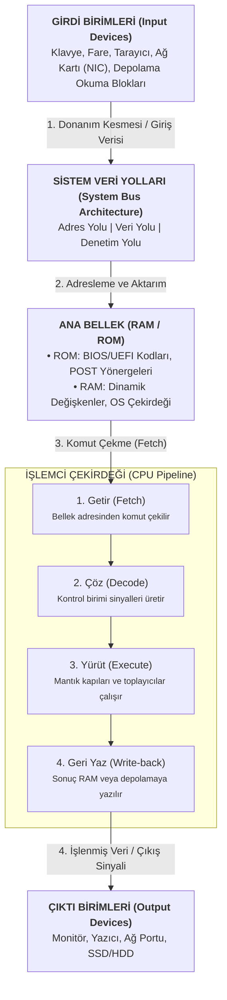
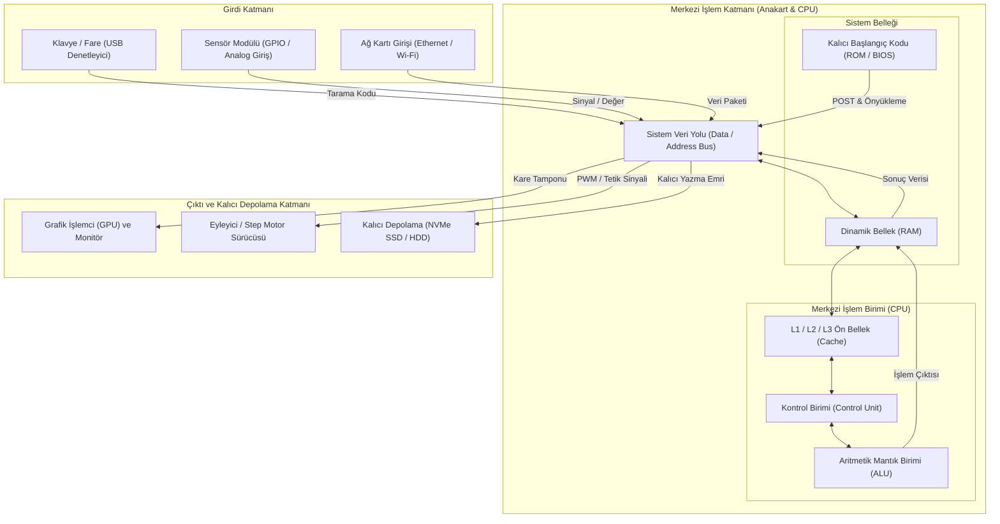

# Bürokrasiye Değgin

### Ölçme, Değerlendirme ve Sınav Usulleri

- Final sınav soruları büyük ölçüde sınıftaki tüm öğrencilerin dönem boyunca geliştirecekleri bireysel donanım ve gömülü sistem proje raporlarının içeriklerinden hazırlanır. Sınavda başarılı olmak, sisteme yüklenen tüm proje raporlarının mimari, donanımsal ve işlevsel detaylarına hâkim olmak gerekir.

### Uygulama ve Araştırma Şartnameleri
- **Proje Kapsamı ve Kabul Kriterleri:** Tek bir LED yakıp söndürme veya yalnızca tek bir sensörden basit veri okuma düzeyindeki ilkel çalışmalar doğrudan geçersiz sayılır. Kabul edilecek çalışmalar; [[nesnelerin-interneti|Nesnelerin İnterneti]] (IoT), [[Endüstri 4.0]] prensipleri, uzaktan veri aktarımı, robotik yönlendirme veya otonom denetim kabiliyetlerini barındıran katma değerli sistemlerdir.

---

# Derse Değgin

## Kavramlar ve Tanımlar

### [[RFID|RFID Teknolojisi]] (Radyo Frekansıyla Tanımlama)
- Radyo dalgaları aracılığıyla mikroçip barındıran nesnelerin kablosuz olarak kimliklendirilmesini ve veri transferini sağlayan elektromanyetik iletişim yöntemidir. Fiziksel kartın çevresinde yer alan bakır anten, okuyucu aygıtın yaydığı manyetik alana [[indüklenme|indüklenerek]] dâhili çipi enerjilendirir. 10 santimetre mesafeye kadar kararlı veri transferi gerçekleştirir.
	-  Çip içerisinde 1 KB büyüklüğünde **EEPROM** bellek alanı bulunur. Bu alan toplam yedi sektöre ayrılmış olup **altı sektör** kullanıcıya ait bakiye, kimlik no, yetki kodu gibi verileri saklar. **Yedinci sektör** ise şifreleme ve güvenlik anahtarlarına ayrılmıştır. Şehir içi toplu ulaşımda (ESHOT, İZBAN) kullanılan bakiye yükleme otomatları hem okuma hem yazma (Read/Write) yapabilen modüller içerirken, turnikeler ve sınıf yoklama terminalleri sadece okuma (Read-Only) yapan donanımlardır.

### Gömülü Sistem Mimarisi: Arduino Uno ve Raspberry Pi

- **[[mikrodenetleyici kartları|Mikrodenetleyici kartları]]** tekil bir kontrol döngüsünü donanımsal zamanlama hassasiyetiyle yürüten yapılardır. [[tek kart bilgisayar|Tek kart bilgisayarlar]] ise bünyesinde mikroişlemci, bellek denetleyicisi, grafik işlemci ve tam teşekküllü bir işletim sistemi barındıran üst seviye hesaplama üniteleridir. Mikrodenetleyicide işletim sistemi araya girmediği için zamanlama kusursuzdur.
	- `Arduino Uno`, üzerine bağlanan bir duman sensörü veya analog ısı algılayıcısını GPIO pinleri üzerinden okuyup mikrodenetleyici çekirdeğinde işleyen bir devre kartıdır. `Raspberry Pi` ise üzerinde Linux tabanlı işletim sistemi (Raspberry Pi OS) koşan, monitör, klavye ve fare bağlantısıyla bağımsız bir bilgisayar gibi çalışan platformdur. Araç çizgisi izleyen yarış robotlarında, motor sürücüler ve optik sensörler doğrudan denetleyici pinleriyle kontrol edilir. Raspberry Pi ise kamera görüntülerini işleyip yapay zekâ algoritmalarıyla rotayı belirler; kablosuz ağ üzerinden kontrol merkezine canlı veri aktarır.

### [[CPU|Merkezî İşlem Birimi]] (CPU) ve Çalışma Mantığı
- Bilgisayar sistemindeki komutları yorumlayan, veri akışını yöneten ve tüm operasyonları koordine eden donanım çekirdeğidir. Bünyesinde komut silsilesini ve aygıt senkronizasyonunu yöneten [[control unit|Kontrol Birimi]] (Control Unit) ile matematiksel ve mantıksal hesaplamaalrı icra eden [[arithmetic logic unit|Aritmetik Mantık Birimi]] (Arithmetic Logic Unit - ALU) bulunur.
	- Sisteme klavyeden $5+3$ ifadesi girildiğinde, girdi birimi bu karakterleri elektik sinyallerine dönüştürerek ana belleğe (RAM) aktarır. Kontrol birimi, bellekteki verileri ve toplama komutunu [[arithmetic logic unit|ALU]]'ya sevk eder. ALU bünyesidne ikili toplayıcı mantık kapıları işlemi gerçekleştirir, sonucu 8 olarak üretir ve tekrar RAM üzerindeki hedef adrese yazar. [[control unit|Kontrol birimi]] bu sonucu çıktı birimi olarak monitöre aktararak ekranda "$8$" değerinin görüntülenmesini sağlar.

### Bellek Hiyerarşisi
- Bilgisayar mimarisinde verilerin işlenme hızları ve saklanma sürelerine göre kademelendirildiği organizasyondur. [[RAM]], işlemcinin anlık ihtiyaç duyduğu komut ve verileri tutan **geçici (uçucu)** çalışma alanıdır. Elektrik akımı kesildiğinde içeriği sıfırlanır. [[sabit disk|Sabit diskler]] (Katı Hâl Sürücüsü - [[SSD]]/[[HDD]]) ise verileri manyetik veya yarı iletken hücrelerde kalıcı olarak muhafaza eden depolama birimleridir.

### Yazılım Hata Türleri: Sözdizim Hatası ve Mantık Hatası
- Programlama dillerinde kuralların ihlali veya algoritma tasarımındaki kavramsal kusurlar sonucu oluşan aksaklıklardır. Sözdizimsel hata (syntax error), dilin yazım kurallarının, noktalama işaretlerinin veya rezerve edilmiş anahtar kelimelerinin hatalı kullanılmasını ifade eder; derleyici veya yorumlayıcı tarafından işlem durdurularak anında bildirilir. Mantıksal hta (*logical error*) ise sözdizimi geçerli olan bir kodun, kurgusal tasarım hatasından dolayı yanlış sonuç üretmesidir.

### Verinin Temsil Edilmesi ve Ölçü Birimleri
- Elektronik devrelerde transistörlerin iki temel fiziksel durumunu (yüksek gerilim/1, düşük gerilim/0) temsil eden en küçük bilgi birimine **bit** adı verilir. 
- ASCII (Amerikan Standart Bilgi Değişimi Kodu), 0 ile 255 arasındaki sayılar değerleri harflere, sembollere ve kontrol karakterlerine eşler.
	- Klavyeden büyük "T" harfine basıldığında tarama kodu işletim sistemine aktarılır. Sistem bu karakteri ASCII karşılığı olan **84** taban değerine ve ikili kodlama olan `01010100` bit dizisine dönüştürerek RAM'e kaydeder. Bellek kapasitesi basamakları ondalık ($10^3 = 1000$) sistem yerine **ikili üsler ($\mathbf{2^{10} = 1024}$)** üzerinden ilerler. 1 KB, 1024 byte'a tekabül ederken; 1 MB, 1024 KB değerine; 1GB ise 1024 MB'ye tekabül eder. 
	- 64-bit işlemci mimarisi, 8-bit mimariye kıyasla tek bir saat vuruşunda 64 basamaklı ikili sinyali paralelv eri yolları üzerinden eşzamanlı işleme ve çok daha geniş bir bellek adres uzayını doğrudan yönetme kabiliyeti sağlar.

### Donanım Güvenliği ve Enerji Yönetimi: Elektrostatik Deşarj (ESD) ve Güç Kaynağı (PSU)
- İnsan vücudu ve yalıtkan yüzeylerde biriken statik elektriğin düşük dürençli bir iletkene kontrolsüz biçimde sıçraması **elektrostatik deşarj** olarak adlandırılır. Bu sıçrama, mikroskobik CMOS yarı iletke yollarını yakarak kalıcı donanım hasarına yol açar. **Güç kaynağı** ise **şebekeden gelen yüksek gerilimli alternatif akımı (AC) bilgisayar bileşenlerinin gereksinim duyduğu doğru akıma (DC) dönüştürür**.
	- Anakart, işlemci veya RAM montajı esnasında teknisyenin antistatik bileklik takması ve timsah tipi klemensi kasanın çıplak metal şasisine bağlaması statik yükün güvenle tahliyesini sağlar. **Güç kaynağı kasadaki bileşenlere +3.3V (yonga setleri, modern CPU'lar), +5V (mantık devreleri, anakart bileşenleri) ve +12V (sabit disk motorları, fanlar, soğutma pompaları) doğru akım dağıtır. Kasanın fişi çekilmiş olsa dahi güç kaynağı içerisindeki yüksek kapasiteli sığaçlar (kondansatörler) elektrik yükünü uzun süre muhafaza eder.**

---

## 2. Araştırma Tasarımı ve Metodolojik Mimari

### Bilgisayar Kuşakları

| Kuşak / Dönem                   | Temel Anahtarlama Bileşeni                                | Ortalama Bileşen Yoğunluğu                                       | Programlama Paradigmaları                               | Veri Saklama ve Kayıt Ortamı                            | Tipik Sistem Mimarileri                                        |
| :------------------------------ | :-------------------------------------------------------- | :--------------------------------------------------------------- | :------------------------------------------------------ | :------------------------------------------------------ | :------------------------------------------------------------- |
| **1. Kuşak**  (1946–1959)    | Vakum Tüpleri (Termiyonik Valfler)                        | Sistem başına ~18.000 tüp; yüksek enerji tüketimi ve aşırı ısı   | Makine Dili (Salt ikili kodlama, 0-1 seviyesi)          | Delikli Kartlar, Manyetik Tamburlar, Manyetik Teyp      | [[ENIAC]], [[EDVAC]], [[UNIVAC]], [[Harvard Mark I]]           |
| **2. Kuşak**  (1959–1964)    | Ayrık Yarı İletken Transistörler                          | Kart başına ~10.000 el lehimli transistör; düşük güç             | [[Assembly Dili]] (Sembolik mnemonikler), Erken FORTRAN | Manyetik Çekirdek Bellekler, Manyetik Şerit Teypler     | [[IBM 1401]], Philco Transac S-200                             |
| **3. Kuşak**  (1964–1970)    | Küçük/Orta Ölçekli Entegre Devreler (SSI/MSI)             | Tek silikon yongada onlarca transistör                           | Yapısal Diller (C, Pascal, COBOL), İşletim Sistemleri   | Manyetik Disk Plakaları (Hard Disk Sürücüsü)            | [[IBM System/360]] Ailesi                                      |
| **4. Kuşak**  (1970–1990)    | Büyük Ölçekli Entegre Devreler / Mikroişlemciler          | Tek çipte yüz binlerce-milyonlarca transistör (LSI/VLSI)         | Nesne Yönelimli Diller (C++, Erken Java), Görsel Arayüz | Optik Diskler (CD/DVD), Disketler (5.25", 3.5"), Flash  | [[Intel 4004]], [[IBM PC]]` (1981), Kişisel Bilgisayarlar      |
| **5. Kuşak**  (1990–Günümüz) | Çok Büyük Ölçekli Yongalar (ULSI), Çok Çekirdekli CPU/GPU | Tek kalıpta milyarlarca transistör; Kuantum/Yapay Zekâ Yongaları | Paralel İşleme, Yapay Sinir Ağları, Bildirimsel Diller  | NVMe M.2 SSD, Dağıtık Bulut Depolama, Kuantum Durumları | Akıllı Mobil Aygıtlar, Süper Bilgisayarlar, Kuantum Sistemleri |
### Donanım Kesme (Interrupt) ve Bellek İşlem Döngüsü
- Donanım bileşenleri, işlemciye harici olayları bildirmek üzere [[Interrupt Request Lines|Kesme İstek Hatlarını]] (IRQ) tetikler. Bir tuşa basıldığında klavye denetleyicisi ilgili hatta elektrik sinyali gönderir. Kesme denetelyicisi bu sinyali işlemcinin [[INTR]] (Interrupt Request) pinine iletir. İşlemci mevcut saat çevrimindeki işini durdurur; program sayacını ve o anki kayıtçı (register) içeriklerini ana belliğin **[[stack|Yığıt]] (Stack)** bölgesine yedekler. Ardından **[[BIOS]]/[[UEFI]]** içerisinde tanımlı [[Interrupt Vector Table|Kesme Yönlendirme Tablosu]] (Interrupt Vector Table) üzerinden ilgili cihazı sürücü kod bloğuna dallanarak veriyi okur, tampon belleğe aktarır ve yarım kalan ana görevine döner.

---

## Donanım Aygıtları Arası Veri ve Komut Akış Mimarisi

e

| Gerilim Düzeyi | Standart Kablo Rengi | Beslenen Donanım Aygıtları ve Mimarideki İşlevi                                 |
| -------------- | -------------------- | ------------------------------------------------------------------------------- |
| **+12V**       | Sarı                 | Sabit disk motorları, fanlar, sıvı soğutma pompaları, PCIe yuvaları             |
| **+5V**        | Kırmızı              | Anakarat mantık devreleri, 2,5 inç SSD/HDD sürücü mantık kartları, USB portları |
| **+3.3V**      | Turuncu              | Merkezî işlemci yonga seti girişleri, RAM, PCIe veri yolları                    |
| **-12V**       | Mavi                 | Seri bağlantı noktası devreleri, eski tip ses kartı operastonel yükselteçleri   |
| **-5V**        | Beyaz                | Eski ISA veri yolu mimarileri ve programlanabilir salt okunur bellekler         |
| **0V**         | Siyah                | Toprak hattı; devreyi tamamlayan referans dönüş yolu                            |

