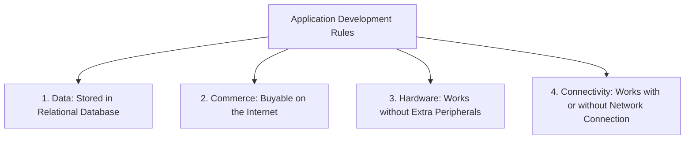
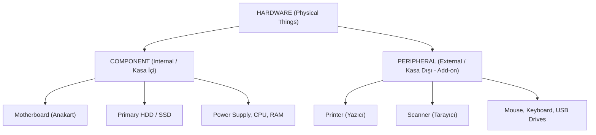

# 📚 Mesleki Yabancı Dil I — Hafta 1: Information Technology 101


> [!warning] **Sınav Formatı ve Kuralları (Kesinleşen Bilgiler)**
> - **Sınav Türü:** Vize ve final sınavları %100 çoktan seçmeli **test** formatında yapılacaktır. Sınavda İngilizce cümle kurma, paragraf yazma veya serbest çeviri (*writing*) kesinlikle **yoktur**.
> - **Soru Şablonu:** Soru kökünde kavramın resmi İngilizce tanımı (*formal definition*) verilecek; altında 4 veya 5 seçenek yer alacaktır.
> - **Kapsam:** Her sınav için yaklaşık **100 – 120 kelimelik** teknik bir havuzdan sorumlu olunacaktır. Tanımları ezberlemek yerine "Tetikleyici Anahtar Kelimeleri" (*Trigger Words*) yakalamak gerekir.
> - **Yazım Biçimleri:** Resmi teknik raporlarda kısaltmalar yerine uzun haller tercih edilir (örn. günlük dilde *app*, resmi raporda ve sınavda *application*).


---

## 📖 Okuma & Dinleme Metni (Reading & Listening)

### Metin ve Birebir Çevirisi: "Information Technology 101"

| İngilizce Orijinal Metin | Türkçe Akademik Çevirisi |
| :--- | :--- |
| **Hello and welcome to English for IT!** | Merhaba ve Bilişim Teknolojisi (BT) için İngilizceye hoş geldiniz! |
| In this course, you will learn to understand, speak, and write the words required to function in an English-speaking IT job or university study program. | Bu derste; İngilizce konuşulan bir bilişim işinde veya üniversite lisans programında çalışabilmek için gereken kelimeleri anlamayı, konuşmayı ve yazmayı öğreneceksiniz. |
| The course is organized into many units, covering a wide area of IT topics. | Ders; bilişim teknolojileri alanının geniş bir bölümünü kapsayan birçok ünite halinde organize edilmiştir. |
| To complete a unit, you need to learn the new vocabulary and then complete the activities. | Bir üniteyi tamamlamak için yeni kelimeleri öğrenmeniz ve ardından faaliyetleri tamamlamanız gerekir. |
| In this first unit, there are only 10 vocabulary words you need to learn. | Bu ilk ünitede öğrenmeniz gereken yalnızca 10 sözcük bulunmaktadır. |
| The vocabulary words are normally presented in a short reading or dialogue format. Here is a really short reading as an example: | Sözcükler normalde kısa bir okuma veya diyalog biçiminde sunulmaktadır. Örnek olarak burada oldukça kısa bir okuma metni yer almaktadır: |
| **Information Technology 101** | **Bilişim Teknolojileri 101** |
| "Good morning, students. Today, I want to talk about application development." | "Günaydın öğrenciler. Bugün uygulama geliştirme hakkında konuşmak istiyorum." |
| "As you know, to begin, you need a good computer with solid components." | "Bildiğiniz gibi, işe başlamak için sağlam bileşenlere sahip iyi bir bilgisayara ihtiyacınız vardır." |
| "Having the right hardware will help you to develop quality software that works without crashing." | "Doğru donanıma sahip olmak; kilitlenmeden/çökmeden çalışan kaliteli yazılımlar geliştirmenize yardımcı olacaktır." |
| "I always follow certain rules when I build a new app:" | "Yeni bir uygulama geliştirirken daima belirli kuralları izlerim:" |
| "1. The data for the application should be stored in a relational database." | "1. Uygulamanın verileri ilişkisel bir veritabanında saklanmalıdır." |
| "2. Customers should be able to buy my application on the Internet." | "2. Müşteriler, uygulamamı İnternet üzerinden satın alabilmelidir." |
| "3. The software should work without any extra peripherals." | "3. Yazılım, herhangi bir ekstra çevre birimine/eklentiye ihtiyaç duymadan çalışabilmelidir." |
| "4. The program should be designed to work with or without a solid network connection." | "4. Program, sağlam bir ağ bağlantısı olsa da olmasa da çalışabilecek şekilde tasarlanmalıdır." |
| "By following these simple rules, you can write great applications that work for everyone. The end." | "Bu basit kurallara uyarak herkes için sorunsuz çalışan mükemmel uygulamalar yazabilirsiniz. Son." |

---

### ⚙️ Yazılım Geliştirirken İzlenen 4 Temel İlke



---

## 🔑 Temel Terimler Sözlüğü (Core IT Vocabulary)

### `application` *(kısaltma: app)*
- **Türkçe Anlamı:** Uygulama
- **Resmi İngilizce Tanım:** A software program which allows a user to perform specific tasks such as word processing, email, accounting, database management.
- **Türkçe Açıklaması:** Kullanıcının kelime işlem, e-posta, muhasebe veya veritabanı yönetimi gibi belirli görevleri yürütmesine imkân tanıyan yazılım programıdır.
- **Örnek Cümle:** *"Examples of popular applications include Microsoft Word, Adobe Photoshop, and Mozilla Firefox."*
> [!tip] **Sınavda Yakalama Noktası (Trigger Words):**
> Tanımda **`"a software program"`** ve **`"specific tasks"`** (word processing, email, accounting vb.) kalıbı doğrudan `application` seçeneğini işaret eder.

---

### `component`
- **Türkçe Anlamı:** Bileşen (Dahili Donanım)
- **Resmi İngilizce Tanım:** Any device internal to the computer, such as a primary hard disk drive or motherboard.
- **Türkçe Açıklaması:** Bilgisayar kasasının içinde yer alan anakart veya dahili sabit disk sürücüsü gibi dahili donanım aygıtlarıdır.
- **Örnek Cümle:** *"A hardware geek is constantly upgrading components in his computer to achieve more performance."*
> [!tip] **Sınavda Yakalama Noktası (Trigger Words):**
> Soru kökündeki **`"internal to the computer"`** (bilgisayar kasasının içi) ifadesi ve **`"motherboard or hard disk drive"`** örnekleri doğrudan `component` terimini verir.

---

### `computer`
- **Türkçe Anlamı:** Bilgisayar
- **Resmi İngilizce Tanım:** An electronic, digital device that stores and processes information.
- **Türkçe Açıklaması:** Bilgiyi saklayan ve işleyen elektronik, dijital cihazdır.
- **Örnek Cümle:** *"A computer needs to be replaced or upgraded regularly or it will become obsolete."*
> [!tip] **Sınavda Yakalama Noktası (Trigger Words):**
> **`"electronic, digital device that stores and processes information"`** klasik standart tanımıdır.

---

### `data`
- **Türkçe Anlamı:** Veri
- **Resmi İngilizce Tanım:** Literally meaning 'that which is given', this term refers to raw information of any kind.
- **Türkçe Açıklaması:** Kelime anlamı olarak 'verilen' demektir; her türlü işlenmemiş, ham bilgiyi ifade eder.
- **Örnek Cümle:** *"The network administrator was fired when he lost all the company data by accidentally formatting the wrong hard disk drive array."*
> [!tip] **Sınavda Yakalama Noktası (Trigger Words):**
> Köken anlamını belirten **`"that which is given"`** veya ham bilgiyi ifade eden **`"raw information of any kind"`** kalıbı doğrudan `data` terimini verir.

---

### `database`
- **Türkçe Anlamı:** Veritabanı
- **Resmi İngilizce Tanım:** An organized, electronic collection of information optimized for fast access and typically consisting of rows, columns, indexes, and keys.
- **Türkçe Açıklaması:** Hızlı erişim için optimize edilmiş; satırlar, sütunlar, indeksler ve anahtarlardan oluşan organize elektronik bilgi koleksiyonudur.
- **Örnek Cümle:** *"The international company stored their customer information in a central database in Brussels."*
> [!tip] **Sınavda Yakalama Noktası (Trigger Words):**
> **`"organized electronic collection... optimized for fast access"`** ve **`"rows, columns, indexes, and keys"`** kalıpları `database` teriminin kesin tetikleyicileridir.

---

### `hardware`
- **Türkçe Anlamı:** Donanım
- **Resmi İngilizce Tanım:** Physical things that make up a computer, such as a component or a peripheral.
- **Türkçe Açıklaması:** Bir bilgisayarı oluşturan bileşenler veya çevre birimleri gibi tüm fiziksel parçalardır.
- **Örnek Cümle:** *"Hardware today has become such a commodity that it's often more expensive to repair it than to replace it."*
> [!tip] **Sınavda Yakalama Noktası (Trigger Words):**
> Hem dahili (*component*) hem harici (*peripheral*) aygıtları kapsayan genel şemsiye ifade: **`"physical things that make up a computer"`**.

---

### `Internet`
- **Türkçe Anlamı:** İnternet
- **Resmi İngilizce Tanım:** The largest known public network in the world, connecting millions of computers around the world.
- **Türkçe Açıklaması:** Dünya çapında milyonlarca bilgisayarı birbirine bağlayan, bilinen en büyük kamuya açık ağdır.
- **Örnek Cümle:** *"Some people refer to the Internet as an information superhighway."*
> [!tip] **Sınavda Yakalama Noktası (Trigger Words):**
> **`"the largest known public network in the world"`** veya **`"information superhighway"`** ifadeleri `Internet` terimini açık eder.

---

### `network`
- **Türkçe Anlamı:** Ağ
- **Resmi İngilizce Tanım:** A group of connected computers which share resources.
- **Türkçe Açıklaması:** Kaynakları paylaşmak amacıyla birbirine bağlanmış bilgisayarlar grubudur.
- **Örnek Cümle:** *"The company network consisted of 3 servers, 95 workstations, and 10 printers."*
> [!tip] **Sınavda Yakalama Noktası (Trigger Words):**
> Soru kökündeki **`"a group of connected computers which share resources"`** kalıbı doğrudan `network` cevabını verir.

---

### `peripheral`
- **Türkçe Anlamı:** Çevre Birimi / Harici Eklenti / Aksesuar
- **Resmi İngilizce Tanım:** An external computer add-on, such as a printer or a scanner; also known as an 'accessory'.
- **Türkçe Açıklaması:** Yazıcı veya tarayıcı gibi bilgisayara dışarıdan bağlanan harici eklentilerdir; 'aksesuar' olarak da bilinir.
- **Örnek Cümle:** *"The woman hated the look of all the tangled wires behind her desk, which were caused by so many peripherals."*
> [!tip] **Sınavda Yakalama Noktası (Trigger Words):**
> **`"external computer add-on"`** ve **`"accessory"`** (kasanın dışından kablo veya port ile bağlanan donanımlar).

---

### `software`
- **Türkçe Anlamı:** Yazılım
- **Resmi İngilizce Tanım:** Any program designed to run on a computer.
- **Türkçe Açıklaması:** Bilgisayar donanımı üzerinde çalışmak üzere tasarlanmış herhangi bir programdır.
- **Örnek Cümle:** *"The geek purchased new software for his computer almost every weekend."*
> [!tip] **Sınavda Yakalama Noktası (Trigger Words):**
> En genel program tanımı: **`"any program designed to run on a computer"`**.

---

## ⚖️ 4. Kavram Hiyerarşisi: Hardware vs. Component vs. Peripheral



---

## 📝 5. Sınav Simülatörü (Hocanın Soru Formatında Test)

```quiz
{
  "title": "Hafta 1 - Information Technology 101 Test Simülatörü",
  "description": "Vize ve final soru formatında çoktan seçmeli test. Tetikleyici kelimeleri yakalayın!",
  "questions": [
    {
      "id": 1,
      "question": "An \"external computer add-on, such as a printer or a scanner; also known as an accessory\" is formally defined as a:",
      "options": [
        {
          "key": "A",
          "text": "component",
          "isCorrect": false,
          "explanation": "Yanlış. Component (bileşen), anakart veya dahili sabit sürücü gibi bilgisayar kasasının İÇİNDE (internal) yer alan donanımlardır; harici eklentiler değildir."
        },
        {
          "key": "B",
          "text": "peripheral",
          "isCorrect": true,
          "explanation": "Doğru! Tetikleyici: \"external computer add-on\" (harici bilgisayar eklentisi) ve \"accessory\" (aksesuar) doğrudan çevre birimlerini (peripheral) işaret eder."
        },
        {
          "key": "C",
          "text": "software",
          "isCorrect": false,
          "explanation": "Yanlış. Software fiziksel bir donanım/aksesuar değil, program kodları ve yönergelerdir."
        },
        {
          "key": "D",
          "text": "database",
          "isCorrect": false,
          "explanation": "Yanlış. Database organize edilmiş elektronik bilgi koleksiyonudur."
        },
        {
          "key": "E",
          "text": "network",
          "isCorrect": false,
          "explanation": "Yanlış. Network, kaynak paylaşımı için birbirine bağlanmış bilgisayarlar grubudur."
        }
      ]
    },
    {
      "id": 2,
      "question": "The term that literally means \"that which is given\", referring to \"raw information of any kind\", is:",
      "options": [
        {
          "key": "A",
          "text": "data",
          "isCorrect": true,
          "explanation": "Doğru! Tetikleyici: Köken anlamı \"that which is given\" (verilen şey) olan ve ham bilgiyi (\"raw information of any kind\") ifade eden terim data'dır."
        },
        {
          "key": "B",
          "text": "application",
          "isCorrect": false,
          "explanation": "Yanlış. Application, kullanıcının belirli görevleri (kelime işlemci, e-posta vb.) yapmasını sağlayan yazılım programıdır."
        },
        {
          "key": "C",
          "text": "hardware",
          "isCorrect": false,
          "explanation": "Yanlış. Hardware, bilgisayarı oluşturan tüm fiziksel parçaların genel adıdır; ham bilgi anlamına gelmez."
        },
        {
          "key": "D",
          "text": "Internet",
          "isCorrect": false,
          "explanation": "Yanlış. Internet, milyonlarca bilgisayarı bağlayan dünyanın en büyük genel ağıdır."
        },
        {
          "key": "E",
          "text": "peripheral",
          "isCorrect": false,
          "explanation": "Yanlış. Peripheral, harici eklenti veya aksesuar anlamına gelir."
        }
      ]
    },
    {
      "id": 3,
      "question": "An \"organized, electronic collection of information optimized for fast access and typically consisting of rows, columns, indexes, and keys\" is called a:",
      "options": [
        {
          "key": "A",
          "text": "network",
          "isCorrect": false,
          "explanation": "Yanlış. Network (ağ), kaynak paylaşımı için birbirine bağlanmış bilgisayarlar bütünüdür."
        },
        {
          "key": "B",
          "text": "software",
          "isCorrect": false,
          "explanation": "Yanlış. Software, bilgisayarda çalışmak üzere tasarlanmış herhangi bir programdır."
        },
        {
          "key": "C",
          "text": "database",
          "isCorrect": true,
          "explanation": "Doğru! Tetikleyici: \"organized, electronic collection\", \"optimized for fast access\" ve \"rows, columns, indexes, and keys\" doğrudan database (veritabanı) tanımıdır."
        },
        {
          "key": "D",
          "text": "computer",
          "isCorrect": false,
          "explanation": "Yanlış. Computer, bilgiyi saklayan ve işleyen elektronik cihazdır."
        },
        {
          "key": "E",
          "text": "component",
          "isCorrect": false,
          "explanation": "Yanlış. Component, bilgisayarın dahili donanım bileşenidir."
        }
      ]
    },
    {
      "id": 4,
      "question": "Which term describes \"any device internal to the computer, such as a primary hard disk drive or motherboard\"?",
      "options": [
        {
          "key": "A",
          "text": "peripheral",
          "isCorrect": false,
          "explanation": "Yanlış. Peripheral, kasa dışındaki harici çevre birimlerini ifade eder (yazıcı, fare vb.)."
        },
        {
          "key": "B",
          "text": "application",
          "isCorrect": false,
          "explanation": "Yanlış. Application kullanıcıya yönelik yazılımlardır."
        },
        {
          "key": "C",
          "text": "component",
          "isCorrect": true,
          "explanation": "Doğru! Tetikleyici: Soru kökündeki \"internal to the computer\" (bilgisayar kasasının içi) ifadesi ve \"motherboard or hard disk drive\" örnekleri doğrudan component terimini verir."
        },
        {
          "key": "D",
          "text": "network",
          "isCorrect": false,
          "explanation": "Yanlış. Network, bilgisayar ağı anlamına gelir."
        },
        {
          "key": "E",
          "text": "software",
          "isCorrect": false,
          "explanation": "Yanlış. Software fiziksel aygıt değil programdır."
        }
      ]
    },
    {
      "id": 5,
      "question": "\"The largest known public network in the world, connecting millions of computers around the world\" is the definition of:",
      "options": [
        {
          "key": "A",
          "text": "Internet",
          "isCorrect": true,
          "explanation": "Doğru! Tetikleyici: \"largest known public network in the world\" veya \"information superhighway\" doğrudan Internet'tir."
        },
        {
          "key": "B",
          "text": "database",
          "isCorrect": false,
          "explanation": "Yanlış. Database veri depolama yapısıdır."
        },
        {
          "key": "C",
          "text": "peripheral",
          "isCorrect": false,
          "explanation": "Yanlış. Peripheral harici çevre birimidir."
        },
        {
          "key": "D",
          "text": "computer",
          "isCorrect": false,
          "explanation": "Yanlış. Computer tekil bilişim cihazıdır."
        },
        {
          "key": "E",
          "text": "software",
          "isCorrect": false,
          "explanation": "Yanlış. Software yazılım programıdır."
        }
      ]
    }
  ]
}
```

---

## 🧩 6. Kelime Avı Bulmacası (Vocabulary Puzzle)

```puzzle

{
  "title": "Computer Words - Week 1 Puzzle",
  "dimensions": {
    "rows": 14,
    "cols": 14
  },
  "grid": [
    ["N", "C", "M", "O", "N", "I", "T", "O", "R", "T", "A", "S", "S", "T"],
    ["C", "F", "O", "L", "D", "E", "R", "S", "C", "C", "E", "Y", "E", "P"],
    ["A", "S", "G", "I", "H", "T", "F", "A", "E", "E", "I", "E", "A", "R"],
    ["R", "E", "K", "A", "E", "P", "S", "A", "L", "V", "F", "K", "R", "I"],
    ["S", "C", "P", "U", "A", "D", "A", "T", "C", "G", "C", "D", "C", "N"],
    ["B", "T", "T", "G", "S", "N", "E", "O", "S", "E", "A", "S", "H", "T"],
    ["E", "O", "F", "N", "T", "A", "B", "L", "E", "E", "B", "M", "O", "E"],
    ["M", "O", "U", "S", "E", "N", "E", "E", "R", "C", "S", "O", "E", "R"],
    ["B", "B", "S", "A", "E", "R", "A", "W", "T", "F", "O", "S", "O", "S"],
    ["N", "E", "E", "O", "A", "T", "S", "C", "A", "N", "D", "I", "S", "K"],
    ["O", "R", "O", "I", "A", "D", "R", "N", "E", "E", "N", "R", "E", "B"],
    ["T", "O", "S", "D", "T", "V", "A", "N", "C", "T", "E", "U", "D", "K"],
    ["E", "E", "L", "T", "L", "D", "S", "N", "O", "C", "I", "S", "N", "T"],
    ["S", "T", "E", "N", "R", "E", "T", "N", "I", "M", "C", "B", "I", "K"]
  ],
  "words": [
    {
      "word": "MONITOR",
      "direction": "HORIZONTAL_LTR",
      "start": [0, 2],
      "end": [0, 8],
      "path": [[0, 2], [0, 3], [0, 4], [0, 5], [0, 6], [0, 7], [0, 8]]
    },
    {
      "word": "PRINTERS",
      "direction": "VERTICAL_TTB",
      "start": [0, 13],
      "end": [7, 13],
      "path": [[0, 13], [1, 13], [2, 13], [3, 13], [4, 13], [5, 13], [6, 13], [7, 13]]
    },
    {
      "word": "FOLDERS",
      "direction": "HORIZONTAL_LTR",
      "start": [1, 1],
      "end": [1, 7],
      "path": [[1, 1], [1, 2], [1, 3], [1, 4], [1, 5], [1, 6], [1, 7]]
    },
    {
      "word": "SPEAKER",
      "direction": "HORIZONTAL_RTL",
      "start": [3, 6],
      "end": [3, 0],
      "path": [[3, 6], [3, 5], [3, 4], [3, 3], [3, 2], [3, 1], [3, 0]]
    },
    {
      "word": "CPU",
      "direction": "HORIZONTAL_LTR",
      "start": [4, 1],
      "end": [4, 3],
      "path": [[4, 1], [4, 2], [4, 3]]
    },
    {
      "word": "TABLE",
      "direction": "HORIZONTAL_LTR",
      "start": [6, 4],
      "end": [6, 8],
      "path": [[6, 4], [6, 5], [6, 6], [6, 7], [6, 8]]
    },
    {
      "word": "MOUSE",
      "direction": "HORIZONTAL_LTR",
      "start": [7, 0],
      "end": [7, 4],
      "path": [[7, 0], [7, 1], [7, 2], [7, 3], [7, 4]]
    },
    {
      "word": "SCREEN",
      "direction": "HORIZONTAL_RTL",
      "start": [7, 10],
      "end": [7, 5],
      "path": [[7, 10], [7, 9], [7, 8], [7, 7], [7, 6], [7, 5]]
    },
    {
      "word": "SOFTWARE",
      "direction": "HORIZONTAL_RTL",
      "start": [8, 11],
      "end": [8, 4],
      "path": [[8, 11], [8, 10], [8, 9], [8, 8], [8, 7], [8, 6], [8, 5], [8, 4]]
    },
    {
      "word": "SCANDISK",
      "direction": "HORIZONTAL_LTR",
      "start": [9, 6],
      "end": [9, 13],
      "path": [[9, 6], [9, 7], [9, 8], [9, 9], [9, 10], [9, 11], [9, 12], [9, 13]]
    },
    {
      "word": "INTERNET",
      "direction": "HORIZONTAL_RTL",
      "start": [13, 8],
      "end": [13, 1],
      "path": [[13, 8], [13, 7], [13, 6], [13, 5], [13, 4], [13, 3], [13, 2], [13, 1]]
    }
  ]
}
```