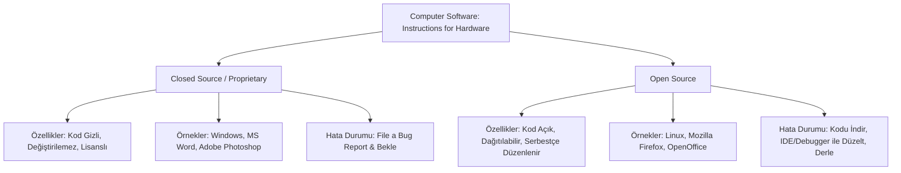

# 📚 Mesleki Yabancı Dil I — Hafta 2: Introduction to Software

## 1. Haftanın Lojistik & Sınav Taktikleri

> [!warning] **Sınav Formatı ve Kuralları**
> - **Soru Formatı:** Sınav kesinlikle İngilizce kompozisyon, klasik çeviri veya serbest yazma (*writing*) içermez. %100 çoktan seçmeli test formatındadır.
> - **Soru Şablonu:** Soru kökünde kavramın resmî İngilizce teknik tanımı (*formal definition*) verilir; şıklardan doğru terim istenir.
> - Sorumluluk tamamen **English 4 IT ünite kelimeleri ve metin içi teknik terimler** üzerindedir.

> [!tip] **Sınav Tüyoları & Çeldirici Uyarıları**
> - **Hata Terminolojisi Karışıklığı (`Bug` vs `Error` vs `Crash`):**
>   - Tanımda `"an error in a computer program"` görüyorsanız cevap: **`bug`**.
>   - Tanımda `"an incorrect action attributable to poor judgment, ignorance, or inattention"` (insan hatası/yanlış eylem) görüyorsanız cevap: **`error`**.
>   - Tanımda `"a computer failure due to faulty hardware or a serious software bug"` (sistemik çökme/donanım-yazılım kilitlenmesi) görüyorsanız cevap: **`crash`**.
> - **Yazılım Başlatma Fiilleri (`Execute` vs `Run` vs `Launch` vs `Boot`):**
>   - Teknik açıdan en doğru ve resmî kabul edilen terim **`execute`** fiilidir. Soru kökünde *"to start a program on a computer"* ifadesi varsa doğrudan `execute` aranmalıdır.
>   - Eğer soru kökünde *"when the software in question is an operating system"* (işletim sistemi başlatma/önyükleme) vurgusu varsa cevap: **`boot`**.
> - **Programı Sonlandırma (`Abort`):**
>   - Tanımda *"to end a program or a process before its completion"* (bir programı veya süreci tamamlanmadan önce zorla durdurmak) kalıbı geçerse işaretlenecek terim: **`abort`**.
> - **Özellik Kavramı (`Feature`):**
>   - Tanımda *"something a computer program is 'supposed' to do"* kalıbı doğrudan **`feature`** terimini işaret eder.
> - **Lisans Modelleri (`Closed Source / Proprietary` vs `Open Source`):**
>   - Kaynak kodun görüntülenemediği ve değiştirilemediği (*cannot see, edit, or manipulate*) durumlar: **`closed source`** veya **`proprietary`**.
>   - Kodun serbestçe dağıtıldığı ve sınırsızca değiştirilebildiği (*distributed, allowing programmers to alter and change*) durumlar: **`open source`**.

---

## 📖 2. Okuma & Dinleme Metni (Reading & Listening)

### Introduction to Computer Software

| İngilizce Orijinal Cümle | Türkçe Akademik Çevirisi |
| :--- | :--- |
| For as long as there has been computer hardware, there has also been computer software. | Bilgisayar donanımı var olduğundan beri, bilgisayar yazılımı da var olmuştur. |
| But what is software? | Peki yazılım nedir? |
| Software is just instructions written by a programmer which tells the computer what to do. | Yazılım; bir programcı tarafından yazılan ve bilgisayara ne yapması gerektiğini söyleyen yönergelerden ibarettir. |
| Programmers are also known as 'software developers', or just plain 'developers'. | Programcılar; 'yazılım geliştiricileri' veya yalnızca 'geliştiriciler' olarak da bilinirler. |
| Nothing much is simple about software. | Yazılıma dair pek az şey basittir. |
| Software programs can have millions of lines of code. | Yazılım programları milyonlarca kod satırına sahip olabilir. |
| If one line doesn't work, the whole program could break! | Şayet tek bir satır dahi çalışmazsa, tüm program bozulabilir! |
| Even the process of starting software goes by many different names in English. | Yazılımı başlatma işlemi bile İngilizcede birçok farklı isimle anılır. |
| Perhaps the most correct technical term is 'execute', as in "the man executed the computer program." | Belki de en doğru teknik terim, "adam bilgisayar programını çalıştırdı" cümlesinde olduğu gibi 'execute' (çalıştırmak/icra etmek) fiilidir. |
| Be careful, because the term 'execute' also means (in another context) to put someone to death! | Dikkatli olun; çünkü 'execute' terimi (farklı bir bağlamda) birini idama mahkûm etmek/infaz etmek anlamına da gelir! |
| Some other common verbs used to start a software program you will hear are 'run', 'launch', and even 'boot' (when the software in question is an operating system). | Bir yazılımı başlatmak için duyacağınız diğer yaygın fiiller 'run', 'launch' ve hatta (söz konusu yazılım bir işletim sistemi olduğunda) 'boot'tur. |
| Software normally has both features and bugs. Hopefully more of the former than the latter! | Yazılımlar normal şartlarda hem özelliklere (features) hem de hatalara (bugs) sahiptir. Umarız birincisi ikincisinden daha fazladır! |
| When software has a bug there are a few things that can happen. | Bir yazılımda hata meydana geldiğinde gerçekleşebilecek birkaç durum vardır. |
| The program can crash and terminate with a confusing message. This is not good. | Program çökebilir ve kafa karıştırıcı bir mesajla sonlanabilir. Bu iyi bir durum değildir. |
| End users do not like confusing error messages such as: "Site error: the file ... requires the ionCube PHP Loader ... to be installed by the site administrator." | Son kullanıcılar; karmaşık hata bildirimlerini sevmezler. |
| Sometimes when software stops responding you are forced to manually abort the program yourself by pressing some strange combination of keys such as ctrl-alt-delete. | Bazen yazılım yanıt vermeyi kestiğinde, ctrl-alt-delete gibi tuhaf bir tuş kombinasyonuna basarak programı manuel olarak durdurmak (abort) zorunda kalırsınız. |
| Because of poor usability, documentation, and strange error messages, programming still seems very mysterious to most people. | Düşük kullanılabilirlik, yetersiz dokümantasyon ve anlaşılması güç hata iletileri yüzünden programlama birçok insana hâlâ çok gizemli gelmektedir. |
| That's too bad, because it can be quite fun and rewarding to write software. | Bu talihsiz bir durumdur; çünkü yazılım yazmak son derece keyifli ve tatmin edici olabilir. |
| To succeed, you just have to take everything in small steps, think very hard, and never give up. | Başarılı olmak için her şeyi küçük adımlarla ele almalı, derinlemesine düşünmeli ve asla vazgeçmemelisiniz. |
| I think everyone studying Information Technology should learn at least one programming language and write at least one program. | Bence Bilişim Teknolojileri (BT) eğitimi alan herkes en az bir programlama dili öğrenmeli ve en az bir program yazmalıdır. |
| Why? Programming forces you to think like a computer. | Neden? Programlama yapmak sizi bir bilgisayar gibi düşünmeye zorlar. |
| This can be very rewarding when dealing with a wide range of IT-related issues from tech support to setting up PPC (pay-per-click) advertising campaigns for a client's web site. | Bu disiplin; teknik destekten bir müşterinin web sitesi için PPC (tıklama başına ödeme) reklam kampanyaları kurmaya kadar geniş bir BT yelpazesiyle ilgilenirken oldukça faydalı olabilir. |
| Also, as an IT professional, you will be dealing with programmers on a daily basis. | Ayrıca bir BT uzmanı olarak programcılarla günlük düzeyde iletişimde ve iş birliğinde olacaksınız. |
| Having some understanding of the work they do will help you get along with them better. | Yaptıkları iş hakkında fikir sahibi olmak, onlarla daha iyi anlaşmanıza ve uyum sağlamanıza yardımcı olacaktır. |
| Software programs are normally written and compiled for certain hardware platforms. | Yazılım programları normalde belirli donanım platformları için yazılır ve derlenir (compiled). |
| It is very important that the software is compatible with all the components of the computer. | Yazılımın, bilgisayarın tüm bileşenleriyle uyumlu (compatible) olması hayati önem taşır. |
| For instance, you cannot run software written for a Windows computer on a Macintosh computer or a Linux computer. | Örneğin, bir Windows bilgisayarı için yazılmış bir yazılımı Macintosh veya Linux bilgisayarda doğrudan çalıştıramazsınız. |
| Actually, you can, but you need to have special emulation software or a virtual machine installed. | Aslında çalıştırabilirsiniz; ancak özel bir emülasyon yazılımına veya sanal makineye (virtual machine) sahip olmanız gerekir. |
| Even with this special software installed, it is still normally best to run a program on the kind of computer for which it was intended. | Bu özel yazılımlar kurulu olsa dahi, bir programı tasarlandığı özgün bilgisayar mimarisinde çalıştırmak normal şartlarda en iyisidir. |
| There are two basic kinds of software you need to learn about as an IT professional. | Bir BT uzmanı olarak öğrenmeniz gereken iki temel yazılım türü vardır. |
| The first is closed source or proprietary software, which you are not free to modify and improve. | Birincisi; değiştirme ve geliştirme özgürlüğünüzün bulunmadığı kapalı kaynaklı veya tescilli/özel mülk (proprietary) yazılımlardır. |
| An example of this kind of software is Microsoft Windows or Adobe Photoshop. | Bu tür yazılımlara örnek olarak Microsoft Windows veya Adobe Photoshop verilebilir. |
| This software model is so popular that some people believe it's the only model there is. | Bu yazılım modeli öylesine yaygındır ki bazı insanlar var olan tek modelin bu olduğuna inanır. |
| But there's a whole other world of software out there. | Fakat dışarıda bambaşka bir yazılım dünyası daha bulunmaktadır. |
| The other kind of software is called open source software, which is normally free to use and modify (with some restrictions of course). | Diğer yazılım türü ise açık kaynaklı yazılım (open source) olarak adlandırılır ve (bazı kısıtlamalar saklı kalmak kaydıyla) kullanımı ve değiştirilmesi serbesttir. |
| Examples of this type of software include most popular programming languages, operating systems such as Linux, and thousands of applications such as Mozilla Firefox and Open Office. | Bu tür yazılımlara örnek olarak en popüler programlama dilleri, Linux gibi işletim sistemleri ve Mozilla Firefox ile Open Office gibi binlerce uygulama sayılabilir. |
| But what is the real difference between open source and closed source software? Is open source software just about saving money? Let's investigate. | Peki açık kaynak ile kapalı kaynak arasındaki asıl fark nedir? Açık kaynak yazılım yalnızca para tasarrufundan mı ibarettir? İnceleyelim. |
| Let's say for instance you find a bug in the latest version of Mozilla Firefox. The bug is causing a major project to fail and you need to fix it right away. | Diyelim ki Mozilla Firefox'un en güncel sürümünde bir kod hatası (bug) buldunuz. Bu hata kritik bir projenin çökmesine yol açıyor ve derhal düzeltmeniz gerekiyor. |
| Step 1. Download and unzip (or uncompress) the source code from Mozilla. | **Adım 1:** Mozilla'dan kaynak kodunu indirin ve arşivden/sıkıştırmadan çıkarın (unzip/uncompress). |
| Step 2. Use an Integrated Development Environment (IDE) and a debugger to find and fix the bug in the source code. | **Adım 2:** Kaynak koddaki hatayı bulup düzeltmek için bir Tümleşik Geliştirme Ortamı (IDE) ve bir hata ayıklayıcı (debugger) kullanın. |
| Please note that you will need to know a little C++ to debug applications such as this. | Bu tür uygulamalarda hata ayıklamak için biraz C++ bilmeniz gerekeceğini unutmayın. |
| Step 3. Test the fix and then use a compiler to turn the source code into a binary file. | **Adım 3:** Yapılan düzeltmeyi test edin ve ardından kaynak kodu ikili bir dosyaya (binary file) dönüştürmek için bir derleyici (compiler) kullanın. |
| This can take a long time for big programs. Once the source code is compiled then the program should work! | Büyük programlar için bu süreç uzun sürebilir. Kaynak kod derlendiğinde program sorunsuz çalışmalıdır! |
| Step 4. You are almost done. Now send the bug fix back to the Mozilla Firefox team. They may even use your bug fix in the next release! | **Adım 4:** Neredeyse tamamladınız. Şimdi hata düzeltmesini Mozilla Firefox ekibine geri gönderin. Bu düzeltmenizi bir sonraki genel sürümde (release) dahi kullanabilirler! |
| Now imagine you find a bug in a proprietary code base such as Microsoft Word. What can you do? | Şimdi ise Microsoft Word gibi tescilli/kapalı bir kod tabanında bir hata bulduğunuzu hayal edin. Ne yapabilirsiniz? |
| Not much, just file a bug report and hope someone fixes it at some point. | Pek bir şey değil; sadece bir hata raporu (bug report) oluşturur ve birilerinin ilerleyen bir süreçte bunu düzeltmesini umarsınız. |
| This is a rather radical example, but I think it illustrates to a large degree why programmers generally prefer open source software to closed source alternatives. | Bu oldukça radikal bir örnektir; ancak programcıların açık kaynaklı yazılımları kapalı kaynaklı alternatiflere neden tercih ettiklerini büyük ölçüde açıklamaktadır. |
| Good programmers love code and they want access to it. Hiding the code from a programmer is like hiding the car engine from an auto mechanic. | İyi programcılar kodu severler ve ona doğrudan erişmek isterler. Kodu bir programcıdan saklamak, otomobil motorunu bir oto tamircisinden gizlemek gibidir. |
| We don't like it! | Biz bunu sevmeyiz! |

---

### ⚙️ Metindeki Temel Prensipler / Kurallar

1. **Açık Kaynak Hata Düzeltme Aşamaları (4-Step Bug Fixing Process):**
   - **Step 1:** Kaynak kodun sıkıştırılmış halden çıkarılması (`Download and unzip/uncompress source code`).
   - **Step 2:** IDE ve Debugger kullanarak mantıksal hatanın tespiti ve onarılması (`Use IDE and debugger`).
   - **Step 3:** Derleyici ile kaynak kodun çalıştırılabilir ikili koda dönüştürülmesi (`Use compiler to turn into binary file`).
   - **Step 4:** Düzeltmenin ana depoya/topluluğa geri iletilmesi (`Send bug fix back for the next release`).

2. **YBS / BT Uzmanlarının Kodlama Öğrenmesi İçin 3 Temel Gerekçe:**
   - **Algoritmik Zihin Yapısı:** Kişiyi bilgisayar gibi sistematik ve katı mantıkla düşünmeye zorlar (`forces you to think like a computer`).
   - **Geniş Çözüm Yelpazesi:** Teknik destekten, PPC (*Pay-Per-Click*) dijital pazarlama kampanyalarının teknik altyapısını kurmaya kadar süreç hâkimiyeti sağlar.
   - **Yazılımcılarla İletişim:** BT uzmanları günlük mesailerinde programcılarla doğrudan çalışırlar (`dealing with programmers on a daily basis`); onların çalışma mantığını kavramak iş birliğini güçlendirir.

---

## 🔑 3. Temel Terimler Sözlüğü (Core IT Vocabulary)

### `abort`
- **Türkçe Anlamı:** İptal etmek, işlemi yarıda kesmek, zorla sonlandırmak.
- **Resmi İngilizce Tanım:** To end a program or a process before its completion.
- **Türkçe Açıklaması:** Bir yazılımın veya işlemin normal döngüsünü tamamlamasını beklemeden, kullanıcı müdahalesiyle veya hata sonucu zorunlu olarak durdurulmasıdır.
- **Örnek Cümle & Çevirisi:** *"When the word processor application crashed, the user had to abort the program and lose all his unsaved changes."* (Kelime işlemci uygulaması çöktüğünde, kullanıcı programı iptal edip sonlandırmak zorunda kaldı ve kaydedilmemiş tüm değişikliklerini kaybetti.)
> [!tip] **Sınavda Yakalama Noktası (Trigger Words):**
> Soru kökünde **`"to end a program or a process before its completion"`** veya **`"stops responding... manually"`** kalıbı geçerse doğrudan **`abort`** seçilmelidir.

---

### `bug`
- **Türkçe Anlamı:** Yazılım hatası, program kusuru.
- **Resmi İngilizce Tanım:** An error in a computer program.
- **Türkçe Açıklaması:** Yazılım kodundaki mantıksal, sözdizimsel veya işlevsel bir eksiklik yüzünden programın hatalı davranması veya beklenmedik sonuçlar üretmesidir.
- **Örnek Cümle & Çevirisi:** *"An average developer will create one bug for every 10 lines of code written."* (Ortalama bir geliştirici, yazdığı her 10 kod satırı için bir hata üretecektir.)
> [!tip] **Sınavda Yakalama Noktası (Trigger Words):**
> Soru kökünde doğrudan **`"an error in a computer program"`** tanımı verilir. `error` ile karıştırmayın; bilgisayar programının içindeki hatayı niteleyen terim **`bug`**'dır.

---

### `closed source`
- **Türkçe Anlamı:** Kapalı kaynak kodlu yazılım.
- **Resmi İngilizce Tanım:** Software in which the license stipulates that the user cannot see, edit, or manipulate the source code of a software program.
- **Türkçe Açıklaması:** Lisans anlaşması gereğince kaynak kodları gizli tutulan, kullanıcının kodları incelemesine, düzenlemesine veya dağıtmasına yasal ve teknik olarak izin verilmeyen yazılım modelidir.
- **Örnek Cümle & Çevirisi:** *"I wanted to develop a new feature for the program, but I couldn't because it was closed source."* (Program için yeni bir özellik geliştirmek istedim fakat kapalı kaynak olduğu için yapamadım.)
> [!tip] **Sınavda Yakalama Noktası (Trigger Words):**
> **`"license stipulates"`**, **`"cannot see, edit, or manipulate the source code"`** ifadeleri görüldüğünde cevap **`closed source`** (veya bağlama göre `proprietary`) olmalıdır.

---

### `compatible`
- **Türkçe Anlamı:** Uyumlu.
- **Resmi İngilizce Tanım:** Capable of being used without modification.
- **Türkçe Açıklaması:** Bir donanım veya yazılım parçasının, hiçbir ek düzenleme veya modifikasyona ihtiyaç duymadan mevcut sistem bileşenleriyle sorunsuz çalışabilme yeteneğidir.
- **Örnek Cümle & Çevirisi:** *"The IBM 360 was the first commercially successful computer family with a wide range of compatible parts."* (IBM 360, geniş uyumlu parçalar yelpazesine sahip, ticari olarak başarılı ilk bilgisayar ailesiydi.)
> [!tip] **Sınavda Yakalama Noktası (Trigger Words):**
> Tanımda yer alan **`"capable of being used without modification"`** kalıbı doğrudan **`compatible`** kelimesini verir.

---

### `crash`
- **Türkçe Anlamı:** Sistemik çökme, kilitlenme.
- **Resmi İngilizce Tanım:** A computer failure due to faulty hardware or a serious software bug.
- **Türkçe Açıklaması:** Ciddi bir yazılım hatası veya arızalı bir donanım bileşeni sebebiyle bilgisayarın ya da uygulamanın aniden çalışmayı durdurması ve yanıt vermez hale gelmesidir.
- **Örnek Cümle & Çevirisi:** *"The user was advised to reboot the computer after a serious crash in which the computer no longer responded."* (Bilgisayarın artık yanıt vermediği ciddi bir çökme sonrasında kullanıcıya bilgisayarı yeniden başlatması önerildi.)
> [!tip] **Sınavda Yakalama Noktası (Trigger Words):**
> Soru kökündeki **`"a computer failure"`** ve **`"faulty hardware or a serious software bug"`** ifadeleri `crash` teriminin mutlak tetikleyicileridir.

---

### `end user`
- **Türkçe Anlamı:** Son kullanıcı.
- **Resmi İngilizce Tanım:** A person who uses a product or service on a computer.
- **Türkçe Açıklaması:** Bir yazılım veya bilişim sistemini geliştiren, tasarlayan veya bakımını yapan teknik ekip değil; sistemi günlük işleri için fiilen tüketen/kullanan nihai kişidir.
- **Örnek Cümle & Çevirisi:** *"Developers must maintain a close relationship with end users if they want to have a successful career."* (Geliştiriciler başarılı bir kariyere sahip olmak istiyorlarsa son kullanıcılarla yakın bir ilişki sürdürmelidirler.)
> [!tip] **Sınavda Yakalama Noktası (Trigger Words):**
> Soru kökündeki **`"a person who uses a product or service on a computer"`** cümlesi doğrudan **`end user`** terimine aittir.

---

### `error`
- **Türkçe Anlamı:** Hata, yanlış işlem.
- **Resmi İngilizce Tanım:** An incorrect action attributable to poor judgment, ignorance, or inattention.
- **Türkçe Açıklaması:** Bilgisizlik, dikkatsizlik, ihmal veya yanlış muhakeme neticesinde ortaya çıkan uygunsuz veya hatalı eylemdir.
- **Örnek Cümle & Çevirisi:** *"The computer reported a 'division by zero' error and automatically aborted the program."* (Bilgisayar 'sıfıra bölünme' hatası bildirdi ve programı otomatik olarak sonlandırdı.)
> [!tip] **Sınavda Yakalama Noktası (Trigger Words):**
> **`"incorrect action"`**, **`"poor judgment"`**, **`"ignorance"`** veya **`"inattention"`** kelimeleri `error` terimini açık eder.

---

### `execute`
- **Türkçe Anlamı:** Çalıştırmak, icra etmek.
- **Resmi İngilizce Tanım:** To start a program on a computer.
- **Türkçe Açıklaması:** Bir bilgisayar programını belleğe yükleyip işletim sistemi üzerinde aktif olarak çalıştırma eylemidir. Teknik bağlamda en doğru başlangıç fiilidir.
- **Örnek Cümle & Çevirisi:** *"The program was set to execute every night at midnight."* (Program, her gece yarısı çalıştırılacak şekilde ayarlandı.)
> [!tip] **Sınavda Yakalama Noktası (Trigger Words):**
> Tanım kökündeki **`"to start a program on a computer"`** ifadesi ile metindeki **`"most correct technical term"`** vurgusu doğrudan **`execute`** fiilini işaret eder.

---

### `feature`
- **Türkçe Anlamı:** Özellik, işlev.
- **Resmi İngilizce Tanım:** Something a computer program is "supposed" to do; these are often reasons to use a particular program or upgrade to a more recent version.
- **Türkçe Açıklaması:** Bir yazılımın yapması tasarlanan ve beklenen görevlerdir. Kullanıcıların bir yazılımı tercih etme ya da üst sürüme yükseltme gerekçesini oluşturur.
- **Örnek Cümle & Çevirisi:** *"The man upgraded his copy of Word because of a new feature that allowed him to spell-check documents in Spanish."* (Adam, İspanyolca belgeleri denetlemesine olanak tanıyan yeni bir özellik nedeniyle Word kopyasını yükseltti.)
> [!tip] **Sınavda Yakalama Noktası (Trigger Words):**
> Hocanın ders transkriptinde altını çizdiği üzere: Soru kökünde **`"supposed to do"`** veya **`"reasons to use... or upgrade"`** ifadeleri görüldüğünde cevap kesinlikle **`feature`**'dır.

---

### `open source`
- **Türkçe Anlamı:** Açık kaynak kodlu.
- **Resmi İngilizce Tanım:** A program in which the code is distributed allowing programmers to alter and change the original software as much as they like.
- **Türkçe Açıklaması:** Kaynak kodları genel erişime açık tutulan; geliştiricilerin kodu incelemesine, değiştirmesine ve diledikleri gibi geliştirmesine izin veren yazılım paradigmasıdır.
- **Örnek Cümle & Çevirisi:** *"The article stated that many programmers prefer open source solutions because they can modify features and fix bugs without waiting for an upgrade or patch from the manufacturer."* (Makale; birçok programcının üreticiden bir yama veya yükseltme beklemeden özellikleri değiştirebildikleri ve hataları düzeltebildikleri için açık kaynaklı çözümleri tercih ettiğini belirtti.)
> [!tip] **Sınavda Yakalama Noktası (Trigger Words):**
> Soru kökünde **`"code is distributed"`** ve özellikle **`"allowing programmers to alter and change"`** kalıbı doğrudan **`open source`** seçeneğini verir.

---

### `programmer` (Software Developer)
- **Türkçe Anlamı:** Programcı, yazılım geliştirici.
- **Resmi İngilizce Tanım:** A person who writes or modifies computer programs or applications.
- **Türkçe Açıklaması:** Bilgisayar sistemlerinin ve uygulamalarının kaynak kodlarını tasarlayan, yazan, test eden ve hata ayıklama işlemlerini yürüten teknik uzmandır.
- **Örnek Cümle & Çevirisi:** *"The software company needed to hire three new programmers to help debug their flagship application."* (Yazılım şirketinin, amiral gemisi uygulamalarındaki hataları ayıklamaya yardımcı olacak üç yeni programcı istihdam etmesi gerekiyordu.)
> [!tip] **Sınavda Yakalama Noktası (Trigger Words):**
> **`"a person who writes or modifies computer programs"`** tanımı doğrudan **`programmer`** kelimesini işaret eder.

---

### `proprietary`
- **Türkçe Anlamı:** Tescilli, mülk, özel mülkiyete ait teknoloji.
- **Resmi İngilizce Tanım:** Privately developed and owned technology.
- **Türkçe Açıklaması:** Bir kişi veya şirketin yasal mülkiyeti altında bulunan; kaynak kodları gizli tutulan ve izinsiz dağıtımı, kullanımı ya da üzerinde değişiklik yapılması yasalarla engellenen teknolojidir.
- **Örnek Cümle & Çevirisi:** *"Because of proprietary code, you may not modify or redistribute the source code of Windows or Macintosh operating systems."* (Tescilli kod sebebiyle, Windows veya Macintosh işletim sistemlerinin kaynak kodunu değiştiremez ya da yeniden dağıtamazsınız.)
> [!tip] **Sınavda Yakalama Noktası (Trigger Words):**
> **`"privately developed and owned technology"`** tanımı sınavda **`proprietary`** şıkkını netleştirir.

---

### 🧩 Tamamlayıcı Teknik Terimler

- **`compile / compiler`:** Kaynak kodu (*source code*) bilgisayar donanımının anlayacağı ikili makine koduna (*binary file*) dönüştüren yazılımdır.
- **`debugger`:** Kaynak koddaki mantıksal veya teknik hataları (*bugs*) bulmak ve düzeltmek için kullanılan yazılımdır.
- **`IDE (Integrated Development Environment)`:** Kod editörü, derleyici ve hata ayıklayıcıyı tek çatı altında toplayan Tümleşik Geliştirme Ortamıdır.
- **`boot`:** İşletim sisteminin donanım tarafından belleğe yüklenerek başlatılması sürecidir.
- **`virtual machine / emulation`:** Bir işletim sistemi içinde başka bir işletim sistemini taklit ederek çalıştırmaya yarayan sanal sistemdir.

---

## ⚖️ 4. Kavram Hiyerarşisi ve Karşılaştırmalar (Mermaid / Tablo)

### Yazılım Modelleri ve Mimarisi

### Yazılım Hata Terminolojisi Karşılaştırması

| Terim | Tanım Odak Noktası | Kaynağı / Sebebi | Sonuç / Eylem |
| :--- | :--- | :--- | :--- |
| **`bug`** | Kod hatası (*an error in a computer program*) | Geliştirici mantık/yazım hatası | Programın hatalı çalışması, donması veya çökmesi |
| **`error`** | Hatalı eylem (*incorrect action*) | Bilgisizlik, dikkatsizlik (*inattention, poor judgment*) | Sistemik işlem hatası (*division by zero vb.*) |
| **`crash`** | Sistemin durması (*a computer failure*) | Ciddi bir bug veya donanım arızası | Programın kapanması, sistemin yeniden başlatılma zorunluluğu |
| **`abort`** | Sürecin yarıda kesilmesi (*to end before completion*) | Programın yanıt vermemesi / sistem kilitlenmesi | Kullanıcının manuel müdahalesi (*Ctrl+Alt+Delete*) |

### Yazılım Başlatma Fiilleri Karşılaştırması

| Fiil | Kullanım Bağlamı | Hocanın Sınav Değerlendirmesi |
| :--- | :--- | :--- |
| **`execute`** | Bir bilgisayar programını genel anlamda çalıştırmak | **En doğru teknik terim.** Soru kökünde *"to start a program"* görürseniz ilk tercih. |
| **`boot`** | İşletim sistemini başlatmak / önyüklemek | Soru kökünde *"when the software is an operating system"* şartı aranır. |
| **`run` / `launch`** | Genel kullanımda bir uygulamayı açmak | Günlük dilde yaygın, teknik sınavlarda genellikle çeldirici olarak verilir. |

---

## 📝 5. Sınav Simülatörü (Hocanın Soru Formatında Test)

**1.** Which of the following is defined as **"an error in a computer program"**?  
A) crash  
B) abort  
C) bug  
D) feature  
E) component  

**2.** The formal technical definition **"to end a program or a process before its completion"** refers to which term?  
A) boot  
B) execute  
C) compile  
D) abort  
E) debug  

**3.** A computer software license stipulates that the user cannot see, edit, or manipulate the source code. This type of software is best described as:  
A) Open source software  
B) Closed source software  
C) Peripheral software  
D) Compatible software  
E) System emulation  

**4.** Which term describes **"a computer failure due to faulty hardware or a serious software bug"**?  
A) crash  
B) error  
C) execute  
D) feature  
E) network  

**5.** In technical terminology, something that a computer program is **"supposed" to do**, which often serves as a reason to upgrade to a more recent version, is called a:  
A) bug  
B) platform  
C) feature  
D) compiler  
E) driver  

**6.** What is the most correct technical verb used **"to start a program on a computer"**?  
A) abort  
B) execute  
C) debug  
D) uncompress  
E) stipulate  

**7.** Technology that is **"privately developed and owned"**, preventing unauthorized alteration or redistribution of its underlying code, is referred to as:  
A) open source  
B) compatible  
C) proprietary  
D) virtual  
E) peripheral  

**8.** An **"incorrect action attributable to poor judgment, ignorance, or inattention"** is technically defined as an:  
A) error  
B) execute  
C) application  
D) end user  
E) IDE  

---

### 🗝️ Cevap Anahtarı ve Tetikleyici Analizi

1. **C (`bug`)** — *Tetikleyici:* Soru kökündeki `"an error in a computer program"` doğrudan `bug` teriminin resmi tanımıdır.
2. **D (`abort`)** — *Tetikleyici:* `"to end a program... before its completion"` kalıbı sürecin tamamlanmadan sonlandırılmasını ifade eder.
3. **B (`closed source`)** — *Tetikleyici:* `"cannot see, edit, or manipulate the source code"` ifadesi kapalı kaynak kod modelini tanımlar.
4. **A (`crash`)** — *Tetikleyici:* `"a computer failure due to faulty hardware or serious bug"` sistemin çökmesini yani `crash` durumunu belirtir.
5. **C (`feature`)** — *Tetikleyici:* Hocanın özellikle vurguladığı `"supposed to do"` ve `"upgrade to a recent version"` kalıpları `feature` terimine aittir.
6. **B (`execute`)** — *Tetikleyici:* `"to start a program on a computer"` tanımı ve metindeki "most correct technical term" tüyosu `execute` fiilini gerektirir.
7. **C (`proprietary`)** — *Tetikleyici:* `"privately developed and owned technology"` ifadesi tescilli/mülk teknoloji (`proprietary`) tanımıdır.
8. **A (`error`)** — *Tetikleyici:* İnsan kaynaklı dikkatsizlik ve muhakeme eksikliğini belirten `"incorrect action attributable to poor judgment, ignorance, or inattention"` doğrudan `error` terimidir.

{
  "title": "Unit 1 English for Information Technology Crossword Puzzle",
  "dimensions": {
    "rows": 13,
    "cols": 14
  },
  "grid": [
    [" ", " ", "C", " ", " ", " ", " ", " ", " ", " ", " ", " ", " ", " "],
    [" ", " ", "O", " ", " ", " ", " ", "I", " ", " ", " ", " ", " ", " "],
    ["H", " ", "M", " ", " ", " ", " ", "N", " ", " ", " ", " ", " ", " "],
    ["A", "P", "P", "L", "I", "C", "A", "T", "I", "O", "N", " ", " ", " "],
    ["R", " ", "U", " ", " ", " ", " ", "E", " ", " ", " ", " ", " ", " "],
    ["D", "A", "T", "A", " ", " ", " ", "R", " ", " ", " ", " ", " ", " "],
    ["W", " ", "E", " ", " ", " ", " ", "N", "E", "T", "W", "O", "R", "K"],
    ["A", " ", "R", " ", " ", " ", " ", "E", " ", " ", " ", " ", " ", " "],
    ["R", " ", " ", " ", "S", "O", "F", "T", "W", "A", "R", "E", " ", " "],
    ["E", " ", " ", " ", " ", " ", " ", " ", " ", " ", " ", " ", " ", " "],
    ["D", "A", "T", "A", "B", "A", "S", "E", " ", " ", " ", " ", " ", " "],
    ["P", "E", "R", "I", "P", "H", "E", "R", "A", "L", " ", " ", " ", " "],
    ["C", "O", "M", "P", "O", "N", "E", "N", "T", " ", " ", " ", " ", " "]
  ],
  "words": [
    {
      "word": "COMPUTER",
      "direction": "VERTICAL_TTB",
      "start": [0, 2],
      "end": [7, 2],
      "path": [[0, 2], [1, 2], [2, 2], [3, 2], [4, 2], [5, 2], [6, 2], [7, 2]]
    },
    {
      "word": "INTERNET",
      "direction": "VERTICAL_TTB",
      "start": [1, 7],
      "end": [8, 7],
      "path": [[1, 7], [2, 7], [3, 7], [4, 7], [5, 7], [6, 7], [7, 7], [8, 7]]
    },
    {
      "word": "HARDWARE",
      "direction": "VERTICAL_TTB",
      "start": [2, 0],
      "end": [9, 0],
      "path": [[2, 0], [3, 0], [4, 0], [5, 0], [6, 0], [7, 0], [8, 0], [9, 0]]
    },
    {
      "word": "APPLICATION",
      "direction": "HORIZONTAL_LTR",
      "start": [3, 0],
      "end": [3, 10],
      "path": [[3, 0], [3, 1], [3, 2], [3, 3], [3, 4], [3, 5], [3, 6], [3, 7], [3, 8], [3, 9], [3, 10]]
    },
    {
      "word": "DATA",
      "direction": "HORIZONTAL_LTR",
      "start": [5, 0],
      "end": [5, 3],
      "path": [[5, 0], [5, 1], [5, 2], [5, 3]]
    },
    {
      "word": "NETWORK",
      "direction": "HORIZONTAL_LTR",
      "start": [6, 7],
      "end": [6, 13],
      "path": [[6, 7], [6, 8], [6, 9], [6, 10], [6, 11], [6, 12], [6, 13]]
    },
    {
      "word": "SOFTWARE",
      "direction": "HORIZONTAL_LTR",
      "start": [8, 4],
      "end": [8, 11],
      "path": [[8, 4], [8, 5], [8, 6], [8, 7], [8, 8], [8, 9], [8, 10], [8, 11]]
    },
    {
      "word": "DATABASE",
      "direction": "HORIZONTAL_LTR",
      "start": [10, 0],
      "end": [10, 7],
      "path": [[10, 0], [10, 1], [10, 2], [10, 3], [10, 4], [10, 5], [10, 6], [10, 7]]
    },
    {
      "word": "PERIPHERAL",
      "direction": "HORIZONTAL_LTR",
      "start": [11, 0],
      "end": [11, 9],
      "path": [[11, 0], [11, 1], [11, 2], [11, 3], [11, 4], [11, 5], [11, 6], [11, 7], [11, 8], [11, 9]]
    },
    {
      "word": "COMPONENT",
      "direction": "HORIZONTAL_LTR",
      "start": [12, 0],
      "end": [12, 8],
      "path": [[12, 0], [12, 1], [12, 2], [12, 3], [12, 4], [12, 5], [12, 6], [12, 7], [12, 8]]
    }
  ]
}