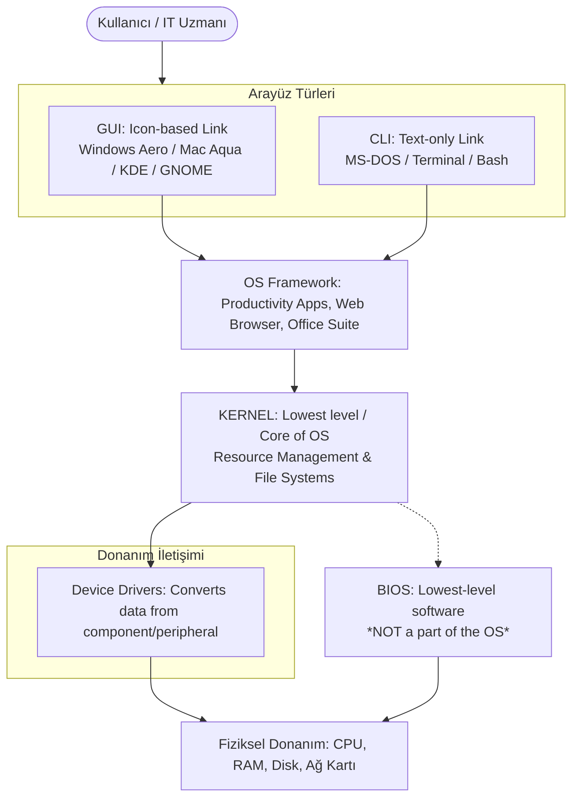

# Mesleki Yabancı Dil I | Unit 3: Learning About Operating Systems


> [!tip] Sınav Tüyoları ve Çeldiriciler
> 1. **Kernel vs. BIOS Çelişkisi:** Kernel (çekirdek), işletim sisteminin en alt seviyedeki çekirdeğidir (*lowest level or core OF THE OS*). BIOS ise Kernel'dan da alt seviyededir ancak **işletim sisteminin bir parçası DEĞİLDİR** (*isn't really a part of the OS*). Soru kökünde "not a part of the OS" geçerse cevap BIOS'tur.
> 2. **CLI vs. GUI Ayrımı:**
>    - `Text-only link` $\rightarrow$ **CLI (Command Line Interface)**
>    - `Icon-based link` $\rightarrow$ **GUI (Graphical User Interface)**
> 3. **Eş Anlamlı Eylemler:** 
>    - `Log on` $=$ `Sign in` (*kullanıcı adı ve şifreyle sisteme/kaynağa erişmek*)
>    - `Log off` $=$ `Sign out` (*bağlantıyı veya oturumu sonlandırmak*)
>    Hoca derste her iki formun da sınavlarda birbirinin yerine kullanılabileceğini dile getirdi.
> 4. **Convergence (Yakınsama / Kümelenme):** Temel işletim sistemi kurulumuna not defteri, hesap makinesi, web tarayıcısı, ses kayıt edici gibi harici programların dahil edilerek tek potada toplanması kavramıdır.
> 	-  **con-** "birlikte, bir arada" + **vergere** "eğilmek, yönelmek" > **convergere** "bir noktaya doğru eğilmek/yönelmek" > **convergence** "yakınsama, birleşme, kesişim, çakışma". Farklı yönlerden gelen *şey*lerin aynı noktada buluşması, kesişmesi.
> 5. **X Window System (X11):** Unix sistemlerde KDE ve GNOME masaüstü ortamlarının **altında çalışan** (*underlying*) araç takımıdır.

---

## Okuma Metni ve Birebir Akademik Çevirisi

| İngilizce Orijinal Metin | Birebir Türkçe Çevirisi |
| :--- | :--- |
| **Learning About Operating Systems** | **İşletim Sistemlerini Öğrenmek** |
| An operating system is a generic term for the multitasking software layer that lets you perform a wide array of 'lower level tasks' with your computer. | İşletim sistemi, bilgisayarınızda geniş bir yelpazedeki "alt düzey görevleri" gerçekleştirmenize olanak tanıyan çok görevli yazılım katmanı için kullanılan genel bir terimdir. |
| By low-level tasks we mean: | Alt düzey görevlerden kastımız şunlardır: |
| • the ability to log on with a username and password | • bir kullanıcı adı ve parola ile oturum açma yeteneği |
| • log off the system and switch users | • sistemden çıkış yapma ve kullanıcı değiştirme |
| • format storage devices and set default levels of file compression | • depolama aygıtlarını biçimlendirme ve varsayılan dosya sıkıştırma düzeylerini ayarlama |
| • install and upgrade device drivers for new hardware | • yeni donanımlar için aygıt sürücülerini yükleme ve yükseltme |
| • install and launch applications such as word processors, games, etc. | • kelime işlemciler, oyunlar vb. uygulamaları yükleme ve başlatma |
| • set file permissions and hidden files | • dosya izinlerini ve gizli dosyaları ayarlama |
| • terminate misbehaving applications | • hatalı/düzensiz çalışan uygulamaları sonlandırma |
| A computer would be fairly useless without an OS, so today almost all computers come with an OS pre-installed. | Bir bilgisayar, bir işletim sistemi olmadan oldukça kullanışsız olurdu; bu nedenle günümüzde neredeyse tüm bilgisayarlar önceden yüklenmiş bir işletim sistemi ile birlikte gelir. |
| Before 1960, every computer model would normally have its own OS custom programmed for the specific architecture of the machine's components. | 1960'tan önce, her bilgisayar modeli normalde makinenin bileşenlerinin özel mimarisi için özel olarak programlanmış kendi işletim sistemine sahip olurdu. |
| Now it is common for an OS to run on many different hardware configurations. | Artık bir işletim sisteminin birçok farklı donanım yapılandırmasında çalışması yaygındır. |
| At the heart of an OS is the kernel, which is the lowest level, or core, of the operating system. | Bir işletim sisteminin kalbinde, işletim sisteminin en alt düzeyi veya merkezi olan çekirdek (kernel) yer alır. |
| The kernel is responsible for all the most basic tasks of an OS such as controlling the file systems and device drivers. | Çekirdek; dosya sistemlerini ve aygıt sürücülerini denetlemek gibi bir işletim sisteminin en temel görevlerinin tamamından sorumludur. |
| The only lower-level software than the kernel would be the BIOS, which isn't really a part of the operating system. We discuss the BIOS in more detail in another unit. | Çekirdekten daha alt düzeydeki tek yazılım, aslında işletim sisteminin bir parçası olmayan BIOS'tur. BIOS'u başka bir ünitede daha ayrıntılı ele alacağız. |
| The most popular OS today is Microsoft Windows, which has about 85% of the market share for PCs and about 30% of the market share for servers. | Günümüzde en popüler işletim sistemi, kişisel bilgisayarlar (PC) için pazar payının yaklaşık %85'ine ve sunucular için pazar payının yaklaşık %30'una sahip olan Microsoft Windows'tur. |
| But there are different types of Windows OSs as well. Some common ones still in use are Windows 98, Windows 2000, Windows XP, Windows Vista, and Windows Server. | Ancak Windows işletim sistemlerinin de farklı türleri bulunmaktadır. Halen kullanımda olan yaygın olanlardan bazıları Windows 98, Windows 2000, Windows XP, Windows Vista ve Windows Server'dır. |
| Each Windows OS is optimized for different users, hardware configurations, and tasks. | Her bir Windows işletim sistemi; farklı kullanıcılar, donanım yapılandırmaları ve görevler için optimize edilmiştir. |
| For instance Windows 98 would still run on a brand new PC you might buy today, but it's unlikely Vista would run on PC hardware originally designed to run Windows 98. | Örneğin, Windows 98 bugün satın alabileceğiniz yepyeni bir bilgisayarda yine de çalışabilir; ancak Vista'nın aslen Windows 98'i çalıştırmak üzere tasarlanmış bir bilgisayar donanımında çalışması pek olası değildir. |
| There are many more operating systems out there besides the various versions of Windows, and each one is optimized to perform some tasks better than others. | Çeşitli Windows sürümlerinin haricinde piyasada çok daha fazla işletim sistemi mevcuttur ve her biri bazı görevleri diğerlerinden daha iyi yerine getirmek üzere optimize edilmiştir. |
| Free BSD, Solaris, Linux and Mac OS X are some good examples of non-Windows operating systems. | FreeBSD, Solaris, Linux ve Mac OS X, Windows harici işletim sistemlerine iyi birer örnektir. |
| Geeks often install and run more than one OS on a single computer. This is possible with dual-booting or by using a virtual machine. | Bilgisayar meraklıları (geeks) genellikle tek bir bilgisayara birden fazla işletim sistemi kurar ve çalıştırır. Bu durum, çift önyükleme (dual-booting) veya sanal makine (VM) kullanılarak mümkündür. |
| Why? The reasons for this are varied and may include preferring one OS for programming, and another OS for music production, gaming, or accounting work. | Neden? Bunun nedenleri çeşitlidir ve programlama için bir işletim sistemini, müzik prodüksiyonu, oyun veya muhasebe işleri için başka bir işletim sistemini tercih etmeyi içerebilir. |
| An OS must have at least one kind of user interface. Today there are two major kinds of user interfaces in use, the command line interface (CLI) and the graphical user interface (GUI). | Bir işletim sisteminin en az bir tür kullanıcı arayüzü bulunmalıdır. Günümüzde kullanımda olan iki ana kullanıcı arayüzü türü vardır: Komut satırı arayüzü (CLI) ve grafiksel kullanıcı arayüzü (GUI). |
| Right now you are most likely using a GUI interface, but your system probably also contains a command line interface as well. | Şu anda büyük olasılıkla bir GUI arayüzü kullanmaktasınız; ancak sisteminiz muhtemelen bir komut satırı arayüzü de barındırmaktadır. |
| Typically speaking, GUIs are intended for general use and CLIs are intended for use by computer engineers and system administrators. | Genel olarak ifade etmek gerekirse; GUI'ler genel kullanıma, CLI'lar ise bilgisayar mühendisleri ve sistem yöneticilerinin kullanımına yöneliktir. |
| Although some engineers only use GUIs and some diehard geeks still use a CLI even to type an email or a letter. | Yine de bazı mühendisler yalnızca GUI kullanır ve bazı fanatik kullanıcılar bir e-posta veya mektup yazmak için dahi CLI kullanmaya devam eder. |
| Examples of popular operating systems with GUI interfaces include Windows and Mac OS X. | GUI arayüzüne sahip popüler işletim sistemlerine Windows ve Mac OS X örnek verilebilir. |
| Unix systems have two popular GUIs as well, known as KDE and Gnome, which run on top of X-Windows. | Unix sistemlerinin de X-Windows üzerinde çalışan KDE ve Gnome olarak bilinen iki popüler GUI'si vardır. |
| All three of the above mentioned operating systems also have built-in CLI interfaces as well for power users and software engineers. | Yukarıda adı geçen işletim sistemlerinin üçü de ileri düzey kullanıcılar ve yazılım mühendisleri için yerleşik CLI arayüzlerine sahiptir. |
| The CLI in Windows is known as MS-DOS. The CLI in Mac OS X is known as the Terminal. There are many CLIs for Unix and Linux operating systems, but the most popular one is called Bash. | Windows'taki CLI arayüzü MS-DOS olarak bilinir. Mac OS X'teki CLI ise Terminal adını alır. Unix ve Linux işletim sistemleri için birçok CLI vardır, fakat en popüleri Bash olarak adlandırılır. |
| In recent years, more and more features are being included in the basic GUI OS install, including notepads, sound recorders, and even web browsers and games. | Son yıllarda, not defterleri, ses kayıt programları ve hatta web tarayıcıları ile oyunlar da dahil olmak üzere temel GUI işletim sistemi kurulumuna giderek daha fazla özellik dahil edilmektedir. |
| This is another example of the concept of 'convergence' which we like to mention. | Bu, bahsetmeyi sevdiğimiz "yakınsama/kümelenme (convergence)" kavramının bir başka örneğidir. |
| A great example of an up and coming OS is Ubuntu. Ubuntu is a Linux operating system which is totally free, and ships with nearly every application you will ever need already installed. | Yükselişte olan bir işletim sistemine harika bir örnek Ubuntu'dur. Ubuntu; tamamen ücretsiz olan ve ihtiyaç duyabileceğiniz neredeyse her uygulamanın halihazırda kurulu olarak geldiği bir Linux işletim sistemidir. |
| Even a professional quality office suite is included by default. What's more, thousands of free, ready-to-use applications can be downloaded and installed with a few clicks of the mouse. | Profesyonel kalitede bir ofis paketi bile varsayılan olarak dahildir. Dahası, binlerce ücretsiz ve kullanıma hazır uygulama farenin birkaç tıklamasıyla indirilip kurulabilir. |
| This is a revolutionary feature in an OS and can save lots of time, not to mention hundreds or even thousands of dollars on a single PC. | Bu, bir işletim sisteminde devrim niteliğinde bir özelliktir ve tek bir bilgisayarda yüzlerce hatta binlerce dolarlık tasarruftan bahsetmeye bile gerek kalmaksızın bolca zaman kazandırabilir. |
| Not surprisingly, Ubuntu's OS market share is growing very quickly around the world. | Şaşırtıcı olmayan bir şekilde, Ubuntu'nun işletim sistemi pazar payı tüm dünyada çok hızlı bir şekilde büyümektedir. |
| As an IT professional, you will probably have to learn and master several, if not all, the popular operating systems. | Bir bilişim teknolojileri (IT) uzmanı olarak, muhtemelen popüler işletim sistemlerinin hepsini olmasa da birkaçını öğrenmek ve uzmanlaşmak zorunda kalacaksınız. |
| If you think this sort of thing is fun and interesting, then you have definitely chosen the right career ;) | Eğer bu tarz şeylerin eğlenceli ve ilginç olduğunu düşünüyorsanız, kesinlikle doğru kariyeri seçmişsiniz demektir ;) |
| The operating system is the lowest software layer that a typical user will deal with every day. That is what makes it special and worth studying in detail. | İşletim sistemi, tipik bir kullanıcının her gün etkileşimde bulunacağı en düşük yazılım katmanıdır. Onu özel ve ayrıntılı incelenmeye değer kılan da budur. |

---

## 2. İşletim Sistemi Mimarisi ve Katman Şeması



---

## 3. Haftanın Odak Kelimeleri

### 1. CLI (Command Line Interface)
* **Resmî Tanım:** `A text-only link between a computer and its operator.`
* **Türkçe Anlamı:** Komut Satırı Arayüzü; bilgisayar ile kullanıcı arasındaki salt metin tabanlı bağlantıdır.
* **Örnek Cümle:** *"The technician enjoyed administering the Unix server with the CLI tools."*
* **Sınav Tetikleyicisi (Trigger Words):** **`TEXT-ONLY LINK`**, **`OPERATOR`**, **`BASH`**, **`TERMINAL`**, **`MS-DOS`**.

### 2. GUI (Graphical User Interface)
* **Resmî Tanım:** `An icon-based link between a computer and its operator.`
* **Türkçe Anlamı:** Grafik Kullanıcı Arayüzü; pencereler, butonlar ve simgeler kullanan görsel bağlantıdır.
* **Örnek Cümle:** *"Most users prefer an icon-based GUI over a command line option."*
* **Sınav Tetikleyicisi (Trigger Words):** **`ICON-BASED LINK`**, **`WINDOWS`**, **`KDE`**, **`GNOME`**.

### 3. Kernel
* **Resmî Tanım:** `The fundamental part of an operating system responsible for providing access to the machine's hardware` (veya ders ses kaydındaki tanımıyla: `The lowest level or core of the operating system, responsible for resource management and file access`).
* **Türkçe Anlamı:** Çekirdek; işletim sisteminin en alt seviyesinde donanıma erişim ve kaynak yönetimini yürüten temel merkezdir.
* **Örnek Cümle:** *"The system administrator needed to upgrade the kernel in order to provide native support for Serial ATA drives."*
* **Sınav Tetikleyicisi (Trigger Words):** **`CORE OF THE OS`**, **`LOWEST LEVEL`**, **`FUNDAMENTAL PART`**, **`ACCESS TO HARDWARE`**, **`RESOURCE MANAGEMENT`**.

### 4. Device Driver
* **Resmî Tanım:** `Software which converts the data from a component or peripheral into data that an operating system can use.`
* **Türkçe Anlamı:** Aygıt Sürücüsü; bir donanım bileşeninden veya çevre biriminden gelen veriyi işletim sisteminin anlayabileceği verilere dönüştüren yazılımdır.
* **Örnek Cümle:** *"The IT support technician asked the end user if he had recently updated any device drivers."*
* **Sınav Tetikleyicisi (Trigger Words):** **`CONVERTS THE DATA`**, **`COMPONENT OR PERIPHERAL`**, **`OS CAN USE`**.

### 5. File Permissions
* **Resmî Tanım:** `A set of strict rules for controlling read, write, and execute access to a file or directory.`
* **Türkçe Anlamı:** Dosya İzinleri; bir dosya veya dizin üzerindeki okuma (read), yazma (write) ve çalıştırma (execute) yetkilerini belirleyen katı kurallar bütünüdür.
* **Örnek Cümle:** *"The company switched from FAT32 to NTFS file system because the former did not support file permissions."*
* **Sınav Tetikleyicisi (Trigger Words):** **`STRICT RULES`**, **`READ, WRITE, AND EXECUTE`**, **`ACCESS TO A FILE OR DIRECTORY`**.

### 6. Compression
* **Resmî Tanım:** `A method of packing data in order to save disk storage space or download time.`
* **Türkçe Anlamı:** Sıkıştırma; disk alanından veya indirme süresinden tasarruf etmek amacıyla verileri paketleme yöntemidir.
* **Örnek Cümle:** *"Zip and mp3 are two common file compression examples."*
* **Sınav Tetikleyicisi (Trigger Words):** **`PACKING DATA`**, **`SAVE DISK STORAGE SPACE`**, **`DOWNLOAD TIME`**, **`ZIP`**.

### 7. Format
* **Resmî Tanım:** `Prepare a device to store data, erasing any existing data.`
* **Türkçe Anlamı:** Biçimlendirmek; mevcut tüm verileri silerek bir depolama aygıtını veri saklamaya hazır hale getirmektir.
* **Örnek Cümle:** *"One must format a flash memory drive or a hard disk drive before it can be used to store data."*
* **Sınav Tetikleyicisi (Trigger Words):** **`PREPARE A DEVICE`**, **`ERASING ANY EXISTING DATA`**, **`STORE DATA`**.

### 8. Hidden File
* **Resmî Tanım:** `A file which does not appear by default in a directory listing; normally for security reasons or to spare confusion in end users.`
* **Türkçe Anlamı:** Gizli Dosya; son kullanıcıda kafa karışıklığını önlemek veya güvenlik gerekçesiyle dizin listesinde varsayılan olarak görünmeyen dosyadır.
* **Örnek Cümle:** *"The administrator was upset when the end user found a way to display and then delete several hidden files."*
* **Sınav Tetikleyicisi (Trigger Words):** **`DOES NOT APPEAR BY DEFAULT`**, **`SECURITY REASONS`**, **`SPARE CONFUSION IN END USERS`**.

### 9. Multitasking
* **Resmî Tanım:** `Concurrent execution of two or more tasks by a processor.`
* **Türkçe Anlamı:** Çoklu Görev; bir işlemci tarafından iki veya daha fazla görevin eşzamanlı / aynı anda yürütülmesidir.
* **Örnek Cümle:** *"UNIX is the original multitasking environment and was designed from the beginning to share resources over a network."*
* **Sınav Tetikleyicisi (Trigger Words):** **`CONCURRENT EXECUTION`**, **`TWO OR MORE TASKS`**, **`BY A PROCESSOR`**.

### 10. Operating System (OS)
* **Resmî Tanım:** `A GUI or CLI software link between the computer and operator; also provides a framework for productivity software such as an office suite, web browser, or programming languages.`
* **Türkçe Anlamı:** İşletim Sistemi; kullanıcı ile bilgisayar arasındaki arayüz bağlantısını kuran ve ofis, tarayıcı gibi üretkenlik yazılımlarına altyapı sağlayan sistemdir.
* **Örnek Cümle:** *"The programmer tested his Java code on many operating systems including: Windows, Linux, and Macintosh."*
* **Sınav Tetikleyicisi (Trigger Words):** **`FRAMEWORK FOR PRODUCTIVITY SOFTWARE`**, **`MULTITASKING SOFTWARE LAYER`**, **`LINK BETWEEN COMPUTER AND OPERATOR`**.

### 11. Virtual Machine (VM)
* **Resmî Tanım:** `A software program which mimics the performance of one or more hardware devices in order to run software independently of the actual hardware.`
* **Türkçe Anlamı:** Sanal Makine; yazılımları fiziksel donanımdan bağımsız çalıştırmak için donanım cihazlarının performansını taklit eden yazılımdır.
* **Örnek Cümle:** *"In order to run Java programs in Windows one needs to download an appropriate virtual machine."*
* **Sınav Tetikleyicisi (Trigger Words):** **`MIMICS THE PERFORMANCE`**, **`INDEPENDENTLY OF THE ACTUAL HARDWARE`**, **`ONE OR MORE HARDWARE DEVICES`**.

### 12. Linux
* **Resmî Tanım:** `An open source version of Unix developed by a volunteer team of programmers around the world.`
* **Türkçe Anlamı:** Linux; Linus Torvalds öncülüğünde dünya genelindeki gönüllü programcılar tarafından geliştirilen açık kaynaklı Unix türevidir.
* **Örnek Cümle:** *"Linux was originally developed by Linus Torvalds, who wanted a free Unix-like operating system that ran on standard PC hardware."*
* **Sınav Tetikleyicisi (Trigger Words):** **`OPEN SOURCE VERSION OF UNIX`**, **`VOLUNTEER TEAM`**, **`LINUS TORVALDS`**.

### 13. X (X Window System / X11)
* **Resmî Tanım:** `A software toolkit for UNIX systems underlying numerous GUI window managers including KDE and Gnome.`
* **Türkçe Anlamı:** X Pencere Sistemi; Unix sistemlerde KDE ve Gnome dahil birçok görsel pencere yöneticisinin temelinde yatan yazılım araç takımıdır.
* **Örnek Cümle:** *"The man was surprised at how similar in functionality X was to Microsoft Windows."*
* **Sınav Tetikleyicisi (Trigger Words):** **`SOFTWARE TOOLKIT FOR UNIX`**, **`UNDERLYING NUMEROUS GUI`**, **`KDE AND GNOME`**.

### 14. Log On / Sign In
* **Resmî Tanım:** `To enter information related to an account name and its password in order to access a computer resource.`
* **Türkçe Anlamı:** Oturum Açmak; bir bilgisayar kaynağına erişebilmek için hesap adı ve parola bilgilerini girmektir.
* **Örnek Cümle:** *"The computer user could not log on because he forgot his username and password."*
* **Sınav Tetikleyicisi (Trigger Words):** **`ENTER INFORMATION`**, **`ACCOUNT NAME AND PASSWORD`**, **`ACCESS A RESOURCE`**.

### 15. Log Off / Sign Out
* **Resmî Tanım:** `To terminate a connection to a computer or network` (veya `To end a session with a computer or network resource`).
* **Türkçe Anlamı:** Oturumu Kapatmak; bilgisayar, ağ veya kaynakla olan oturumu ya da bağlantıyı sonlandırmaktır.
* **Örnek Cümle:** *"The server was set to automatically log off users after 10 minutes of inactivity."*
* **Sınav Tetikleyicisi (Trigger Words):** **`TERMINATE A CONNECTION`**, **`END A SESSION`**, **`INACTIVITY`**.

---

## 4. Kritik Karşılaştırma ve Tuzak Tabloları

### Karşılaştırma 1: Arayüz Türleri (CLI vs. GUI)

| Kriter | CLI (Command Line Interface) | GUI (Graphical User Interface) |
| :--- | :--- | :--- |
| **Bağlantı Türü** | **Text-only link** | **Icon-based link** |
| **Hedef Kitle** | Sistem yöneticileri, bilgisayar mühendisleri, "diehard geeks" | Genel son kullanıcılar (*general use*) |
| **Windows Temsilcisi** | **MS-DOS** | Windows Aero / Masaüstü Arayüzü |
| **Mac OS X Temsilcisi**| **Terminal** | Aqua GUI |
| **Unix/Linux Temsilcisi**| **Bash** | **KDE, GNOME** (X-Windows üzerinde çalışır) |

### Karşılaştırma 2: Donanım ve Yazılım Seviyeleri (BIOS vs. Kernel vs. OS)

| Bileşen | Seviye / Konum | İşletim Sisteminin Parçası mı? | Görevi / Tetikleyici İfade |
| :--- | :--- | :--- | :--- |
| **BIOS** | Donanıma en yakın en alt seviye yazılım | **HAYIR** (*isn't really a part of the OS*) | Sistemi açılışa hazırlama, donanımı başlatma |
| **Kernel** | İşletim sisteminin kalbi / merkezi | **EVET** (*lowest level or core of the OS*) | Donanıma erişim, dosya sistemleri, sürücü kontrolü |
| **OS** | Çok görevli yazılım katmanı | Kendisi bir bütün | Donanım ile uygulama yazılımları arasında köprü |

### Karşılaştırma 3: Çoklu İşletim Sistemi Çalıştırma (Dual-Booting vs. Virtual Machine)

| Yöntem | Çalışma Mantığı | Donanım İlişkisi |
| :--- | :--- | :--- |
| **Dual-Booting** | Bilgisayar açılışında seçilen tek bir işletim sistemini doğrudan donanımda çalıştırır. | Donanım kaynaklarına doğrudan erişir; aynı anda yalnızca biri aktiftir. |
| **Virtual Machine (VM)** | Bir işletim sistemi açıkken içinde sanal donanım katmanı taklit eder (*mimics the performance*). | Donanımı simüle eder; aynı anda birden fazla işletim sistemi çalıştırabilir. |

---


## 5. Sınav Simülatörü: Çoktan Seçmeli Sorular

```quiz
{
  "title": "Unit 3 - Operating Systems Çoktan Seçmeli Test",
  "description": "İşletim sistemleri mimarisi, çekirdek, arayüzler ve teknik kavramlara yönelik 5 soruluk sınav simülatörü.",
  "questions": [
    {
      "id": 1,
      "question": "Which of the following is defined as \"a software program which mimics the performance of one or more hardware devices in order to run software independently of the actual hardware\"?",
      "options": [
        {
          "key": "A",
          "text": "Device driver",
          "isCorrect": false,
          "explanation": "Yanlış. Device driver donanım ile işletim sistemi arasındaki veri iletişimini sağlar."
        },
        {
          "key": "B",
          "text": "BIOS",
          "isCorrect": false,
          "explanation": "Yanlış. BIOS donanımı başlatan en alt düzey yazılımdır ancak OS parçası değildir."
        },
        {
          "key": "C",
          "text": "Virtual machine",
          "isCorrect": true,
          "explanation": "Doğru! Tetikleyici: Sorudaki \"mimics the performance of one or more hardware devices\" ifadesi şaşmaz biçimde Virtual Machine (Sanal Makine) tanımıdır."
        },
        {
          "key": "D",
          "text": "Kernel",
          "isCorrect": false,
          "explanation": "Yanlış. Kernel işletim sisteminin kalbi ve temel çekirdeğidir."
        },
        {
          "key": "E",
          "text": "Operating system",
          "isCorrect": false,
          "explanation": "Yanlış. Operating system genel çok görevli yazılım katmanıdır."
        }
      ]
    },
    {
      "id": 2,
      "question": "A system administrator wants to define \"a set of strict rules for controlling read, write, and execute access to a file or directory\". Which technical concept describes this action?",
      "options": [
        {
          "key": "A",
          "text": "File compression",
          "isCorrect": false,
          "explanation": "Yanlış. File compression dosya boyutunu küçültme işlemidir."
        },
        {
          "key": "B",
          "text": "File permissions",
          "isCorrect": true,
          "explanation": "Doğru! Tetikleyici: \"strict rules for controlling read, write, and execute access\" ifadesi doğrudan File Permissions (Dosya İzinleri) kavramını tanımlar."
        },
        {
          "key": "C",
          "text": "Hidden files",
          "isCorrect": false,
          "explanation": "Yanlış. Hidden files dizin listelerinde gizlenen dosyalardır."
        },
        {
          "key": "D",
          "text": "Multitasking",
          "isCorrect": false,
          "explanation": "Yanlış. Multitasking birden fazla görevin eşzamanlı çalıştırılmasıdır."
        },
        {
          "key": "E",
          "text": "Convergence",
          "isCorrect": false,
          "explanation": "Yanlış. Convergence farklı araçların temel işletim sisteminde tek potada birleştirilmesidir."
        }
      ]
    },
    {
      "id": 3,
      "question": "Which of the following components is \"the fundamental core of an operating system responsible for hardware access\", yet sits directly above the lowest-level software that \"isn't actually a part of the operating system\"?",
      "options": [
        {
          "key": "A",
          "text": "BIOS",
          "isCorrect": false,
          "explanation": "Yanlış. BIOS işletim sisteminin parçası olmayan en alt yazılımdır; soru ise işletim sisteminin temel çekirdeğini sormaktadır."
        },
        {
          "key": "B",
          "text": "MS-DOS",
          "isCorrect": false,
          "explanation": "Yanlış. MS-DOS eski bir CLI arayüzü ve disk işletim sistemidir."
        },
        {
          "key": "C",
          "text": "Device driver",
          "isCorrect": false,
          "explanation": "Yanlış. Device driver donanım sürücüsüdür."
        },
        {
          "key": "D",
          "text": "Kernel",
          "isCorrect": true,
          "explanation": "Doğru! Tetikleyici: \"fundamental core of an operating system\" ve BIOS'un bir üst katmanındaki çekirdek doğrudan Kernel'dır."
        },
        {
          "key": "E",
          "text": "Bash",
          "isCorrect": false,
          "explanation": "Yanlış. Bash popüler bir Unix/Linux CLI kabuğudur."
        }
      ]
    },
    {
      "id": 4,
      "question": "Software which \"converts the data from a component or peripheral into data that an operating system can use\" is called a:",
      "options": [
        {
          "key": "A",
          "text": "Graphical user interface",
          "isCorrect": false,
          "explanation": "Yanlış. GUI simge ve pencerelere dayalı görsel kullanıcı arayüzüdür."
        },
        {
          "key": "B",
          "text": "Command line interface",
          "isCorrect": false,
          "explanation": "Yanlış. CLI metin tabanlı komut satırı arayüzüdür."
        },
        {
          "key": "C",
          "text": "Device driver",
          "isCorrect": true,
          "explanation": "Doğru! Tetikleyici: \"converts the data from a component or peripheral into data that an OS can use\" doğrudan Device Driver (Aygıt Sürücüsü) tanımıdır."
        },
        {
          "key": "D",
          "text": "Virtual machine",
          "isCorrect": false,
          "explanation": "Yanlış. Virtual machine donanımı taklit eden yazılımdır."
        },
        {
          "key": "E",
          "text": "Word processor",
          "isCorrect": false,
          "explanation": "Yanlış. Word processor bir kelime işlemci uygulama yazılımıdır."
        }
      ]
    },
    {
      "id": 5,
      "question": "In modern operating systems, the concept where a processor achieves the \"concurrent execution of two or more tasks\" is officially known as:",
      "options": [
        {
          "key": "A",
          "text": "Compression",
          "isCorrect": false,
          "explanation": "Yanlış. Compression dosya verisini sıkıştırmadır."
        },
        {
          "key": "B",
          "text": "Formatting",
          "isCorrect": false,
          "explanation": "Yanlış. Formatting depolama aygıtını biçimlendirmedir."
        },
        {
          "key": "C",
          "text": "Multitasking",
          "isCorrect": true,
          "explanation": "Doğru! Tetikleyici: \"concurrent execution of two or more tasks\" doğrudan Multitasking (Çok Görevlilik) kavramıdır."
        },
        {
          "key": "D",
          "text": "Dual-booting",
          "isCorrect": false,
          "explanation": "Yanlış. Dual-booting bilgisayar açılışında iki işletim sisteminden birini seçebilmektir."
        },
        {
          "key": "E",
          "text": "Convergence",
          "isCorrect": false,
          "explanation": "Yanlış. Convergence farklı harici programların temel OS paketinde toplanmasıdır."
        }
      ]
    }
  ]
}
```

---

## 6. Kelime Avı Bulmacası (Word Search Puzzle)

```puzzle
{
  "title": "Unit 3 - Operating Systems Word Search",
  "dimensions": {
    "rows": 15,
    "cols": 15
  },
  "grid": [
    [" ", " ", " ", " ", " ", " ", " ", " ", " ", " ", " ", " ", " ", " ", " "],
    [" ", "M", "U", "L", "T", "I", "T", "A", "S", "K", "I", "N", "G", " ", "D"],
    ["P", " ", " ", " ", " ", " ", " ", " ", " ", " ", " ", " ", " ", " ", "E"],
    ["E", " ", "C", "O", "M", "P", "R", "E", "S", "S", "I", "O", "N", " ", "V"],
    ["R", " ", " ", " ", " ", " ", " ", " ", " ", " ", " ", " ", " ", " ", "I"],
    ["M", " ", " ", "I", "N", "T", "E", "R", "F", "A", "C", "E", " ", " ", "C"],
    ["I", " ", " ", " ", " ", " ", " ", " ", " ", " ", " ", " ", "B", " ", "E"],
    ["S", " ", "T", "E", "R", "M", "I", "N", "A", "L", " ", " ", "I", " ", "D"],
    ["S", " ", " ", " ", " ", " ", " ", " ", " ", " ", " ", " ", "O", " ", "R"],
    ["I", " ", " ", " ", "K", "E", "R", "N", "E", "L", " ", " ", "S", " ", "I"],
    ["O", " ", " ", " ", " ", " ", " ", " ", " ", " ", " ", " ", " ", " ", "V"],
    ["N", " ", " ", " ", "U", "B", "U", "N", "T", "U", " ", " ", " ", " ", "E"],
    ["S", " ", " ", " ", " ", " ", " ", " ", " ", " ", " ", " ", " ", " ", "R"],
    [" ", " ", "B", "A", "S", "H", " ", " ", " ", " ", " ", " ", " ", " ", " "],
    [" ", " ", " ", " ", " ", " ", " ", " ", " ", " ", " ", " ", " ", " ", " "]
  ],
  "words": [
    {
      "word": "MULTITASKING",
      "direction": "EAST",
      "start": [1, 1],
      "end": [1, 12],
      "path": [
        [1, 1], [1, 2], [1, 3], [1, 4], [1, 5], [1, 6],
        [1, 7], [1, 8], [1, 9], [1, 10], [1, 11], [1, 12]
      ]
    },
    {
      "word": "DEVICEDRIVER",
      "direction": "SOUTH",
      "start": [1, 14],
      "end": [12, 14],
      "path": [
        [1, 14], [2, 14], [3, 14], [4, 14], [5, 14], [6, 14],
        [7, 14], [8, 14], [9, 14], [10, 14], [11, 14], [12, 14]
      ]
    },
    {
      "word": "COMPRESSION",
      "direction": "EAST",
      "start": [3, 2],
      "end": [3, 12],
      "path": [
        [3, 2], [3, 3], [3, 4], [3, 5], [3, 6], [3, 7],
        [3, 8], [3, 9], [3, 10], [3, 11], [3, 12]
      ]
    },
    {
      "word": "PERMISSIONS",
      "direction": "SOUTH",
      "start": [2, 0],
      "end": [12, 0],
      "path": [
        [2, 0], [3, 0], [4, 0], [5, 0], [6, 0], [7, 0],
        [8, 0], [9, 0], [10, 0], [11, 0], [12, 0]
      ]
    },
    {
      "word": "INTERFACE",
      "direction": "EAST",
      "start": [5, 3],
      "end": [5, 11],
      "path": [
        [5, 3], [5, 4], [5, 5], [5, 6], [5, 7],
        [5, 8], [5, 9], [5, 10], [5, 11]
      ]
    },
    {
      "word": "TERMINAL",
      "direction": "EAST",
      "start": [7, 2],
      "end": [7, 9],
      "path": [
        [7, 2], [7, 3], [7, 4], [7, 5],
        [7, 6], [7, 7], [7, 8], [7, 9]
      ]
    },
    {
      "word": "KERNEL",
      "direction": "EAST",
      "start": [9, 4],
      "end": [9, 9],
      "path": [
        [9, 4], [9, 5], [9, 6], [9, 7], [9, 8], [9, 9]
      ]
    },
    {
      "word": "UBUNTU",
      "direction": "EAST",
      "start": [11, 4],
      "end": [11, 9],
      "path": [
        [11, 4], [11, 5], [11, 6], [11, 7], [11, 8], [11, 9]
      ]
    },
    {
      "word": "BIOS",
      "direction": "SOUTH",
      "start": [6, 12],
      "end": [9, 12],
      "path": [
        [6, 12], [7, 12], [8, 12], [9, 12]
      ]
    },
    {
      "word": "BASH",
      "direction": "EAST",
      "start": [13, 2],
      "end": [13, 5],
      "path": [
        [13, 2], [13, 3], [13, 4], [13, 5]
      ]
    }
  ]
}
```
