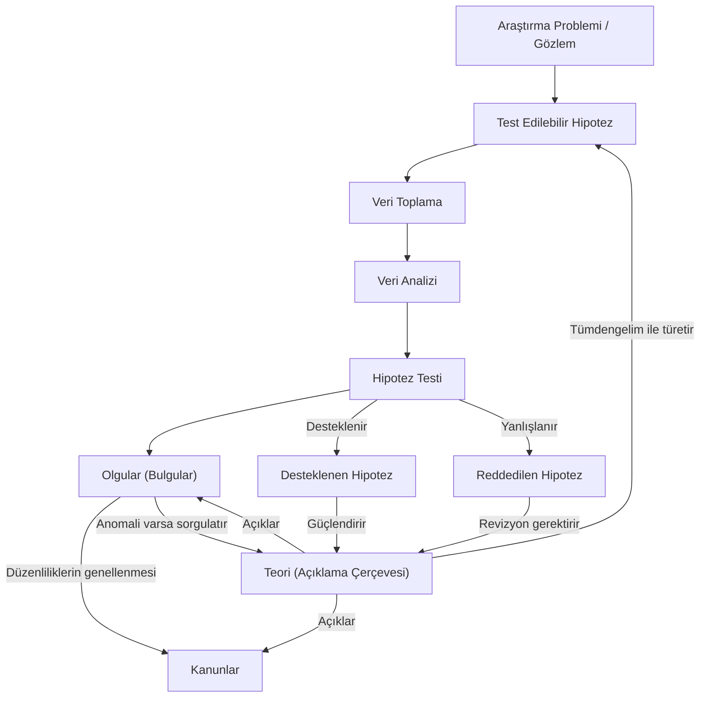

## Kavramsal Çerçeve

**Bilgi**; insanın bilişsel yetileri, deneyimleri ve algıları aracılığıyla olgular ve gerçeklikler dünyasıyla kurduğu bağ üzerinden üretile, doğrulanabilir ve işlenebilir zihinsel çıktıdır. 

İnsan, doğadaki olayları sebep-sonuç ilişkileri bağlamında (deterministik biçimde) anlamlandırma yeteneğine sahiptir. Söz gelimi, New York caddelerinde trafik ışıklarının ritmini takip ederek araçların tekerlekleri vasıtasıyla sert ceviz kabuklarını kıran kargaların davranışı veya Pavlov deneyindeki koşullanmış refleksler biyolojik uyum mekanizmalarıdır. İnsan bilgisi ise kavramsal soyutlama, mantıksal çıkarsama ve kuramsal aktarım yetkinlikleriyle tanımlanır.

### Bilgi Kaynakları

Gerçekliği kavrama ve bilgi üretme sürecinde başvurduğumuz meşru zeminler kuramsal düzeyde dört ana eksende yapılandırılır:

- **[[bilgi-kaynagi-otorite|Otorite]]**: Toplumsal, akademik veya kurumsal konumu gereği uzman kabul edilen kişi ve yapıların aktardığı referans bilgidir. Sınıf ortamında dersi yürüten öğretim üyesinin aktarımları da doğrudan bu bilgi kaynağını örnekler.
- **[[bilgi-kaynagi-mantik|Mantık ve Akıl Yürütme]]**: Zihinsel çıkarsamalar, tümdengelim ve tümevarım yollarıyla ulaşılan tutarlı bilgi durumudur. Aristoteles'in 3 ilkesi gibi (mantığın çelişmezliği, mantığın özdeşliği, üçüncü hâlin imkânsızlığı) yahut yanan bir sobaya doğrudan temas ederek acı deneyimi yaşayan bir bireyi gözlemleyen ikinci bir kişinin, kendisi aynı teması gerçekleştirmeksizin akıl yürütme yoluyla sobanın yakıcı olduğu bilgisine ulaşması mantığın ve akıl yürütmenin bir tezahürüdür. 
- **[[bilgi-kaynagi-duyular|Duyular ve Duygusal Sezgi]]**: Bireyin çevresel uyarıcıları görme, işitme, dokunma gibi algı kanallarıyla tecrübe etmesi neticesinde oluşan doğrudan [[ampirik]] çıktılardır.
- [[Bilimsel Metot]]: Nesnel ölçüm araçları, sistematik deneyler ve kontrollü gözlemler yoluyla veri toplayarak inşa edilen yöntemli bilgi kaynağı.

### Bilim ve Bilimsel Araştırma

Bilim; evrendeki olguları, tekrarlanan doğa durumlarını ve toplumsal süreçleri metodolojik araçlarla, başka bir ifadeyle **uygun bir şablonla** inceleyen sistematik ve kurallı bir bilgi kümesidir. Günlük hayattaki sıradan bir arayış (söz gelimi; kiralık ev bulma süreci) ile bilimsel araştırmayı birbirinden ayıran temel nitelikler; araştırma deseninin evrensel standartlara bağlılığı (**evrensellik**), elde edilen bilginin **[[genel-geçerlik]]** taşıması, yöntemlerin **[[Tekrarlanabilirlik]]** barındırması ve iddiaların **[[Sınanabilirlik]]** niteliğine sahip olmasıdır. Söz gelimi, *suyun deniz seviyesinde 100 santigrat derecede kaynadığı* önermesini ele alalım. İşbu önerme; kullanılan ısı kaynağı, termometre ve kontrollü ortam koşullarıyla her bağımsız gözlemci tarafından veriyle doğrulanabilir bir bilimsel gerçekliktir. Buna mukabil, doğrulanabilir [[ampirik]] veri barındırmayan kişisel anlatılar (*Tek boynuzlu at gördüm iddiası gibi*), subjektif algı alanında kalarak bilimsel bilgi vasfı kazanamaz.

### [[ispat yükü|İspat Yükü]] (Burden of Proof)
Epistemolojide ve araştırma metodolojisinde ispat yükü; bir olguya, ilişkiye veya modele değgin yeni bir sav ileri süren araştırmacının, bu iddiasını ampirik veriler ve metodolojik kanıtlarla temellendirme zorunluluğudur. Hukuktaki suç isnadı karşısında bireyin suçsuz kabul edildiği [[masumiyet karinesi|Masumiyet Karinesi]] ilkesinde olduğu gibi, bilimsel araştırma süreçlerinde de bir kuram veya önerme kanıtlanana kadar araştırmacı iddiasını geçerli kılacak ölçüm, deney ve analizleri sunmakla mükelleftir.

## [[Hipotez]]

**Araştırılan bir probleme, henüz açıklanmamış bir doğa durumuna veya değişkenler arasındaki ilişkilere getirilen, doğrulanmaya ya da yanlışlanmaya açık, ampirik olarak test edilebilir geçici kuramsal önermelerdir**. İnsan zihni belirsizlik durumlarını anlamlandırma eğilimindedir. Doğa olaylarının arkasındaki fiziksel dinamiklerin bilinmediği çağlarda şimşek çarpması olayının doğrudan "Zeus'un gazabı" olarak açıklanması veya mağaradaki gaz sızıntılarının doğaüstü varlıklara atfedilmesi, zihnin boşlukları kapatma refleksiyle kurduğu ilkel modellerdir. Modern bilimsel araştırmada ise, söz gelimi bir sınıftaki öğrencilerin yaş ortalamasına ilişkin öne sürülen belirli bir sayısal değer, anket ve kayıt analizleriyle test edilecek bir hipotez teşkil eder. Hipotezler araştırma sürecinde toplanan verilerin analizi neticesinde kabul edilir veya reddedilir.

### [[Teori]] (Kuram)

Evrene, doğaya veya toplumsal süreçlere değgin **bağımsız olguları, kanıtlanmış hipotezleri ve matematiksel kanunları birbirine bağlayan, kapsamı en geniş, en güçlü açıklama çerçevesidir**. *İzafiyet Teorisi*, *Evrim Teorisi* veya yer çekimine ilişkin kuramsal sistemler doğadaki karmaşık mekanizmaların **"neden" ve "nasıl" işlediğini açıklar**. Teori, sistemin kuramsal omurgasını meydana getirir. **İçerisinde test edilmiş olguları, formüle edilmiş yasaları ve doğrulanmış hipotezleri barındırır**. Deney koşullarının farklılaşması veya yeni değişkenlerin dahil olması durumunda teoriler revize edilebilir, yeni parametrelerle genişletilebilir.

### [[Kanun]] (Yasa)

**Doğada sürekli ve düzenli biçimde tekrarlanan olguların belirli koşullar altında matematiksel ve fiziksel bağıntılarla formüle edilmiş kesin ifadeleridir**. Suyun kaldırma kuvveti veya yer çekimi ivmesinin matematiksel denklemleri birer kanundur. **Kanun sistemin "nasıl" işlediğini nicel formüllerle tasvir eder**ken; **teori söz konusu kanunların da arkasında yatan kapsamlı nedensel mekanizmayı açıklar**.

## Araştırma Tasarımı ve Metodolojik Mimari

### Bilimsel Ürün Raporlama Formatı (IMRaD Mimarisi)

Bilimsel araştırmalar, araştırmacının kişisel anlatım tercihlerinden bağımsız olarak, akademik camianın ortak kabulü olan standart bir yapısal kurgu dâhilinde sunulur. Bilimsel bir makale veya tez çalışmasının omurgasını meydana getiren evrensel bölümler şunlardır:

1. **Başlık (Title):** Araştırmanın temel problemini, değişkenlerini ve sınırlarını özetleyen açık ifade.
2. **Özet (Abstract):** Araştırma problemini, kullanılan yöntemi, temel bulguları ve ulaşılan yargıyı içeren yoğunlaştırılmış metin.
3. **Giriş (Introduction):** Araştırma probleminin kuramsal temellerinin, literatürdeki yerinin, öneminin ve araştırma hipotezlerinin ortaya konduğu bölüm.
4. **Yöntem (Methodology):** Araştırma deseninin, veri toplama araçlarının (anket, deney, gözlem, log analizleri), örneklem yapısının ve analiz tekniklerinin açıklandığı metodolojik kısım.
5. **Bulgular (Results/Findings):** Toplanan verilerin istatistiksel, matematiksel veya nitel analizleri sonucunda ulaşılan doğrudan çıktılar.
6. **Tartışma ve Sonuç (Discussion & Conclusion):** Bulguların kuramsal çerçeveyle ve literatürle entegre edildiği, hipotezlerin doğrulanma durumlarının değerlendirildiği ve gelecekteki çalışmalara yön veren çıkarımların sunulduğu bölüm.

### Bilişim Odaklı Araştırma Yöntemlerinin Ayırt Edici Yönü

Bilişim ve teknoloji alanında yürütülen araştırmalar temel bilimsel yöntem mantığını aynen muhafaza etmekle birlikte; veri toplama safhasında dijital izleme, sensör kayıtları, log analizleri ve büyük veri madenciliği kullanımıyla, veri analizi safhasında ise yapay sinir ağları, bulanık mantık ve makine öğrenmesi algoritmalarıyla klasik yöntemlerden farklılaşır.

### Bilimsel Kavramlar Arasındaki Yapısal İlişkiler

| Metodolojik Kavram | Kuramsal Tanım ve Kapsam                                                           | Araştırma Sürecindeki İşlevi                                                             | Vaka / Örneklem                                                                           |
| :----------------- | :--------------------------------------------------------------------------------- | :--------------------------------------------------------------------------------------- | :---------------------------------------------------------------------------------------- |
| **[[Hipotez]]**    | Araştırma problemine sunulan, doğrulanmaya muhtaç geçici önerme.                   | Veri toplama ve analiz aşamasıyla test edilerek kabul veya ret kararına zemin oluşturur. | Bir dersi alan öğrencilerin yaş ortalamasının belirli bir sayıya tekabül ettiği önermesi. |
| **[[olgu\|Olgu]]** | Gözlem ve deneylerle doğrulanmış, tartışmasız ampirik gerçeklik.                   | Teori ve hipotezlerin üzerine inşa edildiği temel ampirik tuğlaları sağlar.              | Serbest bırakılan tebeşirin yer çekimi etkisiyle yere düşmesi.                            |
| **[[Kanun]]**      | Düzenli doğa durumlarının matematiksel ve fiziksel bağıntılarla formüle edilmesi.  | Doğa durumlarının belirli şartlar altında nasıl gerçekleştiğini nicel olarak tanımlar.   | Yer çekimi ivmesi veya suyun kaldırma kuvvetine ait matematiksel formülasyonlar.          |
| **[[Teori]]**      | Olguları, hipotezleri ve kanunları kapsayan en üst düzey bütüncül açıklama modeli. | Doğa olaylarının nedensel mekanizmalarını ve arka planını bir şemsiye halinde açıklar.   | İzafiyet Teorisi, Evrim Teorisi, Kütle Çekim Teorisi.                                     |

---

