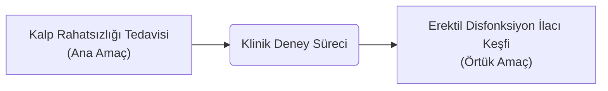
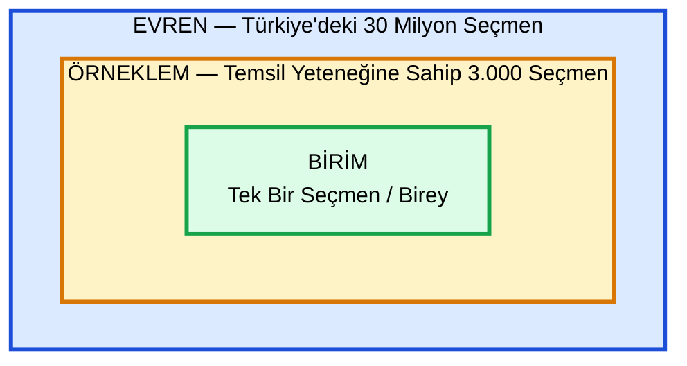
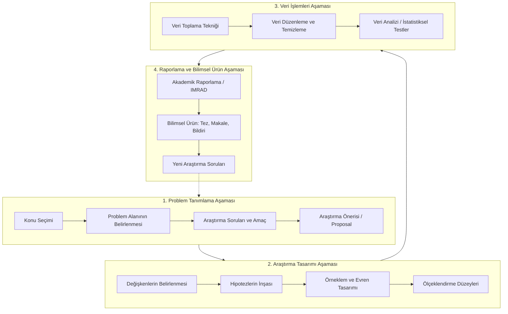

## Kavramsal Çerçeve

### Amaç Biçimleri (Ana, Yan, Örtük)

Bilimsel araştırmalarda amaç; yürütülen tüm metodolojik faaliyetlerin varmayı hedeflediği nihai çıktıyı temsil eder ve üç düzeyde yapılandırılır:

#### Ana Amaç
Araştırma tasarımının odaklandığı temel varoluş gayesidir. Bilişim sektöründeki çalışanların maruz kaldığı meslek hastalıklarını ve iş kazalarını modelleyen bir çalışmada, sektör genelinde görülen meslek hastalıklarının bütüncül profilini çıkarmak ana amaçtır.

#### Yan Amaç
Ana amaca ulaşırken tespit edilen ve süreci besleyen ikincil kazanımlardır. Bilişim çalışanlarının en fazla hangi ergonomik/psikolojik rahatsızlığa maruz kaldığını saptamak veya meslek hastalıklarını önleyici kurumsal stratejiler ile yönetsel politikalar geliştirmek yan amaç kapsamındadır.

#### Örtük Amaç
Araştırmacının başlangıçtaki kurgusunda bulunmayan, süreç içerisinde tesadüfen yahut yöntemin doğası gereği kendiliğinde beliren hedeflerdir. Tıp ve pozitif bilimlerde sıkça karşılaşılan bu durumun tipik örneği viagra etken maddesinin keşfidir. Araştırmacılar, doğrudan kalp rahatsızlıklarını tedavi etme ana amacıyla yola çıkmış; klinik denemelerin neticesinde erektil disfonksiyonu gideren bambaşka bir terapötik sonuca ulaşmışlardır.

### Problem Tanımı ve Araştırma Sorusu

[[problem|Problem]], bilimsel bir merakın veya kuramsal bir boşluğun araştırma lisanıyla ifade edilmesidir. Bu basamakta araştırmacı, net ve [[ampirik]] olarak incelenebilir *araştırma sorusu* cümleleri inşa eder. **Araştırma soruları, amaç ile hipotezler arasındaki metodolojik köprüyü oluşturur. **

### Hipotez (Denence)
[[Hipotez]], araştırma problemine yönelik öne sürülen, doğrulanması veya yanlışlanması amacıyla [[ampirik]] teste tâbi tutulan geçici çözüm önerisidir. **Hipotezler her zaman kesin yargı bildiren önerme cümleleri biçiminde kurulur.**

Hipotezi bir başka biçimde tanımlarsak; **iki veya daha fazla değişken arasında nedensel ya da ilişkisel bir bağ öngören, test edilmeye açık geçici bir açıklama** deriz.

- *Yerkabuğu neden sarsılmaktadır?* sorusuna karşılık üretilen "*Dünya bir öküzün boynuzları üzerindedir ve öküz başını hareket ettirdikçe deprem meydana gelir*" iddiası yapısal olarak bir hipotezdir. Saçma veya bilim dışı olması onun hiptez formatında kurulduğu gerçeğini hâlâ muhafaza eder; araştırmacı bu iddiayı ampirik test sürecine sokarak sonucunu ortaya koyar. Benzer şekilde iktisadi modellemelerde "*Fiyat yükseldikçe talep düşer*" veya "*Eğitim seviyesi yükseldikçe hata oranı azalır*" ifadeleri de doğrudan test edilebilir birer hipotezdir.

### Yöntem ve Teknik Ayrımı
**[[Yöntem]]**; bilimsel bir hedefe ulaşmak adına baştan sonra takip edilen sistematik yolu, araştırma deseninin basamaklarının bütüncül sürecini ifade eder.

**[[Teknik]]** ise işbu [[yöntem|yöntemsel]] süreç yürütülürken belirli bir bilimsel faaliyeti icra etmek için sahaya sürülen araç düzeyindeki somut enstrümandır.

- Ortamdaki hava sıcaklığının tespit edilmesi sürecin yöntem boyutunu oluştururken, ölçüm işlemini gerçekleştirmek amacıyla kullanılan termometre bir tekniktir. Benzer biçimde, saha araştırması yöntemi içerisinde anket formunun tatbik edilmesi bir veri toplama tekniğidir.

### Değişken (Variable, Attribute, Feature) ve Türleri
Gözlemden gözleme değişen birden fazla sayısal veya sözel değer alabilen nitelikler **değişken** olarak adlandırılır. Yönetim Bilişim Sistemleri sahasında veri madenciliği ve yapay zekâ disiplinlerinde bu kavram **öznitelik** (attribute) veya **özellik** (feature) terimleriyle karşılanır.

#### Nitel (Kalitatif) ve Nicel (Kantitatif) Değişkenler
Sayısal olarak ölçülebilen ve matematiksel büyüklük ifade eden unsurlar **[[kantitatif]] (nicel)** değişkenlerdir (yaş gibi ve un miktarı gibi).

Sayısal bir büyüklük bildirmeyen, sınıflama veya kategori belirten unsurlar **[[kalitatif]] (nitel)** değişkenlerdir.  Cinsiyet değişkeni nitel bir unsurdur.

#### Bağımsız Değişken ve Bağımlı Değişken
Araştırmacının kontrolünde bulunan, manipüle edilebilen ve modeldeki diğer unsurları etkileyen değişkenler [[bağımsız değişken]] ($x$); bağımsız değişkenlerin değişimine göre şekillenen, araştırmacının tahminlemeye çalıştığı sonuç değişkeni ise [[bağımlı değişken]] ($y$) olarak konumlanır.

*Regresyon Modeli Eşleştirmesi:* İktisadi bir talep tahminleme modelinde;

$$\large
\text{Talep} = \beta_0 + \alpha_1(\text{Fiyat}) + \alpha_2(\text{Rakip Fiyat}) + \alpha_3(\text{Enflasyon}) + \alpha_4(\text{Satın Alma Gücü}) + \epsilon
$$

İşbu formülasyonda, tahmin edilmek istenen "Talep" bağımlı değişken; talebi şekillendiren "Fiyat", "Rakip Ürün Fiyatı", "Enflasyon" ve "Satın Alma Gücü" bağımsız değişkenlerdir. $\beta_0$ sabit katsayıyı, $\alpha$ değerleri değişkenlerin eğim ve duyarlılık katsayılarını, $\epsilon$ ise modelin hata payını temsil eder.

#### Kesikli Değişken ve Sürekli Değişken
Belirli bir sayısal aralıkta sadece tam ve sınırlı değerler alabilen değişkenler **[[kesikli değişken|kesiklidir]]** (bir ailedeki çocuk sayısı gibi). Belirli iki değer aralığındaki tüm reel sayıları, kesirli değerleri alabilen değişkenler **[[sürekli değişken|süreklidir]]** (marketten alınan unun 1kg 927 gram gelmesi gibi ağırlık ölçümleri).

### Teori (Kuram)

[[Teori]], doğadaki bir olguya yönelik geliştirilen; kanunlar, ilkeler, sınanmış hipotezler ve ampirik bulgularla desteklenen en güçlü ve kapsamlı sistematik açıklamadır. 

**Dünyadaki tüm oluş ve süreçleri (arz-talep dengesi, canlıların adaptasyon mekanizması, yağmurun yağışı vb.) nedensellik zemininde anlamlandırır.**

### Varsayım (Sayıltı)
[[Varsayım]], araştırmacının modeli sadeleştirmek, sınırlandırmak ve çözülebilir kılmak amacıyla **doğrulama veya yanlışlama ([[ampirik]]) sürecine dâhil etmeden** **doğruluğunu baştan kabul ettiği temel ön kabullerdir**. Hipotezin aksine sınanmaz. Araştırmanın üzerine inşa edildiği mecburî veya metodolojik tabanı oluşturur.

- Talep tahmini yürüten bir araştırmacının, enflasyon verilerinin aşırı dalgalı olması sebebiyle çalışmasında enflasyon oranını peşinen yüzde 10 kabul etmesi bir varsayımdır. Benzer şekilde, doktora tezinde talep tahmin tekniklerini sınayan bir araştırmacının, mevsimsel etkiyi modelin dışında tutabilmek adına mevsimsellik taşımayan bir ürün (şişelenmiş içme suyu veya otel rezervasyonu yerine mevsimsiz standart bir mamul) seçerek "Modelim mevsimsel etkinin bulunmadığı ürün gruplarında geçerlidir" beyanı bir sayıltıdır.

### Sınırlılık (Kısıt)
[[Sınırlılık]], araştırmacının kontrolü dâhilinde veya zorunlu metodolojik sebeplerle çalışma kapsamının dışında bıraktığı sınırları ifade eder. Araştırmada "*Fiyat unsurunun talep üzerindeki etkisi çalışma kapsamı dışında bırakılmıştır*" gibi bir ifade çalışmanın kısıtını ilan eder.

| Parametre          | Metodolojik İşlem Biçimi                                       | Temel İşlevi                                  |
| :----------------- | :------------------------------------------------------------- | :-------------------------------------------- |
| **[[Hipotez]]**    | Ampirik veriyle doğrudan test edilir.                          | Olgular arasındaki ilişkiyi sınamak.          |
| **[[Varsayım]]**   | Doğruluğu peşinen sabit bir değer olarak atanır; test edilmez. | Modeli sadeleştirmek ve yürütülebilir kılmak. |
| **[[Sınırlılık]]** | Çalışmanın inceleme alanından bütünüyle hariç tutulur.         | Araştırmanın kapsam sınırlarını çizmek.       |

### Evren (Popülasyon / Anakitle), Örneklem ve Birim
- **[[Evren]]**: Bir araştırmanın bulgularının genelleneceği, problem alanını oluşturan elemanların bütünü.
- **[[Tam Sayım]]:** Evreni oluşturan tüm elemanların tek tek incelenmesidir. Türkiye'deki tüm YBS öğrencilerine veya 30 milyonu aşkın seçmenin tamamına ulaşmak zaman, maliyet ve iş gücü kısıtları nedeniyle güç olduğundan ötürü bilimsel araştırmalar tam sayım yerine örneklem üzerinden yürütülür.
- **[[Örneklem]]**: Evreni temsil etme kabiliyetine sahip, bilimsel örnekleme yöntemleriyle seçilmiş sınırlı alt kümedir. 30 milyonluk seçmen kitlesini tahminlemek amacıyla bilimsel olarak kurgulanan 2000-3000 kişilik grup ya da Türkiye geneli YBS öğrencilerini modellemek için belirlenen 400-500 kişilik öğrenci grubu örneklemdir.
- **[[Birim]]**: **Evrenin veya örneklemin incelemeye konu olan en küçük yapı taşı**dır. YBS araştırmasında tek bir öğrenci, seçim araştırmasında tek bir seçmen, trafik araştırmasında incelenen her bir kaza olayı, biyoloji laboratuvarında deneye tâbi tutulan her bir fare bir **birimdir**.

### Model ve Tasarım
- **[[Model]]**: Karmaşık bir süreci, değişkenler arasındaki ilişkileri harfler, şekiller, semboller veya matematiksel denklemler kullanılarak temsil etmek.
- **Araştırma Tasarımı**: Model kavramını da içine alan; yöntemin, ölçeklerin, örneklem yöntemlerinin ve veri analiz tekniklerinin tüm mimarisini kapsayan üst çatı yapıdır.

### Yasa (Kanun)
[[Kanun]], doğrulanmış doğa durumlarının ve süreçlerinin matematiksel bağıntılarla formüle edilmiş nihai ifadesidir. **Olguların matematiksel dille özetlenmiş hâlidir**.

### Araştırma Türleri
- **[[descriptive-research|Betimsel Araştırmalar]]**: İncelenen topluluğun veya yapının mevcut durumunu olduğu gibi ortaya koyan araştırmalardır. Bir sınıftaki öğrencilerin yaş ortalamasını, cinsiyet dağılımını, ikâmetgah bölgelerini tespit edip bırakmak betimseldir. Yalnızca ortaya bir tanım yahut betim koyar ve bırakır.
- **[[inferential-research|Çıkarımsal Araştırmalar]]**: Mevcut verilerden yola çıkarak değişkenler arası örüntüler yakalayan, geleceğe dönük genellemeler ve tahminler üreten araştırmalardır. (Örn. Brexit sürecinde seçmenlerin yaşı arttıkça ayrılıkçı oyların arttığını saptamak veya öğrencilerin matematik notlarından genel başarılarını kestirmek).
- **Nitel ve Nicel Araştırmalar**: *Nitel Araştırma*, küçük örneklemlerle çalışan, metin analizi, içerik analizi, duygu analizi gibi metin madenciliği tekniklerini kullanan desendir. *Nicel Araştırma*, büyük örneklemlerle yürütülen, istatistiksel farklılık testleri, korelasyon ve regresyon gibi matematiksel teknikleri içeren desendir.

### Bilim Felsefesi Paradigmaları: Pozitivizm ve Yorumlayıcılık
Geçmişte felsefe, tıp ve ilahiyat sacayağında yürütülülen entelektüel arayışlar 18 ve 19. yüzyıllarda ayrılarak pozitif ve beşerî bilimler ekseninde kurumsallaşmıştır:

- **[[Pozitivizm]]**: Doğa bilimlerinin yöntemlerini toplumsal alana tatbik eder. İnsan davranışları da dâhil tüm gerçekliklerin nesnel olduğunu, matematiksel formüllerle ifade edilebileceğini ve rasyonel kalıplara dökülebileceğini kabul eder. İktisattaki «homo economicus» (her adımında sadece maddî çıkarını maksimize eden insan) modeli bu pozitivist anlayıştan peydah olmuştur.
- **[[Yorumlayıcılık]]**: Sosyal olayların doğa bilimlerindeki gibi mekanik formüllerle izah edilemeyeceğini savunur. İnsan davranışları genellenemez, karmaşık ve bağlamsaldır. Bu durum Herbert Simon'ın «**[[Sınırlı Rasyonellik]]**» (Bounded Rationality) kuramıyla açıklanır: bireyler mutlak rasyonel kararlar alamaz, sınırlı rasyonel çerçevede hareket eder.

---

Bilimsel araştırma; doğrusal basamakların yanı sıra süreğen geri beslemelerle işleyen dinamik bir süreçtir. Sürecin omurgasını oluşturan dört ana faz bulunmaktadır:

### Süreğen Bileşenler: Literatür Taraması ve Yöntemsel Tercihler
[[Literatür Taraması]] (Yazın Taraması) ve **Yöntem-Teknik Belirleme** araştırmanın tek bir safhasında yapılıp sonlandırılan işlemlerden bağımsızdır. Tüm adımlarda döngüsel olarak icra edilir:
1. **Problem Aşamasında Literatür:** Literatürdeki kuramsal boşlukları (**Research Gap**) yakalamak ve çalışılmış konuları mükerrer şekilde ele almaktan kaçınmak için taranır.
2. **Tasarım Aşamasında Literatür:** Geçerliliği ve güvenilirliği kanıtlanmış ölçekleri devralmak ve araştırma modelini kuramsal tabana oturtmak için taranır.
3. **Veri Analizi Aşamasında Literatür:** Eldeki veri tipine en uygun analitik ve istatistiksel testleri tayin etmek için taranır.
4. **Çıktı Aşamasında Literatür:** Elde edilen bulguları mevcut yazınla karşılaştırmak ve tartışmak amacıyla taranır. Her bilimsel ürün (tez, makale, konferans bildirisi) YÖK Tez Merkezi ve indeksli veri tabanları aracılığıyla literatüre geri dönerek yeni araştırmacılara girdi sağlar.