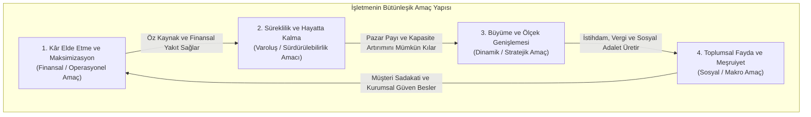
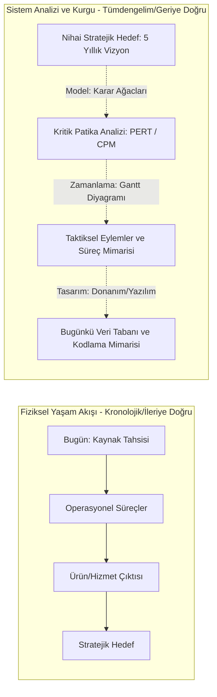
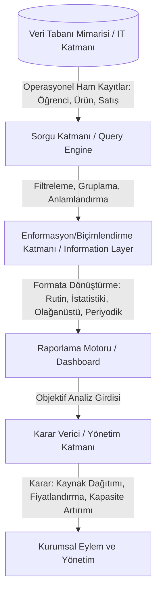
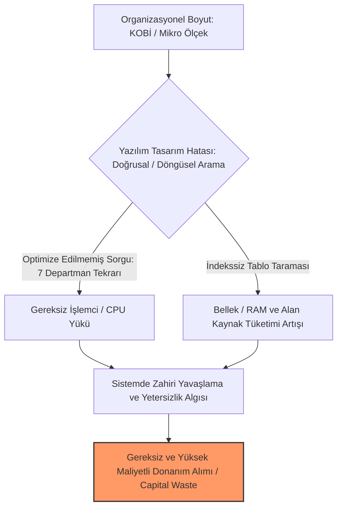
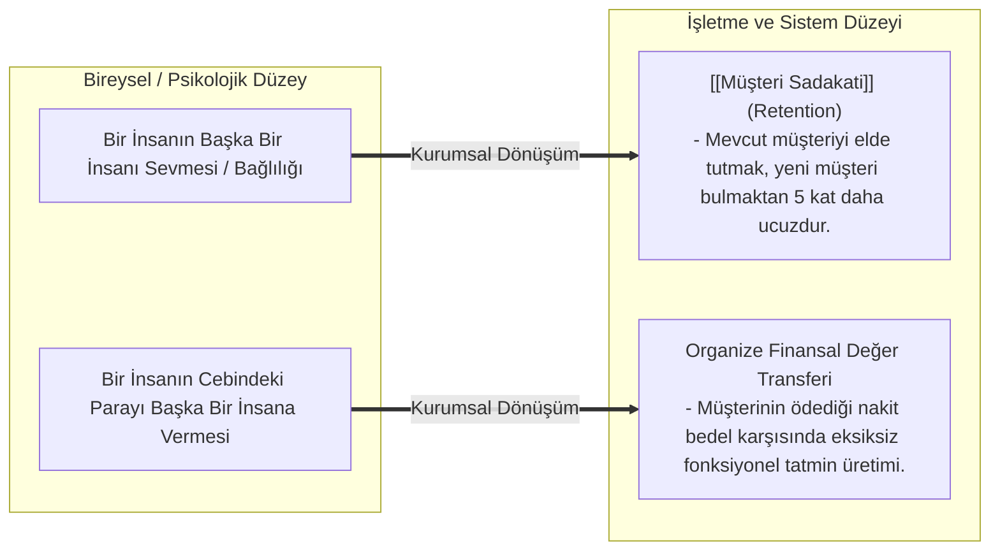

# Ön Bilgi

- Bu notlar derslerde anlatılan konulardan kısa kısa aldığım notların ve önemli addettiğim kavramların çeşitli kaynaklarla detaylandırılmasından oluşuyor. Temel olarak 3 kısım vardır; 
- Bunlardan ilki **Bürokrasiye Değgin**. İşbu kısımda ders içeriklerinden bağımsız olarak projeler, ödevler, dersin işleyişi, sınav tarihleri gibi gibi kısımlar yer alıyor (**değgin**, *dair* kelimesinin Türkçe ifade edilişidir).
- **Derse Değgin** ise doğrudan işbu dersin konu anlatımı ile alakalıdır.
- **Derse Aşkın** kısmına gelirsek, bu kısmı dersin konu anlatımını aşan, anlatımdan sapan ancak anlamayı biraz daha kolaylaştıracak örnekler içeriyor. Derse değgin akademik anlatıya elden geldiğinde sadık kalmaya çalışırken derse aşkın akademik anlatıyı aşan, yeri geldiğinde ders dışı dış kaynaklara da yer veren, bir nevi "vizyon" katabilecek bir kısımdır.  

---

# Bürokrasiye Değgin

## Ölçme, Değerlendirme ve Sınav Usulleri
- Dersin başarı notu **vize sınavı, dönem projesi** ve **final sınavı** olmak üzere üç temel ayaktan teşekkül eder. Dönem projesinin genel başarı notuna etkisi **%40** oranındadır. Proje çalışması teslim etmeyen veya proje notu sisteme girilmeyen öğrenciler dersten doğrudan başarısız sayılır.
- Final değerlendirmesi, dönem boyunca hazırlanan ve öğretim üyesi tarafından onaylanana projelerin sunumu üzerinden gerçekleştirilecek.

## Uygulama ve Proje Şartları
- Proje ekipleri kesin olarak **3 veya 4** kişilik gruplardan teşekkül eder.
- **İncelenecek vaka reel bir üretim veya hizmet işletmesinde tespit edilen somut bir operasyonal aksaklığın giderilmesini ya da mevcut durumun bilişim mimarisi marifetiyle iyileştirilmesini hedeflemelidir.**
- Bilişim altyapısı, kurumsal veri tabanı derinliği ve süreç karmaşıklığı barındırmayan mikro ölçekli randevu sistemleri (berber randevu sistemi, kuaför, güzellik salonu vb.) proje konusu olarak reddedilir. Hoca bunların kabul edilmeyeceğini, epey basit kaçacağını söyledi.
- **Teslim Formatı ve Dokümantasyon**: Projeler hem teknik süreç analizini içeren yazılı metin dokümantasyonu (**Word**) hem de sunum (**Powerpoint/Canva**) formatında hazırlanacak. Bütün teslimler final sınavı öncesinde **Sakai** sistemine yüklenecek.
- Sunuma ciddiyete uygun bir giyim tarzı ile katılmak gerekiyor. Sunum aşaması ekip üyeleri arasında paylaşılarak yapılabileceği gibi, tüm grup adına yetkilendirilen tek bir sözcü aracılığıyla da sunulabilir.
- Sunum oturumlarına sektörden profesyoneller, harici juri üyeleri ve firma yöneticileri davet edilebilir...

# Derse Değgin
## 1. İşletme Üzerine
### İşletmenin İktisadi ve Teknik Tanımı

[[isletme-tanim|İşletme]]; [[Üretim Faktörleri|üretim faktörlerini]] planlı bir organizasyon yapısı altında bir araya getirerek insan gereksinimlerini karşılayacak mal veya hizmetleri üreten, bunları piyasa belirli bir kâr marjıyla pazarlayan ve temel varlık sebebi **sürdürülebilir katma değer** üretmek olan en küçük bağımsız iktisadi-teknik birimdir. Temel amacı **kâr elde etmek** ve hem kârının devamlılığını sürdürmek hem de hayatta kalmaktır. *İşletme Üzerine* kısmında daha çok bu amaçlar üzerine duracağız.

Bu kurumsal yapı üç temel boyuttan meydana gelir:
- **İktisadi Boyut**: Kıt kaynaklarla azami fayda ve çıktıyı üretme zorunluluğu.
- **Teknik Boyut**: Girdileri süreçler vasıtasıyla nihai mamul veya hizmete dönüştüren operasyonel ve bilişimsel altyapı.
- **Toplumsal Boyut**: Tüketici ihtiyaçlarını karşılama ve ekonomik ekosisteme değer katma misyonu.

### İşletmenin Amaçlar Sistemi

İşletmeler birbirini besleyen ve sistemik bir nedensellik bağı kuran dört temel amaç doğrultusunda varlıklarını sürdürürler.

#### Kâr Elde Etme ve Kâr Maksimizasyonu (Finansal/Operasyonel Amaç)
Kâr, işletmenin yaşam döngüsünü sürdürmesini sağlayan temel finansal kaynaktır. Öz kaynakları büyüten, yeni teknolojik yatırımları finanse eden ve organizasyona dinamizm katan net iktisadi değeri ifade eder. **Bilişim sistemleri, maliyetleri düşürmek ve gelir kaçaklarını önlemek sûretiyle bu fonksiyonu optimize eder.**

#### Süreklilik ve Hayatta Kalma (Varoluşsal/Sürdürülebilirlik Amacı)
İşletmeyi anlık veya tekil bir satış başarısına indirgeyemeyiz. **Esas hedef piyasa dalgalanmalarına ve iç krizlere rağmen operasyonel çarkların kesintisiz biçimde dönmesidir**. Sürekliliğin teknik teminatı, süreçlerin kişilere bağımlı olmaktan çıkarılarak kurumsal bilgi sistemleri marifetiyle standardize edilmesidir.

#### Büyüme (Dinamik/Stratejik Amaç)
Durağanlık işletmeler açısından gerileme riski taşır. **Sağlıklı bir organizasyon pazar payını artırmayı, işlem hacmini genişletmeyi ve [[Ölçek Ekonomisi|ölçek ekonomisinin]] maliyet avantajlarından faydalanmayı amaçlar.** Ölçek genişledikçe bilişim mimarisinin taşıyıcı kapasitesi de büyümek zorundadır. 
- Buradan ölçek büyüdükçe bilişim sistemlerine olan ihtiyacın da daha kritik olacağı sonucunu çıkarsayabiliriz, nitekim ölçeğin büyümesi işlem hacminin ve verilerin de büyümesi olarak ifade edecektir kendini.

#### Toplumsal Fayda, İstihdam ve Sosyal Adalet (Makro Amaç)
İşletmeler faaliyet gösterdikleri topluma **[[Katma Değer|katma değer]]** sağlarlar. **[[nitelikli iş gücü|Nitelikli iş gücüne]]** istihdam yaratmak, kamuya vergi ödemek ve toplumsal refahı yaygınlaştırmak işletmenin **[[kurumsal meşruiyet]]** zeminini oluşturur.

### Kâr, Kazanç ve Kaynak Tüketimi
- **Kâr**: Kaynakların rasyonel kullanımı sonucunda elde edilen, işletmenin sürdürülebilirliğini temin eden katma değerdir. 
- **Kaynak İsrafı (Gizli Maliyet)**: Bedeli peşinen ödenmiş ve organizasyona tahsis edilmiş bir kaynağın planlanandan önce atıl bırakılması bir kazanç değildir. Bilakis kapasite kullanım oranının düşmesi, zaman sermayesinin ve operasyonel girdilerin israfıdır.

---

## 2. Kavramsal Çerçeveler

### Harcama (Expenditure) ve Gider (Expense) Ayrımı

Finansal muhasebe ve yönetim bilişim sistemleri veri tabanı mimarisinde bu iki kavram farklı sistemetik aşamaları temsil eder:

| **Parametre**         | [[Harcama]] (Expenditure)                                                                  | [[Gider]] (Expense)                                                                                                                    |
| --------------------- | ------------------------------------------------------------------------------------------ | -------------------------------------------------------------------------------------------------------------------------------------- |
| **Operasyonel Tanım** | Varlık, mal veya hizmet edinmek amacıyla kasadan nakit çıkması ya da borçlanılması işlemi. | Edinilen varlık veya hizmetin işletme faaliyetlerinde tüketilerek [[hâsılât]] sağlamak üzere defter kayıtlarında aktifleştirilmesidir. |
| **Zamanlama**         | Anlık, spontane ve dinamik gerçekleşir (örn: kredi kartıyla alışveriş yapılması).          | Dönemsellik ilkesine tabidir; fatura kesinleştiğinde, hesap kesildiğinde veya dönem kapandığında kayda geçer.                          |
| **Bütçesel Etki**     | Anlık likidite durumunu ve nakit akışını etkiler.                                          | İşletmenin net kâr/zarar durumunu, vergi matrahını ve öz kaynak büyüklüğünü doğrudan belirler.                                         |
| **Sistemik Kayıt**    | Finansal hareketin operasyonel tetikleyicisidir (işlem kaydı).                             | Muhasebe defterinde mizana, gelir tablosuna ve yevmiye defterine bağlanan kesinleşmiş muhasebe kaydıdır.                               |

### Strateji ve Taktik Ayrımı

- **[[Stratejik Planlama]]**: Organizasyonun uzun vadeli kurumsal vizyonunu (örn: 5 yıl sonra hedeflenen pazar payı, yeni tesis yatırımları, uluslararası stratejik ortaklıklar) kapsar. Bütünsel, makro ve tümdengelimci bir doğrultuya sahiptir.
- **[[Taktiksel Planlama]]**: Stratejik hedefe ulaşmak gayesiyle bugünden devreye sokula kısa ve orta vadeli eylemlerdir (eğitim programları, teknoloji yatırımları, süreç iyileştirmeleri, stajlar...). Değişen çevre koşullarında taktikler dinamik olarak güncellenir; stratejik hedef ise yönünü muhafaza eder.

### Fonksiyonel Yazılımlar ve Bütünleşik Sistemler (ERP)
- **[[Fonksiyonel Bilişim Sistemleri]]**: Küçük ölçekli, süreç karmaşıklığı sınırlı işletmelerde tek bir departmanın (sadece muhasebe veya sadece stok yönetimi gibi) anlık operasyonel ihtiyacını karşılayan, diğer birimlerle veri bağı kurmayan müstakik yazılımlardır. *([[cisa-fonksiyonel|Bilgi sistemleri denetimindeki tanım için tıklayınız.]])*
- **[[Kurumsal Kaynak Planlaması]] (ERP)**: Departmanlar arasındaki çitleri kaldırarak üretim, satın alma, finans, insan kaynakları ve pazarlama birimlerini tek bir merkezî veri tabanı mimarisi üzerinde konuşturan bütünleşik kurumsal omurgadır.

---

## 3. Sistem Tasarımı, Analiz ve Bilişim Mimarisi

### Yaşam Akışı ve Sistem Kurgusu

Fiziksel yaşam zaman ekseninde *soldan sağa* doğru kronolojik bir akışla ilerler. Gelgelelim bilişim sistemleri tasarımı, proje yönetimi ve karar mekanizmaları **sağdan sola (tümdengelimci - geriye doğru türetim)** mantığıyla modellenir. Yani ilkin büyük bir resim kurgulanır, buna yukarıda gördüğümüz **stratejik planlama** da diyebiliriz, sonrasında küçük adımlarla bu büyük resme ulaşmaya çalışırız, bir diğer deyişle **taktiksel planlama** ile.

Sistem analisti, ilkin işletmenin ulaşmak istediği nihai hedefi tanımlamalıdır. İşletmenin amacını gerçekleştirmek için belirlediği stratejisini bilmelidir. Ardından geriye doğru türetim yapar [[PERT/CPM Ağları]], [[Gantt Şemaları]] ve [[veri-madenciligi-4#3. Sınıflandırma Algoritmaları Karar Ağaçları (Decision Trees)|Karar Ağaçları]] yardımıyla kritik patikaları çıkarır. Beklenmedik aksaklıklarda sistemin taktiksel katmanı dinamik olarak güncellenir. Her güncelleme işlemi insan ve organizasyon üzerinde operasyonel sürtünme üretir.

#### Veri, Bilgi, Rapor ve Yönetim Hiyerarşisi

Yönetim Bilişim Sistemler, nesnel ve kuralları belirlenmiş bir yapı kurarak yönetimi bireysel inisiyatiflerden bağımsız hâle getirir. Yönetim hiyerarşisi şu akışla işler:

YBS altyapısının ürettiği dört temel raporlama kategorisi bulunur:
1. **Periyodik Raporlar**: Önceden belirlenmiş zaman aralıklarıyla düzenli biçimde oluşturulan dokümanlar.
2. **İstatistiki Raporlar**: Dağılım modelleri, yüzdelik oranlar, geçmiş trendler ve korelasyon verileri.
3. **Olağanüstü (İstisnai) Raporlar**: Sistemde tanımlanan standart tolerans limitleri veya kritik eşikler aşıldığında tetiklenen uyarı çıktıları.
4. **Rutin Raporlar**: Standart işleyişin idamesi için her iş gününde kesintisiz üretilen operasyonel dökümler.
### Kurumsal Ölçek ile Donanım ve Yazılım Mimarisi

Bilişim sisteminin ölçeği, hizmet verdiği kurumun hacmiyle tam bir uyum sergilemelidir. Veri tabanı tasarımındaki sistemler hatalar doğrudan donanım israfına yol açar.

Veri tabanında aranan bir nesneye ait kayıt, dizinlenmiş (indexlenmiş) anahtarlar yerine ardışık döngülerle tüm tablolar baştan sonra taranarak aranırsa sorgu maliyeti katlanarak artar. Bu da donanım kaynaklarını tüketerek sistem yöneticilerinde yetersizlik algısı yaratır; neticede gereksinim duyulmayan yüksek maliyetleri donanım yatırımları yapılarak kurumsal sermaye heba edilir. 

# Derse Aşkın

## İnsan Doğasının Kurumsal Yansımaları

İşletmeyi yönetmeyi ve bilişim altyapısını kurmayı karmaşık kılan iki temel dinamik bulunur:

1. **Sevginin Müşteri Sadakatine Dönüşmesi**: İnsanlar arasındaki duygusal bağ epey kırılgandır. Olumsuz bir tavırda kolayca zedenebileceği gibi, işletme ile müşteri arasındaki bağ da operasyonel bir aksaklıkta derhal kopabilir. [Araştırmalar gösteriyor ki](https://www.researchgate.net/publication/233555767_The_optimal_ratio_of_acquisition_and_retention_costs) mevcut müşteriyi elde tutmanın maliyeti yeni bir müşteri kazanma maliyetinden beş kat düşük. Bilgi sistemleri müşteri deneyimini hatasız izleyerek bu sadakati kurumsallaştırır.
2. **Parasal Transferin Rıza ile Gerçekleşmesi**: Bir bireyin cebindeki kaynaktan vazgeçerek işletmeye nakit aktarması, sunulan mal veya hizmetin ürettiği tatminin katlanılan maliyetten yüksek algılanmasına bağlıdır. İşletme; minimum kaynak tüketimiyle maksimum öznel fayda ürettiği ölçüde bu parasal transferi sürdürülebilir kılar.