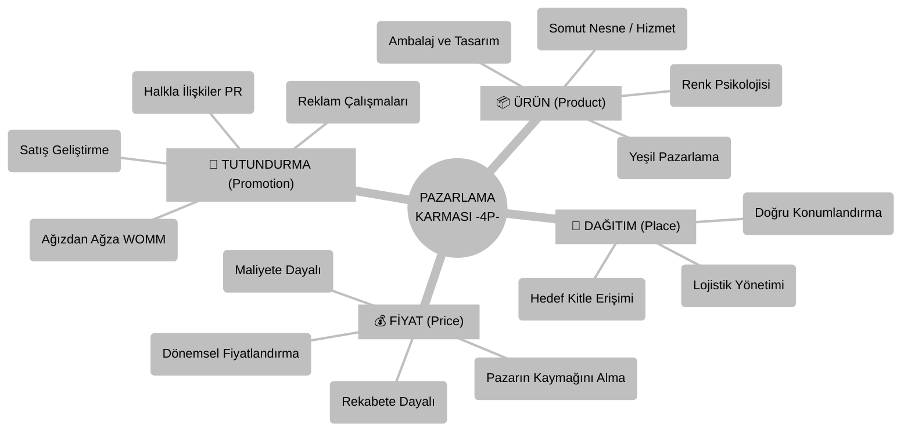

## Dersin Bürokrasisi, Vurgular vs.
- **Sınav ve Değerlendirme**: Vize %40, Final %60 ağırlığında (dönem içi ödev verilmezse). Sınavlarda kesinlikle çoktan seçmeli test <u>sorulmayacak</u>. Değerlendirme karma yöntem veya tamamen klasik sorular üzerinden yapılacak. Derse tam katılım final notuna doğrudan +10 puan olarak yansıyacak.
- **Sınav Beklentisi**: Kesinlikle ezber <u>istenmemektedir</u>. Sınavlarda salt bilgi yerine, **kavramlar arasında ilişki kurabilme, örneklendirebilme, analitik düşünerek  yorum yapabilme** yetenekleri ölçülecek. Yorum yapabilmek ve ilişki kurabilmek daha önemli ezcümle.
- **Vurgular**: Derste genel olarak ihtiyaç giderme ve değer yaratma üzerinden pazarlama ele alındı, satış ve iknadan ziyade. [[Pazarlama Karması]] (4P) unsurlarının hem geleneksel hem de dijital dünyadaki karşılıkları dersin omurgasını oluşturmaktadır. Teknolojinin gelişimi ile pazarlamanın iç içe geçtiği de sıklıkla tekrar edildi.

---

# Ders Notları

## Pazarlamanın Doğası ve Kapsamı

Genel algının aksine **pazarlama**, **yalnızca bir ürünü satmak veya müşteriyi ikna etmek <u><b>değildir</u></b>** Temel odak noktası müşteri ihtiyaçlarını anlamak ve onlara bir [[Müşteri Değeri|Müşteri Değeri (Customer Value)]] sunmaktır. Bu süreçte hem somut ürünler hem de soyut hizmetler ([[Hizmet Pazarlaması]]) pazarlamaya konu olur.

Modern pazarlama anlayışında satış sonrası destek, iade süreçleri ve marka ile kurulan bağ da ürünün ayrılmaz bir parçasıdır.

> [!IMPORTANT] Satış Sonrası Hizmetin Önemi
> Müşteri bir ürünü satın aldıktan sonra süreç bitmez. İade süreçlerinin zorluğu veya vergi/garanti problemleri, müşterinin markayı bir daha tercih etmemesine yol açar. Pazarlama, satın alma öncesinden başlar ve satın alma sonrasında da devam eder.

## Pazarlama Karması (Marketing Mix - 4P)
Pazarlama stratejileri oluşturulurken dört temel bileşen çerçevesinde hareket edilir. Bunlar dijital pazarlamanın da temelini oluşturan bileşenlerdir.

  

 

 

### 1. Ürün (Product)
Pazara sunulan, bir ihtiyacı veya isteği karşılayan her türlü somut nesne veya soyut hizmettir (bkz. [[1- Mikro İktisat#İktisat|İktisat]]).

- **Ambalajlama ve Tasarım**: Ürünün kutusu sadece onu korumakla kalmaz. Müşteriye de bir mesaj verir aynı zamanda.
- **Renk Psikolojisi**: Markalar renkleri bilinçli kullanırlar; söz gelişi, McDonald's'ın kırmızı ve sarı kullanımı iştah açıcı ve acele ettirici bir etki yaratır.
- **Yeşil Pazarlama (Green Marketing)**: Çevreye duyarlı, geri dönüştürülebilir ambalaj kullanımıdır. Pozitif bir marka algısı yaratılır bu şekilde. 
	- *Doğayı katleden şirketlerin o plastiğin üzerine geri dönüşüm logosu basarak vicdanlarını rahatlatması ve o ürünü iki katı fiyata satarak bizleri gezegeni kurtardıklarına inandırmalarıdır da diyebiliriz. Para hırsıyla katledilen doğa, yine para hırsıyla "çevreye duyarlı" imajıyla gösterime sokulur burada.*
		- Bu ürünler bir ihtiyacı gidermek için değil de göstergelerin manipülasyonu için alınır daha ziyade, üreten firmalar da bunun farkında. "Yeşil pazarlama" logolu ürünü alırken dünyayı kurtarmıyoruz, "çevreci" göstergesini satın alıp kendi narsisizmimizi parlatıyoruz. Kahve alırken de sadece kahve almıyoruz, Afrikalı çocuklara yardım etme hissini (vicdanı) satın alıyoruz.

### 2. Fiyat (Price)
Ürünün veya hizmetin parasal karşılığıdır. İşletmeler pazara girerken veya ürün konumlandırırken farkı stratejileri izler:

- **Maliyet Artı Fiyatlandırma**: Maliyetin üzerine kâr marjı eklenmesidir.
- **Rekabete Dayalı Fiyatlandırma**: Rakiplerin fiyatlarına göre (altında, üstünde veya eşit) konumlanma.
- **Dönemsel Fiyatlandırma**: Talebin yüksek olduğu dönemlerde (örn: kışın kış lastiği) fiyatların artması.
- **Pazarın Kaymağını Alma (Price Skimming)**: Piyasada muadili olmayan tamamen yenilikçi bir ürün çıkarıldığında başlangıçta fiyatı en yüksek seviyede tutma stratejisi.
- **Pazara Nüfuz Etme/Pazarı Domine Etme (Market Penetration)**: Piyasaya girerken fiyatı rakiplerden düşük tutarak **[[sürümden kazanmak|sürümden kazanma]]** ve hızlıca pazar payı elde etme stratejisi.

### 3. Dağıtım (Place)
Ürünün doğru zamanda ve doğru yerde müşteriye ulaştırılmasıdır. Sadece lojistik değil, aynı zamanda fiziksel mağazaların veya dijital platformların erişilebilirliğidir.

- Derste örnek verilmişti, bizim üniversiteden bir kişinin, üniversite kampüsüne Gratis açılması fikri varmış. Bunun arka planında hedef kitleye ([[Hedef Pazar]]) doğrudan temas etme stratejisi yatmaktadır tabii; nihayetinde öğrencilerin yoğun olduğu bir alandan söz ediyoruz. Doğru yerde müşteriye ulaşma örneğidir bu bakımdan.
- Amazon gibi firmaların drone ile teslimat yapması da geleneksel kargo maliyetlerini düşürürken müşteri memnuniyetini de maksimize eder ve bu **lojistik süreçleri** müşteri açısından zaman tasarrufu da sağlar. Elbet bu ivmelidir, ancak insanî ilişkileri sekteye uğratacak bir yapıdadır aynı zamanda. Karşı tarafta bir öteki değil de mekanik bir alet söz konusudur nitekim. Gitgide ivme ve konfor uğruna insanî ilişkiler de sekteye uğruyor, ivme uğruna bütün anlatı günbegün bertaraf ediliyor. Bu bakımdan riskleri de vardır hâliyle.

### 4. Tutundurma (Promotion)
Markanın ve ürünün hedef kitleye duyurulması, hatırlatılması ve ikna edilmesi sürecidir.

- **Reklam**: Ücretli kitlesel iletişim.
- **Satış Geliştirme**: Promosyonlar, indirimler, 10 kahve alana 1 kahve bedava gibi sadakat programları vesaire.
- **Halka İlişkiler (PR)**: Fuarlara katılım, sosyal sorumluluk projeleri.
- **Ağızdan Ağza Pazarlama (Word of Mouth - WOMM)**: Müşterilerin ürün hakkındaki yorumlarıdır. Özellikle **e-ticaret** sitelerindeki kullanıcı yorumları, satın alma kararlarını doğrudan etkileyen en güçlü ***tutundurma*** araçlarından biridir.

## Tüketici Davranışları ve Tüketim Motivasyonları
Tüketiciler her zaman rasyonel kararlar almazlar. Satın alma davranışını etkileyen farklı motivasyonlar vardır.

- **Hedonik Tüketim (Hedonic Consumption)**: İhtiyaçtan ziyade zevk, haz ve anlık duygu değişimleri sebebiyle yapılan alışveriş türüdür.

## Teknoloji, İnternet ve Dijital Pazarlamanın Temelleri
İnternetin tarihsel gelişimi ile paralel olarak büyümüştür dijital pazarlama.

- **Web'in Doğuşu**: 60'larda Soğuk savaş döneminde askerî iletişim ağı olarak kurulan ARPANET, bugünkü internetin atasıdır.
- Bilginin depolanması ve ilişkilendirilmesi üzerine ilk felsefî temeller Vannevar Bush tarafından atılmıştır.
- 89-91 yıllarında CERN'de *Tim Berners-Lee* tarafından geliştirilen World Wide Web, internetin küresel çapta ticarîleşmesini sağlamıştır.
- **İletişim Protokolleri**: Bugünkü web sitelerinin alt yapısını ağdaki cihazların konuşmasını sağlayan [[TCP/IP]] ve veri transferini yöneten [[UDP]] gibi protokoller sağlamaktadır.
- **Evrim**: [[bilisim-hukuku-4#2. Web’in Açılımı ve Dönemleri|Web'in evrimi]]
 

> [!NOTE] Dijitalleşmenin Hızlandırıcısı: Pandemi
> COVID-19 pandemisi, işletmelerin dijital dönüşüm süreçlerini ve e-ticaret hacmini katlanarak büyütmüş, dijitalleşmeyi lüks olmaktan çıkarıp bir zorunluluk haline getirmiştir. Bkz. [[3- Dijital Ekonomi ve Kavramlar#İnternet Ekonomisi Nasıl Dijital Ekonomiye Dönüştü ?|İnternet ekonomisi nasıl dijital ekonomiye dönüştü?]]

# Derse Aşkın: Örüntüler ve Bağlantılar
- **Not**: Şakamatik bir dil ile olması için abartılı bir üslup kullanılmıştır. Abartılara aldanış etmeyiniz, abartıların gerçeklik değeri pek yoktur...

##### A. Pazarlama Temelleri ve Evrimi

- *[[Pazarlama Karması]] (4P)*: E. Jerome McCarthy tarafından literatüre kazandırılmış, Philip Kotler tarafından popülerleştirilmiş temel pazarlama modelidir. İşletmenin hedef pazarda istediği tepkiyi yaratmak için kullandığı kontrol edilebilir değişkenler setidir: **ürün, fiyat, mekân, promosyon**. Yani olay şu: **dandik bir şeyi süsle** (ürün), **pahalıya koy** (fiyat), **her yerde reklamını yap** (promosyon), **bakkala bile sok** (mekân). Dijitalde de değişen bir şey yok, orada da geçerli.
- **[[Hizmet Pazarlaması]] (7P)**: 4P kesmemiş, yanına 3 tane daha koymuşlar: **insanlar**, **süreç**, **fiziksel kanıt**. Yani diyorlar ki *"hizmet satıyorsan sattığın atmosfer güzel olsun (**fiziksel kanıt**), garson ürünü hızlı getirsin (**süreç**), garson güler yüzlü olsun (**insanlar**)".*  Bkz. [[dijital-pazarlama-6#Hizmet Pazarlaması ve Teknoloji Kabul Modeli|Hizmet Pazarlaması ve Teknoloji Kabul Modeli]]
- **[[Müşteri Değeri]]**: Tüketicinin üründen elde edeceği faydalar ile bu faydaları elde etmek için katlanacağı maliyetler (zaman, para, efor) arasındaki fark.  $\text{Algılanan Fayda - Algılanan Maliyet}$
- **[[Yeşil Pazarlama]]**: Günah çıkarma seansıdır bir nevi. Peattie ve diğerlerinin süslediği bu kavram ekolojik yıkımın faturasını yine tüketiciye kesmenin, vicdan azabını bir katma değer olarak satmanın adıdır. "*Biz doğayı çok seviyoruz o yüzden bu plastik bardağı yeşile boyadık ve üzerine yaprak koyduk*" diyerek tüketiciden birkaç TL fazla alma sanatı. Doğayı seviyoruz falan hepsi hikâye aslında, esas amaç vicdanınızı rahatlatıp cüzdanınızı boşaltmak.
- **[[Hedef Pazar]]**: Segmentasyon (bölümlendirme) yapıldıktan sonra işletmenin ürün ve hizmetlerini sunmayı seçtiği spesifik tüketici grubu.
- **[[Müşteri Tatmini]]**: Tatmin dediğimiz aslında beklentinin yönetilmesidir. Beklentiler ile gerçekleşen performansın eşleşme derecesidir. $\text{Tatmin = Gerçek Deneyim - Beklenti}$
- **[[Pazarlama 1.0 – 5.0, Philip Kotler]]**: Kotler'in bu evrim hikâyesi aslında kontrolün derinleşme tarihidir bir nevi. 1.0'da sadece malı satarlarken 5.0'da artık yapay zekâyla bizim bile henüz bilmediğimiz arzularımızı bize "ihtiyaç" diye kakalarlar. Kapitalizmin canı çıksın diyelim... Philip Kotler ise pazarlamanın en önde gelen isimlerinden. Her birkaç yılda sürüm atlıyor, ciddi diyorum. Marketing 1.0, Marketing 2.0 diye ilerletiyor kitaplarını. Yakında "Marketing: Only for AI's" diye kitap çıkarırsa şaşırmam, yaşı yeter inşallah (94 yaşında).

##### B. Fiyatlandırma ve Strateji
- **[[Maliyet Artı Fiyatlandırma]]**: En kaba hâliyle "ben bunu kaça mal ettim, üstüne ne koyarım" demektir. Strateji değil de esnaf kurnazlığıdır daha ziyade.
- **[[Rekabete Dayalı Fiyatlandırma]]**: Yan dükkan kaça satıyorsa ona göre hizalanmaktır.
- **[[Dönemsel Fiyatlandırma|Dönemsel (Sezonsal) Fiyatlandırma]]**: Talebin arttığı anlarda köşeye sıkıştırmanın adıdır. Bayramda veya tatilde "fırsat" diye sundukları şey aslında zaman darlığımızı fırsat bilip cebimizi boşaltmaktır. Sevgililer gününde de...

> 	Hoca derste "*Piyasaya rakibi olmayan yepyeni bir ürün sunarsanız fiyatı nasıl belirlersiniz*?" diye bir açık kapı bıraktı. Bu durumda [[Pazarın Kaymağını Alma (Price Skimming)]] (ilk başta çok yüksek fiyat çekip zamanla düşürmek) yapılabilir yahut piyasayı domine etmek istiyorsak [[Pazara Nüfuz Etme (Market Penetration)]] (ilk başta zararına yakın ucuz satıp tekel olmak) yapılabilir.

##### C. Tutundurma, Dağıtım ve Tüketici Psikolojisi
- **[[Ağızdan Ağza Pazarlama|Ağızdan Ağza Pazarlama (Word of Mouth - WOMM)]]**: Tüketicilerin markalar veya ürünler hakkındaki kişisel deneyimlerini birbirlerine aktarmasıdır. Dijitaldeki adı e-WOMM'dur (Kullanıcı yorumları, puanlamalar). Güvenin ticarîleşmesidir bir nevi...
- **[[Halkla İlişkiler]] (PR)**: Edward Bernays'ın temellerini attığı bu alan aslında "*rızanın imalatı*"dır. Kötü kokan bir şirketi başkalarına "toplum dostu" diye yuttururuz halkla ilişkilerde. Başka bir deyişle, markanun yahut kişinin kamuoyu nezdindeki imajını ve itibarını yönetme süreci.
- **[[Olumsuzluk Önyargısı|Olumsuzluk Önyargısı (Negativity Bias)]] ve [[Sosyal Kanıt|Sosyal Kanıt (Social Proof)]]**: İnsanın evrimsel olarak tehlikelere/kötüye odaklanma eğilimi **olumsuzluk önyargısı**dır. Diğer insanların kararlarına bakarak doğruyu bulma eğilimi ise Cialdini'nin literatüre kazandırdığı **sosyal kanıt** ilkesidir. Ürünün 100 tane mükemmel yorumu var ama 1 adet kötü yorumu varsa gözümüz direkt o kötüye gider mesela **olumsuzluk önyargısı** gereği.  Sosyal kanıta "bak herkes bunu yapıyor sen de yapsana" da denilebilir. Cialdini okumuş adam tabii, "insanlar koyundur" diyemiyor, **sosyal kanıt** diyor onun yerine.
- **[[Hedonik Tüketim|Hedonik Tüketim (Hedonic Consumption)]]**: Tüketicinin rasyonel bir ihtiyacı karşılamak yerine zevk, fantezi, haz ve duygusal tatmin amacıyla gerçekleştirdiği tüketim davranışıdır (Holbrook ve Hirschman). Derste hoca mutlu olmak için cips almak gibi örnek verdiydi.