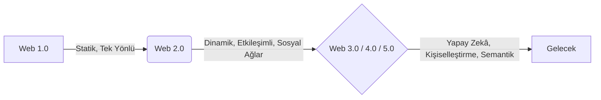

## Dersin Bürokrasisi, Vurgular vs.

- **Ödev**: Porter'ın 5 Güç Modeli (Porter's Five Forces) araştırılacak (bkz. [[4- Bilgi Sistemleri, Organizasyon ve Strateji II#Porter'in Rekabetçi Güçler Modeli (5 Güç Modeli)|5 Güç Modeli]])
- **Pazarlamanın 4P'si Dijital Uygulama**: Geçen hafta işlenen [[dijital-pazarlama-1#Pazarlama Karması (Marketing Mix - 4P)|Pazarlama Karması]] konusu bu hafta dijitale bağlandı. Sınavda bir internet sitesi veya uygulama fikri verip/isteyip, bunun 4P'sini açıklamamız istenebilirmiş. PDF'te bu konu IoT (Nesnelerin İnterneti) bağlamında da detaylandırılmış; "Nesnelerin interneti pazarlama karmasını nasıl değiştirir?" gibi bir soru gelebilir, bilemiyom.
- **İngilizce-Türkçe Kelime Eşleştirmesi**: Sınavın en az 50 puanlık kısmının burası olabileceğini dile getirdi. Kesin değil, ancak daha önceleri yaptığı bir şeymiş. Derste karşılaştığımız İngilizce kelimelerden 10-20 tanesini verip Türkçe karşılıklarını yazmamızı isteyebilirmiş. Eh, bunları not almak gereksizdi bana göre aslında ama, düzgün bir dökümantasyon için almak lazımdı mecbur.
- **Not**: Teknoloji Kabul Modeli, geçmiş haftanın ödevi idi, haftaya olan ders için de ödev olarak verildi nitekim. Teknoloji Kabul Modeli'ni anlattığım yazı şurada mevcut: [[teknoloji-kabul-modeli|Teknoloji Kabul Modeli]]

---

## 1. [[teknoloji-kabul-modeli|Teknoloji Kabul Modeli (TAM)]]

1. **Dışsal Değişkenler (External Variables)**: Sürecin sıfır noktasıdır. Bireyin dışındaki her şeyi; sistemin tasarım özelliklerini, teknik altyapıyı, kullanıcıya verilen eğitimi, kurumsal dayatmaları, bireyin cinsiyet ve yaş gibi farklılıklarını kapsar.

2. **Algılanan Fayda (Perceived Usefulness - PU)**: Bireyin söz konusu sistemi kullanmasının kendi iş performansını yahut mesleki verimliliğini artıracağına dair taşıdığı subjektif inanç. **Kuramın mutlak merkezidir** desek yeridir. Nitekim araştırmalar da bir sistem zor ve karmaık olsa bile eğer kullanıcıya yüksek bir fayda sağlıyorsa kullanıcının o zorluğa katlanacağını ve buna mukabil kullanımı dünyanın en kolay sistemi bile olsa işe yaramıyorsa (faydasızsa) kabul görmeyeceğini göstermektedir.

3. **Algılanan Kullanım Kolaylığı (Perceived Ease of Use - PEOU)**: Bireyin söz konusu sistemi kullanmanın zihinsel veya fiziksel hiçbir zahmet gerektirmeyeceğine, yani sistemin kolay olacağına dair inancının derecesi.

4. **Kullanıma Yönelik Tutum (Attitude Toward Using - A)**: Duygusal reaksiyon da denilebilir. Kullanıcının o teknolojiyi kullanmaya yönelik geliştirdiği genel olumlu veya olumsuz hissiyattır. Zihinde beliren fayda ve kolaylık inançları birleşerek bu tutumu doğurur.

5. **Davranışsal Niyet (Behavioral Intention - BI)**: Eylemem karar vermek de denilebilir. Kullanıcının söz konusu teknolojiyi gelecekte kullanmaya yönelik aldığı bilinçli plandır. Orijinal modele göre hem kişinin *kullanıma yönelik tutumu* hem de doğrudan *algıladığı fayda* (PU) bu niyeti tetikler. Yani birey «Bu işime yarar, hislerim de olumlu, o hâlde bunu kullanacağım» şeklinde kesin bir rasyonel karar alır. Gerekçeli Eylem Teorisi'nden miras alınan varsayıma göre insanın eylemini tahmin etmenin en iyi yolu bu niyeti ölçmektir.

6. **Gerçekleşen Kullanım (Actual System Use - AU)**: Niyetin fiiliyata döküldüğü, zincirin son halkası. Zihinde kurgulanan niyet doğrultusunda sistem gerçek hayatta, günlük rutinin bir parçası olarak kullanılmaya başlar. Instagram kullanımımız buna örnek gibidir.

## 2. Web Sürümlerinin Evrimi ve Dijital Pazarlama

### Web 2.0: Küresel İnsan Ağı ve Etkileşim
Tüplü, hantal monitörlerden dinamik, mobil cihazlara geçiş.

- **İçerik Üreticileri (Content Creators)**: Web 2.0 ile birlikte tüketici pasif olmaktan çıktı. Hem tüketen hem üreten ([[Prosumer]]) hâline geldi. Literatürde **üretüketim** olarak geçer bu derste değinilmese bile.
- **Küresel İşbirliği**: Wikipedia gibi platformlar veya tartışma forumları.
- **Veri Madenciliği (Data Mining)**: Kullanıcı etkileşimleri arttıkça devasa bir veri havuzu oluştu. Firmalar, siber alandaki hareketlerimizi, yorumlarımızı, izlerimizi toplayıp analiz ederek bize özel ürünler sunar.
- **[[Ağızdan Ağza Pazarlama]] (WOMM - Word of Mouth Marketing)**: [[dijital-pazarlama-1#4. Tutundurma (Promotion)|Tutundurma (Promotion)]] kısmında bahsedilen e-ticaret yorumları mevzusu. Bir restoran veya otel hakkında yazılan yorumlar, markanın itibarını saniyeler içinde yerle bir edebilir dediydi hoca. Tüketici yorumları içerik analizi yöntemiyle (hangi kelime kaç kez kullanılmış, örn: "kırık" kelimesi) incelenir.

### İtibar Yönetimi (Reputation Management)
- İnternette Kişi = Markadır. (Hoca Demet Akalın örneğini verdiydi; nitekim Demet bir isim değil, bir markadır).
	- *Baudrillard'ı anlamak... Demet Akalın denildiğinde artık bir insanı değil de  piyasada dolaşıma giren, tüketilen ve belirli değerleri temsil eden bir işaretler bütününden bahsediyoruz.*

- **Karalama (Defamation)**: Sosyal medyada bir kuruma klavye delikanlılığı yaparak hakaret etmek davalarla sonuçlanabilir (Bir arkadaşının otel hakkındaki kötü yorumu yüzünden tazminat ödemek zorunda kaldığını anlattıydı hoca).
- **İçerik Analizi**: Ürün altındaki binlerce yorumun yazılımlar aracılığıyla analiz edilip "en çok tekrarlanan kelimelerin" bulunmasıdır. 

### Web 3.0, 4.0 ve 5.0   

- **[[Bulut Bilişim]] (Cloud Computing)**: Verilerin depolanması. 
##### **Web 3.0'ın Temelleri**
- **Yapay Zeka (AI) ve Makine Öğrenimi (Machine Learning)**: Söze gerek yok bunun için ya.
- **Anlamsal Ağ (Semantic Web)**: İnternetin veriyi bir insan gibi "anlamlandırması".
- **Merkeziyetsizleşme (Decentralization)**: Verilerin tek bir şirketin tekelinden çıkması (Blockchain, Kripto Paralar, NFT, Akıllı Sözleşmeler).
- **Nesnelerin İnterneti (IoT)**: Ağa bağlı akıllı cihazlar.

## 3. Pazarlamanın Temel Çerçeveleri

- [[dijital-pazarlama-1#Pazarlama Karması (Marketing Mix - 4P)|Pazarlamanın 4 P'si]] (*Üzerinde bu derste de duruldu, sınavda çıkması muhtemelel dolayısıyla*): **Product** (Ürün), **Price** (Fiyat), **Place** (Dağıtım), **Promotion** (Tutundurma/Reklam).
- [[SWOT Analizi]]: Strengths, Weaknesses, Opportunities, Threats 

## 4. Ağ Toplumu (Network Society)
- **Not**: Yanlış bir biçimde "community" olarak ele alındı derste. Community değil, society olması gerekiyor. Society daha büyük, soyut, kurumsal ve hukukî bağlarla bağlı insan topluluğudur. Community ise daha ziyade cemaat gibidir, topluluk gibidir. Daha küçük, organik, ortak ilgi alanları veya ortak kimlik etrafında toplanmış gruplardan oluşuyor. GitHub topluluğu gibi, Python geliştiricileri topluluğu gibi, DÜ YBS topluluğu gibi gibi. Bir sonraki derste de bu hatalı kullanımı sürdürdü hoca.

**Manuel Castells'in [[Ağ Toplumu (Network Society)]] kavramı işlendi biraz.** Bkz. [[network-theories-of-power|Network Society]]
- Ağlar (Networks) düğümlerden (nodes) ve aralarındaki bağlantılardan oluşur.
- Şehir planlaması, sinir sistemimiz veya kargo lojistiği... Hepsi birer ağdır.
- Toplumsal ağlarda **Süper Yayıcılar** (Super Spreaders) vardır (çok takipçili hesaplar). Bilgiyi ve aynı zamanda bilgi kirliliğini (misinformation) çok hızlı yayarlar.
- **E-Devlet**: Bürokrasinin 'formel' yapısının dijital bir ağa taşınmasıdır. Eskiden nüfus müdürlüğünde beklenen sıralar artık tek tıkla çözülmektedir. Derste bunun tam tersinin "enformel" olduğu söylenildi de, enformel ne yahu? Doğrusunun **formal** (resmî) olması gerekiyor, olumsuzu da **informal** (gayriresmî). 

---

## **Derste sorulan yahut dile getirilen İngilizce terimler/kelimeler** (*Amme hizmeti, gerçi tüm notlar amme hizmeti ama...*)

- **Data Mining**: Veri Madenciliği
- **Word of Mouth Marketing (WOMM)**: Ağızdan Ağza Pazarlama (*Not*: Mouth-to-Mouth denildi ancak genel olarak Word of Mouth kullanılıyor diye biliyorum)
- **Content Creator**: İçerik Üreticisi
- **Storage**: Depolama (Hafıza)
- **Cloud Computing**: Bulut Bilişim
- **Discussion**: Tartışma / Fikir Alışverişi
- **Internet of Things (IoT)**: Nesnelerin İnterneti
- **Artificial Intelligence (AI)**: Yapay Zekâ
- **Uyum**: Hoca her nedense *Harmony* olarak ele aldı uyumu ilk başta ama, harmony daha ziyade müzikal ve felsefî bir kelime, betimleyici bir dilde kullanılır genellikle. Oysa bir şirketin pazara "uyum" sağlamasının harmony değil, **adaptation** olması gerekir. Bir ürünün müşteriye uymasına ise product-market **fit** denilebilir. Yok, eğer mevzubahis teknolojik bir ürünün uyumluluğu ise, compatibility denmesi lazım. GitHub'da compatible with older versions diye görülür mesela sürekli, eski sürümlerle uyumlu anlamında. 
- **Machine Learning**: Makine Öğrenmesi
- **Decentralized**: Merkeziyetsiz
- **Smart Contracts**: Akıllı Sözleşmeler
- **Virtual Reality (VR)**: Sanal Gerçeklik
- **Misinformation**: Bilgi Kirliliği / Yanlış Bilgi (*post-truth olarak da ifade ederiz kimi zaman, ek bilgi.*)
- **SWOT Analysis**: GZFT Analizi (Güçlü yönler, Zayıf yönler, Fırsatlar, Tehditler)
- **FOMO (Fear of Missing Out)**: Bir Şeyleri Kaçırma Korkusu. Şey gibi, Instagram hesabınızı kapattığınızda falan aklınıza gelen "her şeyi kaçıracağım ama..." gibi korkular. Bir şeyi kaçırmayacaksın bu arada, hayat orada yatmıyor. Sahte kişilikler anca.

