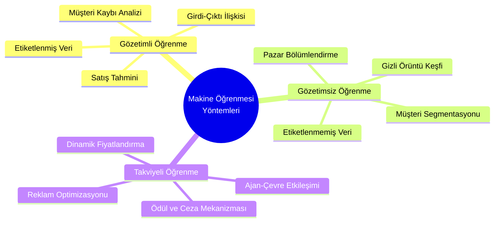

## Bilgilendirme

**Ödev**: Henry Ford ve Fordizm akımının pazarlama ile ilişkisi bayram sonrasına ödev olarak verildi.

---
Başlamadan önce, [[fordizm|Fordizm]] araştırmasına bakmanızı öneririm ödev için. Ancak bundan da öte, [[fordizm-kritik|Fordizme yönelik yaptığım şu kritiğe]] de bakmanızı öneririm. Nitekim Fordizm verimlilik, ivme gibi hikâyeler adı altında pazarlansa bile art alanında olan birçok gayri-insanî faktör var. 
## Veri, Enformasyon ve Makine Öğrenmesi

Yirminci yüzyılın ortalarından itibaren tahmine dayalı geleneksel yöntemlerin yerini veriye dayalı analitik sistemlerin almasıyla dijital dönüşüm mefhumu geri dönülemez bir patikaya saptı. Haddizatında veri (*data*) dediğimiz kavram kendi başına yalıtık ve anlamsız bir yığın olmaktan öteye gidemezken, belirli bir algoritmik tezgâhta işlenip enformasyona (information) tahvil edilmesiyle ancak bir değer yaratımından ve bir anlamdan söz edebiliriz.

Bu veri, yani ham gerçekler; sayılar, metinler yahut görseller formunda karşımıza çıkabilir ve toplanış biçimine göre **yapılandırılmış**, **yapılandırılmamış** yahut **yarı yapılandırılmış** olarak tasnif edilir. Söz gelişi, elimizde belirli mülakat sorularıyla sahaya inmemiz **yapılandırılmış** bir veri seti sunarken anlık reaksiyonlarla şekillenen bir diyalog **yarı yapılandırılmış** formata bürünüri.

- **Yapılandırılmış (Structured) Veri**: Önceden belirlenmiş mülakat sorularıyla alınan net yanıtlar buna örnektir.
- **Yarı Yapılandırılmış (Semi-structured) Veri**: Hem hazırlıklı soruların hem de spontane gelişen diyalogların harmanı.
- **Yapılandırılmamış (Unstructured) Veri**: Tamamen spontane, o anki akıştan elde edilen, kategorize edilmesi en zor olan veri havuzu.

Gelgelelim insanın öğrenme süreci nasıl ki geçmiş deneyimlerin zihinde tortulaşıp geleceğe dair bir projeksiyon sunmasına dayanıyorsa, makine öğrenimi de tam olarak bu zemine oturur. Arthur Samuel'in açıkça "*programlanmaksızın bilgisayarla öğrenme yetisi kazandıran alan*" olarak tanımladığı bu sistem, elimizdeki devasa veri yığınlarından geçmiş deneyimleri devşirerek geleceğe dair isabetli öngörülerde bulunur. Yapay zekânın şemsiyesi altındaki bir daldır **makine öğrenimi**.

Makine öğrenmesi üç temel kolon üzerine bina edilir:

1. **Temsil (Representation)**: Modelin veriyi nasıl algıladığı, yapılandırdığı ve kavradığıdır.
2. **Değerlendirme (Evaluation)**: Kurulan modelin başarısının hangi metriklerle ölçüldüğü, kendi kendini nasıl sınadığıdır.
3. **Optimizasyon (Optimization)**: En iyi modelin en doğru performans kriterlerine göre nasıl seçileceğidir.

Süreç verinin toplanmasıyla başlar, temizlenmesiyle devam eder. Ardından anlamlı özelliklerin cımbızlanmasıyla bir eğitim veri seti (training set) oluşturulur ve en nihayetinde daha önce hiç karşılaşılmamış veriler üzerinde dahi isabetli tahminler yapabilen bir algoritma tecessüm eder.

>[!important] Makine Öğrenmesi Yöntemleri 
> Yukarıdaki diyagramda yer alan üç temel öğrenme yöntemi arasındaki fark bilinmelidir. Hoca bu yöntemlerin art alanlarını ezberlememizi istemiyor, işin tekniğine girmemizi de istemiyor. Sadece ne olduğunu bilmemiz ve pazarlama ile entegre edebilmemiz yeterli. Gözetimlinin etiketli veriyle, gözetimsizin gizli örüntülerle (bkz. [[veri-madenciligi-4]]), takviyelinin ise ödül/ceza ile çalıştığını zihnimize kazımalıyız.

### Endüstriyel Evrim ve Nesnelerin İnterneti
Yapay zekânın şafağın gelmeden evvel üretim ilişkilerinin nasıl evrildiğine bakmak elzemdir. Endüstri 1.0 buhar gücüyle mekanik tahakkümü başlatırken Endüstri 2.0 Henry Ford'un seri üretim (mass production) bantlarıyla elektriği sermayenin hizmetine sunmuştur. Nüfusun patlaması ve talebin arzı fersah fersah aşmasıyla seri üretime geçilmiş, kışın ortasında domates yiyebilme lüksü bu dönemin bir semptomu olarak hayatımıza girmiştir. Endüstri 3.0 bilgisayarları ve otomasyonu sahaya sürerken bugün içinde debelendiğimiz Endüstri 4.0 siber-fiziksel sistemleri ve [[Nesnelerin İnterneti (IoT)]] mefhumunu doğurmuştur.

Nesnelerin interneti, cihazların sensörler aracılığıyla birbirleriyle fısıldaşmasıdır kabaca. Akıllı evlerin siz daha kapıdan girmeden kahvenizi demlemesi yahut perdeleri aralaması bu ağ toplumunun küçük bir tezahürüdür. Keza artırılmış gerçeklik (Augmented Reality - AR) teknolojisi mağazalardaki akıllı aynalar (smart mirrors) vasıtasıyla kıyafeti fiziken giyme zahmetini ortadan kaldırıp dijital bir izdüşümünüzü size sunarak tüketim pratiklerini zaman tasarrufu adı altında hızlandırır. 

### Yapay Zekâ
1956 yılında John McCarthy tarafından literatüre kazandırılan [[Yapay Zekâ]], makinelerin insan benzeri bilişsel reaksiyon göstermesi ve problem çözme yetisi kazanmasıdır. Alan Turing'in "Makineler düşünebilir mi?" sorusuyla tohumlarını attığı bu alan bugün üç farklı kategoride ele alınır:

1. **Dar/Zayıf Yapay Zekâ (Narrow AI)**: Yalnızca spesifik görevleri icra edebilen Siri yahut Alexa gibi sistemlerdir. İçinde bulunduğumuz evre büyük oranda budur.
2. **Güçlü Yapay Zekâ (General AI)**: İnsan seviyesinde bilinç ve karar verme yetisine sahip olması beklenen, henüz tam anlamıyla tecessüm etmemiş ancak eşiğinde olduğumuz yapıdır.
3. **Süper Yapay Zekâ (Super AI)**: İnsan zekâsını fersah fersah aşacak olan ve kendi dilini üreterek kontrolsüz bir tekâmüle evrilme potansiyeli taşıyan distopik yahut ütopik nihai form.

Gardner'in zekâ teorisinden bahsetti hoca ama, tam bir saçmalık bu bana soracaksanız. Haddizatında zekâ dediğimiz mefhum Spearman'ın yüzyıl evvel ortaya koyduğu *g* faktöründen başka bir şey değildir. Zekâ öyle sekize, ona, şu ya da bu parçalara bölünmez; zekâ, en saf hâliyle örüntü yakalama, soyutlama yapabilme, örüntüler arası korelasyon kurabilme yetisinin ta kendisidir. Bir insan bu *g* faktörünü alır, notalar üzerinde tecessüm ettirir, "müzikal zekâ" derler; sayılar üzerinde tecessüm ettirir, "sayısal/lojik zekâ" derler. Hâlbuki motor aynı motordur, işleyen çark aynıdır, değişen yalnızca o bilişsel kapasitenin hangi referans çerçevesinde, hangi parametreyle pratiğe döküldüğüdür. Dolayısıyla yok sen şu zekâsın, sen şucusun bucusun gibi sınıflandırmalar tamamıyla politik amaçla yapılan saçma sınıflandırmalar gibi geliyor. Nitekim bunları böyle sınıflandırmaya gerek yok, sanki farklı bir mekaniğe dayanıyormuş gibi.

Pazarlama ekosisteminde yapay zekâ, e-ticaret platformlarının dinamik fiyatlandırma stratejilerinde saniyeler içinde rakip analizi yapıp fiyat güncellemesinde yahut Netflix'te ve YouTube'da geçmiş izleme verilerinizi sömürerek bize özel kişiselleştirilmiş bir ortam oluşturur. Ancak bu sistemler kusursuz değildir. Algoritmik ön yargılar, telif hakkı ihlalleri ve en mühimi, hatalı verilerle beslendiğinde yanlış bir bilgiyi mutlak doğruymuş gibi inatla savunabilir. Etik sorunları da bünyesinde barındırır tabii, nihai karar aşamasında insan faktörünün denetimi de hâlâ zaruridir yapay zekâda.

## İngilizce Terimler
- **Data**: Veri
- **Information**: Enformasyon
- **Machine Learning**: Makine Öğrenmesi
- **Artificial Intelligence (AI)**: Yapay Zekâ
- **Augmented Realıty (AR)**: Artırılmış Gerçeklik
- **Mass Production / Mass Customization**: Seri Üretim / Kitlesel Kişiselleştirme
- 

---

## Derse Aşkın: Örüntüler, Bağlantılar ve Kritikler

