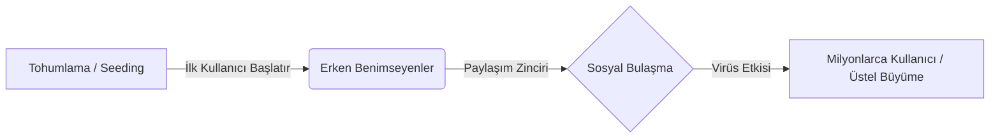
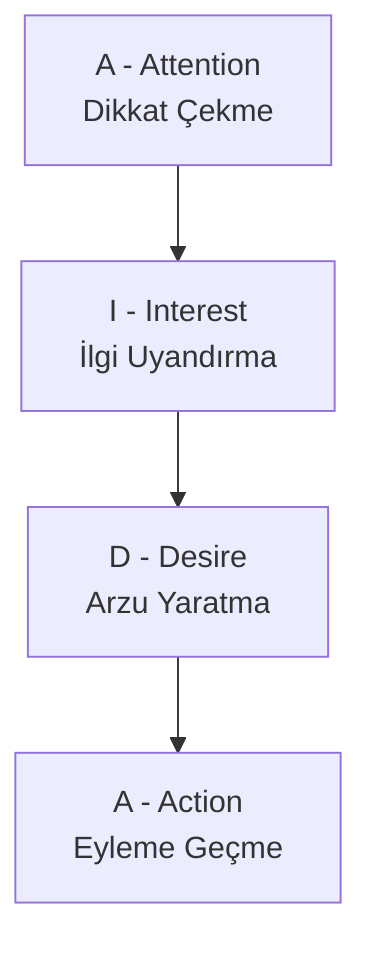

## Dersin Bürokrasisi, Vurgular vs.

- **Ödevlerin Amacı:** Verilen ödevler sadece not için değil, **tartışma ve bağlantı kurma (bağlam yaratma)** yeteneğini geliştirmek için var aynı zamanda. 

---

## 1. Ağ Toplumu ve Pazarlama İlişkisi
Geçen hafta Manuel Castells üzerinden değinilen [[Ağ Toplumu (Network Society)]] kavramını bu hafta doğrudan pazarlama modelleriyle ilişkilendirdik. Kavramları ezberlemek yerine aralarındaki ilişkiyi kurmak epey mühim. Castells'in "Bilgi Kenti" yaklaşımına göre endüstriyel çağın dikey, hiyerarşik yapısı yerini yatay, esnek ve gevşek bağlı ağlara bırakmıştır.

- **B2B (Business to Business):** Firmalar arası ağ etkileşimi.
- **B2C (Business to Customer):** İşletmeden müşteriye.
- **C2C (Customer to Customer):** Tüketiciden tüketiciye (Örn: Sahibinden, Letgo). Bu ağ yapısı dijitalleşme ile devasa boyutlara ulaşmıştır.

**İletişim Ağları:**
- **Dış İletişim:** Müşteri hizmetleri (7/24 destek ağları). Şirketin itibarı için kritiktir.
- **İç İletişim (Kurum İçi Çapraz Koordinasyon):** Rektörlüğün attığı maili herkes görürken, işletme fakültesinin kendi içindeki mailleşmesini rektörlüğün görmemesi gibi hiyerarşik veya çapraz ağ yapıları.

## 2. Sosyal Bulaşma ve Viral Pazarlama
Bilginin veya bir davranışın ağ içerisindeki düğümler (kullanıcılar) arasında yayılması. Süreç biyolojik bir virüsün yayılmasına veya suya atılan bir taşın yarattığı dalgalara benzer.

- **[[Sosyal Bulaşma]] (Social Contagion):** Ağ üyelerinin yeniliklerle ilgili tutum ve davranışlara diğer üyeler aracılığıyla maruz kalmasıdır. Virüs gibidir bir nevi. Bilgi doğru da olsa yanlış da olsa hızla yayılır.
	- Bulaşma iki yönlü olabilir: Yukarıdan aşağıya (üst gelir grubundan alt gelir grubuna) veya aşağıdan yukarıya (alt gelir grubundan üst gelir grubuna).
- **[[Viral Pazarlama]] (Viral Marketing):** Sosyal bulaşma dinamiğinin bilinçli olarak markalar tarafından kullanılmasıdır. (Örn: Tom Dickson'ın "Will it Blend?" YouTube videoları). Bu videolar sayesinde Blendtec firmasının satışları %700 artmıştır
	- *Avantajları:* Düşük maliyet (bedava reklam), üstel (exponential) büyüme, yüksek hız ve geniş erişim.
	- *Dezavantajları:* Kontrolün kaybedilmesi. Marka için olumsuz bir durum da aynı hızla yayılabilir.

**Viral Kampanyaların Aşamaları:**
1. **Tohum Atma (Seeding):** İlk kullanıcının (veya markanın) içeriği ağa bırakması.
2. **Kuluçka:** İçeriğin ilk kitle tarafından algılanması.
3. **Bulaşma:** İçeriğin kitleler arası paylaşımı.

>[!NOTE] Jonah Berger'in "Contagious" Yaklaşımı
>Başarılı bulaşıcı içerik için 6 unsur (STEPPS) vardır:
>1. **Sosyal Para Birimi**: Kişiyi iyi gösteren içerik.
>2. **Tetikleyiciler**: Akılda kalıcılık.
>3. **Duygu**: Yüksek uyarılma düzeyi.
>4. **Kamu**: Gözlemlenebilirlik ve taklit.
>5. **Pratik Değer**: Faydalı bilgi.
>6. **Hikâye**: Anlatı yapısı.

 

> [!TIP] AIDA Modeli
> Tüketicinin bir reklama/içeriğe maruz kaldığında geçirdiği psikolojik evreler, reklamcılığın temel modeli olan **AIDA** ile açıklanıyor. *(Sınavda sorulma ihtimali yüksek).*  
> **A**ttention (Dikkat): Tüketicinin dikkatini çekmek.  
> **I**nterest (İlgi): Ürüne yönelik ilgi uyandırmak.  
> **D**esire (Arzu): Tüketicide ürüne sahip olma arzusu uyandırmak.  
> **A**ction (Eylem): Satın alma davranışını gerçekleştirmek.

### 3. Ağızdan Ağza Pazarlama (WOMM) ve Güven
Geleneksel pazarlamadan daha etkilidir çünkü kaynağı markanın kendisi değil, deneyimlemiş bir diğer tüketicidir. İnsanlar markalara değil, **kendi akranlarına (diğer tüketicilere) güvenirler.**

- **E-WOMM (Electronic Word of Mouth):** İnternet ortamındaki elektronik ağızdan ağza pazarlamadır.
- **Özellikleri:** Eşzamanlıdır, asenkrondur, coğrafi sınırları yoktur. Satın alma niyetini doğrudan etkiler. Özellikle yüksek riskli ve pahalı ürünlerde (örn: Cartier saat veya araba alırken) tüketiciler e-WOMM'a (yorum okumaya) yoğun ihtiyaç duyar. 
	- Fiziksel sosyal ağlar ortalama 150 kişiyle sınırlıyken e-WOMM'un erişimi küreseldir.

### 4. Dijital Psikoloji: Normatif Baskı ve Ördek Sendromu
İnsanlar sosyal ağlarda birer düğüm noktasıdır ve diğer düğümlerden etkilenirler.

- **Normatif Baskı:** Akran onayı alma veya sosyal uyum ihtiyacı. *"Herkesin iPhone'u var, benim de olmalı"* hissi. (Bkz. [[Sosyal Kanıt]]). 
- **[[Ördek Sendromu]] (Duck Syndrome):** Ördekler suyun üzerinde çok sakin, estetik ve mutlu süzülürler. Ancak suyun altına baktığınızda ayaklarını hayatta kalmak/ilerlemek için çılgınca çırptıklarını görürsünüz.
	- **Sosyal Medya Bağlantısı:** İnsanlar Instagram'da mükemmel hayatlar, mutlu evlilikler, harika tatiller sergiler (suyun üstü). Ancak arka planda kavgalar, borçlar, depresyon vardır (suyun altı). Sosyal medya tamamen "iyi görünme" sanrısıdır.

### 5. Marka Toplulukları (Brand Communities)
Tüketicilerin sadece bir ürünü satın almakla kalmayıp, o marka etrafında bir **"kabile" (tribe)** oluşturmasıdır. (Michel Maffesoli'nin 'Modern Kabileler' kavramına dayanır).

> [!IMPORTANT] Muniz ve O'Guinn Marka Topluluğu Modeli
> Hoca sınavda bunu sorabileceğini belirtti. Bu modele göre bir marka topluluğunun 3 şartı vardır:
> 1. **Biz Bilinci (Consciousness of Kind):** "Biz Apple kullanıcılarıyız", "Biz Harley Davidson'cıyız" hissiyatı. Üye olmayanlardan ayrışma.
> 2. **Ritüeller ve Gelenekler:** Ortak semboller, markaya özgü kutlamalar veya jargonu paylaşma.
> 3. **Ahlaki Sorumluluk:** Topluluk üyelerinin birbirine yardım etme güdüsü (Örn: Yolda kalan bir Harley sürücüsüne diğerinin yardım etmesi veya Apple forumlarında insanların birbirinin teknik sorununu çözmesi). 
>Bu modelde odak noktası sadece marka değil, aynı zamanda müşteri-müşteri arasındaki karmaşık ağ yapısıdır.

### 6. Etkileyiciler (Influencers) ve Nesnelerin İnterneti (IoT)
- **Ünlü Etkileyiciler (Celebrities):** Çok geniş kitlelere hitap ederler ama samimiyetleri/güvenilirlikleri düşüktür.
- **Mikro Etkileyiciler / Sıradan İnsanlar:** Kitleleri küçüktür ama etkileşimleri ve güvenilirlikleri çok daha yüksektir.
- **Kanaat Önderleri / Fikir Liderleri (Opinion Leaders)**: Belirli bir alanda uzmanlaşmış kişilerdir. Güven temelli ilişki kurarlar (Örn: Sadece gıda üzerine içerik üreten biri).
	- Kitleleri peşinden hop diye sürükleyen, orantısız bir etkiye sahip olan kişilerdir.
	- Ağ stratejilerinin üç temel varsayımından biri şudur: **Kanaat önderleri hedeflenmelidir. Başarılı bir sosyal bulaşma yaratmak istiyorsak bu kişileri bulmak şart**.
- **Pazarlama Kurtları (Marketing Mavens):** Belirli bir pazar veya ürün hakkında derinlemesine bilgi sahibi olan, piyasa dedikodularını, indirimleri, kampanyaları bilen ve bunu çevresiyle paylaşan uzman tüketicilerdir. **Fikir liderlerinden farkı; uzmanlıklarının tek bir ürün kategorisine özgü olmaması, genel pazar bilgisine sahip olmalarıdır.**
- **[[Nesnelerin İnterneti (IoT)]]:** Cihazların (buzdolabı, saat, araba) sensörler aracılığıyla internete bağlanıp birbirleriyle veri alışverişi yapmasıdır. Pazarlamacılar için devasa bir **Büyük Veri (Big Data)** kaynağıdır. 
	- IoT sistemi üç temel bileşenden oluşur: Fiziksel nesneler, bağlantı altyapısı ve veri işleme sistemleri. Pazarlama karması (4P) üzerinde Dinamik Fiyatlandırma ve Kişiye Özel Kampanyalar gibi devasa yenilikler sunar.

### 7. Tüketimde Fayda (Utility) Türleri
- **Fonksiyonel Fayda:** Ürünün temel işlevini yerine getirmesidir. (Örn: Saatin zamanı göstermesi, arabanın A noktasından B noktasına götürmesi).
- **Hedonik (Hazcı) Fayda:** Ürünün sağladığı statü, lüks hissi, psikolojik tatmin. (Örn: Rolex saatin zamanı göstermekten çok "Ben zenginim" statüsü vermesi). Dijital pazarlama genellikle fonksiyonel değil, hedonik faydaya odaklanır.
	- Hoca hedonik diyor ama asıl teorik terim Thorstein Veblen'in "Gösterişçi Tüketim" ve Baudrillard'ın "Gösterge Değeri" kavramlarıdır. Tüketici Rolex'i sadece haz almak için değil, ötekine bir mesaj (gösterge) yollamak ve sınıf farkını belli etmek için alır. Hedonizm bireyseldir, gösterge değeri ise toplumsaldır.

---

## **Derste sorulan yahut dile getirilen İngilizce terimler/kelimeler** (*Amme hizmeti, gerçi tüm notlar amme hizmeti ama...*)

- **Social Contagion (Sosyal Bulaşma):** *Contagion* kelimesi tıpta virüsün bulaşması/yayılması demektir. Sosyolojide bilginin bulaşmasıdır. 
- **Viral Marketing (Viral Pazarlama):** Zaten dilimize pelesenk olmuş bir kelime. *Virus* kökünden gelir.
- **Attention, Interest, Desire, Action (AIDA):** İlgi, Merak, Arzu, Eylem (ya da eyleme geçiş).
- **Seeding (Tohum Atma):** Viral pazarlamada içeriği ilk yayan kişilerin eylemi.
- **Tribe / Modern Tribes (Kabile / Modern Kabileler):** Michel Maffesoli'nin sosyolojik konsepti.
- **Marketing Mavens (Pazarlama Kurtları):** *Maven* = bilgiyi anlayan, uzman.
- **Celebrity**: Ünlü 
- **Influencer**: Etkileyici

### 🔗 Bağlantılar: Derse Aşkın

1. **[[Ördek Sendromu - Bağlantı]]**
2. **[[Marka Toplulukları - Bağlantı]]**

