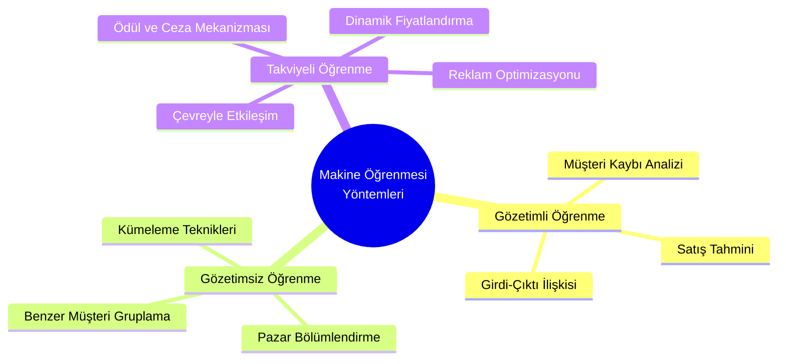
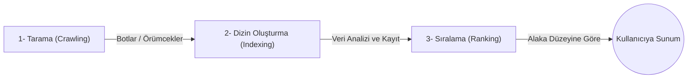

## Bürokrasi, ödevler vb.

- **Ödev**: Chatbot (Sohbet Robotları -yahut *Sohbot*) teknolojilerinin ne işe yaradığı ve yapay zekâ desteğiyle özellikle pazarlama alanında nasıl kullanıldığının araştırılması (Hocanın bu konuda yazılmış bir makalesi varmış).
	- [[Sohbotlar ne işe yarar, YZ destekli sohbot pazarlamada nasıl kullanılır]]
- **Sınav Beklentisi ve Vurgular**:
	- Hoca daha önceki derslerdeki gibi yine vurguladı: Sınavda kavramların salt ne olduğundan ziyade **pazarlamada nasıl kullanıldığı** ve **diğer kavramlarla nasıl ilişkilendirildiği** gibi sorular üzerinden ölçüm yapılacak.
	- **Müşteri Tatmini (Customer Satisfaction)** kavramının formülünün kesinlikle not alınmasını, sınavlarda anlık bilgi veya soru olarak karşımıza çıkacağını üstüne basa basa belirtti.

---

# Ders Notları
## 1. Makine Öğrenmesi (Machine Learning) ve Pazarlama
Geçen haftanın kısa bir özeti minvalindeydi bu kısım. Pazarlamadaki sezgisel yaklaşımlardan veri tabanlı (data-driven) yaklaşımlara geçiş anlatıldı. Verinin (açık, statik, yapılandırılmış, yapılandırılmamış) tek başına bir anlam ifade etmediği, **işlendikçe değer kazandığı vurgulandı**.

Makine öğrenimi, sistemin tıpkı bir işletme gibi **Girdi (Input)** $\to$ **Süreç/İşlem (Process)** $\to$ **Çıktı (Output)** mantığıyla (bkz. [[3- Modern Yönetim Anlayışı#Sistemin Ögeleri|Sistemin Öğeleri]]) çalışmasına dayanır. Pazarlamada bu süreç ürünün ilk girişinden satış sonrası desteğe (örn: e-ticaret sitelerindeki 5 yıldızlı yorumların algoritma tarafından öne çıkarılması) kadar her aşamada aktiftir.

---
## 2. Endüstri 4.0, Fordizm ve Yapay Zekâ
Endüstriyel devrimlerin ardından 2011 yılında Almanya'da ortaya çıkan Endüstri 4.0; nesnelerin internetini, bulut bilişimi ve otonom robotları hayatımıza sokmuştur.

- **Fordizm (Geçen Haftanın Ödevi)**: Henry Ford'un pazarlama anlayışı tüketicinin taleplerinin göz ardı edildiği tek tip (standart) üretime dayanır. Düşük fiyat stratejisiyle ölçek ekonomisi (sürümden kazanma) yaratılmıştır. "Ne üretirsem onu satarım" mantığı egemendir (Bkz. [[fordizm]]).
- **Yapay Zekâ (AI)**: 1956'da John McCarthy tarafından literatüre kazandırılmıştır. Türkiye'de Cahit Arf'ın "Makineler nasıl öğrenir?" semineri vardır...
	- [[dijital-pazarlama-4#Yapay Zekâ|Yapay Zekâ - Dijital Pazarlama 4. Ders]]

>[!important] Müşteri Tatmini (Customer Satisfaction) - Sınav Vurgusu
>Hoca bu formülü not almamızı özellikle istemişti:  
>**Müşteri Tatmini = Hâlihazırda Elde Edilen Durum (Deneyim) - Beklentiler**  
>Eğer hâlihazırda elde edilen durum (yani **deneyimimiz**), tasavvur ettiğimiz o beklentiden/beklentilerden fazlaysa (pozitifse) müşteri tatmini sağlanır. Buna mukabil beklentimiz arşa çıkmışken deneyimimiz ondan azsa (negatifse), bu sefer müşteri tatmini sağlanmaz; daha ziyade tatminsizlik doğar.

- **Dinamik Fiyatlandırma (Kişiselleştirme)**: Söz gelimi, bir alışveriş uygulamasında bir kişi, aynı ürüne diğer kişilerden daha sık bakıyorsa ve alışveriş de yapıyorsa, algoritma bu kişiye daha cazip bir fiyat teklifi sunabilir. Veriye dayalı bir pazarlama stratejisine örnektir bu.

---

## 3. Artırılmış Gerçeklik (Augmented Reality - AR)

Gerçek dünya ile 3 boyutlu dijital içeriklerin bileşkesidir. Tüketicilerin fiziksel dünya algısına dijital nesnelerin entegre edilmesidir. Artırılmış gerçeklik kavramı ilk kez 1990'larda Boeing araştırmacısı Tim Caudell tarafından kavramsallaştırılmıştır. Ancak teknolojik temeli 1968'de Ivan Sutherland’ın geliştirdiği başa takılan görüntüleme sistemine dayanır. Ayrıca Azuma'ya göre bir sistemin AR sayılabilmesi için üç kural vardır: 

1. Gerçek ve sanalın birleşmesi
2. Gerçek zamanlı etkileşim
3. 3D ortamda çalışması.

- **Kullanım Alanları**: Akıllı aynalar (kıyafet denemeden üstünde görme), IKEA Place uygulaması (mobilyayı odaya yerleştirme), Sephora (makyaj deneme), konum tabanlı oyunlar (Pokemon Go).
- **Pazarlamadaki Yeri**: Tüketiciye satın almadan önce (pre-purchase), mekâna dahi gelmesine gerek duymaksızın  sanal bir deneyim yaşatır. Sanal gerçekliği artırır, ürünü kendi mekânına yerleştirebileceği gibi (söz gelimi, bilgisayar alacaksa boyutlarını görebilir, mobilya alacaksa da aynı cümleden) istediği kıyafeti de yine mekâna gitmeksizin, kendi üzerinde sanal gerçekliği artırarak deneyebilir. Bu da ürünle bağ kurmasını kolaylaştıracağı gibi, satın alma ve tekrar tekrar satın alma süreçlerini de atıracaktır; nitekim, kolay bir şekilde deneyebilecek ve alabilecektir.
- **Dezavantajları**: Kötü tasarlanmış uygulamalar marka algısını zedeler; gizlilik ve güvenlik sorunları yaratır. **Aşırı bilgi yüklemesi de satın alma kararını olumsuz etkileyebilir**. Yani tüketiciyi dijital katmanlara ve bilgiye boğmak, karar felcine (paradox of choice) yol açar. Bu yüzden bilgi kesinlikle kişiselleştirilmelidir.

### Hedonik ve Faydacı (Fonksiyonel)
- **Hedonik Tüketim**: İhtiyaçtan ziyade haz, zevk, hoşnutluk, duygusal tatmin için yapılan tüketimdir. Söz gelimi, eğlenmek için Netflix izlemek gibi.
- **Faydacı Tüketim**: Doğrudan bir ihtiyacı gidermeye, işlevselliğe yönelik tüketimdir. Söz gelimi, yön bulmak için Google Maps kullanmak gibi. Ödevi teslim etmek için Microsoft Word kullanmak gibi.

---

## 4. Arama Motorları (Search Engines) ve Optimizasyon
90'larda Alan Emtage tarafından geliştirilen sistemlerdir. Kullanıcıların anahtar kelimelerle internetteki içeriklere ulaşmasını sağlar.

### Arama Motoru Pazarlaması (Search Engine Marketing -SEM-)
- **Ücreti Reklamlar**: Tıklama başına ödeme (Pay-per-click) sistemiyle çalışır. Arama sonuçlarında "Reklam" ibaresiyle en üstte çıkar.
- **Doğal (Organik) Sonuçlar ve SEO**: Herhangi bir ücret ödemeden arama motoru algoritmalarına uyum sağlayarak üst sıraya çıkmaktır. Tüketiciler organik sonuçlara daha çok güvenir.
	- *Sayfa İçi (On-page) Optimizasyon*: İçerik kalitesiyle, anahtar kelime kullanımıyla.
	- *Sayfa Dışı (Off-page) Optimizasyon*: Dış bağlantılar, site haritası.

---

## 5. Mobil Pazarlama ve Sosyal Medya
- **Özellikleri**: Geleneksel pazarlamaya göre daha hızlı, kişiselleştirilmiş ve **çift yönlü iletişim (marka ve tüketici karşılıklı etkileşiminde)** sunar.
- **Yöntemler**: Konum bazlı hedefleme (GPRS), SMS pazarlama, QR kodlar.
- **Parakendecilik (Retail)**: Ürünü büyük miktarda alıp nihai tüketiciye küçük miktarlarda satma işi.

---

## İngilizce terimler vs.
- **Input / Process / Output**: Girdi / Süreç (İşlem) / Çıktı
- **Feedback**: Geri Bildirim / Geri Besleme
- **Customer Loyalty**: Müşteri Sadakati
- **Customer Satisfaction**: Müşteri Memnuniyeti/Müşteri Tatmini
- **Augmented Reality (AR)**: Artırılmış Gerçeklik
- **Search Engine**: Arama Motoru
- **Search Engine Optimization (SEO)**: Arama Motoru Optimizasyonu
- **Advertisement Bombarding**: Reklam Bombardımanı. Literatürde ve sektörde **Ad Bombardment** olarak kullanılır daha ziyade, tüketicide yarattığı etki bakımından "**Ad Fatigue" (Reklam Yorgunluğu)** olarak ifade edilir. **Bombarding** fiilimsisi pek kullanılmaz.
- **Word-of-Mouth Marketing** veya **Mouth-to-Mouth Marketing**: Ağızdan ağza pazarlama.
- **Two-Way Communication**: Çift yönlü iletişim. Hoca *two-faced communication* demişti galiba, eğer öyleyse yanlış söyledi. Nitekim **two-faced** "ikiyüzlü, riyakâr" anlamlarına gelir. Markaların tüketiciye karşı tutumunu düşünürsek doğru denilebilir :D Pazarlama terminolojisinde <b><u>two-way communication</u></b> denilir, doğrusu budur.