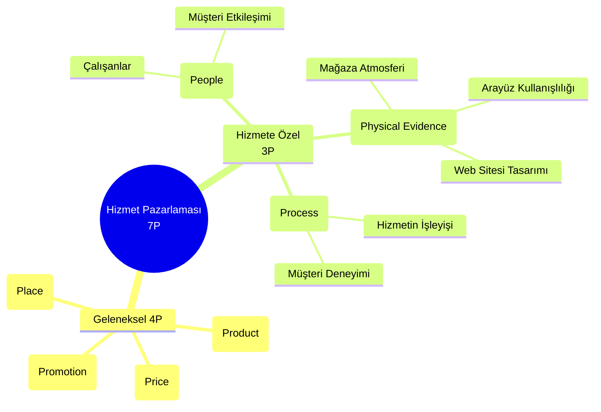
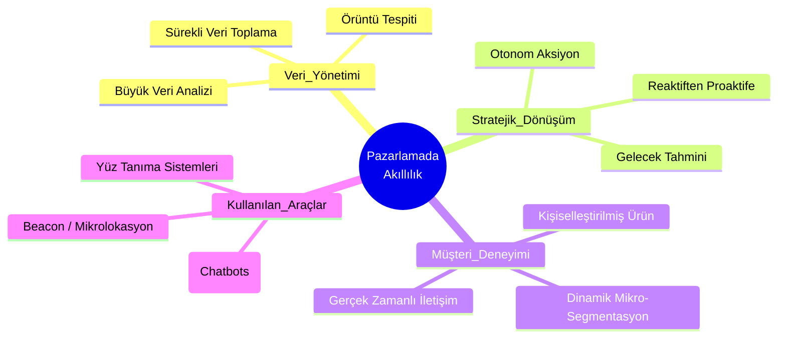

# Ders Notları

## 1. Sosyal Medya ve Çift Yönlü İletişim (Two-Way Communication)
Geleneksel pazarlamadaki tek yönlü bilgi akışının aksine sosyal medya, aracıları ortadan kaldırarak marka ile tüketici arasında **doğrudan etkileşim** kurulan bir ağ sunar. Pazarlama açısında şöyle avantajları olduğunu çıkarsayabiliriz:

1. **Maliyet ve Hız**: Hedef kitleye çok düşük bütçelerle ve anında ulaşabilme imkânı. Dijital Ekonomi dersinden bildiğimiz üzere, dijitaldeki ürünlerin de reklamların da **marjinal maliyeti sıfırdır**. Bir birim ekstra üretmenin maliyeti yoktur, ayrıca bunlar devinim içerisinde yayılır internet üzerinde.
2. **Müşteri Tatmini (Customer Satisfaction)**: Geçmiş haftalarda formülü verilen (Mevcut Deneyim - Beklentiler) kavramını anımsamak lazım. Sosyal medya aracılığıyla tüketicinin hem **hedonik** hem de **fonksiyonel** beklentileri hızlıca ölçülüp karşılanabilir. Ayriyeten, daha önce işlenen [[Sosyal Bulaşma]] dinamiği sosyal medyada vücut bulur; olumlu bir kampanya da olumsuz bir kriz de ağdaki kullanıcılar aracılığıyla saniyeler içerisinde yayılır. Reklamın iyisi kötüsü olmaz ya, o mesele.

---

## 2. İçerik Pazarlaması ve Platform Türleri
Bilginin ve dijital görünürlüğün yönetildiği çeşitli sosyal medya formatları mevcuttur.

#### Bloglar ve İçerik Pazarlaması (Content Marketing)
Günümüzde geleneksel web bloglarının yerini Instagram Reels, gezi/yemek videoları yahut LinkedIn makaleleri almıştır. Temel strateji ürünü doğrudan satmaya çalışmak yerine tüketiciye detaylı bilgi aktararak markanın dijital tanınırlığını artırmaktır.

#### Mikro Bloglar
Hızlı, kısa ve anlık içeriklerin paylaşıldığı platformlardır. En bariz örneği X'dir herhalde. Özellikle markaların kısa süreli indirim kampanyalarını, promosyonlarını duyurmasında veya acil durumlarda kriz yönetimini sağlamasında önemli bir rol üstlenir.

#### Medya Paylaşım Siteleri ve Vikiler
YouTube ve TikTok gibi video odaklı platformlar medya paylaşımına girerken, Wikipedia gibi vikiler (genişletilmiş bilgi blogları) sınıfındadır. Gelgelelim derste anlatılan bir tehlike var, biz buna **post-truth** deriz aslında; gerçeklik yanılgısı, gerçeklik sonrası olarak çevirmek mümkündür. Vikilerde içeriğin kullanıcılar tarafından üretilmesi ciddi bir bilgi kirliliğine ve dezenformasyona yol açma riski taşır. Sosyal bulaşma ile beraber post-truth çok çabuk yayılır nitekim. 

---

## 3. Robotik Teknoloji, Endüstri 5.0 ve Yapay Zekâ
Robot kelimesi ilk kez 1920'de Karel Čapek tarafından literatüre kazandırıldı. Günümüzde robotlar şu prensiplerle çalışır: **Algıla (Sense), Düşün (Think), Eyle (Act)**.

Endüstriyel evrim sürecinde Endüstri 4.0 (Büyük Veri, ML, IoT) yerini yavaş yavaş **Endüstri 5.0**'a bırakmaktadır. **Endüstri 5.0, yapay zekânın doğrudan üretim ve hizmet sistemlerine entegre edildiği, insan-makine işbirliğini vurgulayan bir evredir.** 

Her ne kadar zamandan tasarruv, ivme, kalite, ciddi maliyet düşüşü gibi avantajlar sunsa bile insanî etkileşimi ve öteki ile karşılaşmayı engelleyen, günbegün duygusal bağın yok olmasına ve tükdüzeliğe sebebiyet vermesi gibi olumsuz yanları da vardır. İstihdam/işsizlik sorunları da cabası.

1. **Endüstriyel Robotlar**: Endüstri işte. Üretim hattında, montajda, lojistikte, otomotiv sektöründe vs.
2. **Hizmet Robotları**: Hizmet işte bu da. Teslimat droneları, sağlık/ameliyat robotları, yaşlı bakım robotları gibi gibi, hizmet sektörüne değgin robot.

### Pazarlama Karması (4P) ve Robotlar
Robotik teknolojiler geleneksel 4P bileşenlerini şu şekilde dönüştürmektedir:
- **Ürün (Product)**: Robotik destekli üretimle hata payı sıfırlanır, ürün kalitesi standartlaşır.
- **Fiyat (Price)**: İşçilik ve enerji maliyetleri düştükçe, bu tasarruf tüketiciye daha uygun fiyat olarak yansıtılabilir (veya kâr marjı artırılır).
- **Dağıtım (Place)**: Otonom araçlar ve dronelar ile lojistik süreçleri hızlanır.
- **Tutundurma (Promotion)**: İnteraktif robotlar fuarlarda veya mağaza içinde ilgi odağı olarak markanın tanıtımını yapar.

### Hizmet Pazarlaması ve Teknoloji Kabul Modeli

>[!important] Hizmet Pazarlaması (7P) ve Teknoloji Kabul Modeli
>Pazarlamanın geleneksek 4P'sine (Ürün, Fiyat, Dağıtım, Tutundurma) hizmet söz konusu olduğunda 3 yeni 'P' eklenir (bkz. [[Hizmet Pazarlaması]]). [[teknoloji-kabul-modeli#Teorinin Temel Kavramları, İşleyişi vs.|Teknoloji Kabul Modeli (TAM)]] ile ilişkilendirilip sınavda sorulabilir.  
> 1.  **People (İnsan)**: Hizmeti sunan ve alan arasındaki etkileşim.
> 2. **Fiziksel Kanıt (Physical Evidence)**: Hizmet soyut olsa dahi sunulduğu ortamın somutluğu. Mağaza atmosferi, internet sitesinin tasarımı, arayüzün kullanım kolaylığı (TAM'daki *Algılanan Kullanım Kolaylığı*) bu kapsama girer.
> 3. **Süreç (Process)**: Hizmetin başından sonuna, müşteri memnuniyetini de kapsayan tüm adımlar.

---

## 4. Coğrafi Bilgi Sistemleri (CBS / GIS) ve Pazarlama
Verinin sadece metinden yahut sayıdan ibaret olmadığı, mekânsal bir boyutunun da olduğu sistemlerdir. Art alanında yine sayılar yatar gerçi. Google Earth, Yandex Haritalar vb.

Tüketicilerin arama geçmişleri, GPS hareketleri ve konum verileri büyük bir veri tabanında toplanır ve haritalar üzerinde anlamlı bilgilere dönüştürülür.

- **Pazarlamadaki Kullanımı**: Bir fabrikanın nereye kurulacağının (optimal kuruluş bağlamında) seçimi (bkz. [[4- Tesis İçi Yerleşimi ve Kapasite Planlaması#Tesis Yerleşim Planlaması|Tesis Yerleşim Planlaması]]), müşteri yoğunluk haritalarının çıkarılması, mağaza içi yönlendirmeler vs.
- **Veri Üretimi**: Google Haritalar'da bir işletmenin görünürlüğününün artması için kullanıcıların sürekli o konumu işaretlemesi, yorum ve fotoğraf atması (kitle kaynaklı veri üretimi) gerekir.
- **Radyo Frekansı (RFID)**: Hasta bilekliklerinden envanter ve depo yönetimine, mağazalardaki stok kontrolünden tedarik zincirine kadar geniş bir yelpazede fiziksel nesnelerin takibini sağlar.

---

## 5. Akıllı Sistemler (Smart Systems) ve Pazarlama Entegrasyonu
Teknolojinin dönüşümüyle beraber salt veri toplayan cihazlardan ziyade; veriyi **analiz eden, yorumlayan ve buna göre kendi kendine eylem üretebilen** yapılara geçiş yaptık. Bir önceki başlıkta robotlar için bahsettiğimiz "**Algıla, Düşün, Eyle**" mantığının tüm bir sisteme, ağa veya fiziksel altyapıya entegre edilmiş hâlidir bu.
### Akıllılık nedir?
Bir sistemin akıllı sayılabilmesi için bilgiyi toplaması yetmez; bilgiyi işlemeli, öğrenmeli ve en önemlisi **insan müdahalesi olmadan** eyleme dökebilmelidir.

## 6. Pazarlamadaki Akıllılık Paradigması ve Dönüşüm
Pazarlamada akıllılık; müşteri verisinin sürekli toplanması, anlamlandırılması, davranış örüntülerinin keşfedilmesi ve **geleceğe yönelik tahmin üretilerek otomatik aksiyon alınması** sürecidir.

### Geleneksel Pazarlama vs. Akıllı Pazarlama

- Toplu iletişimden $\to$ **Kişiselleştirilmiş** iletişime.
- Geçmiş veri (ex-post) analizinden $\to$ **Gerçek zamanlı (real-time) veri analizine**.
- Kampanya sonu ölçümünden $\to$ **Anlık performans optimizasyonuna**.
- Statik (sabit) segmentasyondan $\to$ **Dinamik mikro-segmentasyona**. 
- İnsan ağırlıklı karar mekanizmasından $\to$ **Yapay Zekâ destekli kararlara**.

## İngilizce Terimler
- **Augmented Reality**: Artırılmış Gerçeklik. Pokemon Go gibi *fiziksel dünya ile dijital nesnelerin* kamera aracılığıyla eşzamanlı birleşimine AR (Augmented Reality) diyoruz.