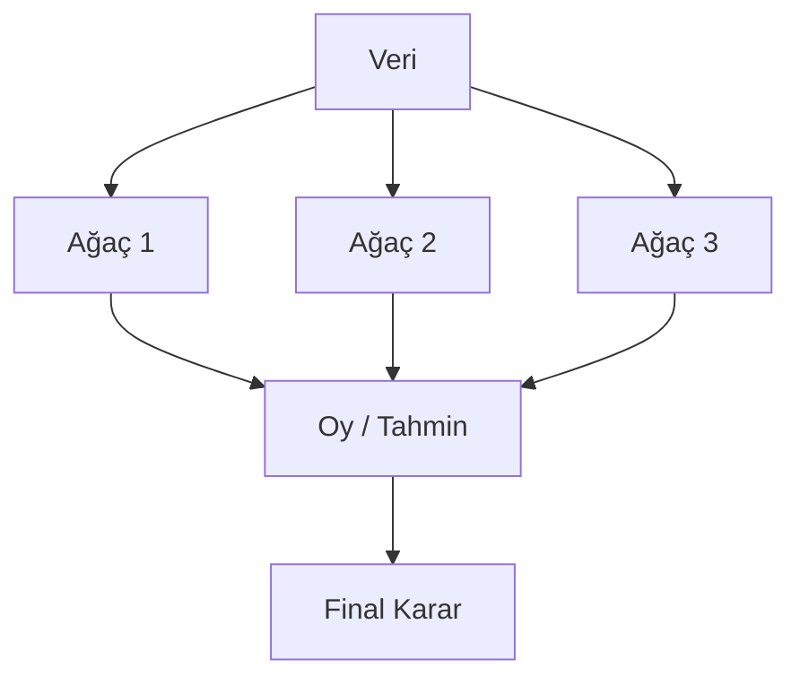
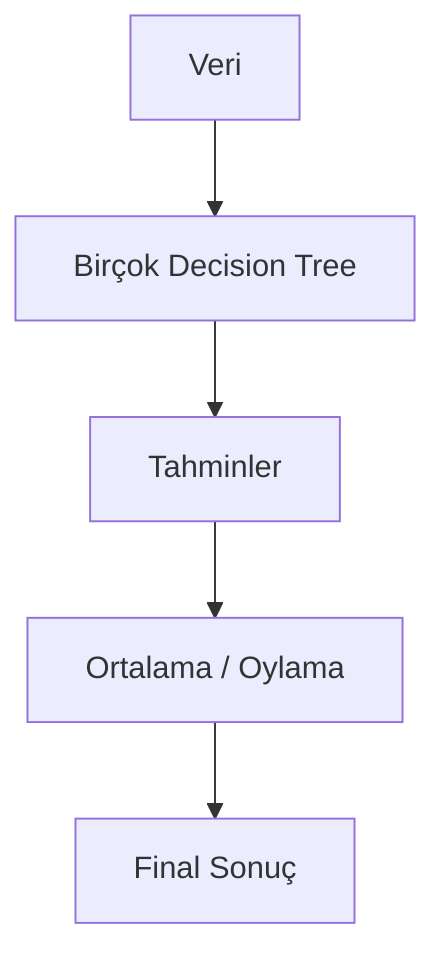
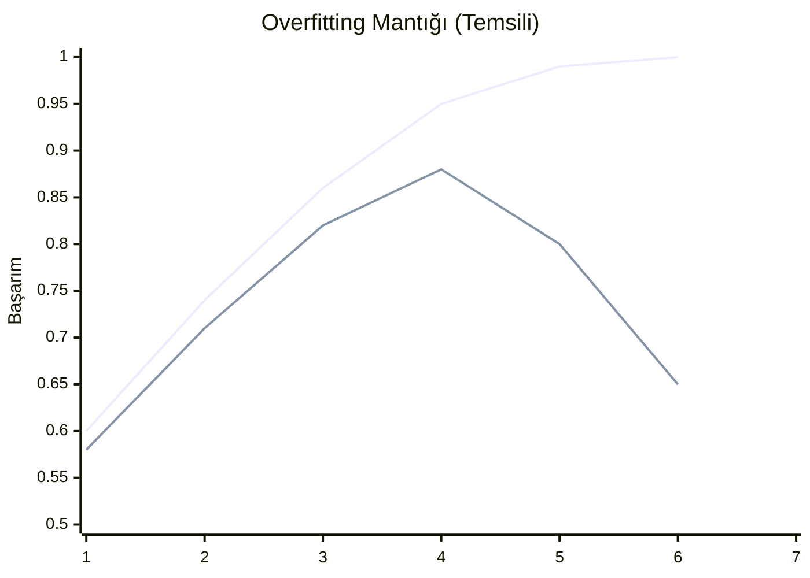
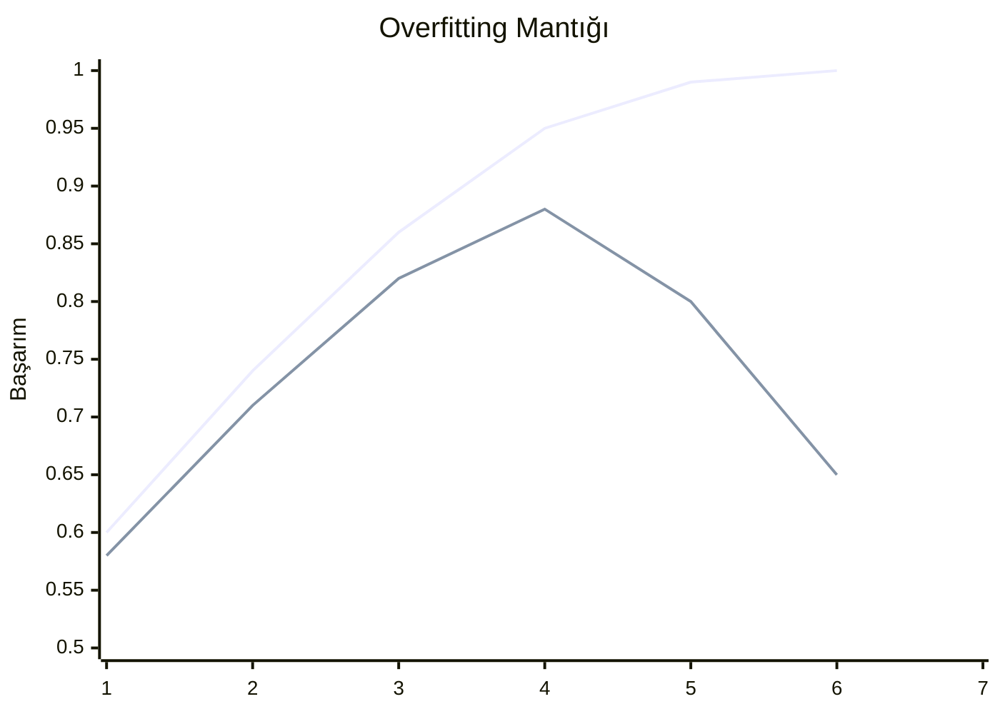
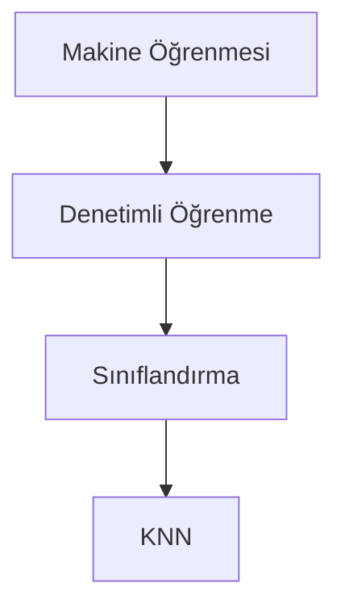
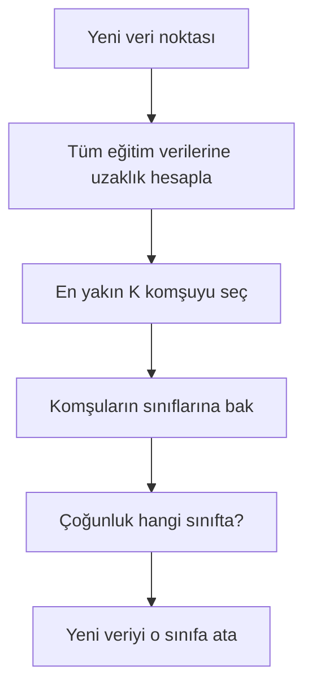
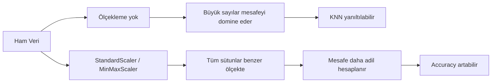
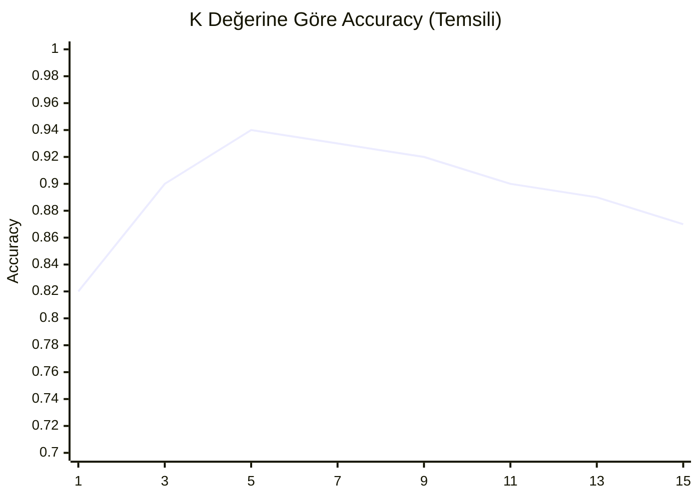

# Random Forests

>[!abstract] Tanım
><u>Karmaşık bir problemi çözmek ve modelin performansını iyileştirmek için birden fazla sınıflandırıcıyı birleştirme süreci olan topluluk öğrenme (ensemble learning) kavramına dayanır.</u>

## 1. Karar Ağacından Random Forest'e Neden Geçilir?

Geçen haftaki [[veri-madenciligi-4|Decision Tree]] tek başına güçlü bir algoritmaydı, fakat üç temel zaafı vardı:

1. **Overfitting yapabilir.**
2. **Veri değişimine karşı hassas olabilir.**
3. **Tek ağaç her zaman güçlü olmayabilir.**

Bunu çözmek için geliştirilen yaklaşım **ensemble learning**'dir.

### Ensemble Learning Nedir?

Birden fazla modelin birlikte çalışarak tek modele göre **daha güçlü ve daha kararlı** tahmin üretmesidir.

- **Tek model** → daha fazla hata yapabilir.
- **Birden fazla model** → daha stabil sonuç verir.

### Majority Voting (Çoğunluk Oylaması)

Mantık çok basittir:

- Model 1 → Evet
- Model 2 → Hayır
- Model 3 → Evet
- **Final karar** → Evet

Yani son kararı tek bir ağacın keyfine bırakmıyoruz. İnsanlık tarihinin hatırı sayılır kısmı zaten tek kişinin kararının bedelini ödeyerek geçti; burada bari o hatayı azaltıyoruz.



---

## 2. Random Forest Nedir?

**Random Forest**, çok sayıda **Decision Tree**'nin birlikte çalıştığı bir modeldir.

### Yapısı



### Avantajları

- **Overfitting azalır.**
- **Daha güçlü model** elde edilir.
- **Daha stabil sonuçlar** verir.
- **Feature importance** hesaplanabilir.

>[!note]
>Random Forest, overfitting'i tamamen yok etmez; ama **Decision Tree'ye göre daha dayanıklıdır**. Yani "asla hata yapmaz" değil, "tek ağaca göre daha güvenilirdir".

---

## 3. Random Forest Nasıl Çalışır?

PDF'deki 5 temel adım:

1. Eğitim setinden rastgele **K veri noktası** seçilir.
2. Seçilen veri noktalarıyla bir **karar ağacı** oluşturulur.
3. İstenilen kadar ağaç için bu işlem sürdürülür.
4. Aynı süreç tekrar tekrar uygulanır.
5. Yeni veri geldiğinde bütün ağaçların tahminleri alınır ve **çoğunluk oyu** ile sınıf belirlenir.

### Kritik Mantık

Eğer:
- bütün ağaçlara **aynı veri**, 
- aynı koşullar altında, 
- aynı davranışla eğitim verirsen,

bu ağaçların hepsi birbirine benzer sonuç üretir. O zaman orman kurmuş olmazsın, aynı ağacı çoğaltmış olursun. Güven artmaz, sadece kalabalık yapmış olursun.

Bu yüzden Random Forest'te amaç:
- farklı veri dilimleri görmek,
- farklı ağaçlar üretmek,
- sonra bunları ortak karara götürmektir.

---

## 4. Decision Tree ve Random Forest Karşılaştırması

| Özellik | Decision Tree | Random Forest |
|---|---|---|
| Yapı | Tek bir ağaç | Birçok ağacın birleşimi |
| Eğitim | Hızlı ve basit | Daha uzun sürer |
| Overfitting | Kolay ezberleyebilir | Ezberlemeye daha dayanıklıdır |
| Doğruluk | Genellikle daha düşük | Genellikle daha yüksek |
| Yorumlama | Çok kolay | Tek tek ağaçlar anlaşılır ama tüm orman daha karmaşıktır |
| Kullanım | Küçük veri ve açıklanabilirlik gereken durumlar | Daha güçlü ve güvenilir tahmin gereken durumlar |

### Kısa Özet

| Karşılaştırma     | Decision Tree         | Random Forest                                  |
| ----------------- | --------------------- | ---------------------------------------------- |
| Ağaç sayısı       | 1                     | 100+                                           |
| Veri kullanımı    | Tüm veri              | Her ağaç farklı veri dilimleri görebilir       |
| Özellik kullanımı | Tüm özellikler        | Her ağaç farklı özellik alt kümeleri görebilir |
| Dayanıklılık      | Daha az               | Daha fazla                                     |
| Doğruluk          | Genellikle daha düşük | Genellikle daha yüksek                         |

---

## 5. Accuracy, Train Accuracy, Test Accuracy ve Overfitting

### Accuracy Nedir?

**Accuracy**, modelin doğru tahmin ettiği örneklerin toplam örnek sayısına oranıdır.
$$
Accuracy = \frac{Doğru\ Tahmin\ Sayısı}{Toplam\ Tahmin\ Sayısı}
$$
### Train Accuracy Nedir?

Modelin **eğitim verisi üzerindeki başarısıdır**.

- Model bu veriyi eğitim sırasında gördüğü için genelde daha yüksektir.
- Çok yüksek çıkması tek başına iyi haber değildir.
- Bazen **1.00** veya **0.99** gibi değerler, modelin veriyi **ezberlediğini** gösterebilir.

### Test Accuracy Nedir?

Modelin **daha önce görmediği veri üzerindeki başarısıdır**.

Asıl güveneceğimiz metrik budur. Çünkü mesele eğitimi tekrar etmek değil, **genelleme yapabilmek**tir.

>[!important]
>**Öğrenmek = genelleme yapabilmek** demektir. Yani modelin yalnızca gördüğünü hatırlaması değil, görmediği veride de mantıklı davranabilmesidir.

### Overfitting Nedir?

Modelin eğitim verisini aşırı iyi öğrenip, yeni veride kötüleşmesidir.






**Best weight / en iyi nokta** aşıldığında train accuracy yükselmeye devam ederken test accuracy düşebilir. İşte istemediğimiz tablo budur.

### Verilen Tabloyu Yorumlayalım

| Train Accuracy | Test Accuracy | Yorum |
|---|---:|---|
| 1.00 | 0.70 | **Güvenilmez.** Ezberlemiş ama genelleyemiyor. Ağır overfitting. |
| 0.99 | 0.65 | **Güvenilmez.** Train çok yüksek, test zayıf. Ezberleme baskın. |
| **1.00** | **0.80** | **Kabul edilebilir.** Train tarafı çok yüksek ama test hâlâ makul. Genelleme var. |
| **0.94** | **0.92** | **Çok iyi.** Train-test dengeli, güvenilir sonuç. |
| **0.95** | **0.94** | **Mükemmele yakın.** Hem çok iyi öğrenmiş hem çok iyi genellemiş. |

### Bu Tabloda Overfitting Var mı?

- **İlk iki satırda** belirgin ve sorunlu overfitting vardır.
- **Üçüncü satırda** train-test farkı bulunduğu için hafif overfitting emaresi vardır ama test sonucu kabul edilebilir olduğu için model yine de iş görebilir.
- **Son iki satırda** ciddi overfitting sorunu yoktur; model dengelidir.

>[!note]
>Hocanın vurgusu şu: `0.95 / 0.94` gibi bir sonuç çok güçlüdür. Son üç satır daha çok **Random Forest** tarafında görülür. Ama veri aşırı temiz ve kaliteli ise **Decision Tree**'de de görülebilir.

---

## 6. Random Forest Kurma Checklist'i (PDF'deki 1-14 Adım)

Bu kısım sınav için bayağı değerli. Çünkü soru doğrudan "hangi adım ne yapıyor?" diye gelebilir.

1. **Kütüphaneleri yükle**  
   `pandas`, `numpy`, `matplotlib`, `seaborn`, `sklearn`
2. **CSV'den veriyi oku**  
   `pd.read_csv()`
3. **Verinin ilk görünümünü incele**  
   `df.head()` ve hedef sütun dağılımı
4. **Gereksiz sütunları kaldır**  
   Örn. ID, sıra numarası, anlamlı bilgi taşımayan sütunlar
5. **Kategorik değişkenleri tespit et**
6. **Hedef değişkeni sayısallaştır**  
   Örn. `Attrition: Yes/No` → `1/0`
7. **Diğer kategorik değişkenleri encode et**  
   `LabelEncoder` ya da uygun başka dönüşüm yöntemleri
8. **Train/Test ayır**  
   `train_test_split()`
9. **Model değerlendirme fonksiyonu tanımla**  
   Accuracy, train score, test score vb.
10. **Decision Tree modelini kur ve eğit**
11. **Karar ağacını görselleştir**
12. **Random Forest modelini kur ve eğit**
13. **Ormandaki tek bir ağacı seçip görselleştir**
14. **Feature importance grafiğini çiz**

>[!important]
>PDF ile notebook aynı hikâyeyi anlatıyor: veriyi oku, temizle, dönüştür, böl, modeli kur, ölç, karşılaştır, görselleştir.

>[!note]
>PDF'de kategorik veriler için **LabelEncoder** vurgulanıyor. Notebook'ta ise bazı yerlerde `pd.get_dummies()` kullanılmış. Sınav açısından esas fikir şudur: **Kategorik veriyi sayısallaştırmak zorundasın.** Hangi araçla yaptığın ikinci katman detaydır.

---

## 7. Random Forest İçin Kritik Parametreler

### Decision Tree tarafında en önemli parametreler

#### 1. `max_depth`
Ağacın kaç seviyeye kadar büyüyeceğini belirler.

- Çok büyük olursa ağaç fazla büyür.
- Fazla büyürse ezberleme artar.
- O yüzden overfitting'i kontrol etmek için kritik parametredir.

#### 2. `criterion`
Kök ve dallanma kararında kullanılacak saflık ölçüsüdür.

Genellikle:
- `gini`
- `entropy`

Eğer hiçbir şey yazmazsan, algoritma çoğu zaman varsayılan olarak **Gini** kullanır.

### Random Forest tarafında en önemli ek parametre

#### `n_estimators`
Ormanda kaç tane ağaç kurulacağını belirler.

- `100` ağaç → bir başlangıç değeri olabilir.
- `300`, `500`, `1000` denenebilir.
- Amaç: ağaç sayısı artınca **accuracy** iyileşiyor mu bakmak.

>[!question]
>Sınav mantığıyla bakarsak güzel soru şudur:  
>**Accuracy artmıyorsa önce n_estimators mı değiştirirsin, yoksa max_depth / criterion / train-test oranı gibi ayarları mı kurcalarsın?**
>
>Doğru düşünme biçimi: dene, ölç, karşılaştır, raporla.

---

## 8. Random Forest İçin Sınavlık Kod Parçaları

### 8.1. Veriyi eğitim ve test olarak ayırma

```python
X_train, X_test, y_train, y_test = train_test_split(
    X, y,
    test_size=0.2,
    random_state=42,
    stratify=y
)
```

**Satır satır mantık:**
- `X, y` → girişler ve hedef sütun
- `test_size=0.2` → verinin %20'si test için ayrılır
- `random_state=42` → her çalıştırmada aynı bölünmeyi üretir
- `stratify=y` → sınıf dağılımını train ve testte korur

### 8.2. Decision Tree kurma

```python
dt_model = DecisionTreeClassifier(
    criterion="gini",
    max_depth=10,
    random_state=42
)

dt_model.fit(X_train, y_train)
```

**Buradan soru gelir:**
- `criterion="gini"` → bölme ölçütü
- `max_depth=10` → ağacın derinliğini sınırlar
- `fit(...)` → modeli eğitir

### 8.3. Random Forest kurma

```python
rf_model = RandomForestClassifier(
    n_estimators=100,
    max_depth=10,
    random_state=42,
    n_jobs=-1
)

rf_model.fit(X_train, y_train)
```

**Buradan soru gelir:**
- `n_estimators=100` → 100 ağaç kur
- `max_depth=10` → her ağacın derinliğini sınırla
- `n_jobs=-1` → işlemcinin tüm çekirdeklerini kullan
- `fit(...)` → modeli eğit

### 8.4. Accuracy ölçme

```python
y_pred_rf = rf_model.predict(X_test)
rf_accuracy = accuracy_score(y_test, y_pred_rf)
print("Random Forest Accuracy:", rf_accuracy)
```

**Mantık:**
- `predict(X_test)` → test verisi için tahmin üretir
- `accuracy_score(...)` → gerçek değerlerle tahminleri karşılaştırır
- Çıkan sayı modelin doğruluk oranıdır

### 8.5. Train ve test skorlarını birlikte görmek

```python
print("Decision Tree Train Score:", dt_model.score(X_train, y_train))
print("Decision Tree Test Score :", dt_model.score(X_test, y_test))

print("Random Forest Train Score:", rf_model.score(X_train, y_train))
print("Random Forest Test Score :", rf_model.score(X_test, y_test))
```

Bu kodun amacı şudur:
- model ezberliyor mu?
- train çok yüksek, test düşük mü?
- Random Forest gerçekten daha dengeli mi?

### 8.6. Özellik önem dereceleri

```python
rf_importance = pd.Series(rf_model.feature_importances_, index=X.columns)
rf_importance.sort_values(ascending=False).head(10)
```

Bu kod:
- hangi sütunun tahminde daha etkili olduğunu bulur
- en önemli 10 özelliği sıralar

Grafik hâli:

```python
rf_importance.sort_values(ascending=False).head(10).plot(
    kind="barh", figsize=(8, 5)
)
plt.title("Random Forest - En Önemli 10 Özellik")
plt.xlabel("Önem Değeri")
plt.show()
```

---

# K-Nearest Neighbors (KNN)

## 9. KNN Nedir?

**K-en yakın komşu (K-Nearest Neighbors, KNN)**; gözlemlerin birbirine olan benzerliklerine göre tahmin yapan, **denetimli öğrenmede** sınıflandırma ve regresyon için kullanılan en temel algoritmalardan biridir.

### Makine Öğrenmesindeki Yeri



### Kısa Tanım

Sınıfı bilinmeyen yeni bir verinin, eğitim verisindeki örneklere olan **uzaklığı** hesaplanır. Sonra en yakın komşuların çoğunluğuna göre bu yeni veri bir sınıfa atanır.

---

## 10. KNN'de Etiket Meselesi

Senin taslaktaki “**etiketlemeksizin sınıflandırma yapan algoritma**” cümlesi teknik olarak düzeltilmeli.

### Doğrusu şu:
KNN **denetimli öğrenmedir**. Yani eğitim verisinde **etiket vardır**.

- `X` → özellikler
- `y` → etiket / hedef sütun

KNN'in farkı şudur:
- Decision Tree gibi eğitim aşamasında büyük bir kural yapısı kurmaz
- yeni veri geldiğinde mevcut etiketli örneklere bakarak karar verir

Yani:
- **etiket yok** değil,
- **etiketi öğrenilmiş kurala dönüştürmüyor**.

>[!important]
>Ders anlatımındaki “KNN etiketi kendi çıkarıyor gibi görünür” vurgusu, **yeni örneğin sınıfını komşulara bakarak belirlemesi** anlamında doğrudur. Ama algoritmanın tamamı açısından KNN yine de **supervised learning** içindedir.

### Etiketleme Nedir?

Önceki haftalardaki mantıkla:

- `X` = bağımsız değişkenler / girdiler
- `y` = bağımlı değişken / hedef / label

Örnek:

| Yaş | Maaş | Mesai | İşten Ayrıldı mı? |
|---:|---:|---|---|
| 25 | 25000 | Hayır | 0 |
| 41 | 70000 | Evet | 1 |

Burada son sütun **label**'dır.

---

## 11. KNN Nasıl Çalışır?

1. Yeni bir veri noktası gelir.
2. Eğitim verisindeki tüm örneklere uzaklığı hesaplanır.
3. En yakın **K** komşu seçilir.
4. Bu komşuların sınıflarına bakılır.
5. Çoğunluk hangi sınıftaysa yeni veri o sınıfa atanır.



### Mantığın özü

KNN şunu sorar:

> **“Bu yeni gözlem, daha önce gördüğüm hangi örneklere benziyor?”**

---

## 12. KNN Neden “Öğrenmiyor” Gibi Görünür?

KNN için özel terim:

### Lazy Learner (Tembel Öğrenici)

Çünkü:
- eğitim aşamasında karmaşık bir model kurmaz
- veriyi hafızada tutar
- asıl hesaplamayı **tahmin anında** yapar

Bu yüzden:
- eğitim süresi görece kısa olabilir
- ama tahmin süresi uzayabilir

Özellikle veri çok büyükse işler ağırlaşır.

>[!warning]
>Milyonlarca satırlık veri için KNN çoğu zaman verimli değildir. Çünkü yeni gelen her örneğin, çok sayıda mevcut örnekle mesafesi hesaplanır. Yani algoritma her seferinde tüm mahalleyi tek tek yoklar.

---

## 13. KNN İçin En Kritik Kavram: Mesafe

KNN'nin kalbi **distance (mesafe)** kavramıdır.

### En bilinen mesafe türleri

1. **Euclidean Distance**
2. **Manhattan Distance**
3. **Minkowski Distance**

### Kısa mantıklar

- **Euclidean** → düz çizgi mesafesi, Pisagor mantığı
- **Manhattan** → grid/şehir blokları gibi yatay-dikey mesafe
- **Minkowski** → Euclidean ve Manhattan'ın genelleştirilmiş çerçevesi

>[!note]
>Scikit-learn'de `KNeighborsClassifier` çoğu durumda varsayılan olarak **Minkowski** kullanır.

### Hocanın verdiği ek analoji: Edit Distance / Hamming

Ders içinde uzaklık fikrini anlatırken **Hamming distance** ve “**Bunu mu demek istediniz?**” mantığına değinildi.

Buradaki ana fikir şudur:
- bazı algoritmalar iki yazının / iki dizinin birbirine ne kadar benzediğini ölçer
- mesafe küçükse sistem sana yakın kelimeyi önerebilir

Bu, KNN'in standart sınıflandırma adımı değil; ama **mesafe düşüncesini sezmek** için çok faydalı bir analojidir.

---

## 14. K Değeri Nedir ve Neden Önemlidir?

KNN'deki **K**, dikkate alınacak komşu sayısıdır.

- `K = 1` → en yakın 1 komşuya bak
- `K = 3` → en yakın 3 komşuya bak
- `K = 5` → en yakın 5 komşuya bak

### Neden kritik?

- **K çok küçükse** → model gürültüye duyarlı olur, **overfitting** artar
- **K çok büyükse** → model fazla geneller, **underfitting** oluşabilir

### Tek sayı mı, çift sayı mı?

Pratikte K çoğu zaman **tek sayı** seçilir:
- `3`
- `5`
- `7`
- `11`

Sebep: **eşitlik (tie)** problemini azaltmak.

Örneğin:
- `K = 6` seçersen,
- 3 komşu mavi, 3 komşu kırmızı olabilir.
- Bu durumda algoritma ek kurala ihtiyaç duyar.

O yüzden tek sayı daha güvenlidir.

### K=1 neden riskli?

`K = 1` olduğunda her yeni örnek yalnızca en yakın tek örneğe bakar.
Bu durumda model çok hassaslaşır ve gürültüye kolayca kapılır.

Yani `K=1` çoğu zaman:
- çok yerel karar verir
- genellemesi zayıf olur
- overfitting eğilimi taşır

---

## 15. KNN'de Ölçekleme (Scaling) Neden Çok Önemli?

KNN mesafe hesabı yaptığı için, sütunların ölçeği birbirinden çok farklıysa büyük değerli sütunlar mesafeyi domine eder.

Örnek:
- Yaş → `18, 25, 40`
- Gelir → `20_000, 70_000, 150_000`

Bu durumda gelir sütunu yaş sütununu ezer geçer. Mesafe hesabı bozulur.

### Bu yüzden ne gerekir?

- `StandardScaler`
- `MinMaxScaler`

### Mantık

Matematiksel hesap varsa, ölçekleme önemlidir.

Bu dersin altın cümlelerinden biri budur.



>[!important]
>Özellikle KNN için accuracy artırma yöntemlerinden biri **ölçekleme**dir.

---

## 16. KNN İçin Sınavlık Kod Parçaları

### 16.1. KNN modeli kurma

```python
knn_model = KNeighborsClassifier(n_neighbors=5)
knn_model.fit(X_train, y_train)
```

**Ne yapıyor?**
- `n_neighbors=5` → 5 komşuya bak
- `fit(...)` → veriyi saklar / kullanıma hazır hâle getirir

### 16.2. Tahmin ve accuracy

```python
y_pred_knn = knn_model.predict(X_test)
print("KNN Accuracy:", accuracy_score(y_test, y_pred_knn))
```

- `predict(X_test)` → test verilerini sınıflandırır
- `accuracy_score(...)` → doğruluk oranını hesaplar

### 16.3. Ölçekleme ile KNN

```python
scaler = StandardScaler()

X_train_scaled = scaler.fit_transform(X_train)
X_test_scaled = scaler.transform(X_test)
```

Buradan soru gelmesi çok olası:
- `fit_transform(X_train)` → eğitim verisinin ortalama ve std değerlerini öğrenir, sonra dönüştürür
- `transform(X_test)` → test verisini **aynı ölçeğe** taşır

### 16.4. Ölçeklenmiş veriyle KNN kurma

```python
knn_model_scaled = KNeighborsClassifier(n_neighbors=5)
knn_model_scaled.fit(X_train_scaled, y_train)

y_pred_knn_scaled = knn_model_scaled.predict(X_test_scaled)
print("KNN (Scaled) Accuracy:", accuracy_score(y_test, y_pred_knn_scaled))
```

Amaç:
- ölçekleme öncesi ve sonrası accuracy'yi karşılaştırmak
- KNN'in neden scaling istediğini pratikte görmek

### 16.5. En iyi K'yı deneme

```python
k_values = range(1, 21)
scores = []

for k in k_values:
    model = KNeighborsClassifier(n_neighbors=k)
    model.fit(X_train_scaled, y_train)
    pred = model.predict(X_test_scaled)
    scores.append(accuracy_score(y_test, pred))
```

Bu kod ne yapıyor?
- `K=1`'den `K=20`'ye kadar bütün komşu sayılarını dener
- her biri için accuracy hesaplar
- hangi K daha iyi sonuç veriyor diye bakar

Grafiği:

```python
plt.plot(k_values, scores, marker="o")
plt.title("K Değerine Göre Model Performansı")
plt.xlabel("K değeri")
plt.ylabel("Accuracy")
plt.show()
```

Bu grafik şunu gösterir:
- K çok küçükken başarı bazen oynak olur
- orta bölgede tepe noktası bulunabilir
- K çok büyüyünce başarı tekrar düşebilir



---

## 17. Decision Tree ile KNN Arasındaki Fark

| Özellik | Decision Tree | KNN |
|---|---|---|
| Model yapısı | Kural tabanlı ağaç | Mesafe tabanlı |
| Eğitim | Model kurar | Veriyi saklar |
| Tahmin | Hızlı | Daha yavaş |
| Ölçekleme ihtiyacı | Genelde gerekmez | Çok önemlidir |
| Yorumlanabilirlik | Yüksek | Düşük |

### Sözlü kısa fark

- **Decision Tree**: “Şu koşul sağlandı mı?” diye gider.
- **KNN**: “Kime daha yakınsın?” diye gider.

---

## 18. Hangi Veride Hangi Algoritma Daha Uygun?

Bu soru sınav kokuyor, evet. O yüzden kısa karar şeması bırakalım.

### Decision Tree seçmeye daha yatkın durumlar

- modeli açıklamak istiyorsan
- “neden bu kararı verdi?” sorusuna görsel cevap gerekliyse
- kural tabanlı yorum önemliyse
- ölçekleme ile uğraşmak istemiyorsan

### Random Forest seçmeye daha yatkın durumlar

- daha yüksek doğruluk istiyorsan
- tek ağaca güvenmek istemiyorsan
- overfitting riskini azaltmak istiyorsan
- feature importance görmek istiyorsan
- tablo veri (tabular data) ile çalışıyorsan

### KNN seçmeye daha yatkın durumlar

- veri setin küçük / orta ölçekliyse
- benzer örnekler yakın duruyorsa
- sayısal özellikler anlamlıysa
- ölçekleme yapabiliyorsan
- lokal benzerlik mantığı iş görüyorsa

### KNN'den uzak durulabilecek durumlar

- veri çok büyükse
- çok yüksek boyut varsa
- tahminin hızlı olması gerekiyorsa
- ölçekler çok farklıysa ve veri hazırlığı zayıfsa

---

## 19. Sınav İçin En Kritik Cümleler

1. **Random Forest, çok sayıda Decision Tree'nin birlikte çalıştığı ensemble modeldir.**
2. **Decision Tree'nin temel problemi overfitting'tir; Random Forest buna daha dayanıklıdır.**
3. **Train accuracy tek başına yeterli değildir; asıl önemli olan test accuracy ve genellemedir.**
4. **Öğrenmek, genelleme yapabilmek demektir.**
5. **Decision Tree'de kritik parametreler `max_depth` ve `criterion` (`gini` / `entropy`) değerleridir.**
6. **Random Forest'te ek olarak `n_estimators` çok önemlidir.**
7. **KNN denetimli öğrenmedir; kararını komşular arasındaki mesafeye göre verir.**
8. **KNN bir lazy learner'dır.**
9. **KNN'de mesafe hesaplandığı için scaling çok önemlidir.**
10. **K değeri çok küçükse overfitting, çok büyükse underfitting görülebilir.**
11. **K çoğu zaman tek sayı seçilir; çünkü eşitlik problemi azaltılır.**
12. **Decision Tree kural tabanlı, KNN mesafe tabanlıdır.**

---

## 20. Tek Paragrafta Haftanın Özeti

Bu hafta iki sınıflandırma algoritması işlendi: **Random Forest** ve **KNN**. Random Forest, Decision Tree'nin tek başına taşıdığı overfitting ve kararsızlık problemlerini azaltmak için birden fazla ağacın çoğunluk oylamasıyla çalıştığı bir ensemble yapıdır. Burada kritik başlıklar `max_depth`, `criterion`, `n_estimators`, train/test accuracy ve feature importance kavramlarıdır. KNN ise yeni gelen veriyi, eğitim kümesindeki en yakın komşularına olan mesafesine göre sınıflandıran, model kurmaktan çok veri saklayan bir **lazy learner**'dır. Burada da kritik başlıklar **mesafe metrikleri**, **K seçimi**, **tek/çift K farkı**, **ölçekleme** ve **küçük veri - büyük veri ayrımı**dır.