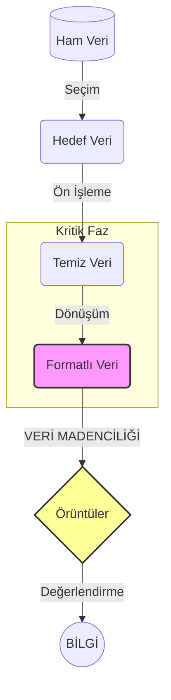

### Dersin Bürokrasisi
- Sınıf mevcudu epey fazla olduğu için bireysel projeler sınav gibi değerlendirilmeyecek (?). 
- Vize ve final test olmanın yanı sıra, vize %40 ağırlık iken final %60 ağırlığa sahip olacak muhtemelen. Testlerin en az 40-50 sorudan oluşacağı söylendi.
- Her hafta ödevler de verilecek; kod ne yapıyor değil de, satırın ne yaptığını, nasıl çalıştığını ve sonucunu tahmin etmeye yönelik ödevlerden bahsedildi daha ziyade.
- Kendimizin veri işleyeceği bir projeyi sınıf içerisinde göstermemizi bekliyor.
- Python dili kullanılacak. Anaconda, Jupyter Notebook veya VS Code kurulumları istenecek.
- Derse %70 katılım şartı var.


---

[[hafta_1_giris_110819.pdf]]


## 1. Veri Madenciliği Nedir?

Dersin temel analojisi adı üstünde **madenciliktir**. Doğadan çıkarılan altın saf değildir; toprak, kaya ve diğer elementlerle (gürültü) karışık hâldedir. [[veri madenciliği|Veri madenciliği]] de veri tabanlarındaki milyonlarca satır *çöp* (loglar, hatalı girişler) yahut **[[2- Zekâ, DIKW#1. ** Veri (Data) ** İşaret/Sembol|ham veri]]** arasından işe yarar örüntüyü (altını) ayrıştırma ve değerli **[[2- Zekâ, DIKW#3. ** Bilgi (Knowledge)**|bilgiye]]** dönüştürme işidir.

Bkz. [[2- Zekâ, DIKW#DIKW Piramidi (Data-Information-Knowledge-Wisdom)|DIKW Piramidi]]


   >[!abstract] Veri Madenciliği (Data Mining)
   >Büyük ölçekli veri setleri (big data) içerisinden; gizli, daha önce bilinmeyen (novel), potansiyel olarak yararlı ve anlaşılabilir örüntülerin algoritmik yöntemlerle çıkarılması sürecidir. Teorik olarak KDD (Knowledge Discovery in Databases) sürecinin bir adımıdır, ancak pratikte tüm süreci kapsar.

### 2. KDD Süreci (Knowledge Discovery in Databases) 
Veri madenciliği tek atımlık bir işlem değildir. **Veri Tabanlarında Bilgi Keşfi** (KDD) sürecinin sadece bir adımıdır. Bu süreç lineer görünse de aslında iteratiftir; bir aşamadaki hata önceki aşamaya dönmeyi gerektirir.





1. **Veri Temizleme (Cleaning)**: [[LLM'lerde Halüsinasyonların Anatomisi#GIGO (Garbage In, Garbage Out)|GIGO]] (Garbage-In, Garbage-Out) prensibinin yönetildiği yerdir. Gürültülü (noisy) veriler, eksik değerler (missing values) ve aykırı değerler (outliers) bu aşamada temizlenir.
2. **Veri Bütünleştirme (Integration)**: Farklı kaynaklardan (SQL, API, CSV, Sensör) gelen verilerin tek bir küpte (Data Warehouse) birleştirilmesidir.
3. **Veri Seçme (Selection)**: Analizle alakasız niteliklerin (feature) elenmesidir. (*Feature Selection*).
4. **Dönüşüm (Transformation)**: Verinin algoritmanın çalışabileceği uzaya taşınmasıdır. Normalizasyon (Min-Max, Z-Score) yahut One-Hot Encoding gibi vektörel dönüşümler bu safhada icra edilir.
5. **Veri Madenciliği (Mining)**: Modelin kurulduğu ve algoritmanın çalıştığı aşama.
6. **Örüntü Değerlendirme (Eveluation)**: Elde edilen örüntünün Accuracy, Precision, Recall yahut ROC Curve gibi metriklerle teste tâbi tutulmasıdır.


## 3. Büyük Veri (Big Data) ve Depolama Mimarisi

Veri artışı lineer değil, [[eksponansiyel]] bir eğri izlemektedir. Geleneksel ilişkisel veri tabanları (RDBMS) bu entropik yükü kaldıramaz hâle gelmiştir.

 > 	**2025 Projeksiyonu**: 181 Zettabyte (ZB). <br>
 > 	**2035 Projeksiyonu**: ~19.000 Zettabyte.
 
### 3.1. Veri Birimleri

- **Terabyte (TB)**: $10^{12}$ byte (Kişisel depolama sınırı).
- **Petabyte (PB)**: $10^{15}$ byte (Kurumsal veri ambarı alt sınırı).
- **Exabyte (EB)**: $10^{18}$ byte.
- **Zettabyte (ZB)**: $10^{21}$ byte.

> 	$1\text{ ZB} = 1024 \text{ EB} \approx 10^{21} \space \text{Byte}$

- **Küçük Veri**: Bilgisayarın RAM'inde (örn. 32GB) işlenebilen, geçmişe dönük veriler (Market alışveriş fişleri gibi).
- **Büyük Veri**: Anlık akan, sosyal medyadan gelen (Twitter, Instagram), tek bir bilgisayarın RAM'ine sığmayan devasa yığınlar.

> [!note] Donanım Kısıtı
>  Donanım kısıtları artık işlemci (CPU) hızından ziyade depolama ve hafıza (memory) optimizasyonuna kaymıştır. Veriyi işlemekten çok, onu nerede ve nasıl saklayacağımız (**[[Space Complexity]]**) daha maliyetli bir problemdir. Nitekim Zettabyte seviyesindeki veriyi işlemek için tekil sunucular yetersiz kalır; Hadoop HDFS gibi dağıtık dosya sistemleri zorunludur.

### 3.2. Veri Ambarları (Data Warehouses)
- Veri madenciliği operasyonları canlı işlem gören veri tabanları üzerinde yapılamaz zira sistem bu yükü kaldıramayacağı için kilitlenir. Analiz için veriler **[[OLAP]]** (Online Analytical Processing) tabanlı **veri ambarlarına** taşınır.

#### Veri Ambarının 4 Temel Özelliği

1. **Konu Odaklıdır (Subject-Oriented)**: Satış, Finans, İnsan Kaynakları gibi spesifik alanlara ayrılır.
2. **Bütünleşiktir (Integrated)**: Farklı formatları (XML, JSON, SQL) tek bir standart yapıya dönüştürür, standartlaştırır.
3. **Zamana Bağlıdır (Time-Variant)**: Geçmiş veriyi tutar.
4. **Değişmezdir (Non-Volatile)**: Veri ambarına giren veri güncellenmez veya silinmez; yalnızca okunur ve yeni veri eklenir (append-only).

**Örnekler**: Amazon Redshift, Google BigQuery, Snowflake, Microsoft Azure Synapse.


## 4. Veri Madenciliği İşlevleri ve Algoritmaları
- Veri madenciliği algoritmaları verinin etiketli (labeled) olup olmamasına göre iki ana paradigmaya ayrılır.

### A. Öngörü Yöntemleri (Predictive/Supervised Learning)

Verinin sonucu (hedef değişkeni) önceden bellidir. Geçmiş veriden öğrenerek geleceği tahmin eder.


| Yöntem                             | Açıklama                                                                           | Algoritmalar                           |
| ---------------------------------- | ---------------------------------------------------------------------------------- | -------------------------------------- |
| **Sınıflandırma (Classification)** | Çıktı **kategoriktir** (Evet/Hayır, Hasta/Sağlıklı). Veriyi ayrık sınıflara böler. | Karar Ağaçları, Naive Bayes, SVM, KNN. |
| **Regresyon**                      | Çıktı **sürekli ve sayısaldır**. Veriyi bir fonksiyona/eğriye yedirir.             | Lineer Regresyon, Lojistik Regresyon   |
| **Zaman Serileri**                 | Zaman içinde değişen verinin trend analizi.                                        | ARIMA, LSTM.                           |

### B. Tanımlayıcı Yöntemler (Descriptive/Unsupervised Learning)

Verinin etiketi yoktur. Sistem sadece verinin içindeki gizli topolojiyi haritalandırmaya çalışır.


| Yöntem                    | Açıklama                                                                              | Algoritmalar                      |
| ------------------------- | ------------------------------------------------------------------------------------- | --------------------------------- |
| **Kümeleme (Clustering)** | Benzer verileri gruplar. Müşteri segmentasyonu için kullanılır.                       | K-Means, Hierarchical Clustering. |
| **Birliktelik Analizi**   | "Bunu alan şunu da aldı" mantığıdır. Olayların birlikte gerçekleşme frekansını ölçer. | Apriori, FP-Growth.               |
| **Aykırı Değer Analizi**  | Verinin genel örüntüsüne uymayanları (fraud detection) bulur.                         | Isolation Forest.                 |


### Tarihsel Arkaplan

 ```mermaid
 timeline
    title Veri Madenciliğinin Evrimi
    1950'ler : İlk Bilgisayarlar : Sayım işlemleri.
    1960'lar : Veri Koleksiyonları : Hiyerarşik ve Ağ tabanlı veritabanı modelleri.
    1970'ler : İlişkisel Model : Codd'un İlişkisel Veri Modeli (RDBMS) devrimi.
    1980'ler : Uzmanlaşma : Mekansal, Bilimsel, Mühendislik veritabanları.
    1989 : KDD Kavramı : "Veri Tabanlarında Bilgi Keşfi" çalıştayı.
    1990'lar : Kırılma Noktası : "Veri Madenciliği" teriminin doğuşu.
    2000'ler : Yaygınlaşma : Veri Ambarları ve Web Madenciliği.
 ```

### Kritik dönemeçler ve İlk Yazılımlar (90'lar)

Verinin sadece saklanan değil, "sorgulanan" bir şeyden "analiz edilen" bir şeye dönüşmesi bu dönemde başlamıştır.

 1. **1989 - KDD Çalıştayı**: "Knowledge Discovery in Databases" kavramı ilk kez resmi olarak ortaya atıldı.
 2. **1992 - İlk Yazılımlar**: Akademik teoriden ticari ürüne geçiş başladı.
 3. **1993 - WEKA**: Waikato Üniversitesi tarafından geliştirilen açık kaynaklı yazılım. (Hâlâ eğitimlerde kullanılır, Java tabanlıdır).
 4. **1995 - KDD-95**: İlk uluslararası konferans.
 5. **1996 - IBM Intelligent Miner**: Büyük ölçekli veri analizi için geliştirilen ilk kurumsal ve ticari yazılımlardan biri. Karar ağaçları ve sinir ağları yapabiliyordu.
 6. **1998 - SAS Enterprise Miner**: İş analitiği ve optimizasyon için geliştirildi.
    
 
 > [!note] Neden Önemli?
 > 
 > 1950'lerde bilgisayar sadece "sayıyordu". 1970'lerde veriyi "ilişkilendirdi" (SQL). 1990'larda ise veriden "bilgi üretmeye" (madencilik) başladı. Bu ilerleyiş donanım kapasitesinin artışı ([[Moore Yasası]]) ve depolama maliyetlerinin düşüşü ile doğrudan koreledir.
 
 