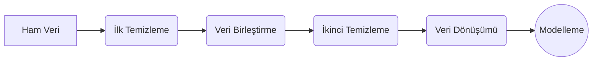

# Sınav, Ödev, Geliştirme Ortamı  vs.

- **Sınav Soru Tipi**: Hoca sınavlarda kesinlikle kod soracağını belirtti. Bir kod verip kodun çıktısı aşağıdakilerden hangisi olur diye sorabilir. Dolayısıyla kod ezberlemekten ziyade kodun ne işe yaradığını (çıktısını) okuyabilmek çok önemli.
- **Kod Pratiği**: Gönderilen kod ile ilgili dosyaların çalıştırılması şart. Boşuna verilmiyor onlar.
- **Potansiyel Sınav Soruları**: Sınav test olacak, zaten biliniyor bu. Soru kökünde bir Pandas kodu olacak:` df.isnull().sum().` gibi. Bu kodun "**Veri setindeki her bir sütundaki boş (eksik) veri sayısını toplar ve ekrana basar**" demek olduğunu bilmeliyiz. Pandas kütüphanesindeki `merge()`, `concat()`, `dropna()`, `fillna()` fonksiyonlarının ne iş yaptığını bilmeliyiz. `df.groupby("Sinif")["col"].transform(lambda x: x.fillna(x.mean()))` kodunu verip, "Bu kod ne iş yapar?" diye sorabilir gibi gibi. Bu minvalde sorular gelecetir daha ziyade kod ile ilintili olarak. "Hatalı kod, hatasız kod; sözdiizimi hatası" minvalinde sorular geleceğini zannetmiyorum. Nihayetinde bu sıralar ilgili dili bilmeye yatıyor, oysa biz dili bilmekten ziyade dilde yazılanların ne işe yaradığını bilmeye odaklanıyoruz. Yine de sözdizimi mevzusunda iddialı konuşmayayım. 
- **Hata Ayıklama**: Hocanın verdiği kodları ezbere çalıştırmaktan ziyade, hatalarla (`ModuleNotFoundError` vb.) karşılaşıp bunları çözmek daha önemli.
- **Platform Seçimi**: VS Code veya Jupyter Notebook kullanılabilir. Ancak hoca Jupyter'i daha görsel, sade ve hücre bazlı (satır satır) çalışmaya uygun bulduğu için tavsiye ediyor.

---

# 1. Veri ve Veri Ön İşleme
## 1.1. Verinin Anatomisi: Boyutlar ve Kavramlar

- Nesneler (objects) ve nesnelerin niteliklerinden (attributes) oluşan kümeye **veri** denir.
	- **Nesne**: Kayıt, varlık, örnek (satırlar).
	- **Nitelik**: Bir nesnenin özelliği, **boyutu** (sütunlar). Örn: Yaş, sıcaklık, göz rengi vs.

>[!info] Boyut (Dimension) Kavramı
>Veri madenciliğinde sütun sayısı, verinin boyutunu (ve kapladığı büyüklüğü) belirler.
>
> - **1 Boyutlu Veri**: Sadece tek bir sütun vardır. Görselleştirilemez.
> - **2 Boyutlu Veri**: Satır ve sütunlardan (X ve Y ekseni) oluşan standart tablolardır. Veri madenciliğinde en çok bu boyut kullanılır.
> - **3 Boyutlu Veri**: Derinlik (Z analizi) katar. 4 veya 5 boyutlu veriler insan gözüyle (grafiksek olarak) anlamsızlaşır.

## 1.2. İstatistiksel Veri Türleri

Makine öğrenmesi algoritmaları sadece sayılarla çalışır. Bu yüzden eldeki verinin türünü bilmek zorunludur. 

### A. Nümerik (Sayısal/Nicel) Veriler
Doğası gereği sayısal olan ve dönüşüm gerektirmeyen verilerdir.

- **Sürekli (Continius)**: Yaş, sıcaklık, boy (Sonsuz küsürat alabilir, sürekli artış gösterebilir).
- **Aralıklı (Discrete)**: Çocuk sayısı, kaza sayısı (buçuklu olamaz).

### B. Nominal (Kategorik) Veriler
Sayısal bir büyüklük ifade etmezler. "Daha fazla" yahut "daha büyük" anlamları taşımazlar. Sadece etikettirler.

- **Binary (İkili)**: Erkek/Kadın, Var/Yok, Geçti/Kaldı.
- **Çok Kategorili**: Şehirler, renkler, forma numaraları.

### C. Ordinal (Sıralı Kategorik) Veriler
Kategoriktir ama kendi içerisinde hiyerarşisi vardır. Eğitim düzeyi (Lise < Üniversite), kariyer, sosyoekonomik statü vb.

### D. Ratio (Oransal) Veriler
Nümerik verilere benzerler *ancak* **mutlak sıfır** noktası vardır ve oranlanabilir. **Birbirine bölündüğünde matematiksel olarak anlam ifade eden veri türüdür**.


>[!bug] Santigrat vs. Kelvin
>100 Santigrat derece, 50 Santigrat derecenin iki katı **değildir**. Oransal (*ratio*) bir değer elde etmek istiyorsak mutlak sıfırı olan bir birime, yani **Kelvin**'e çevirmeliyiz. 60 Kelvin, 30 Kelvin'in tam 2 katıdır.


## 1.3. Veri Önişleme (Data Preprocessing) Süreci
Veriler insanlar veya makineler tarafından toplanır ve doğası gereği her zaman **kirlidir**. Modelin içine çöp girerse çöp çıkar ([[LLM'lerde Halüsinasyonların Anatomisi#GIGO (Garbage In, Garbage Out)|GIGO - Garbage In Garbage Out]]).

Doğru veri akışı (profesyonel pipeline) şu şekilde olmalıdır:

1. **Ham Veriyi Al.**
2. **İlk Temizlik:** Tip kontrolleri (sayı mı yazı mı) ve anahtar/ID kontrolleri yapılır.
3. **Birleştir (Merge/Concat):** Farklı tablolar bir araya getirilir.
4. **İkinci Temizlik:** Birleştirme sonrası oluşan yeni `NaN` (boş) değerler ve tekrarlayan (duplicate) kayıtlar temizlenir.
5. **Özellik Mühendisliği (Feature Engineering):** Yeni sütunlar türetilir, veri dönüştürülür.
6. **Modelleme:** Makine öğrenmesine sokulur.



>[!warning] Dikkat!
>Veri birleştirildikten sonra `NaN` değerler oluşacağı için kesinlikle ikinci bir temizlik yapılmalıdır!

# 2. Veri Temizleme (Cleaning)
Gerçek dünyadan toplanan veriler genellikle kirlidir. **Eksik Veri**, **Gürültülü Veri** ve **Tutarsız Veri** ile uğraşırız bu aşamada. Veri bilimi mesaisinin çoğunluğu burada geçer.


## A. Eksik Veri (Missing Data / `NaN` / `Null`)
Veri toplanırken bir niteliğin girilmemesi yahut elde edilememesi durumudur. (Pandas kütüphanesinde eksik veriler `NaN` - *Not a Number* olarak görünür).

>[!question] NaN vs Unknown Mantığı
> - `NaN`: Matematiksel olarak "Sayı Değil" demektir. Yani o hücre tamamen **boştur**, bir değeri, anlamı yoktur. Bilgisayar bunu hesaplamaya sokamaz.
> - `Unknown / Null`: Bu hücre aslında doludur. İçine "bilinmiyor" diye bir yazı yazılmıştır veya "0" atanmıştır. Yani hücrenin bir varlığı vardır ama içindeki bilgi bizim için belirsizdir. 


Eksik veriyle başa çıkmak için şu yöntemler kullanılır:

#### 1. Satırı/Sütunu Silmek (`dropna()`)
- Dezavantajı veri kaybı yaşatmasıdır. Ancak verinin hacmine göre karar verilir.
- Bir milyon veriden sadece bin tanesi boşsa (%0.1) silip geçmek en mantıklısıdır. Lakin bin veriden yüz tanesi boşsa (%10), silmek analizi bozacağı için veriyi **doldurmak** zorundayız.

#### 2. Global Sabit Bir Değere Doldurmak
- Hücrelere manuel olarak "`Unknown`" veya "`Bilinmiyor`" metnini atamaktır.

#### 3. İstatistiksel Doldurma (Central Tendency)
- Eksik kısımları o sütunun genel **Ortalama (Mean)**, **Medyan (Ortanca)** veya **Mod (Tepe Değer)** ile doldurmaktır.

#### 4. Sınıfa Göre Doldurma (En Mantıklısı)

>[!example] Örnekler
> - **Takım Örneği**: A takımındaki Metin isimli oyuncunun maaşı girilmemişse, Metin'in maaşı tüm şirketin ortalamasıyla değil de **sadece A takımının maaş ortalamasıyla** doldurulmalıdır. Sınıfsal ayrımla alakalıdır.
> - **Sınav Örneği**: Sınav kâğıdı kaybolan öğrenciye ne not vereceğimizi düşünelim. Eğer diğerleriyle aynı sınıftaysa sınıf ortalaması verilir. Ancak o öğrencinin geçmiş notları belli biliniyorsa, geçmiş yıllardaki kendi genel ortalamasına dayalı bir not da verilebilir. Bağlam (context) önemlidir.

###### **Python / Pandas: Eksik Veri Yönetimi**

```python
df.isnull().sum() # Hangi sütunda kaç tane eksik (NaN) veri var onu sayar.
df["col"].mean() # Sütunun sayısal ortalamasını alır.
df["col"].fillna(df["col"].mean()) # Eksik verileri, o sütunun ortalamasıyla doldurur.
df["col"].fillna(df["col"].mode()[0]) # Eksik verileri en sık tekrar eden (kategorik) değerle doldurur.
df.groupby("Takim")["Maas"].transform(lambda x: x.fillna(x.mean())) # Herkesin maaşını kendi takımının ortalamasıyla doldurur.
df.dropna() # İçinde NaN olan tüm satırları siler atar.
```


---

## B. Gürültülü Veri (Noisy Data / Outliers)
Hücre boş değildir ancak ölçüm yahut giriş hatası vardır. Söz gelişi, maaşın -10 TL girilmesi veya yaşın 1000 TL girilmesi veya finansal bir grafikte genel trendin çok dışında bir sıçrama olması gibi. 

**Sentetik veri de denilebilir bu verilere.**

Gürültülü veriyi onarmak/minimize etmek için üç ana matematiksel yöntem kullanılır:

#### 1. Hareketli Ortalama (Moving Average)
- Veri noktalarının belirli bir pencere boyutu (örn: 3 periyotluk) içinde ortalaması alınarak dalgalanmalar (aykırı değerler) yumuşatılır. 
- **Dezavantajı**: İlk birkaç satırda (pencere dolana kadar) yeni `NaN` değerler oluşturmasıdır.

- **Basit Hareketli Ortalama (SMA - Simple Moving Average)**: Standart olandır. Tüm değerlere **eşit** ağırlık verir.
- **Ağırlıklı Hareketli Ortalama (WMA - Weighted Moving Average)**: En yeni verilere daha fazla ağırlık verir. Sonraki veriler öncekilere göre daha önemli kabul edilir.
- **Üstel Hareketli Ortalama (EMA - Exponential Moving Average)**: Önceki verilere üstel olarak azalan bir ağırlık verir. (**Finans, borsa ve kripto analizlerinde en çok bu kullanılır**).

#### 2. Bölmeleme (Binning)
- Sürekli (devamlı) verileri belirli aralıklara bölerek sepetlere atma işlemidir. İkiye ayrılır:
	1. **Eşit Genişlikli (Equal-Width)**: Veri aralığını eşit parçalara böler (örn: 0-20 yaş, 20-40 yaş).. **Riski** ise bazı sepetler ([[bin]]) tamamen boş kalabilir. Pandas'taki karşılığı `pd.cut()` fonksiyonudur. 
	2. **Eşit Frekanslı (Equal-Frequency)**: Her sepete eşit sayıda veri koyar (örn: toplam 9 veri varsa, her septe 3'er veri düşecek şekilde böler). Boş sepet riski olmaması ve verinin dengeli dağılması bakımından avantajlıdır. Aykırı değerleri bulmakta etkilidir. Pandas'taki karşılığı `pd.qcut()` fonksiyonudur.


#### 3. Eğri Uydurma (Curve Fitting)
- Veriye uygun bir matematiksel fonksiyon (**[[Lineer Regresyon]]**) veya **[[Polinomal Regresyon]]** çizilir. Bu çizginin (beklenen trendin) çok dışında kalan noktalar aykırı (gürültülü) kabul edilerek analizden çıkartılır.

###### Eğri Uydurma Temsili

```python
import matplotlib.pyplot as plt
import numpy as np

x = np.linspace(0, 10, 100)
y = np.sin(x)

plt.plot(x, y)
plt.title("Finansal Dalgalanma Temsili")
plt.show()
```


---

## C. Tutarsız Veri (Inconsistent Data)
Verilerin kendi içinde mantıksal olarak çelişmesidir. Veri giriş formlarındaki standart eksikliğinden kaynaklanır.
- **Örnek**: Yaş sütununda 35 yazarken, doğum tarihi sütununda 2020 yazması.
- **Örnek**: ID yazılması gereken yere yaş yazılması.
- **Örnek**: Aynı niteliğin farklı kaynaklarda "Desilitre", "Mililitre" ve "Gram" gibi farklı birimlerle (Değer Kümeleri) girilmiş olması. **Birleştirme yapmadan önce mutlaka aynı standarda çekilmelidir.**


---

# 4. Veri Birleştirme (Integration)
Farklı kaynaklardan gelen `.csv` verilerini tek potada eritmektir. Excel değil de CSV kullanmamızın sebebi, CSV'nin virgülle ayrılmış değerlerden oluşmuş olmasıdır ki, bu da dosya boyutu olarak çok daha az yer kaplar (CSV = Comma Seperated Values - Virgülle Ayrılmış Değerler).

- `concat()`: Verileri körü körüne alt alta veya yan yana ekler.
- `merge()`: SQL'deki **Join** mantığıdır. Ortak bir sütuna (*ID*) göre akıllıca birleştirir.
	- **Inner Join**: Kesişimdir. **Sadece iki tabloda da bulunan** öğrencileri/verileri getirir.
	- **Left / Right Join**: Sol veya sağ tabloyu korur, diğerinden verileri çeker. Bulamadıklarına `NaN` atar.
	- **Full Outer Join**: Tüm kayıtları korur, eşleşmeyen her bir yere `NaN` atar.


---

# 5. Veri Dönüşümü (Transformation)
Makinenin matematiği doğru yapabilmesi için elzemdir.

## 5.1. Normalizasyon
- İncelenecek veriyileri normalden sapmayan bir ölçüy egöre inceleme, **aynı seviyeye getirme** işlemidir. 
- Oyunlardaki eşleştirme/matchmaking algoritmaları buna benzer mesela. 
- Min-Max Scaling ile tüm veriler 0 ile 1 arasında sıkıştırılır.

### 5.2. Encoding (Kodlama)
- Sözel (**Nominal**/**Ordinal**) verileri sayısala çevirmektir.

1. **Label Encoding**: Kategorilere sayı atanmasıdır (Bilgisayar=0, Elektrik=1).
2. **One-Hot Encoding**: Kategorielrin sütunlara ayrılıp matris mantığıyla 1 ve 0 (var/yok) olarak basılmasıdır.
