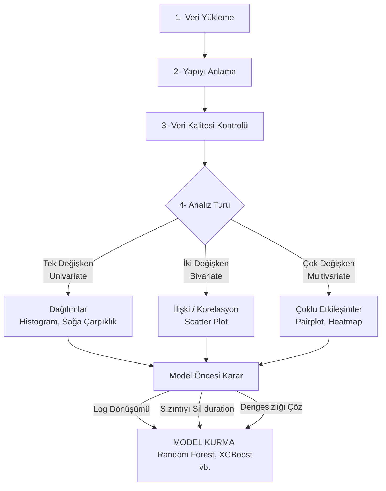

## Çalışma Tüyoları vs.

- **Yapay Zekâ Kullanımı ve Tecrübe**: Hata aldığınızda yahut "Bu sağa çarpık grafiği nasıl merkeze çekerim?" diye merak ettiğinizde kodları dil modellerine atarak soru sorun. Hocanın derste tavsiyesi buydu, nitekim bunlara benzer sorular gelebilir. Sınavda kodların mantığını ve çıktıların yorumunun sorulacağını tekrar belirtti hoca bu derste, bozarak öğrenmemiz gerektiğini de söyledi. "Tecrübe, negatifle karşılaşmaktır" der Byung-Chul Han. Hocanın verdiği kodları bozarak, yanlış çalışan kodla karşılarak tecrübe kazanacağız vesselam. O yüzden arada sıra kodları bozmak gerekiyor, değerleri değiştirmek gerekiyor ki ne işe yaradığını, sözdiziminde yahut sayılarda bir hata/farklılık olduğunda çıktının ne olacağını görmemiz gerkeiyor. Bu şekilde tecrübe edilir ancak.


---

## Keşifsel Veri Analizi (Exploraty Data Analysis -EDA)

**EDA**, veri madenciliği sürecinin **zemin etüdü**dür. Model kurmadan önce veriyi tanıma, anlama, problemleri görme ve yapısını çözme sürecidir. Veri madenciliği sürecinin en kritik, hamallığının en çok olduğu ama kararların verildiği aşamadır.

>[!quote]
>EDA yapılmadan önce kurulan model, zemin etüdü yapılmamış bir arsaya bina dikmeye benzer. Belediye (veri bilimci) gelir, "Zemin sağlam mı? Deprem riski var mı?" diye sorar. Temel çürükse, bina (model) da çöker.
>

### Temel Amaçlar
1. **Veriyi Tanımak**: Kaç satır (gözlem), kaç sütun (değişken) var?
2. **Kalite Kontrolü**: Veri temizleme prensibi gereği; eksik veri, gürültülü veri veya tutarsız veri var mı?
3. **Hipotez Testi**: Değişkenler arasında ilişki (korelasyon) var mı?
4. **Model Seçimi**: Proglem sınıflandırma mı? Regresyon mu? Kümeleme mi?

---

## 2. Verinin Anatomisi ve Temel Formül
Makine öğrenmesi ve veri madenciliğinfde her şey şu temel fonksiyona dayanır:

$$
\Large
\underbrace{f(x)}_{\text{Girdiler (Features)}} = \underbrace{y}_{\text{Çıktı (Target)}}
$$
<br>

* **$x$ (Bağımsız Değişkenler / Features):** Verinin boyutlarıdır. Yaş, eğitim durumu, maaş, evin metrekaresi vb. (Sütunlar).
* **$y$ (Bağımlı Değişken / Target):** Tahmin etmeye çalıştığımız sonuç. Kredi verilsin mi? (Evet/Hayır), Evin fiyatı ne kadar? (Sayısal).


>[!info] Boyut, Satır, Hedef vb.
>- **Satır (Row)**: Gözlem sayısıdır (örn: 1000 müşteri). Veri sayıdıır ayrıca. 1 milyon kişiyi aradıysak 1 milyon satır vardır.
>- **Sütun/Boyut (Column/Dimension) X - Bağımsız Değişkenler**: Değişken sayısıdır (örn: yaş, maaş, cinsiyet = 3 boyut).
>- **Hedef (Y- Bağımlı Değişken)**: Bulmak istediğimiz sonuçtur, tahmin etmeye çalıştığımız sonuç veya. Evin fiyatı gibi, müşteri krediyi alacak mı gibi. 
>- *İsim (Ad-Soyad)* genelde bir boyut olarak *kullanılmaz**, zira kategorize edilemez (Nominal ama çok fazla unique değer var). Ancak "Cinsiyet" (Kadın/Erkek) kategorize edilebilir.


> [!question] İsim Sütunu Neden İşe Yaramaz?
> Derste kritik bir soru sorulmuştu: *"İsim, yaş, maaş sütunlarında ismin neden bir anlamı yoktur?"* <br>
> İsim sayısal bir veri de değil kategorik bir veri de değil. İsim verisinin tek işe yarayabileceği şey milyonlarca veri arasından isim dağılımının yüzdesini bulmak gibi bir şey söz konusu olduğunda olabilir ancak. Nüfusa göre isim dağılımı gibi gibi ölçümler yapıldığında. **İsim ne sayısaldır, ne kategoriktir, ne de kategorize edilebilirdir.** Eğitim durumu (İlkokul, Lise, Doktora) kategorize edilebilir (1'den 6'ya kadar numaralandırılabilir). Cinsiyet (Kadın/Erkek) 0-1 yapılabilir. Ancak "Ahmet, Mehmet" model için anlamsızdır. İsim sütunu bu sebeplerden dolayı ilgili bağlam içerisinde anlamsızdır.


---

## 3. EDA Akış Diyagramı, Kurulabilecek Modeller
EDA bittikten sonra bu verilerle hangi modeller kurulabilir?
1.  **Logistic Regression:** Basit, yorumlanabilir, akademik temel model.
2.  **Decision Tree (Karar Ağacı):** Outlier'lara dayanıklı, görsel olarak açıklanabilir.
3.  **Random Forest:** Daha güçlü, hangi sütunun (feature) daha önemli olduğunu verir.
4.  **XGBoost / Gradient Boosting:** Daha ileri seviye, yarışmalarda kazandıran model.




### 3.1. Analiz Türleri (EDA Türleri)


| **Tür**                         | **Açıklama**                                                             | **Grafik Örnekleri**             |
| ------------------------------- | ------------------------------------------------------------------------ | -------------------------------- |
| **Univariate (Tek Değişken)**   | Tek bir sütunun dağılımına bakılır. (Sadece "yaş" dağılımı nasıl?)       | Histogram, Boxplot, Countplot    |
| **Bivariate (İki Değişken)**    | İki sütun arasındaki ilişkiye bakılır. (Yaş arttıkça "maaş" artıyor mu?) | Scatter Plot, Korelasyon Matrisi |
| **Multivariate (Çok Değişken)** | 3 veya daha fazla değişkenin ilişkisi.                                   | Heatmap, Pairplot                |


---

## 4. Kritik Veri Problemleri

### A. Sınıf Dengesizliği (Class Imbalance)
Veri setindeki hedef değişkenin ($y$) sınıflarının eşit dağılmamasıdır.

> [!example] Kedi vs. Köpek Örneği
> 1000 fotoğrafın olduğu bir veri setinde 900 kedi, 100 köpek varsa; model her şeye "kedi" deme eğiliminde olur. Çünkü köpeği yeterince öğrenemez. <br>
> **Çözüm:** Veri çoğaltma (Augmentation), Sentetik Veri Üretme veya veriyi azaltma (Undersampling).


### **B. Veri Sızıntısı (Data Leakage)**
Modelin eğitim sırasında gerçek hayatta (tahmin anında) sahip olamayacağı "gelecekten gelen" bilgiyi görmesidir.


#### Özet: Bank Marketing `duration` sütunu:   

* Müşteriyi arayıp ikna etmeye çalışıyoruz. Veri setinde `duration` (görüşme süresi) sütunu var. Amacımız müşterinin vadeli mevduata abone olup olmayacağı (`y=yes/no`) $\to$ *İkili Sınıflandırma (Binary Classification)*
* Süre uzunsa müşteri genelde kabul ediyor ("`yes`").
* **Sorun:** Biz müşteriyi aramadan önce (tahmin anında) görüşmenin ne kadar süreceğini bilemeyiz.
* **Sonuç:** `duration` sütunu modele dâhil edilirse model %100'e yakın başarı verir ama gerçek hayatta çuvallar. **Bu sütun veri setinden çıkarılmalıdır.**

#### Örnek Uygulama: Bank Marketing Veri Seti

**Not**: *Bu örnek uygulamaya bakılmadan önce, Jupyter Notebook üzerinden bu veri setinin kurcalanması ve test edilmesi tavsiye edilir. Hocanın anlattıklarını Veri Sızıntısı bağlamında kabaca anlatmaya çalıştım ancak Jupyter Notebook üzerinden test edilmediği müddet yahut yapay zekâdan destek alarak "Bu burada ne demeye çalışmış yaw arka planını da göz önüne alarak anlat bakalım hele..." demeden **tam olarak** anlaşılabileceğini zannetmiyorum.* 

Bu veri seti Portekiz'deki bir bankanın telefonla pazarlama kampanyasına ait. Amaç ise müşterinin vadeli mevduata abone olup olmayacağının tespiti (`y = yes/no`) $\to$ *İkili Sınıflandırma (Binary Classification)*

##### **1. Veriyi Yükleme ve Okuma Farklılığı**
Veri bazen tek sütunda sıkışmış virgüllerle/noktalı virgüllerle gelebilir (Derste Kaggle'dan veya HTML'den çekilen veriler buna örnek olarak verilmişti).

```python
# Eğer veriler Excel'de tek sütunda görünüyorsa ayırıcı (separator) kullanmalıyız!
import pandas as pd
df = pd.read_csv("bank-full.csv", sep=";") # Sütunları ayırmak için sep=";" kullanıldı!
df.head()
```


##### **2. Keşif Kodları**
*   `df.shape`: Boyut kontrolü (45.211 satır, 17 sütun).
*   `df.info()`: Sütun tipleri ve eksik değer var mı? (Non-null: Boş yok. String olanları binary'e çevirmemiz gerekecek).
*   `df.describe()`: İstatistiksel özet (Ortalama, min, max, çeyreklikler, standart sapma).
*   `df.isnull().sum()`: Boş değerleri sayar (Sonuç 0 çıktı).
*   `df.duplicated().sum()`: Çift kayıt (duplicate) var mı? (Sonuç 0 çıktı).

##### **3. Normalize Etmek**
Hedef değişkenin (`y`) dağılımına bakarken:

```python
# 39.000 No, 5.000 Yes var. Bunları aynı ringe (0-1 aralığına) çekmek için:
df['y'].value_counts(normalize=True) 
# Çıktı: %88 No, %12 Yes. (Aşırı Dengesiz Veri - Class Imbalance!)
```

##### **4. Sağa Çarpıklık (Right-Skewed) ve Logaritma**
`balance` (Bakiye) histogramına bakıldığında kuyruk sağa doğru uzuyor. Yığılma solda. Ortalama (mean) ile medyan arasında ciddi fark var. Bu tarz uç değerler (outliers) içeren sağa çarpık verileri normale döndürmek için **Logaritmik Dönüşüm (Log Transform)** uygulanması düşünülmelidir.

> [!danger] Veri Sızıntısı (Data Leakage) Uyarısı - `duration` Sütunu
> Derste epey vurgulandı.`duration` (çağrı süresi) arttıkça müşterinin "Evet" deme ihtimali artıyor. **Ancak bu sütun, modelden <u>çıkarılmalıdır</u>!** Neden? <br>
> Çünkü biz müşteriyi aramadan önce (model tahmin yaparken) çağrının ne kadar süreceğini bilemeyiz, ne de olsa geleceğe ait bir bilgidir bu. <br>
> *Ekstra Outlier Yorumu:* Call center çalışanı "hı hı, aynen pampi" diyerek müşteriyi darlarsa, müşteri normalde evet diyecekken sinirlenip telefonu kapatabilir. Bu da **"duygusal veri / bozucu yük"** yaratarak bir outlier (aykırı değer) oluşturur.


#### Örnek Uygulama: Adult Income Veri Seti
Bu veri setinin amacı kişinin gelirinin 50.000$'ın altında mı üstünde mi olduğunu tahmin etmektir. (`income = <=50K / >50K`) $\to$ *İkili Sınıflandırma*

1. **Sütun İsimleri Yoksa:** Veri setinde "yaş, eğitim" gibi başlıklar yoksa, analiz programına bu veriler yüklenirken başlıkların manuel olarak tanımlanması (etiketlenmesi) gerekir.
2. **Duplicate (Çift Kayıt) Temizliği:** Veride tekrar eden satırlar bulunabilir (Örn: 24 adet tekrar eden satır). Analize başlamadan önce bunlar silinmelidir.
3. **Gizli Eksik Veri (Gürültü):** Sistemde boş veri yok gibi görünse de, verinin içine bakıldığında boşluklar yerine **`?` (Soru işareti)** konulduğu görülebilir. Bunlar tespit edilip "`Null` (Boş)" değere çevrilmelidir.
4. **Feature Redundancy (Gereksiz Tekrar):** Veride hem `education` (Lise, Üniversite) hem de `education_num` (9, 13 gibi eğitim numarası) sütunları varsa, ikisi de aynı şeyi ifade ettiği için biri modelden çıkarılmalıdır.
5. **Target Encode:** `>50K` ve `<=50K` gibi metin ifadeleri, modelin matematiksel olarak anlayabilmesi için 1 ve 0'lara (Binary) dönüştürülmelidir.

#### E. Bank vs Adult Veri Seti Karşılaştırması

Aşağıdaki tablo, iki veri setinin kavramsal zorluk derecelerini özetlemektedir:

| Özellik                           | Bank Marketing           | Adult Income                         |
| :-------------------------------- | :----------------------- | :----------------------------------- |
| **Problem Türü**                  | Binary Classification    | Binary Classification                |
| **Leakage (Sızıntı) Riski**       | Var (`duration` sütunu)  | Yok                                  |
| **Class Imbalance (Dengesizlik)** | Çok Yüksek (~%12)        | Orta (~%24)                          |
| **Outlier (Aykırı Değer)**        | Aşırı (`balance` sütunu) | Orta (`capital_gain` sütunu)         |
| **Temizlik**                      | Karmaşık                 | Daha Stabil                          |
| **Gerçek Dünya Zorluğu**          | Yüksek                   | Orta                                 |
| **Öğretim Kolaylığı**             | Orta                     | Yüksek                               |
| **Feature Redundancy (Tekrar)**   | Az                       | Var (`education` vs `education_num`) |

<div style="background-color: #e9ecef; padding: 10px; border-left: 4px solid #495057; color: #212529;">
<strong>📌 Sonuç Özeti:</strong><br>
- <strong>Bank Dataset:</strong> Tam bir gerçek dünya karmaşasıdır. Outlier, Leakage ve aşırı dengesizlik barındırır. Özel müdahaleler gerektirir.<br>
- <strong>Adult Dataset:</strong> Daha temiz, daha stabildir. Model öğretmek ve temel EDA mantığını kavramak için çok daha idealdir.
</div>


>[!important] Sonuç Özeti
>**Bank Dataset**: Tam bir gerçek dünya karmaşasıdır. Outlier, Leakage ve aşırı dengesizlik barındırır. Özel müdahaleler gerektirir. <br>
>**Adult Dataset**: Daha temiz ve daha stabildir. Model öğretmek ve temel EDA mantığını kavramak için çok daha ideal.
