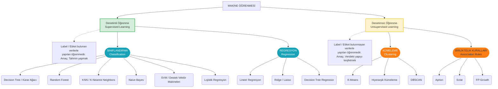
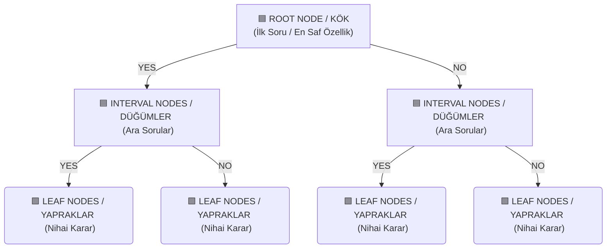
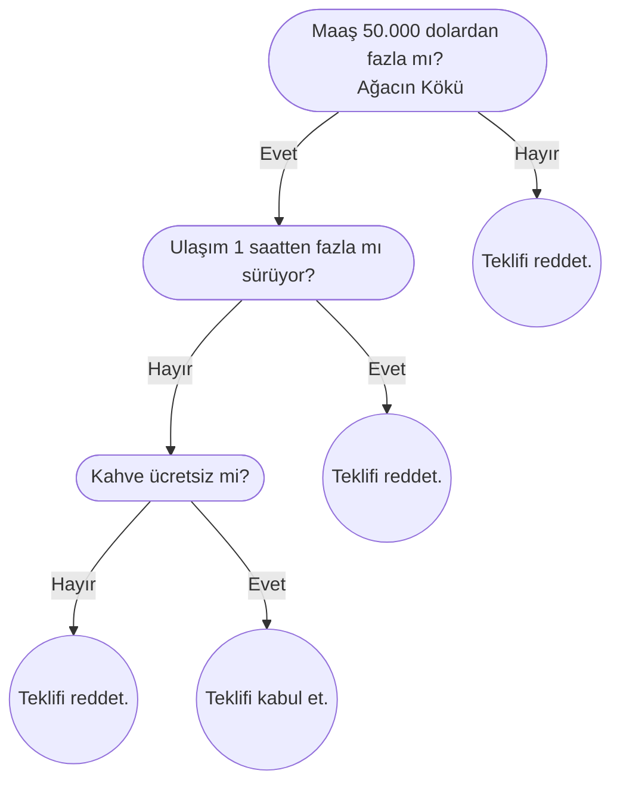
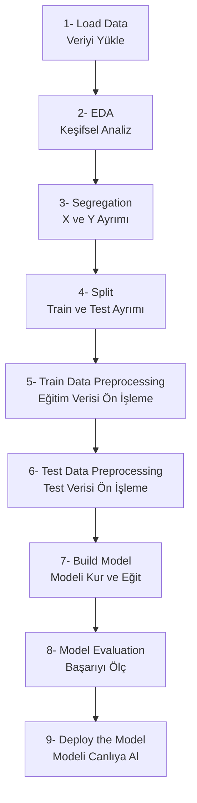

>[!danger] Kritik: Dönem Sonu Projesi Detayları
>
>
>**📌 Genel Not Dağılımı:** Vize (%35) + **Proje (%15)** + Final (%50)
>
>### 1. Çalışma Konusu ve Kurallar
>- **Veri Seti:** Tamamen kendimiz bulacağımız, **en az 50.000 gözlem (satır)** içeren bir veri seti olacak. *(Kaggle'a bakabilirsiniz).*
>- **Bireysel Çalışma Esası:** Hoca çalışmanın **bireysel** olmasını şiddetle tavsiye ediyor. 
>- **Algoritma Dağıtımı:** Herkes kafasına göre algoritma seçemeyecek. **10. Hafta sonunda** hoca kura çeker gibi rastgele dağıtacak *(Bana K-Means, başkasına Random Forest düşebilir).*
>- **Teslim Tarihi:** 14. Hafta.
>
>### 2. Proje Aşamaları (Nasıl Yapılacak?)
>Hoca sadece bir sonuç değil, modelin gelişimini de görmek istiyor. Süreç 3 adımdan oluşacak:
>
>1. **Aşama 1 (Zemin/İlk Model):** Hocanın derste verdiği saf, değiştirilmemiş kodu kendi veri setimize uygulayıp bir taban `Accuracy` (Başarı) oranı bulacağız. *(Örn: "Hiçbir şeye dokunmadım, başarı %80 çıktı").*
>2. **Aşama 2 (Laboratuvar/Optimizasyon):** Model üzerinde **3 farklı parametre değişikliği** yapacağız. Misal: 
>	- Train/Test oranını değiştirmek, 
>	- Ağacın `max_depth` (derinlik) ayarıyla oynamak, 
>	- `gini` yerine `entropy` kullanmak,
>	- Verideki outlier'ları (aykırı değerleri) temizlemek vs.
>3. **Aşama 3:** Yapılan bu 3 değişikliğin **en az 2'si modeli daha iyiye götürmek zorunda** *(Örn: %80'den %85'e).*
>
> **Ek Not:** Hoca derste açıkça *"Bunu yaptım kötüleşti, şunu yaptım iyileşti tarzı raporlar en güzel çalışmalardır."* gibi bir şey söylemişti. Yani sadece başarıyı değil, **başarısız denemeleri ve bunun nedenlerini de** rapora eklersek bilimsel süreci tam anlamıyla işletmiş oluruz. Hem hatalarımızı anlama amacıyla önemli hem de hatadan sonuç çıkardığımızı gösterme amacıyla...
>
>### 3. Puanlama Kriterleri (100 Puan Üzerinden)
>
>| Değerlendirme Kriteri | Puan | Benden Ne Bekleniyor? |
>| :--- | :---: | :--- |
>| **Veri Setine Hâkimiyet** | 20 | Veriyi nereden aldın? Sütunlar *(Feature)* ne anlama geliyor? |
>| **Veri Analizi (EDA)** | 10 | Hangi eksikleri sildin? Dönüşüm *(Encoding)* yaptın mı? Bkz: [[veri-madenciligi-3#Keşifsel Veri Analizi (Exploraty Data Analysis -EDA)\|EDA Süreçleri]] |
>| **Modele Hâkimiyet** | 30 | Algoritmada tam olarak neleri değiştirdin? *(Örn: Neden Entropy kullandın?)* |
>| **Model İyileştirme** | 30 | Yaptığın müdahaleler modelin başarısını artırdı mı? |
>| **Başarılı Sonuç** | 10 | Ulaştığın nihai `Accuracy` (Doğruluk) oranı tatmin edici mi? |

---


# Ders Notları

## 1. Veri Madenciliği ve Bilgi Keşfi: Gerçek Hayat Uygulamaları

Veri madenciliği sadece tablo temizlemek değildir. O tablolardan [[makine öğrenmesi]] algoritmalarıyla anlamlı kurallar ve tahminler (*pattern/örüntü*) çıkarmaktır. 

- **Sepet Analizi (Market Basket Analysis)**: Ders esnasında yurt dışından bir örnek vermişti hoca bunun için: Yurt dışında bebek bezleri ile alkol reyonu yan yana. Bunun nedeni, çocuğu olan aile babasının bezi alırken yanına içkisini de almasından kaynaklı. Türkiye'de de cips ve kola birlikteliği böyledir. 
- **Tavsiye Sistemleri (Recommendation Systems)**: Netflix'in "Bunu izleyenler şunu da izledi" demesi veya Trendyol'un sepet önermeleri tamamen arka planda çalışan yapay zekâ/makine öğrenmesi örüntüleridir.

## 2. Makine Öğrenmesi Türleri

Makine öğrenmesi, bilgisayarların açıkça programlanmadan verilerden öğrenmesi (*pattern keşfi*) işidir. Pekiştirmeli öğrenmeyi saymazsak temelde ikiye ayılır (Not: Bu dersin işlendiği hafta tesadüf eseri aynı konu Dijital Pazarlama dersinde de işlendi. Oraya da bakmanız önerilir: [[dijital-pazarlama-4#Makine Öğrenmesi|Makine Öğrenmesi]]):





### A. Denetimli Öğrenme (Supervised Learning)
- Ortada bir **ETİKET (Label - $Y$)** vardır. Makineye sürekli "Bu ev 1 milyon, bu ev 2 milyon" diye **<u>önceden etiketlenmiş</u>** geçmiş veriler verilir.
- Küçükken büyüklerimizin bize *Uglum sobaya dokunma yanarsun, uglum kosma dusersin* demesi gibi bir etiketleme süreci içerir. Bir denetleyen söz konusudur. *Çocuk zamanla bu etiketlerle öğrenir ve koşarsa düşeceğini, sobaya dokunursa elinin yanacağını tahmin eder.* 
- *Kişinin yaşına, eğitimine, medeni durumuna (X) bakarak maaşının 50K'dan fazla olup olmadığını (Y) tahmin etmek.*
- **Amaç**: Öğrendiklerinden yola çıkarak gelecekteki yeni veriler için **TAHMİN (Prediction)** yapmaktır. 
	- *İşin içinde tahmin varsa kesinlikle denetimli öğrenmedir*.
- **Türleri**:
	1. **Sınıflandırma**: Çıktı kategoriktir. *Karar Ağaçları, KNN, SVM, Naive Bayes*.
	2. **Regresyon**: Çıktı sayısaldır, doğrusaldır. *Ev fiyatı, maaş tahmini*.

### B. Denetimsiz Öğrenme (Unsupervised Learning)
- **Etiket ($Y$ hedef sütunu) YOKTUR**. Makine tahmin yapmaz, sadece verinin içinde yapıyı/örüntüyü (pattern) keşfeder, gruplar, ayrıştırır.
- "*Notu BA'dan düşük olanlar sağa, yüksek olanlar sola geçsin*" demek gibidir. Burada bir tahmin yoktur, sadece **olanı kümelere (clusters) ayırmak vardır**.
- **Amaç**: Veri gruplarını keşfetmek ve örüntüleri ortaya çıkarmak. Bir başka deyişle, **verinin içindeki gizli yapıyı, desenleri bulmaktır.**
- **Türleri**:
	1. **Kümeleme (Clustering)**: K-Means, DBSCAN.
	2. **Birliktelik Analizi**: Apriori, Eclat (Sepet analizi algoritmaları).

## 3. Sınıflandırma Algoritmaları: Karar Ağaçları (Decision Trees)

Veriyi **ardışık kararlar vererek** bölme mantığıyla (if-else tarzı) çalışan sınıflandırma algoritmasıdır.

### Karar Ağacı Anatomisi
1. **Kök (Root Node)**: Ağacın en tepesindeki ilk soru hücresidir. Veriyi en iyi bölen özelliktir.
2. **Düğümler (Interval Nodes)**: Kökten sonra gelen ara sorulardır.
3. **Yapraklar (Leaf Nodes)**: Artık bölünmenin bittiği ve **kararın (tahminin) verildiği** son hücrelerdir. "Maaşı 50K'dan azdır" veya "İşi reddet" gibi.
4. **Kenarlar (Edges)**: Sorular arası bağlantılardır.


##### Karar Ağaçlarının (Decision Tree) Avantajları
- **Yorumlanması kolaydır**: İnsan mantığına (if-else) çok uygun olduğu için alınan kararın nedeni kolayca açıklanabilir.
- **Görselleştirilebilir**: Ağaç yapısı çizilerek sunum yapılabilir.
- **Sezgisel bilgi sağlar**: Hangi değişkenin (feature) hedefi belirlemede daha önemli olduğunu (root node'a yakınlığına bakarak) hemen anlarız.

##### Ağacın Durma Kriteri
- Düğüm sayısı arttıkça modelin karmaşıklığı da artar. Karmaşıklığın artması bizi *overfitting* tehlikesine götürür.
- **Dallanma ne zaman durur?**: Algoritma bu alt gruplara ayırma işlemini şu iki durumdan biri gerçekleşene kadar sürdürür:
	1. Veri tamamen saf olana kadar (örn: yapraktaki herkesin "yes " olması).
	2. Dışarıdan bir **durdurma kriteri** (örn: `max_depth`) sağlanana kadar.

>[!danger] Karar Ağaçlarının En büyük Problemi: OVERFITTING (Aşırı Öğrenme)
>Makinenin veriyi öğrenmesi değil, **ezberlemesidir**. Ezberleyen makine, tıpkı ezberci bir öğrenci gibi, yeni bir durumla karşılaştığında yorum (tahmin) yapamaz ve çuvallar. **Ezberlersek, farklı alanda yorum yapamayız**. <br>
>**Çözüm**: Karar ağaçlarının bu sorunu çözmek için birden fazla karar ağacının birleşiminden oluşan [[Random Forest]] (Rassal Orman) algoritması geliştirilmiştir.

>[!info] 📉 Eğitim Grafiği (Time vs. Loss) ve Overfitting'in Tespiti
>Makine öğrenirken arka planda bir **Zaman (Time)** ve **Hata/Kayıp (Loss)** grafiği oluşur. Eğitim ilerledikçe hata oranı sıfıra doğru yaklaşır. 
>Ancak bir noktadan (minimum loss) sonra hata çizgisi **tekrar yukarı doğru çıkmaya başlarsa**, işte o kırılma noktası modelin öğrenmeyi bırakıp **ezberlemeye (Overfitting)** başladığı yerdir. Eğitimi tam o dip noktada (Best Weight) kesmek veya `max_depth` gibi kısıtlamalar getirmek gerekir.
#### Kök Hücre (Root) Neye Göre Seçilir?
Elimizde 15 sütun (özellik) varsa, en tepeye (köke) hangisini sorarak başlayacağız? Buna **Saflık (*Purity*)** ve **Karışıklık (*Impurity*)** ölçümüyle karar verilir.

En yaygın kullanılan iki matematiksel ölçüm şunlardır:

1. **Entropy (Bilgi Kazancı)**: Verideki belirsizliği logaritmik olarak ölçer. Değer `0` ise veri tamamen saftır, `1` ise tamamen karışıktır (Amacımız `0`'a yaklaşmak).
2. **Gini Index**: Veri setindeki saflığı karesel olarak ölçer. Karar ağacı algoritması Gini değerini küçültmeye çalışır. **Scikit-learn kütüphanesinin varsayılan bölme ölçütü Gini'dir**.

#### Karar Ağacının Yapısal Şeması




#### Örnek Bir Karar Ağacı: "İş Teklifini Kabul Etmeli Miyim?"




## 4. Makine Öğrenmesi Eğitim Süreci (Pipeline)
Makine öğrenmesinde her şey şu denklem etrafında döner:
$$
\large
f(x) = Y
$$
Makinenin amacı $X$ (Girdiler) ile çarpıldığında $Y$'yi (Hedef) verecek en iyi $W$ (Weight/Ağırlık) değerlerini bulmaktır.

#### Aşama Aşama Eğitim Süreci
1. **Veri Seti (Dataset)**: Önce tablo yüklenir.
2. **X ve Y Ayrımı (Kritik)** 
	- **X (Girdi Değişkenleri / Features)**: Yaş, eğitim, çalışma saati gibi tahmin yapmak için kullanılacak sütunlar.
	- **Y (Hedef Değişken / Label)**: Tahmin edilmek istenen sonuç sütunu (örn: gelir 50k'dan küçük mü?).
3. **Eğitim ve Test Ayrımı (`train_test_split`)**: Veri seti körü körüne eğitime sokulmaz. Genellikle **%80 Eğitim (Train)** ve **%20 Test** olarak bölünür. Model %80'lik kısımla çalışır, öğrenir; kalan %20'lik kısımla ise daha önce hiç görmediği bu veriler üzerinde sınava tabi tutulur.
	- Modeli hiç görmediği %20'lik veriyle test edip ezberleyip ezberlemediğini (`accuracy`) ölçeceğiz.
4. **Model Eğitimi (Training / `fit`)**: Algoritma çalışır ve verideki örüntüleri (pattern) öğrenir. Matematiksel olarak $f(x) = W \cdot X = Y$ denklemindeki en iyi $W$ (Ağırlık/Weight) değerlerinib ulmaya çalışır. Zamanla hata (`loss`) sıfıra yaklaşır.
5. **Tahmin (Prediction / `predict`)**: Eğitilen model, test için ayrılan X verilerine bakarak Y'leri tahmin eder.
6. **Değerlendirme (Eveluation)**: Modelin tahminleri ile gerçek Y değerleri karşılaştırılır. **Accuracy (Doğruluk Oranı)**, Precision, Recall, F1 Score gibi metrikler ve **Confusion Matrix (Karmaşıklık Matrisi)** ile modelin başarılı ölçülür (örn: Model %83 başarılı).

> 	**Confusion Matrix (Karmaşıklık Matrisi) Mantığı**: Modelin nerede kafasının karıştığını gösterir. Örneğin hoca dersteki çıktıda şunu okumuştur: *"Gerçekte 0 (Maaşı 50K altı) olanı gerçekten 0 tahmin edenler 4300 kişi. Gerçekte 1 olanı 0 tahmin edenler (Hata)..."* şeklinde matrisin çapraz okuması yapılır.

#### ML Pipeline (Makine Öğrenmesi Boru Hattı)
Profesyonel bir veri madenciliği sürecinin 7 adımının temsilidir. Dikkat edilecek en önemli husus **veri ön işlemenin (preprocessing), veriyi `Train` ve `Test` olarak ikiye böldükten sonra yapılmasıdır!** Aksi takdirde modele gelecekten bilgi sızar (Data Leakage).



    

## 5. Önemli İki Kod

Derste Python / Scikit-learn kodlarında özellikle iki komutun altını vurgulamıştı hoca. Bu iki komutu gördüğümüzde orada bir yapay zekâ / makine öğrenmesi döndüğünü anlamalıyız.

```python
# fit() -> Eğitimi Yapar
# Modeli X_train girdileri ve Y_train hedefleri ile eğitiyoruz (W ağırlıklarını buluyor).
dt_model.fit(X_train, Y_train)

# predict() -> Tahmin yapar
# Eğitilmiş modeli kullanarak, hiç görmediği X_test verilerinin sonuçlarını tahmin etmesini istiyoruz.
y_pred = dt_model.predict(X_test)
```


## Derse Aşkın

>[!tip] Roadmap.sh
>Ders esnasında makine öğrenmesi yahut veri analisti gibi birçok kariyer planı için bir yol haritası sitesi önerildi: [Roadmap.sh](https://www.roadmap.sh)

