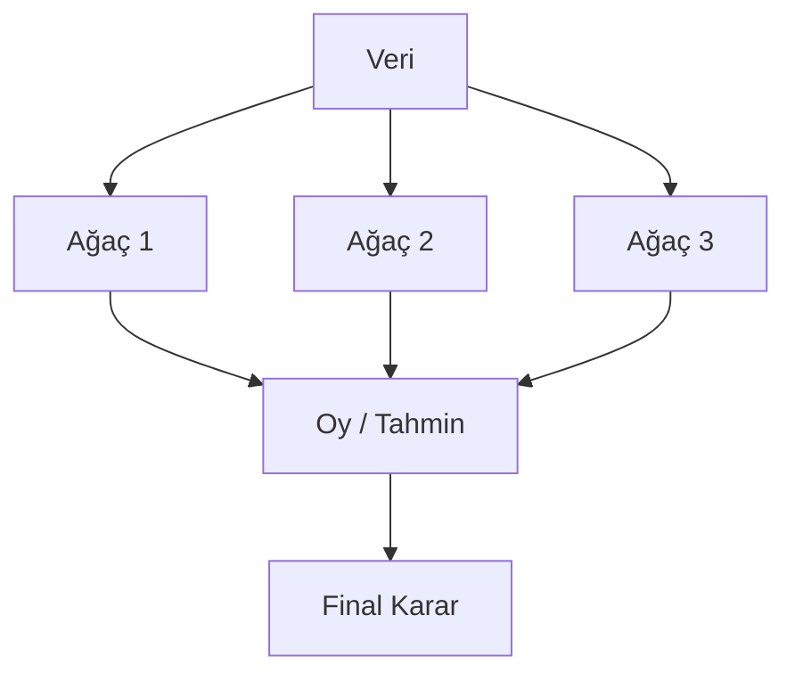
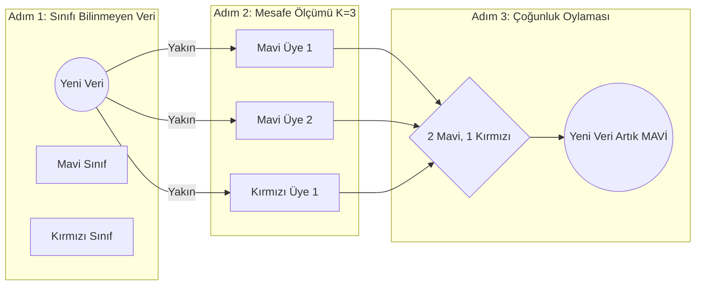

# Bilgilendirme falan

- Kuvvetle muhtemel **algoritma seçimi** ve **parametre ayarlama mantığı** ile ilintili sorular sorulacaktır sınavda, kodlar bağlamında.

---


# Ders Notları
Bu hafta, [[veri-madenciligi-4#A. Denetimli Öğrenme (Supervised Learning)|Denetimli Öğrenme (Supervised Learning)]] şemsiyesi altındaki iki önemli sınıflandırma algoritmasına odaklanıyoruz: **Random Forests** ve **K-Nearest Neighbors (KNN)**.

## A. Random Forests
Geçen hafta işlenen [[veri-madenciligi-4#3. Sınıflandırma Algoritmaları Karar Ağaçları (Decision Trees)|Decision Tree (Karar Ağacı)]] algoritmasının daha güvenli hâli olarak nitelendirilebilir. **Decision Tree** tek başına güçlü bir algoritma aslında, fakat üç temel zaafı var:

1. **Overfitting yapabilir.**
2. **Veri değişimine karşı hassas olabilir.**
3. **Tek ağaç her zaman güçlü olmayabilir.

**Ensemble Learning (Topluluk Öğrenmesi)**, tek bir karar ağacının en büyük problemi olan **Overfitting (Aşırı Öğrenme)** sorununu ve bu gibi diğer sorunları da çözmek için geliştirilmiş bir yöntemdir. 

Birden fazla model birlikte çalışarak tek modele göre **daha güçlü ve daha kararlı** tahmin üretir böylelikle. Ayriyeten Random Forests'in avantajları arasında **feature importance** hesaplaması da vardır: **hangi özelliğin (feature’ın) modele ne kadar katkı yaptığını ölçen değer**.


>[!example] Majority Voting (Çoğunluk Oylaması)
>Sınıfa bir kişi geliyor ve 5 kişiye aynı soruyu soruyor diyelim. 3 kişi "Evet", 2 kişi "Hayır" diyor. Sonuç olarak "Evet" kararı alınıyor. <br>
>**Bu bize şunu anlatıyor**: Tek bir modelin (tek ağaç) yanılma payı yüksektir ve veri değişimine karşı hassastır. Ancak birden fazla modelin (orman) ürettiği kararların oylamaya (*Majority Voting*) sunulması daha kararlı ve daha güvenilir bir sonuç doğuracaktır. **Son kararı tek bir ağacın keyfine bırakmıyoruz**. İnsanlık tarihinin hatrı sayılır kısmı zaten tek kişinin kararının bedelini ödeyerek geçmiştir, bari burada o hatayı azaltalım...





<br>

### Random Forest Nedir ve Nasıl Çalışır?
**Random Forest**, çok sayıda **Decision Tree**'nin birlikte çalıştığı bir modeldir.

1. Eğitim setinden rastgele $K$ adet alt veri kümesi (subset) seçilir.
2. Seçilen bu alt kümelerle ilişkili karar ağaçları oluşturulur.
3. İstenilen ağaç sayısı ($N$) kadar bu işlem tekrarlanır.
4. Her ağaç kendi tahminini üretir.
5. Yeni gelen bir veri, tüm ağaçlara sorulur ve **çoğunluk oyu (*Majority Voting*)** hangi sınıftaysa, veri o sınıfa atanır.


>[!warning] Veri Çeşitliliği
>Eğer Random Forest içindeki her bir ağaca **aynı eğitim verisini** verirsek, ağaçların hepsi **birebir aynı kararları üretir ve oylamanın bir esprisi kalmaz (overfitting olur)**. Algoritmanın adı da bu yüzden **"Random" Forest**'tir ve bu yüzden ağaçları oluştururken eğitim verilerini de rastgele ve farklı alt kümeler (subset) hâlinde dağıtır.

### Accuracy, Train Accuracy, Test Accuracy ve Overfitting
Makine öğrenmesinde modelin amacı **ezberlemek değil, tümevarım (genelleme) yapabilmektir**. Bir modelin başarısı **`Train Accuracy`** (eğitim verisindeki başarı) ve **`Test Accuracy`** (hiç görmediği verideki başarı) karşılaştırılarak ölçülür.

**Accuracy**: Modelin doğru tahmin ettiği örneklerin toplam örnek sayısına oranı. Doğru tahmin sayısının toplam tahmin sayısına oranı ile bulunur.
##### Train Accuracy
Modelin **eğitim verisi üzerindeki başarısı**.
- Model bu veriyi eğitim sırasında gördüğü için **genelde daha yüksektir**.
- **Çok yüksek çıkması** tek başına **iyi haber değildir**.
- Bazen **1.00** veya **0.99** gibi değerler, modelin verihi **ezberlediğini** gösterebilir.

##### Test Accuracy
Modelin **daha önce görmediği veri üzerindeki başarısıdır**.

- Asıl güveneceğimiz metrik budur. Nitekim mesele eğitimi tekrar etmek değil, **tümevarım yapabilmektir.**

>[!important] Öğrenmek
>**Öğrenmek = genelleme (tümevarım) yapabilmek** demektir. Yani modelin yalnızca gördüğünü hatırlaması değil, görmediği veride de mantıklı davranabilmesidir.


##### Overfitting 
- Modelin eğitim verisini aşırı iyi öğrenip yeni veride kötüleşmesidir. Bir modelin güvenilir olup olmadığını okumak için aşağıdaki tablo bir rehber mahiyetindedir (daha iyi anlaşılması için bkz. **[[veri-madenciligi-4#Karar Ağaçlarının En büyük Problemi OVERFITTING (Aşırı Öğrenme)|Overfitting]]**):


| Train Accuracy | Test Accuracy | Durum Analizi                                                                                 | Güvenilir mi?         |
| -------------- | ------------- | --------------------------------------------------------------------------------------------- | --------------------- |
| 1.00           | 0.70          | Veriyi tamamen **ezberlemiş** ama genelleyemiyor (overfitting). Yeni veri gelince çuvallıyor. | **Güvenilmez.**       |
| 0.99           | 0.65          | Aşırı ezberleme var. Gerçek hayatta kullanılamaz.                                             | **Güvenilmez.**       |
| **1.00**       | **0.80**      | Eğitimde ezber ama testte fena değil. Yine de sınırda.                                        | **Kabul edilebilir.** |
| **0.94**       | **0.92**      | Model mükemmel öğrenmiş. Ezberlememiş, **genelleme yapabiliyor**.                             | **Çok iyi**.          |
| **0.95**       | **0.94**      | Eğitim ve test birbirine çok yakın. Hem çok iyi öğrenmiş hem çok iyi genellemiş.              | **Mükemmele yakın**.  |


- **İlk iki satırda** belirgin ve sorunlu overfitting vardır.
- **Üçüncü satırda** train-test farkı bulunduğu için hafif overfitting emaresi vardır ama test sonucu kabul edilebilir olduğu için model yine de iş görebilir.
- **Son iki satırda** ciddi overfitting sorunu yoktur; model dengelidir.

>[!warning] Not
>`0.95/0.94` gibi bir sonuç çok güçlüdür. **Son üç satır daha ziyade Random Forest tarafında görülür.** Ama veri aşırı temi ve aşırı kaliteli ise **Decision Tree**'de de görülebilir.

(*Not: Test accuracy'nin %75'in altında olması makine öğrenmesi projelerinde genellikle kabul edilemez bir durumdur.*)


>[!warning]
>Random Forest, **overfitting**'i tamamen yok etmez; ama **Decision Tree'ye göre daha dayanıklıdır**. Yani "asla hata yapmaz" değil de "tek ağaca göre daha güvenilirdir" demeliyiz.


---


### Decision Tree ve Random Forest Karşılaştırması


| Özellik     | Decision Tree                                                | Random Forest                                                      |
| ----------- | ------------------------------------------------------------ | ------------------------------------------------------------------ |
| Yapı        | Tek bir ağaç                                                 | Birçok ağacın birleşimi                                            |
| Eğitim      | Hızlı ve basit                                               | Daha uzun sürer                                                    |
| Overfitting | Kolay ezberleyebilir                                         | Ezberlemeye daha dayanıklıdır                                      |
| Doğruluk    | Genellikle daha düşük                                        | Genellikle daha yüksek                                             |
| Yorumlama   | Çok kolay                                                    | Tek tek ağaçlar anlaşılır ama tüm orman daha karmaşıktır           |
| Kullanım    | Küçük veri ve açıklanabilirlik gereken durumlarda kullanılır | Daha güçlü ve daha güvenilir tahmşin gereken durumlarda kullanılır 


---

## B. K-Nearest Neighbors (KNN - K-En Yakın Komşu)
KNN, **etiketli verilerle çalışan bir sınıflandırma algoritmasıdır**. Ancak diğer algoritmaların aksine arka planda karmaşık bir "öğrenme denklemi" kurmaz. Bunun yerine **matematiksel mesafe** ölçümüne dayanır. Gözlemlerin birbirine olan benzerliklerine göre tahmin yapan **denetimli öğrenmede** sınıflandırma ve regresyon için kullanılan en temel algoritmalardan biridir.


>[!example] Örnek
>Sınıfa yeni birisi geliyor ve boş bir sıraya oturuyor diyelim. "Ben hangi gruba dâhilim?" diye soruyor. Algoritma ona şunu söylüyor: "Konumunu belirle ve sana en yakın 3 kişiye bak." Yeni kişi bakıyor: 2'si kırmızı takım, 1'i mavi takım. "O hâlde ben kırmızı takımdayım!" diyor.  <br>
>**Bu bize şunu anlatıyor**: <u>İşbu algoritma geçmişten bir kural çıkarmaz</u>! Sadece yeni gelen verinin mevcut verilere olan uzaklığını ölçer ve çoğunluğa göre onu etiketler. <br> 
>KNN şunu soruyor diyebiliriz: **"Bu yeni gözlem, daha önce gördüğüm hangi örneklere benziyor?”**


### Neden KNN Algoritmasına "Lazy Learner" Deniliyor?
Eğitim (`fit`) aşamasında büyük bir matematiksel model (weight vs.) inşa etmez. Yalnızca veriyi hafızasında tutar. Asıl işi **tahmin (`predict`) aşamasında** yapar. Yeni veri geldiğinde o verinin *sistemdeki diğer tüm verilere* olan mesafesini **tek tek hesaplamak zorundadır**. Bu yüzden **milyonluk büyük veri setlerinde KNN kullanmak mantıksızdır ve çok yavaştır**.

Özetle; 
- eğitim aşamasında karmaşık bir model kurmaz, 
- veriyi hafızada tutar,
- asıl hesaplamayı **tahmin anında** yapar.

Bu sebeple eğitim süresi görece kısa olabilir ama tahmin süresi uzayabilir. 

---


Aşağıdaki şema $K = 3$ seçildiğinde sınıflandırmanın nasıl yapıldığını gösteriyor:



KNN'nin öğrenmesini sağlayan şey veriler arasındaki uzaklığı hesaplayan matematiksel metriklerdir. En çok bilinen 3 mesafe ölçümü şunlardır:

1. **Euclidean (Öklid) Distance**: Geometriden bildiğimiz Pisagor bağıntısıdır. İki nokta arasındaki en kısa (kuş uçuşu) mesafeyi ölçer.
2. **Manhattan Distance**: Noktalar arasındaki mesafeyi ızgara (grid) planlı bir şehirde (Manhattan gibi) binaların etrafından dolaşarak ölçer gibi dik açılarla hesaplar.
3. **Minkowski Distance**: Euclidean ve Manhattan mesafesinin genelleştirilmiş hâlidir. **Scikit-learn kütüphanesinde KNN varsayılan olarak Minkowski kullanır**.

>[!example] Edit Distance: "Bunu mu demek istediniz?"
>Sadece sayılar değil, kelimeler arasında da mesafe vardır. Buna yazılımda **Edit Distance** veya **Hamming Distance** denir. Söz gelimi "Merhaba" yerine "Merhebe" yazdığınızda, Google aradaki harf farklılıklarını sıfırlar ve birler üzerinden hesaplayarak mesafeyi ölçer. "Bu kelimenin 'Merhaba'ya olan mesafesi çok yakın, bunu mu demek istediniz?" diye sorar. İşte KNN'nin mesafe mantığı tam olarak bu temel üzerine kuruludur.


KNN algoritmasındaki en büyük problem $K$ değerinin (kaç komşuya bakılacağının) ne olması gerektiğidir. <br>
- **$\mathbf{K=1}$ olursa**, sadece en yakın 1 kişiye bakılır. Gürültüye aşırı duyarlılık yaratacağı için model tamamen **overfitting** yapar bu durumda. Her gelen veri sadece yanındakini örnek alır, genelleme yapılamaz. *En yakın 1 komşuya bak* demektir bu.
- **$\mathbf{K}$ çok büyük olursa**, model aşırı genelleme yapar (underfitting).
- **$\mathbf{K}$ değerinin tek sayı olması gerekir**. Genellikle 3, 5, 7, 11 gibi **tek sayılardan** seçilir. Eğer $K=6$ seçilirse ve 3'ü mavi 3'ü kırmızı çıkarsa algoritma karar veremez (Eşitlik/Tie durumu). Tek sayı seçmek ayağımıza sıkmamak için bir önlemdir; her zaman bir çoğunluk çıkmasını garanti eder.

>[!important] Not!
>Matematiksel hesaplama (mesafe) varsa, **ölçekleme (scaling) zorunludur!** Hocanın daha önce de belirttiği gibi, boks ringine 30 kiloluk biriyle 80 kiloluk birini çıkaramayız. Normalize etmek gerekir onu. Veri setindeki "Yaş" sütunu 20-50 arasında gezerken "Maaş" sütunu 10.000-50.000 arasında geziyorsa; maaşın sayısal büyüklüğü, yaşın etkisini ezer geçer. Bu yüzden `StandardScaler` veya `MinMaxScaler` ile tüm veriler 0-1 veya benzer dar aralıklara çekilmelidir. Ölçekleme yapılmazsa KNN çuvallar.


## Decision Tree vs. KNN
Hangi algoritmanın seçileceği tamamen verinin **[[veri-madenciligi-2#Boyut|boyutuna]]** ve **yapısına** bağlıdır.


| Özellik            | Decision Tree                     | KNN                                        |
| ------------------ | --------------------------------- | ------------------------------------------ |
| **Model Yapısı**       | Kural tabanlı (If-Else)           | Mesafe tabanlı (Matematiksel)              |
| **Öğrenme Tipi**       | Model kurar (Eager Learner)       | Model kurmaz, veriyi saklar (Lazy Learner) |
| **Tahmin Hızı**        | Çok hızlıdır                      | **Çok yavaş** (Her veriyi tek tek tarar)   |
| **Ölçekleme İhtiyacı** | Genelde gerekmez                  | **Kesinlikle gereklidir**                  |
| **Yorumlanabilirlik**  | Yüksek (Ağaç çizilip bakılabilir) | Düşük (sadece matematiksel yakınlık var)   |
| **Veri Boyutu**        | Büyük verilerde çok etkilidir     | Küçük verilerde etkilidir                  |

- **Decision Tree**: “Şu koşul sağlandı mı?” diye gider.
- **KNN**: “Kime daha yakınsın?” diye gider.

---

## Hangi Veride Hangi Algoritma Daha Uygun?

### Decision Tree seçmeye daha yatkın durumlar

- Modeli açıklamak istiyorsak.
- “Neden bu kararı verdi?” sorusuna görsel cevap gerekliyse.
- Kural tabanlı yorum önemliyse.
- Ölçekleme ile uğraşmak istemiyorsak.

### Random Forest seçmeye daha yatkın durumlar

- Daha yüksek doğruluk istiyorsak.
- Tek ağaca güvenmek istemiyorsak.
- Overfitting riskini azaltmak istiyorsak.
- Feature importance görmek istiyorsak.
- Tablo veri (tabular data) ile çalışıyorsak.

### KNN seçmeye daha yatkın durumlar

- Veri seti küçük / orta ölçekliyse.
- Benzer örnekler yakın duruyorsa.
- Sayısal özellikler anlamlıysa.
- Ölçekleme yapabiliyorsak.
- Lokal benzerlik mantığı iş görüyorsa.

### KNN'den uzak durulabilecek durumlar

- Veri çok büyükse.
- Çok yüksek boyut varsa.
- Tahminin hızlı olması gerekiyorsa.
- Ölçekler çok farklıysa ve veri hazırlığı zayıfsa.


---


# Kod Blokları

### 1. Random Forest ve Paralel İşlem (`random_forest.ipynb`)
581.000 satırlık devasa bir veri setinde Decision Tree ve Random Forest karşılaştırması yapıldı derste. Veri gürültüsüz olduğu için Decision Tree %77, Random Forest %75 başarı verdi. *Birbirine yakın başarı oranlarında her zaman daha güvenilir olan Ensemble modelin (Random Forest)* tercih edilmesi gerekir yine de.

```python
from sklearn.ensemble import RandomForestClassifier

rf_model = RandomForestClassifier(
	n_estimators=100,  # Ormandaki ağaç sayısı (default 100)
	max_depth=10,  # Ağaçların fazla büyümesini (overfitting) engellemek için
	random_state=42,  # Her çalışmada aynı rastgeleliği elde etmek için
	n_jobs=-1  # ÇOK ÖNEMLİ: Bilgisayardaki tüm işlemci çekirdeklerini paralel kullanır. Büyük verilerde hızı artırır.
)
rf_model.fit(X_train, y_train)
```

*Not: Confusion Matrix (Karmaşıklık Matrisi) bu veride 7x7 boyutunda çıktı çünkü 7 farklı orman türü (sınıf) vardı. Matristeki tüm sayıların toplamı, test setindeki eleman sayısını (`X_test` uzunluğunu) verir.*

### 2. Ölçeklemenin (Scaling) KNN Üzerindeki Etkisi (`digit.pynb` & `knn.ipynb`)
MNIST (El yazması rakamlar) veri setinde sayılar piksel değerleri (0-16) olduğu için KNN ölçekleme olmadan da %98 başarı verdi, ne de olsa aynı sikletteler. Ancak Breast Cancer gibi değer aralıkları çok farklı olan veri setlerinde ölçekleme yapılınca başarının nasıl fırladığı gösterildi. 

```python
from sklearn.preprocessing import StandardScaler

# StandardScaler ile veriler aynı matematiksel düzleme  çekiliyor
scaler = StandardScaler()

# DİKKAT: Train verisi ile fit_transform yapılırken, Test verisine SADECE transform yapılır! Data leakage olmaması için yaparız bunu!
X_train_scaled = scaler.fit_transform(X_train)
X_test_scaled = scaler.transform(X_test)

# Ölçeklenmiş veri ile KNN eğitimi
knn_scaled = KNeighborsClassifier(metric="manhattan", n_neighbors=5)
knn_scaled.fit(X_train_scaled, y_train)
```

### 3. Optimal K Değerini Bulmak İçin Döngü
En iyi K değerini bulmak için deneme-yanılma (iterasyon) yapmamız gerekir. Kodlamadaki karşılığı `for` döngüsüdür bunun.

```python
k_values = range(1, 21)
scores = []

for k in k_values:
	model = KNeighborsClassifier(n_neighbors=k)
	model.fit(X_train_scaled, y_train) # Eğit
	pred = mode.predict(X_test_scaled) # Tahmin et
	scores.append(accuracy_score(y_test, pred)) # Başarıyı listeye ekle
	
# Çıkan scores listsi matplotlib ile grafiğe döküldüğünde en tepe nokta Optimal K'dir.
```


