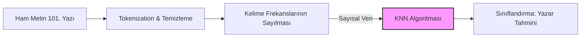

## 1. Yapısal ve Yapısal Olmayan Veri
Veri madenciliğinde veriler yapılarına göre temel kategorilere ayrılır. Metin madenciliğinin neden ayrı bir disiplin olduğunu anlamak için bu ayrımı bilmek şarttır. Geleneksel algoritmalar satır ve sütunlardan oluşan "yapısal" verilerle çalışırken, insanların günlük hayatta ürettiği dokümanlar "yapısal olmayan" formdadır.

| Veri Türü         | Yapı Durumu            | Örnek                      | Makine İçin Anlaşılabilirlik |
| ----------------- | ---------------------- | -------------------------- | ---------------------------- |
| Sayısal (Numeric) | Yapısal (Structured)   | Fiyat = 199₺               | Doğrudan işlenebilir.        |
| Kategorik         | Yapısal                | Marka = Samsung            | Doğrudan işlenebilir.        |
| Metin (Text)      | Yapısız (Unstructured) | "Bu telefonu çok beğendim" | **Ön işleme gerektirir.**    |
## Metin Madenciliği nedir
Medin Madenciliği (Text Mining); haberler, tweetler, e-postalar, ürün yorumları gibi *yapısal olmayan* ve düzensiz elektronik metin yığınlarından; önceden bilinmeyen, potansiyel olarak faydalı ve **yapısal veriler/desenler elde etme sürecidir**.

>[!example] Madencilik Analojisi
>Dağdaki ham kayalar (tweetler, blog yazılarıdır, maillerdir) tek başlarına bir anlam ifade etmezler ve çok karmaşıktırlar. Metin madenciliği süreci ise bu kayaları kırıp, yıkayıp, eleyip içlerindeki altın külçelerini (yapısal ve analiz edilebilir veriyi) ortaya çıkarma sürecidir.

**Neden Gerekli?**
1. **Veri Patlaması**: Her gün milyonlarca *yapısal olmayan* veri üretiliyor.
2. **Anlam Çıkarma**: Ham metinden duygu, konu, eğilim (trend) belirleme ihtiyacı.
3. **Karar Destek**: Şirketlerin müşteri geri bildirimlerini okuyarak değil, analiz ederek strateji geliştirmesi.
4. **Güvenlik ve Denetim**: Spam e-postaların taranması veya sahte haberlerin tespiti.

## Metin Ön İşleme (Preprocessing) Aşamaları
Bir makine "Merhaba" kelimesi ile "merhaba!" kelimesini aynı şey olarak algılamaz. Metni makine öğrenmesi algoritmalarına sokmadan önce mutlak sûrette temizlememiz ve standartlaştırmamız gerekir. Bu işlem sırasıyla şu 4 adımdan oluşur:

1. **Küçük Harfe Çevirme (Lowercasing)**: Bilgisayar büyük/küçük harfle duyarlıdır. 
2. **Noktalama İşaretlerini Kaldırma**: Virgül, ünlem gibi semboller kelimenin yapısını bozar.
3. **Stopwords (Gereksiz Kelimeler) Temizleme**: Bağlaçlar ve edatlar cümleye yapısal anlam katar ama konu/duygu hakkında bilgi vermez. Bu yüzden atılırlar.
4. **Tokenization (Parçalama)**: Temizlenmiş cümle, makinenin sayabileceği/işleyebileceği dizi (array) elemanlarına bölünür. 
	- "yapay zekâ güzeldir" $\to$ \["yapay", "zekâ", "güzeldir"\]

## İleri Seviye Metin Madenciliği Çalışma Alanları
Ön işlemden geçen metinler üzerinde amaca yönelik çeşitli karmaşık görevler icra edilir:

- **Enformasyon Getirimi (Information Retrieval)**: Derlem (corpus) hakkında ön bilginin toplandığı ilk aşamadır. Web sayfalarının URL'leri gibi, dosya tarihleri gibi, yazar bilgileri gibi.
- **Doğal Dil İşleme (NLP - Natural Language Processing)**: Cümlelerin dilbilgisi kurallarına göre analiz edilmesidir. Kelimelerin fiil, isim, sıfat olarak etiketlenmesi (Part of Speech Tagging) bu aşamada yapılır.
- **Adlandırılmış Varlık Tanıma (Named Entity Recognition - NER)**: Metindeki özel isimlerin (Kişi, Şehir, Kurum, Sembol) tespit edilmesidir. 
	- *Zorluk (Bağlam Problemi)*: "Osman Bey" ifadesi, bir insanı imleyebileceği gibi, İstanbul'daki bir semti de imliyor olabilir. NER, bu ayrımı istatistiksel bağlamdan çözer.
- **Örüntüsü Tanımlı Varlıkların Bulunması (Pattern Matching)**: Düzenli ifadeler (regex) kullanılarak metin içindeki e-posta adresleri, telefon numaraları veya tarih formatlarının cımbızlanmasıdır.
- **Duygu Analizi (Sentimental Analysis)**: Metnin kutupsallığını (polarity) ölçer. Yorum veya tweet'in **olumlu** mu yoksa **olumsuz** mu olduğunu belirler. Daha gelişmiş versiyonları doğrudan ruh hâli ve kanaat tespiti yaparlar.

---

#### Problem:
Elimizde 5 farklı yazara ait 20'şer adet (toplam 100) makale var. Kimin yazdığı belli olmayan yeni bir 101. makale geliyor. Bu makaleyi hangi yazarın yazdığını makineye nasıl buldururuz? (Literatürde *Author Recognition* derler).

#### Çözüm Adımları:
1. **Özellik Çıkarımı (Feature Extraction)**: Her yazarın 20 makalesi analiz edilir. Hangi yazarın hangi kelimeleri ne sıklıkla (frekans) kullandığı sayılır. (Metin verisi $\to$ Sayısal frekans verisine dönüştü).
2. **Model Eğitimi**: Elde edilen bu kelime frekans tablosu, örneğin [[veri-madenciligi-5#B. K-Nearest Neighbors (KNN - K-En Yakın Komşu)|KNN]] algoritmasına verilir.
3. **Tahmin (Prediction)**: 101. yazı sisteme sokulur. Yazıdaki kelime kullanım sıklıkları, eski yazarlarla uzaklık/yakınlık (KNN mantığı) hesabına sokulur.
4. **Sonuç**: Model, "Bu kelime kullanım tarzı en çok Yazar-3'e benziyor" diyerek sınıflandırma işlemini tamamlar.

