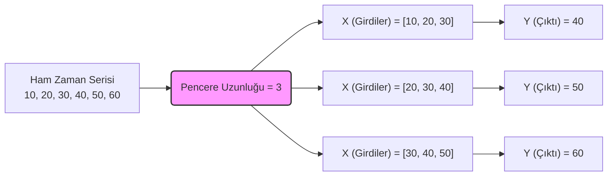

## 1. Zaman Serisi (Time Series) Nedir?
Zaman serisi verileri kısaca eşit zaman aralıklarında (saatlik, günlük, aylık vb.) elde edilen ve **kronolojik bir zaman sırasında tutulan** sayısal verilerdir. Bu verilen en büyük özelliği **bir sıraya bağlı olmaları ve zaman bağımlılığı içermeleridir**. 

Zaman serilerinde temel felsefe şudur: "*Bugün, dünden etkilenmiştir.*" Bir gözlemin bugünkü ve geçmiş değerlerine bakarak, gelecekte alacağı değerlerin tespit edilmeye çalışılması (geleceği tahminleme) işidir.

**Matematiksel Gösterimi**:

$$
X_t = f(X_{t-1}, X_{t-2}, \dots, \epsilon_t)
$$

> [!important] Geleneksel Modellerden Farkı
> Önceki haftalarda işlediğimiz [[veri-madenciligi-4#3. Sınıflandırma Algoritmaları Karar Ağaçları (Decision Trees)|Karar Ağaçları]], [[veri-madenciligi-5#A. Random Forests|Random Forest]] veya [[veri-madenciligi-5#B. K-Nearest Neighbors (KNN - K-En Yakın Komşu)|KNN]] gibi makine öğrenmesi algoritmalarında veriyi eğitirken **rastgele seçim (random split)** kriteri uyguluyordur.  
> Zaman serilerinde ise veriler **RASTGELE SEÇİLEMEZ!** Verinin kronolojik/sıralı olarak eğitilmesi zarurîdir. Zira verilerin sırasını bozarsak, geçmişin geleceği etkileme örüntüsünü yok etmiş oluruz.

---

## 2. Zaman Serisi Bileşenleri
Bir zaman serisi grafiğine baktığımızda onu oluşturan dört temel bileşen görürüz:

### 1. **Trend (Eğilim)**
Verilerin uzun vadede yukarı ya da aşağı yönlü olarak sergiledikleri harekettir (Yükselen trend / düşen trend). Borsa, yatırım ve ekonomide yönü belirleyen ana unsurdur.
### 2. **Mevsimsellik (Seasonality)**
Bir dönem boyunca periyodik olarak tekrar eden belirli bir örüntüyü tanımlar. **Ne zaman olacağı kesindir, saati saatine bellidir.** 
	- *Örnek*: Elektrik faturasının kış aylarında veya yazın klima kullanımından dolayı daha yüksek gelmesi. Otellerdeki müşteri sayısının yazın pik yapıp kışın düşmesi. 
### 3.**Döngüsellik (Cyclicality)**
Mevsimselliğe benzer ancak daha uzun vadeli, belirsiz yapılarda ve konjonktürel değişimlerle şekillenen dalgalanmalardır ve **ne zaman olacağı belli değildir** 3 yılda bir de olabilir 10 yılda bir de. **Konjonktürel Dalgalanmalar (Business Cycles)** genellikle 4 aşamadan oluşur:	
- **Genişleme (Expansion)**: Her şeyin güllük gülistanlık olduğu dönemdir. Bankalar bol bol ucuz kredi dağıtır.
	- İnsanlar kolayca ev, araba alır. Şirketler deli gibi mal satar, yeni işçiler işe alınır. İşsizlik düşer
- **Zirve (Peak)**: Genişleme sonsuza kadar sürmez. Piyasada çok para olduğu için her şeyin fiyatı saçma sapan artmaya başlar. 
			- Enflasyon patlar. 1 liralık mal 10 lira olmuştur. Herkes "Bugün aldım aldım, yarın daha da pahalanacak" diye panikle borca girer. Ekonomi aşırı ısınmıştır, kapasitesinin sınırına dayanmıştır.
- **Daralma (Contraction / Recession)**: Devlet veya Merkez Bankası bakar ki fiyatlar uçuyor, "Hooop, yeter!" der ve frene basar (mesela faizleri artırır).
	- Krediler kesilir, faizler uçar. İnsanlar alışverişi kestiği için şirketler mal satamaz. Mal satamayan şirket küçülmeye gider ve işçi çıkarmalar başlar. İflaslar peş peşe gelir. Kriz patlamıştır.
- **Dip (Trough)**: rizin en dibi, cehennemin dibidir. Ama aslında en güzel fırsatların doğduğu yerdir.
	- Zayıf şirketler batmış, piyasa temizlenmiştir. Fiyatlar artık dibi görmüştür, her şey ucuzlamıştır (ev, araba, şirket hisseleri). Ama kimsede alacak para kalmamıştır.
### 4. **Gürültü (Noise)**
Trend ve mevsimsellik etkisi ortadan kaldırıldıktan sonra geriye kalan, öngörülemeyen kısa vadeli kalıntılar ve düzensizliklerdir.

> [!danger] Gürültü vs. Outlier
> Gerçek değerler, çok anormal sıçramalar yapsalar bile **gürültü değildir**, onlar [[veri-madenciligi-2#B. Gürültülü Veri (Noisy Data / Outliers)|aykırı değerdir (outlier)]]. 
> - Örneğin siyasi bir kriz sonrası benzinin aniden fırlaması bir *outlier* (gerçek değerdir). 
> - Maaşın yanlışlıkla eksi (-) girilmesi veya sistemsel okuma hataları ise *gürültüdür*. 

*(Ek Kavram)* **Durağanlık (Stationarity):** Bir serinin istatistiksel özelliklerinin (ortalaması, varyansı ve kovaryansı) zaman içerisinde sabit kalması, değişime uğramaması durumudur.

---

## 3. Zaman Serilerinde Tahmin ve Pencereleme (Sliding Windows) Yöntemi

Zaman serisi tahmininde en büyük problem **bağımsız değişkenlerin ($X$ sütunlarının) olmamasıdır**. Geleneksel makine öğrenmesinde hastanın yaşı, kilosu, şekeri ($X$'ler) verilip hasta olup olmadığı ($Y$) tahmin edilir. Zaman serisinde ise elimizde yalnızca kronolojik olarak dizilmiş tek bir veri sütunu (örn: elektrik tüketimi) vardır.

Peki, makineye neyi vereceğiz de neyi tahmin edecek bu? Cevap **Pencereleme (Sliding Windows Transformation)**.

Geçmiş verileri bağımsız değişkenlere ($X$), gelecekteki veriyi ise hedef değişkene ($Y$) dönüştürürüz.

| Pencere Boyutu (Windows Length) | Özellikleri                                                                                       |
| ------------------------------- | ------------------------------------------------------------------------------------------------- |
| **Küçük Pencere (Örn:2-3)**     | Hızlı öğrenir, az bilgi toplar, basit örüntüleri tanır. Kısa veri setleri için uygundur.          |
| **Büyük Pencere (Örn:10-15)**   | Daha fazla bağlam (context) içerir, daha fazla bilgi toplar, çok karmaşık örüntüleri tanıyabilir. |

*Not*: Doğru pencere boyutu baştan <u>bilinmez</u>. **Deneyerek (trial and error)** en iyi sonucu veren boyut bulunur.

---

## 4. Derin Öğrenme Tabanlı Modeller (RNN ve LSTM)

Zaman serisi tahminlerinde AR, MA, ARIMA gibi eski istatistiksel modellerin yerini günümüzde yapay zekâ/derin öğrenme modelleri almıştır.

### Neden Klasik Makine Öğrenmesi Değil?
KNN veya Karar Ağaçları gibi modellerin **hafızası yoktur**. Yeni bir veri geldiğinde geçmişteki sıralamayı hatırlamazlar.

### RNN (Recurrent Neural Network - Tekrarlayan Sinir Ağları)
Normal sinir ağlarından farklı olarak **geçmiş bilgileri işleme ve hafızada tutma yeteneğine sahiptir.** Bir çıktının ne olduğunu hafızasında saklayabilen temel bir modeldir.

### LSTM (Long Short-Term Memory - Uzun Kısa Vadeli Hafıza)
RNN'in özel ve çok daha gelişmiş bir türüdür. Sadece bir önceki adımı değil, **uzun vadeli bağımlılıkları** da **öğrenebilir ve modelleyebilir**. NLP'de (Natural Language Processing - Doğal Dil İşleme) cümleler arası bağlamı kurmak için kullanıldığı gibi, zaman serilerinde de geçmiş günlerin hareketini akılda tutmak için kullanılır.

LSTM hücreleri 3 özel kapıdan oluşur:
1. **Unutma Kapısı (Forget Gate)**: Geçmiş bilginin ne kadarının silineceğini/unutulacağını kontrol eder.
2. **Giriş Kapısı (Input Gate)**: Yeni bilginin hücreye ne kadar ekleneceğini belirler.
3. **Çıkış Kapısı (Output Gate)**: Hücrenin dışarıya hangi bilgiyi çıktı olarak vereceğini kontrol eder.

---

# Derse Aşkın

Derste Python/Keras üzerinden bir LSTM modelinin adım adım nasıl kurgulandığı gösterildi. Kodun işleyiş akışı şu şekilde (**NOT: Notebook'u çalıştırmak şart. Burası Notebook'u çalıştırdıktan sonra bir nevi özet minvalinde olan kısım.**):

1. **Verinin Okunması ve Ayrılması:** 
   Önce veriler `MinMaxScaler` ile 0-1 arasına çekilir (Normalize edilir). Ardından veri körü körüne bölünmez. Veri setinin örneğin `0'dan 110'a kadar` olan kısmı Train, `110'dan sonrası` Test olarak **kronolojik sırayla** ikiye ayrılır.
2. **Modelin Kurulması (Sequential & Layers):**
   - `Sequential()`: Modelin baştan sona sıralı ve akışkan bir yapıda olacağını belirtir.
   - `LSTM Katmanı`: Hafıza modelinin kurulduğu yerdir (Örn: `input_shape` ile boyut verilir).
   - `Dense Katmanı (Fully Connected Layer)`: Modelin tahmin üreten, her şeyin bağlandığı son çıktı katmanıdır. Araya birden fazla `Dense` eklenerek model derinleştirilebilir (Hidden Layers).
3. **Modelin Derlenmesi (Loss ve Optimizer):**
   - `Loss (Kayıp Fonksiyonu)`: Modelin hatasını neyle ölçeceğimizdir. Genelde MSE (Mean Squared Error - Karesel Hata) kullanılır.
   - `Optimizer (Optimizasyon)`: En iyi (optimum) ağırlıkları bulmak için kullanılan yöntemdir. Derste `Adam` optimizasyonu kullanıldı.
4. **Modelin Eğitilmesi (Fit):**
   - `Epoch`: Tüm veri setinin ağdan (modelden) baştan sona bir kez geçirilmesi işlemidir. 15 veya 25 gibi sayılar denenerek başarının arttığı yer bulunur.
   - `Batch Size`: Verilerin kaçarlı gruplar hâlinde işleneceğini söyler (Örn: 144 veriyi 32'şer 32'şer alıp güncellemek).

**Başarı Değerlendirmesi ($R^2$ Skoru):**
Derste başarı metriği olarak $R^2$ (Determination/Varyans Oranı) kullandık. Modelin tahmin ettiği verinin varyansı 1.00'e (yani %100'e) ne kadar yakınsa, model orijinal verinin örüntüsünü o kadar iyi yakalamış (öğrenmiş) demektir.

## Sınavda Çıkabilecekler

- **Train-Test Split:** Geleneksel makine öğrenmesi ile zaman serileri arasındaki en büyük fark sorulursa cevap **veri bölme yöntemidir**. Zaman serilerinde rastgele seçim yapılamaz. Kronoloji korunmalıdır.
- **Kavram Eşleştirmesi:** Bir yapay zekâ modelinin adının zaman serisiyle eşleştirilmesi istenebilir. KNN veya K-Means'in hafızası yoktur. Hafıza ve zaman serisi denilince akla **RNN ve özellikle LSTM** gelmelidir.
- **Pencereleme (Sliding Window):** Kodu sorulmasa da mantığı sorulabilir. "*Zaman serilerinde bağımsız değişken ($X$) nasıl elde edilir?*" sorusunun cevabı, verinin belirli bir pencere boyutuyla kaydırılarak bir önceki verilerin $X$, bir sonraki verinin $Y$ yapılmasıdır.
- **Epoch ve Batch Size Ayrımı:** Derste üzerine durulmuştu. `Epoch` tüm verinin bir tur atmasıdır, `Batch Size` ise o tur atılırken verinin kaçarlı dilimler halinde işleneceğidir.