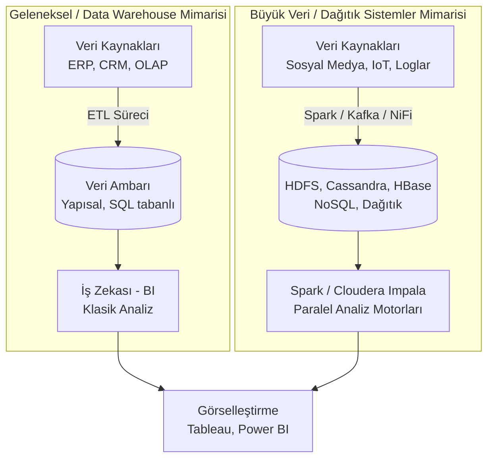

## Dersin Bürokrasisi
- Haftaya "Görüntü Verilerinde Madencilik" işlenerek konular tamamlanacak.
- Verilen Big Data (PySpark) kodlarının çalışabilmesi için bilgisayarda **Java Motorunun (Runtime Java)** kurulu olması gerektiği, aksi takdirde kodların çalışmayacağı belirtildi.

---

## Derse Değgin

### 1. Büyük Veri (Big Data) Nedir? Geleneksel Yöntemlerden Farkı

Günümüzde veri, sosyal medya, IoT (Nesnelerin İnterneti) sensörleri, log kayıtları ve akıllı cihazlardan gelen bir akış biçiminde ilerlemektedir. 
Geleneksel veri işleme yöntemleri (örn. Excel veya tek çekirdekli Pandas DataFrame'leri), hacmi çok büyük, akış hızı yüksek ve karmaşık (yapısal olmayan) bu verileri işlemek için yetersiz kalır. Bu noktada devreye **Büyük Veri (Big Data)** teknolojileri girer. (*Kavramın temelleri için bkz.* [[veri-madenciligi-1#3. Büyük Veri (Big Data) ve Depolama Mimarisi|Büyük Veri ve Depolama Mimarisi]])

Geleneksel analiz ile Big Data analizi arasındaki en temel yapısal fark **işlem mimarisidir**:

- **Seri İşleme (Geleneksel - Pandas):** Veri satır satır, tek bir işlemci çekirdeği üzerinden sırayla okunur ve işlenir. Veri RAM'e çekilir. Milyonlarca satırlık veride RAM tıkanır (Memory Error) veya sistem kilitlenir.
- **Paralel İşleme (Big Data - Spark/Hadoop):** Veri tek bir makinede veya tek bir çekirdekte tutulmaz. **Dağıtık (Distributed)** serverlara yayılır. Çoklu çekirdek mimarisi (Hyper-threading) sayesinde veri eşzamanlı ve parçalar halinde işlenir. 

> [!example] Klasör ve Zaman Analojisi
> Bir Windows klasörünün içine 10.000 adet fotoğraf attığınızı düşünün. 10.001'inci fotoğrafı eklemek veya klasörde arama yapmak istediğinizde klasörün yüklenmesi saniyeler, bazen dakikalar sürer ve bilgisayar donar.
> İşte bilgisayar bilimlerinde verinin devasa boyutlara ulaşması, geleneksel tekil klasör/veri tabanı mantığının çökmesine (zaman problemine) neden olur. Büyük veri teknolojileri, bu klasörü tek bir diske değil, binlerce diske dağıtarak bu donmayı engeller.

### 2. Bilgisayar Bilimlerinin İki Temel Kısıtı: Hafıza ve Zaman

Veri madenciliğinin ve donanım teknolojilerinin gelişmesini zorlayan asıl unsur *verinin kendisi*dir. Veri büyüdükçe iki temel kısıtla karşılaşılır:

> [!info] Hafıza ve Zaman
> Tüm teknolojik gelişimler (özellikle Büyük Veri mimarileri) şu iki kısıtı aşmak için tasarlanır:
> 1. **Space Complexity (Hafıza Problemi - Depolama):** Akışkan verinin tek bir diske sığmaması. Çözüm, veriyi dağıtık sunuculara yaymaktır.
> 2. **Time Complexity (Zaman Problemi - İşlem Hızı):** Bu devasa veriden hızlıca sonuç alma zorunluluğu.

> [!example] Zamanı Satın Almak
> Paramız varsa, İstanbul'a 4 saatte giden bir araba yerine 1 saatte giden bir arabayı alırız. Temelde satın aldığımız şey araba değil, **zamandır**. Big Data sistemlerinde (Spark gibi motorlara veya çok çekirdekli sistemlere) yapılan yatırım da veriyi daha hızlı işleyip "zamanı satın alma" çabasıdır.

### 3. Big Data'nın Karakteristiği: 5V (ve 6V) Kuralı

Büyük veriyi tanımlayan temel nitelikler şunlardır:

| Özellik (V)                                           | Açıklama                                                                                                                                                                                                                          |
| :---------------------------------------------------- | :-------------------------------------------------------------------------------------------------------------------------------------------------------------------------------------------------------------------------------- |
| **Volume (Hacim)**                                    | Verinin devasa fiziksel boyutudur. Terabaytları aşıp Petabayt, Exabayt ve Zettabayt seviyelerine ulaşmasıdır.                                                                                                                     |
| **Velocity (Hız)**                                    | Verinin üretim ve akış hızıdır. Sosyal medya etkileşimleri, borsa verileri gibi durdurulamaz akışları ifade eder. Anlık (real-time) işlenmesi gerekir.                                                                            |
| **Variety (Çeşitlilik)**                              | Verinin sadece tablo (yapısal) olmaması; metin, ses, görüntü, log gibi farklı yapılandırılmamış (unstructured) formatlarda akmasıdır.                                                                                             |
| **Veracity (Doğruluk)**                               | Gelen her verinin güvenilir olmaması, gürültü (noise) barındırmasıdır. (Bkz: [[veri-madenciligi-2#B. Gürültülü Veri (Noisy Data / Outliers)\|Gürültülü Veri]]). Sensör arızaları veya yanlış verilerin hızla ayıklanması gerekir. |
| **Value (Değer)**                                     | Bu veri yığınından şirket veya kurum için anlamlı, ticari veya stratejik bir *değer (bilgi)* çıkarılabilmesidir.                                                                                                                  |
| **Visibility / Visualization (Görsellik-Görünürlük)** | *(Microsoft'un 6. V'si olarak eklenmiştir)* Elde edilen devasa ve karmaşık analiz sonuçlarının dashboardlar ve karar destek sistemleri ile insan gözünün anlayabileceği görsellere dönüştürülmesidir.                             |

### 4. Verinin Yaşam Döngüsü

Veri de tıpkı bir insan gibi doğar, işlenir, analiz edilir, korunur ve kullanılır. Ancak insandan farklı olarak **veri normal şartlarda ölmez**. Veri ancak fizikî felaketler veya yetersiz güvenlik önlemleri sonucu tahrip olursa yok olur.

Döngü 6 aşamadan oluşur:
1. **Üretilmesi (Creating):** Verinin toplanma ihtiyacının belirlenmesi.
2. **İşlenmesi (Processing):** Temizleme, gruplama ve doğrulama aşaması.
3. **Analizi (Analyze):** Fikirlerin ve örüntülerin çıkarılması.
4. **Korunması (Preserving):** Veri güvenliği ve yedekleme. 
5. **Erişim (Giving Access):** Yasal çerçevelerde paylaşım ve dağıtım.
6. **Tekrar Kullanımı (Re-using):** Aynı verinin yeni projelerde kullanılması.

> [!example] Fiziki Güvenlik Zafiyeti
> Yıllar önce yayımlanan "Süper Baba" dizisinin bazı bölümlerine bugün internetten ulaşılamamaktadır. Nitekim o dönemin kayıtları yanlış koşullarda (bodrum katlarında vb.) saklanmış ve bir sel felaketinde tahrip olmuştur. Verinin *ölmesi* budur: fizikî veri güvenliği (korunma) sağlanamazsa veri yok olur. Veri ambarları ve dağıtık sistemler bu riski sıfıra indirmek için vardır.

### 5. Geleneksel Sistemler vs. Büyük Veri Sistemleri

Veri saklama ve işleme mimarileri temelde ikiye ayrılır. 

#### A. Data Warehouse (Klasik Sistemler - ERP/CRM)
- Tek bir şirket içindeki operasyon verileridir.
- Yapısal ve düzenlidir. (Bkz: [[veri-madenciligi-1#3.2. Veri Ambarları (Data Warehouses)\|Veri Ambarları]])
- **SQL (Structured Query Language)** ile sorgulanır.

#### B. Big Data (Dağıtık Sistemler)
- Veriler tek bir sunucuda tutulamaz. Sosyal medya, IoT gibi çoklu kaynaklardan beslenir.
- **NoSQL** (SQL olmayan) mimariler kullanılır. Ortada tek ve düzenli bir tablo yoktur, veri parçalanmış haldedir.
- *Kullanılan Teknolojiler:* Cassandra (Facebook geliştirdi), HBase.

*(Not: ETL süreci, KDD sürecinin belkemiğidir. Bkz: [[veri-madenciligi-1#2. KDD Süreci (Knowledge Discovery in Databases)|KDD Süreci]])*
### 6. Hadoop ve Spark Arasındaki Evrim

Büyük verinin analizinde iki büyük teknolojik mihenk taşı vardır:

1. **Apache Hadoop:** Veriyi parçalayarak dağıtık işleyen (Map-Reduce) ilk büyük açık kaynaklı çerçevedir. Ancak veriyi **diske (Hard Disk) kaydederek** çalıştığı için gerçek zamanlı akışkan verilerde yavaş kalmaya başlamıştır.
2. **Apache Spark:** Hadoop'un yavaşlığına çözüm olarak (zamanı satın almak için) üretilmiştir. Veriyi diskten değil, doğrudan **RAM üzerinden (In-Memory)** okuyup işlediği için Hadoop'tan yaklaşık **100 kat daha hızlıdır**.

> [!important] Spark'ın Çalışma Felsefesi: Lazy Execution (Tembel Çalıştırma)
> - **Pandas** ile bir veriyi okuduğunuzda (Bkz: [[veri-madenciligi-2#1.3. Veri Ön İşleme (Data Preprocessing) Süreci|Pandas Veri Okuma]]), Pandas emri aldığı an veriyi tek tek okur ve RAM'e çeker. Listele dediğinizde listeler. 
> - **Spark** motoru ise oyuna girerken çalışan bir oyun motoru gibidir. Çalıştırıldığı an, görevinin veri işlemek olduğunu bilir ve veri tabanlarındaki dağıtık veriyi **önceden okuyarak hazırda bekletir.** Sizden sadece son emri (listele, analiz et) bekler. Bu yüzden küçük ya da devasa verilerde her zaman **stabil bir sürede** (örneğin hep 1-3 saniye aralığında) tepki verir.

### 7. Büyük Veri Ekosistemi ve Kullanılan Teknolojiler
Büyük verinin yatayda ölçeklenebilir (sunucu ekledikçe büyüyen) yapıda tutulmasını sağlar.

- **HDFS (Hadoop Distributed File System):** Verileri parçalayıp dağıtarak saklayan, sistemin temel dosya mimarisi.
- **Apache Cassandra:** Facebook tarafından geliştirilen, yüksek hızda veri yazma/okuma yapan dağıtık **NoSQL** veri tabanı.
 
  > [!info] Peer-to-Peer Mimarisi
  > Cassandra'da "Master-Slave" (Yönetici-Köle) hiyerarşisi yoktur. **Her node (sunucu/düğüm) eşittir (peer-to-peer).** Bu sayede bir sunucu çökse bile sistem duraksamadan çalışmaya devam eder. Bkz. [[Nedir bu CAP?#2- AP Sistemleri (Availability + Partition Tolerance)|AP Sistemleri]]

- **Apache HBase:** HDFS üzerinde çalışan, sütun tabanlı NoSQL veritabanıdır. Gerçek zamanlı işlemler için kullanılır.
- **Bulut (Cloud) Depoları:** Amazon S3 (AWS) ve Google Cloud Storage (Obje tabanlı yüksek hacimli depolar).
- **MongoDB:** Popüler belge (document) tabanlı, JSON benzeri yapılar tutan NoSQL veritabanı.

#### B. Veri İşleme ve Analiz (Data Analysis)
- **Apache Hadoop (MapReduce):** Veriyi dağıtarak işleyen temel algoritmadır. Ancak veriyi **diske kaydederek** çalıştığı için (Batch Processing) gerçek zamanlı analizlerde yavaştır.
- **Apache Spark:** Hadoop'un yavaşlığına çözüm olarak doğmuştur. Veriyi diskten değil, **bellek içinden (in-memory)** okur. Hadoop'tan 100 kata kadar daha hızlıdır. 
- **Apache Flink & Apache Storm:** Gerçek zamanlı veri akışı (streaming) ve düşük gecikmeli analizlere odaklanan Spark alternatifleridir.
- **Cloudera Impala & Presto/Trino:** Dağıtık sistemler üzerinde SQL benzeri sorgular çalıştırmaya yarayan analiz motorlarıdır.
- **Elasticsearch:** Metin tabanlı arama ve log analizi (Örn: Hata kayıtlarını hızlıca bulma) için çok güçlü bir araçtır.

#### C. Veri Taşıma ve Entegrasyon
- **Apache Kafka:** Yüksek hızlı, gerçek zamanlı veri iletimi sağlar. (Publish-subscribe / Yayıncı-Abone mantığıyla çalışır).
- **Apache NiFi:** Veri akışlarını görsel bir arayüzle yöneten modern bir ETL aracıdır.
- **Apache Sqoop:** Geleneksel ilişkisel veri tabanları (RDBMS) ile Hadoop arasında veri transferi yapar.
- **Apache Airflow:** Veri işleme akışlarını zamanlamak ve programlamak için kullanılır.

#### D. Veri Formatları
Büyük veri dünyasında klasik CSV veya JSON dosyaları çok yer kaplar. Bunun yerine:
- **Parquet / ORC:** Sütun bazlı (columnar) ve sıkıştırılmış veri saklama formatlarıdır. Okuma hızını muazzam derecede artırırlar.
- **Avro**: Satır bazlı veri serileştirme formatıdır.

---

# Kodlarla İlgili

Derste hocanın gösterdiği `pyspark` ve `pandas` karşılaştırma kodunun (notebook) arka planında yatan çalışma mantığı şudur:

1. **Küçük Veri Testi (10.000 - 100.000 Satır):**
   - **Pandas:** Çok hızlıdır (Örn: 0.02 saniye). Çünkü veri küçüktür ve seri işleme hemen sonuç verir.
   - **Spark:** Pandas'a göre daha yavaştır (Örn: 1.3 saniye). Neden? Çünkü Spark'ın o devasa paralel mimarisini ve çekirdekleri ayağa kaldırması küçük bir veri için gereksiz bir hantallık (overhead) yaratır. 
   - **Sonuç:** Veri 1-2 milyon satırın altındaysa makineyi Spark ile yormaya gerek yoktur, Pandas idealdir.

2. **Büyük Veri Testi (20 Milyon - 200 Milyon Satır):**
   - **Spark:** Veri 20 milyona çıktığında süre sadece 2.9 saniyeye çıkar. Veri 200 milyona çıktığında yaklaşık 23 saniyede bitirir. Çekirdekleri paralel çalıştırdığı için makine kaynaklarını (`local[8]` gibi 8 çekirdekli) tam kapasite kullanarak işi süspanse eder.
   - **Pandas:** Veri 20 milyona çıktığında 40-50 saniye bekletir. Veri 200 milyona çıktığında ise bilgisayarın RAM'ini tamamen tüketir (12GB+ RAM kullanımı) ve sistemi büyük ihtimalle kilitler (Out of Memory / Mavi Ekran). Çünkü tek çekirdekle milyonlarca satırı sırayla yutmaya çalışmaktadır.

**Motor Konfigürasyonu:**
Kodun içindeki `local[2]` ibaresi, işlemin o makinedeki 2 çekirdek üzerinden paralel yürütüleceğini ifade eder. Bilgisayarın desteklediği mantıksal işlemci sayısına göre bu değer `local[4]` veya `local[8]` yapılarak hız artırılabilir.

---

## Derse Aşkın

### Çalışma Güzergâhı, Sınavda Çıkabilecekler vb.

- **Hangi Durumda Hangi Teknoloji Kullanılır?** 
  Sınavda veri seti boyutu verilip (Örn: 50.000 satırlık tablo vs. Saniyede 1 milyon tweet akan veri) teknoloji seçimi istenebilir. Küçük ve statik veride **Pandas**; devasa, dağıtık ve akışkan veride **Spark** seçilmelidir.
- **Hadoop vs Spark Ayrımı:** İkisinin de Big Data teknolojisi olduğu ama asıl kırılmanın **Disk vs. RAM (Hız)** üzerinden yaşandığı kesinlikle bilinmelidir. Spark'ın Hadoop'a kıyasla "neden" üretildiğiyle alakalı soru gelebilir.
- **Lazy Execution Mantığı:** Spark'ın neden devasa verilerde stabil saniyeler ürettiğinin kavramsal açıklaması (veriyi önden hazır etmesi) iyi oturmalıdır.
- **Kavram Eşleştirmeleri:** 
  - Geleneksel Veri Tabanı = SQL = Seri İşlem
  - Büyük Veri = NoSQL (Cassandra vb.) = Paralel İşlem 
  - Veri Görselleştirme = **Tableau, Power BI**
  - NoSQL / Peer-to-peer / Facebook üretimi = **Cassandra**
  - Mesajlaşma / Gerçek Zamanlı Veri İletimi = **Kafka**
  - SQL yerine geçen Büyük Veri sorgulayıcıları = **Hive, Impala, Presto**
- **Zaman ve Mekân Karmaşıklığı (Time/Space Complexity):** Bilgisayar bilimlerinin donanımı geliştirmeye iten ana sebebinin bu iki kısıt olduğu sorulabilir.