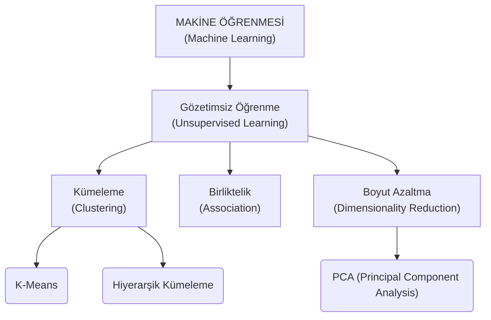

## Sınav ve Ödev Bilgilendirmeleri
- **Sınav Soru Tipi**: Sınavda kod sorulacak. Sıfırdan bir Python kodu yazılması beklenmiyor. «Bu kod hangi işlevi gerçekleştirir?», «Eksik veriyi doldurma kodu hangisidir?», «Hangi kod temizleme yapar?» gibi, yazılmış kodun **veri madenciliği bağlamındaki mantığı** sorulacak.
- **Uygulama Dosyaları**: Hocanın gönderdiği Jupyter Notebook (`.ipynb`) dosyaları **kesinlikle çalıştırılmalı**. O kodların yanına Türkiye'de kolay kolay bulunamayacak detaylı Türkçe açıklamalar da eklendi. Sınavdaki sorular doğrudan bu dosyaların mantığından gelecek.
- **Dönem Sonu Projeci Tüyosu** Hoca algoritma dağıtımını rastgele yapacak, zaten bunu söylemiştim daha önceki notlarda. Eğer size K-Means veya benzeri bir algoritma düşerse standart (öklid) kullanıp geçmeyin. Manhattan kullanın, Hamming deneyin, farklı parametreleri karşılaştırmamızı bekliyor hoca, aradaki farkları görmemizi de istiyor.

---

# Ders Notları

## 1. Kümeleme (Clustering) Nedir
Kümeleme, benzer veri noktalarını gruplamak için kullanılan [[veri-madenciligi-4#B. Denetimsiz Öğrenme (Unsupervised Learning)|Gözetimsiz/Denetimsiz Öğrenme (Unsupervised Learning)]] tekniğidir.

Makine Öğrenmesi hiyerarşisinde **kümeleme**nin yeri aşağıdaki gibidir:

### 1.1. Neden tahmin yapmaz, etiketleme ne demektir
Kümeleme, **tahmin (prediction) yapmaz!**

>[!info] X ve Y Değişkenleri Mantığı
>- Sınıflandırma (Classification) algoritmalarında hastanın tahlilleri ($X$) ve karşılığında "Hasta/Sağlıklı" gibi bir sonuç sütunu ($Y$ - Hedef/Label) vardır. Yeni gelen kişinin ne olacağı **tahmin** edilir.
>- **Kümelemede ise $Y$ sütunu (hedef) YOKTUR.** Sadece $X$'ler (bağımsız değişkenler) vardır. Makine, veriyi alır ve benzerliklerine göre gruplara ayırır. NEYİ GRUPLADIĞINI BİLMEZ!!!

 
**Örnek**: Markete gittiniz ve fişler oluştu diyelim. Bu fişler sizin "zengin" yahut "fakir" olduğunuzu söylemez. Sadece 1000 kişinin alışveriş verisidir bu. K-Means Algoritması bu 1000 kişiyi "sadece ekmek alanlar", "peynir alanlar" diye kümelere ayırır. Kümeleme bittikten sonra o gruplara bakıp "**Bunlar "Zenginler" kümesi**" **diye isim vermeyi BİZ yaparız. Buna [[Etiketleme (Labelling)]] denir., K-MEANS İSE ETİKETLEME YAPMAZ!** K-Means, gelecekteki sınıflandırma algoritmaları için **otomatik etiketleme (auto-labeling)** altyapısı sunar, etiketleyen biziz.

### 1.2. Gerçek Hayatta Kullanım Alanları
1. **Müşteri Segmentasyonu**: Müşterileri harcama alışkanlıklarına göre ayırmak.
2. **Tavsiye/Önerilenler Sistemleri (Recommendation)**: Netflix'in "Bunu izleyenler şunu da izledi" algoritması örnektir. Benzer filmleri izleyenlerin kümesini bulup, o kümenin izlediği ama bizim izlemediğimiz filmleri bize önerir.
3. **Görüntü Segmentasyonu (Sıkıştırma)**:
	- Kayıpsız (Lossless) sıkıştırma **metinlerde** olur.
	- Kayıplı (Lossy) sıkıştırma **ses** ve **görüntüde** olur.
	- **K-Means ile Sıkıştırma**: Bir ağaç görselindeki 1000 adet farklı kahverengi piksel, K-Means ile 3 ana kahverengi kümesine atanır. Kedi burnundaki renkler ortaklaştırılır. Görünüm (formasyon) bozulmaz ama dosya boyutu 10MB'dan 5MB'a düşer.

---

## 2. K-Means Algoritması
Denetimsiz öğrenme içinde yer alan mesafeye dayalı bir algoritmadır. "$K$", oluşturulacak küme sayısını temsil eder.

### 2.1. Nasıl Çalışır

1. $K$ **sayısı belirlenir** (Örn: Veriyi 3 kümeye böl $K=3$).
2. Uzaya rastgele $K$ adet **merkez noktası (centroid)** atanır.
3. Her veri noktası, kendisine **en yakın** merkeze atanır.
4. Oluşan yeni kümenin tam ortası hesaplanır ve merkez nokta oraya kaydırılır.
5. Merkezler sabit kalana kadar bu işlem tekrarlanır.

### 2.2. K-Means için Kullanılan Mesafe Yöntemleri
Verilerin birbirine yakınlığı matematiksel olarak ölçülür. Varsayılan yöntem **[[Öklid Mesafesi]]**'dir.

| **Yöntem**            | **En İyi Kullanım Alanı**                                                                                                                                                                                                                                                     |
| --------------------- | ----------------------------------------------------------------------------------------------------------------------------------------------------------------------------------------------------------------------------------------------------------------------------- |
| **Öklid (Euclidean)** | Düşük boyutlu, düzgün dağılımlı veriler (varsayılan). Geometrideki hipotenüs (Pisagor) mantığıdır. İki nokta arasındaki en kısa "kuş uçuşu" mesafedir. Sayısal ve sürekli verilerde kullanılır. K-Means'in varsayılan (default) değeridir.                                    |
| **Manhattan**         | Grid-tabanlı (ızgara planlı) veriler, şehir haritaları. Noktalar arasındaki mesafeyi çapraz (kuş uçuşu) değil, ızgara planlı bir şehirde binaların etrafından dik açılarla dolaşarak ölçer gibi hesaplar. Veride uç değerler (outliers) varsa Öklid'e göre daha güvenilirdir. |
| **Kosinüs**           | Metin madenciliği, NLP (Doğal Dil İşleme). Yönelime bakar, büyüklüğe bakmaz. Metin madenciliğinde veya "İki müşteri alışveriş sepetinde benzer yönelimde mi?" diye bakarken kullanılır.                                                                                       |
| **Mahalanobis**       | Korelasyonlu veriler, finansal analiz.                                                                                                                                                                                                                                        |
| **Minkowski**         | Genel amaçlı, esnek (Öklid ve Manhattan'ın genelleşmiş hâli). Öklid ve Manhattan'ın genelleştirilmiş, babası sayılan formüldür. Formüldeki "p" değeri 1 olursa Manhattan, 2 olursa Öklid olur. KNN'in varsayılanı buydu hatırlarsak.                                          |
| **Hamming**           | Binary (ikili) veriler. (Google'ın "Bunu mu demek istediniz") mantığı. Sayısal değil, kategorik (metin) veya Binary (1-0) verilerde kullanılır. "Kaç harf/bit farklı?" diye sayar.                                                                                            |

### 2.3. K-Means Avantajları ve Dezavantajları

| Avantajlar +                               | Dezavantajlar -                                                                                                      |
| ------------------------------------------ | -------------------------------------------------------------------------------------------------------------------- |
| Çok hızlı çalışır ve algoritması basittir. | $K$ değerinin baştan bilinmesi gerekir.                                                                              |
| **Büyük Veri** için çok uygundur.          | Başlangıç merkezlerinin rastgele atılmasına duyarlıdır.                                                              |
| Görselleştirmesi ve yorumlaması kolaydır.  | **Outlier (Aykırı Değer)**'lardan çok etkilenir (savaş çıkınca altının fırlaması gibi uç veriler algoritmayı bozar). |
|                                            | Kümelerin küresel (yuvarlak) olduğunu varsayar.                                                                      |

---

## 3. K Değeri Problemi: Elbow (Dirsek) Metodu
K-Means'in en büyük derdi "Peki veriyi kaç kümeye böleceğiz?" sorusudur. Bunu çözmek için **Elbow (Dirsek)** metodu kullanır. 

- **Mantık**: Bir `for` döngüsü kurularak K=1'den K=15'e kadar tüm ihtimaller denenir ve her adımdaki **Hata Oranı (Inertia / WSS)** hesaplanır.
- $K$ sayısı arttıkça hata oranı sürekli azalır. Ancak bir noktadan sonra bu azalma **yavaşlar**.
- Grafikte hatanın düşüşünün yavaşladığı, **dirsek (elbow)** şeklini aldığı kırılma noktası, **Optimum $K$** değeridir.

---

## 4. Boyut Azaltma: PCA (Principal Component Analysis)

**Curse Dimensionality (Boyut Laneti)**: Veri setinde çok fazla sütun (boyut) varsa, mesafelerin anlamı kaybolur, makine aşırı yorulur ve veriyi görselleştirmek imkânsızlaşır.

**Çözüm**: PCA (Temel Bileşen Analizi). Yüksek boyutlu veriyi, minimum bilgi kaybıyla daha az boyuta indirgeme işlemi.

### PCA Neden Yapılır?
1. **Eğitim Süresini Kısaltmak**: 1 Milyon satır $x$ 20 sütun = 20 Milyon işlem demektir. Eğer PCA ile 20 sütunu 3 sütuna indirgersek, işlem sayısı 3 Milyona düşer. %85 tasarruf sağlanır, makine yorulmaz.
2. **Görselleştirme İmkânı**: İnsan gözü 1D (nokta), 2D (grafik), 3D (küp) görebilir. Elimizde değerli olan 8 sütun varsa, bunu grafiksel olarak çizemeyiz. PCA ile o 8 sütunu 2 sütuna (Component 1, Component 2) indirgersek, ekrandaki kümeleri netçe görebiliriz.

### PCA'in Kırmızı Çizgisi: **VARYANS**

>[!danger] Çok Önemli
>Boyutu azaltırken bilgiyi korumak zorundayız. Bilginin istatistikteki karşılığı **Varyans**'tır.  
> - Başlangıçta varyans **1.0** kabul edilir.
> - Sütunları sildiğimizde/dönüştürdüğümüzde varyans **0.90** ve üzerinde kalıyorsa, "Bilgiyi koruduk, kabul edilebilir" deriz.
> - Eğer varyans **0.85** ve altına düşerse bilgi kaybı (veri bozulması) yaşanmıştır, o PCA işlemi **kabul edilemez!** Esi veriyle yeni veri artık eşdeğer değildir.

