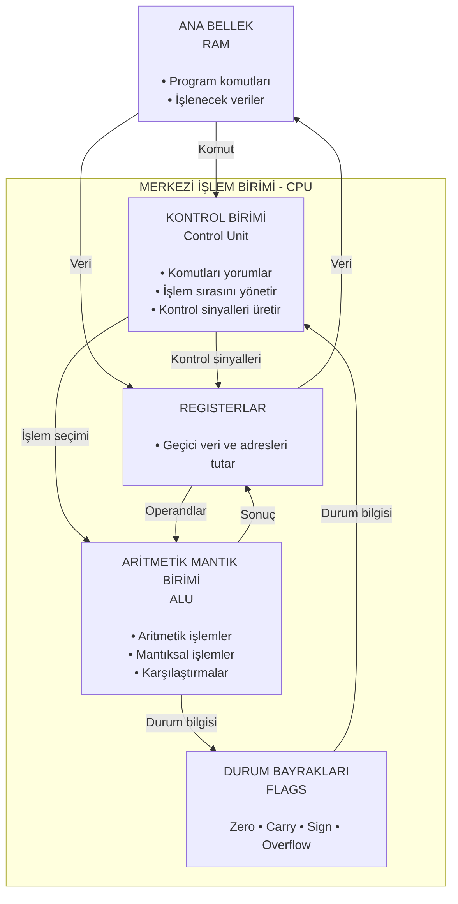

---
tags:
  - bilgi/techne
created: 2026-10-05
---
- Bilgisayar sistemindeki komutları yorumlayan, veri akışını yöneten ve tüm operasyonları koordine eden donanım çekirdeğidir. Bünyesinde komut silsilesini ve aygıt senkronizasyonunu yöneten [[control unit|Kontrol Birimi]] (Control Unit) ile matematiksel ve mantıksal hesaplamaalrı icra eden [[arithmetic logic unit|Aritmetik Mantık Birimi]] (Arithmetic Logic Unit - ALU) bulunur.
	- Sisteme klavyeden $5+3$ ifadesi girildiğinde, girdi birimi bu karakterleri elektik sinyallerine dönüştürerek ana belleğe (RAM) aktarır. Kontrol birimi, bellekteki verileri ve toplama komutunu [[arithmetic logic unit|ALU]]'ya sevk eder. ALU bünyesidne ikili toplayıcı mantık kapıları işlemi gerçekleştirir, sonucu 8 olarak üretir ve tekrar RAM üzerindeki hedef adrese yazar. [[control unit|Kontrol birimi]] bu sonucu çıktı birimi olarak monitöre aktararak ekranda "$8$" değerinin görüntülenmesini sağlar.

