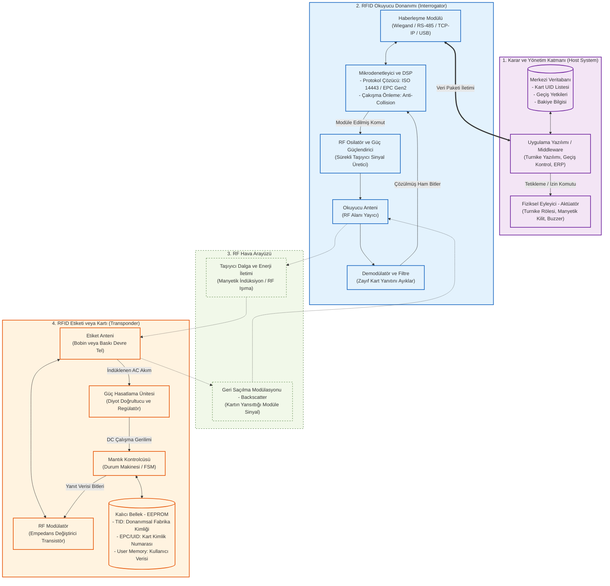

---
tags:
  - bilgi/techne
created: 2026-10-05
---
**RFID (Radio Frequency Identification - Radyo Frekansı ile Tanımlama)**; nesnelerin, hayvanların veya insanların radyo dalgaları kullanılarak kablosuz ve temassız bir şekilde kimliğinin tanımlanmasını ve takip edilmesini sağlayan teknolojidir.

Barkod teknolojisinin gelişmiş hâli gibi düşünülebilir. Ancak barkodun aksine optik bir görüş hizasına ihtiyaç duymaz, cüzdanın veya kutunun içinden de okunabilir.

---

## Sistemin 3 Temel Bileşeni

### 1. **RFID Etiketi / Kartı (Tag):**
   * İçerisinde mikro ölçekte bir **çip** (bilgiyi saklar) ve bir **anten** (sinyal alıp verir) bulunur.
   * **Pasif Etiketler:** Kendi pili yoktur. Okuyucunun yaydığı radyo dalgalarından indüklenen enerjiyle anlık olarak uyanır ve kimlik bilgisini okuyucuya fısıldar *(Öğrenci kimlikleri, ESHOT/İstanbulkart, İzmirimkart, temassız banka kartları, mağazalardaki hırsızlık önleme alarmları...)*.
   * **Aktif Etiketler:** Kendi dâhili pili vardır. Daha güçlü sinyal yayar ve onlarca metre öteden okunabilir *(Otoyol HGS/OGS sistemleri, konteyner ve kargo takibi)*.
### 2. **RFID Okuyucu (Reader):**
   * Sürekli belirli bir frekansta radyo sinyali yayarak etrafındaki etiketleri "*uyandırır*", etiketteki veriyi çözer ve bağlı olduğu sisteme aktarır.
### 3. **Arka Plan Sistemi (Yazılım / Kontrolcü):**
   * Okuyucudan gelen kimlik numarasını (UID) veri tabanıyla eşleştirir ve karar verir *(Örnek: "Bu kart geçerli, turnike kilidini aç" veya "Bu ürünün parası ödendi, alarmı çalma")*.

---

