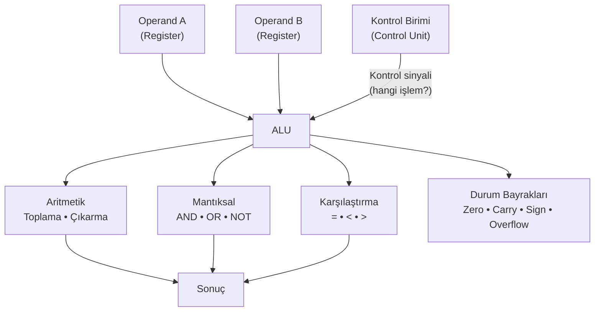

---
tags:
  - bilgi/techne
---
İşlemcinin aritmetik ve mantıksal işlemleri gerçekleştiren birimidir. Toplama, çıkarma gibi matematiksel işlemlerin yanı sıra karşılaştırma, `AND`, `OR` ve `NOT` gibi mantıksal işlemleri de yürütür.

Başka bir ifadeyle; kontrol Birimi tarafından belirlenen işlemleri **[[operand|operandlar]]** üzerinde gerçekleştirerek aritmetik ve mantıksal sonuçları üreten işlemci birimidir.




Burada özellikle **FLAGS (durum bayrakları)** ekledik. Nitekim ALU'nun yaptığı iş yalnızca “sayıyı hesapla ve sonucu ver” değildir. İşlemin sonucuna göre **Zero, Carry, Sign, Overflow** gibi durum bilgileri de oluşturabilir ve bunlar sonraki komutların yürütülmesinde kullanılabilir.

```text
             CPU
              │
       ┌──────┴──────┐
       ▼             ▼
 Control Unit        ALU
       │             │
       │             │
  "Ne yapılacak?"    "İşlemi yap."
       │             │
       ▼             ▼
 Kontrol et       Hesapla /
 ve yönlendir     karşılaştır
```


> **Aritmetik Mantık Birimi (ALU):** Kontrol Birimi tarafından belirlenen işlemleri operandlar üzerinde gerçekleştirerek aritmetik ve mantıksal sonuçları üreten işlemci birimidir.

Bence bu ikisinin diyagramlarını **aynı görsel dilde** tutmak özellikle MIS/Computer Architecture notunda çok iyi durur: CU'da vurgu **komut → yorumlama → kontrol sinyali**, ALU'da ise **operand → işlem → sonuç** olur.
