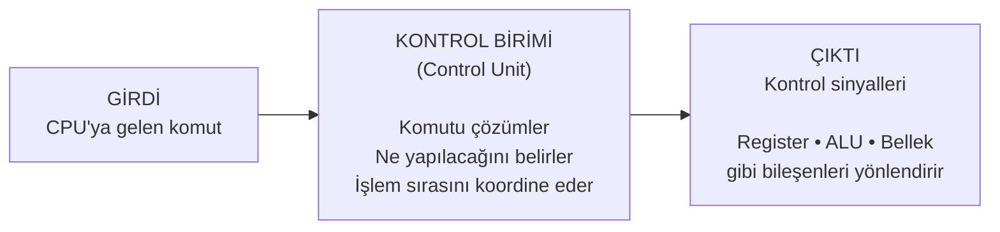

---
tags:
  - bilgi/techne
---
İşlemcinin çalışmasını yöneten birimdir. Bellekten alınan komutları yorumlar, komutların hangi sırayla ve hangi bileşenler tarafından yürütüleceğini belirler ve işlemci içindeki veri ve sinyal akışını koordine eder.

**Komut → Control Unit → Kontrol sinyalleri**

Control Unit'in **girdisi komut**, yaptığı iş **komutu yorumlayıp yürütmeyi koordine etmek**, çıktısı ise **diğer CPU bileşenlerini yönlendiren kontrol sinyalleri**.
