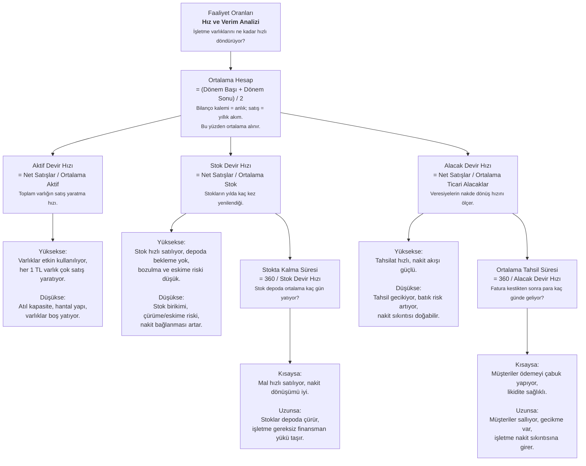

```mermaid
flowchart 

A["Faaliyet Oranları<br/><b>Hız ve Verim Analizi</b><br/><small>İşletme varlıklarını ne kadar hızlı döndürüyor?</small>"] --> B["Ortalama Hesap<br/>= (Dönem Başı + Dönem Sonu) / 2<br/><small>Bilanço kalemi = anlık; satış = yıllık akım.<br/>Bu yüzden ortalama alınır.</small>"]

B --> C["Aktif Devir Hızı<br/>= Net Satışlar / Ortalama Aktif<br/><small>Toplam varlığın satış yaratma hızı.</small>"]
C --> C1["Yüksekse:<br/>Varlıklar etkin kullanılıyor,<br/>her 1 TL varlık çok satış yaratıyor.<br/><br/>Düşükse:<br/>Atıl kapasite, hantal yapı,<br/>varlıklar boş yatıyor."]

B --> D["Stok Devir Hızı<br/>= Net Satışlar / Ortalama Stok<br/><small>Stokların yılda kaç kez yenilendiği.</small>"]
D --> D1["Yüksekse:<br/>Stok hızlı satılıyor, depoda bekleme yok,<br/>bozulma ve eskime riski düşük.<br/><br/>Düşükse:<br/>Stok birikimi, çürüme/eskime riski,<br/>nakit bağlanması artar."]

D --> E["Stokta Kalma Süresi<br/>= 360 / Stok Devir Hızı<br/><small>Stok depoda ortalama kaç gün yatıyor?</small>"]
E --> E1["Kısaysa:<br/>Mal hızlı satılıyor, nakit dönüşümü iyi.<br/><br/>Uzunsa:<br/>Stoklar depoda çürür,<br/>işletme gereksiz finansman yükü taşır."]

B --> F["Alacak Devir Hızı<br/>= Net Satışlar / Ortalama Ticari Alacaklar<br/><small>Veresiyelerin nakde dönüş hızını ölçer.</small>"]
F --> F1["Yüksekse:<br/>Tahsilat hızlı, nakit akışı güçlü.<br/><br/>Düşükse:<br/>Tahsil gecikiyor, batık risk artıyor,<br/>nakit sıkıntısı doğabilir."]

F --> G["Ortalama Tahsil Süresi<br/>= 360 / Alacak Devir Hızı<br/><small>Fatura kestikten sonra para kaç günde geliyor?</small>"]
G --> G1["Kısaysa:<br/>Müşteriler ödemeyi çabuk yapıyor,<br/>likidite sağlıklı.<br/><br/>Uzunsa:<br/>Müşteriler sallıyor, gecikme var,<br/>işletme nakit sıkıntısına girer."]

```
