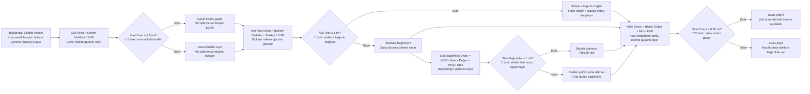

```mermaid

flowchart LR

A["Başlangıç: Likidite Analizi
Kısa vadeli borçları ödeme gücünü ölçmeye başla"] --> B["Cari Oran = Dönen Varlıklar / KVB
Genel likidite gücünü ölçer"]

B --> C{"Cari Oran ≥ 1.5 mi?
1.5 üzeri normal kabul edilir"}

C -->|Evet| C1["Genel likidite güçlü
Net işletme sermayesi pozitif"]
C -->|Hayır| C2["Genel likidite zayıf
Net işletme sermayesi noksan"]

C1 --> D["Asit-Test Oranı = (Dönen Varlıklar - Stoklar) / KVB
Stoksuz ödeme gücünü gösterir"]
C2 --> D

D --> E{"Asit-Test ≥ 1 mi?
1 üstü: stoklara bağımlı değilsin"}

E -->|Evet| E1["Stoklara bağımlı değiliz
Hazır değer + alacak borcu karşılıyor"]
E -->|Hayır| E2["Stoklara bağımlıyız
Satış durursa ödeme aksar"]

E2 --> F["Stok Bağımlılık Oranı = (KVB - (Hazır Değer + MK)) / Stok
Bağımlılığın şiddetini ölçer"]

F --> G{"Stok Bağımlılık > 1 mi?
1 üstü: stoklar bile borcu kapatmıyor"}

G -->|Evet| G1["Stoklar yetmiyor
Yüksek risk"]
G -->|Hayır| G2["Stoklar yetiyor ama risk var
Orta düzey bağımlılık"]

%% Nakit oranı her durumda kontrol edilir
E1 --> H["Nakit Oranı = (Hazır Değer + MK) / KVB
Hazır değerlerle borcu ödeme gücünü ölçer"]
E2 --> H
G1 --> H
G2 --> H

H --> I{"Nakit Oranı ≥ 0.20 mi?
0.20 üstü: stres testini geçer"}

I -->|Evet| I1["Kasa yeterli
Şok durumda bile ödeme yapılabilir"]
I -->|Hayır| I2["Kasa zayıf
Alacak veya stoklara bağımlılık var"]

```
